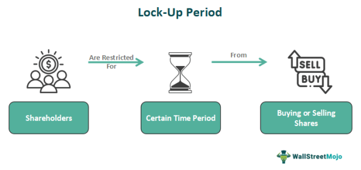

## Table of Contents

## What is an IPO lock-up period?

An IPO lock-up period is a time after a company goes public when certain shareholders can't sell their shares. This period usually lasts from 90 to 180 days. The lock-up helps keep the stock price stable right after the IPO by stopping too many shares from being sold at once.

The lock-up applies to insiders like company founders, executives, and early investors. It's meant to show they believe in the company's future. When the lock-up ends, these shareholders can sell their shares, which might cause the stock price to go up or down depending on how many shares are sold.

## Why is a lock-up period necessary after an IPO?

A lock-up period is necessary after an IPO to keep the stock price from dropping too much right after the company goes public. When a company first sells its shares to the public, it's important for the stock price to stay stable. If insiders like company founders and early investors could sell their shares right away, too many shares might hit the market at once. This could make the stock price go down a lot, which wouldn't be good for the company or new investors.

The lock-up period helps show that insiders believe in the company's future. By not being able to sell their shares for a while, they are showing confidence that the company will do well. This can make new investors feel more secure about buying the stock. When the lock-up period ends, insiders can sell their shares, but by then, the company has had more time to prove itself in the market.

## How long does a typical IPO lock-up period last?

A typical IPO lock-up period usually lasts between 90 and 180 days. This means that for a few months after the company goes public, certain people who own shares can't sell them. These people are often the company's founders, executives, and early investors.

The lock-up period helps keep the stock price steady right after the IPO. If everyone could sell their shares right away, too many shares might be sold at once, which could make the stock price drop a lot. By having a lock-up period, the company can show that the insiders believe in its future and give the stock a chance to stabilize.

## Can the duration of an IPO lock-up period vary, and if so, why?

Yes, the duration of an IPO lock-up period can vary. It usually lasts between 90 and 180 days, but sometimes it can be shorter or longer. The exact length depends on what the company and its underwriters decide is best for the situation.

The reason the duration can change is to help the company and its new investors. If the company thinks a shorter lock-up period will help attract more investors, they might choose that. On the other hand, if they want to make sure the stock price stays stable for a longer time, they might go for a longer lock-up period. It all comes down to what the company thinks will work best for them and their shareholders.

## What happens to the stock price during and after the lock-up period?

During the lock-up period, the stock price usually stays more stable. This is because people who own a lot of shares, like the company's founders and early investors, can't sell their shares yet. If they could sell, they might all try to sell at once, which could make the stock price drop a lot. So, the lock-up period helps keep the price steady by stopping this from happening.

When the lock-up period ends, the stock price can go up or down. It depends on how many people decide to sell their shares. If a lot of people sell their shares right away, the stock price might go down because there are more shares available to buy. But if not many people sell, or if the company is doing well, the stock price might stay the same or even go up. It's hard to predict exactly what will happen, but the end of the lock-up period is an important time to watch.

## Who is affected by the IPO lock-up period?

The IPO lock-up period affects people who already own shares in the company before it goes public. This includes the company's founders, executives, and early investors. These people can't sell their shares during the lock-up period, which usually lasts from 90 to 180 days. The lock-up period is meant to stop them from selling too many shares at once right after the company goes public.

The lock-up period also affects new investors who buy the company's stock after the IPO. They might be worried about what will happen when the lock-up period ends. If a lot of insiders sell their shares all at once, it could make the stock price go down. So, new investors keep an eye on when the lock-up period is over to see how it might affect the stock price.

## Are there any exceptions or early releases from the lock-up period?

Sometimes, there can be exceptions or early releases from the IPO lock-up period. This means some people who own shares might be allowed to sell them before the lock-up period is over. The company and its underwriters decide if this can happen. They might let some people sell their shares early if it's good for the company or if they think it won't hurt the stock price too much.

These early releases are not common, but they do happen. For example, a company might let some early investors sell their shares early if they need the money for something important. Or, the company might think that letting some shares be sold early will help the stock price stay stable. It all depends on what the company thinks is best for everyone involved.

## How do lock-up agreements impact investor behavior?

Lock-up agreements can make investors feel more secure when a company first goes public. They know that insiders like the company's founders and early investors can't sell their shares right away. This helps keep the stock price from dropping a lot because too many shares aren't being sold at once. Investors might feel more confident buying the stock because they see that the insiders believe in the company's future and are willing to wait before selling their shares.

When the lock-up period ends, it can make investors a bit nervous. They watch to see if a lot of insiders will sell their shares. If many shares are sold, the stock price might go down. This makes investors think carefully about whether to buy, hold, or sell their own shares. The end of the lock-up period is an important time for investors to pay attention to what's happening with the stock.

## What are the potential risks associated with the end of a lock-up period?

When the lock-up period ends, one big risk is that the stock price might go down. This can happen if a lot of insiders, like the company's founders and early investors, decide to sell their shares all at once. If too many shares are sold quickly, there are more shares for people to buy, which can make the stock price drop. This is called a "lock-up expiration overhang," and it can make new investors worried about what will happen to their investment.

Another risk is that the end of the lock-up period can make the stock price go up and down a lot. When the lock-up ends, some insiders might sell their shares, while others might hold onto them. This can make the stock price move around a lot, which can be confusing for investors. If the stock price changes a lot, it can be hard for investors to decide if they should buy, sell, or keep their shares. This uncertainty can make investing feel riskier.

## How do companies and insiders prepare for the end of the lock-up period?

Companies and insiders often start preparing for the end of the lock-up period well before it happens. They might talk to their financial advisors and lawyers to make a plan for what to do when they can sell their shares. The company might also share information with investors to show how well it's doing, hoping to keep the stock price stable. This can help make investors feel more confident and less likely to panic when the lock-up period ends.

Insiders, like the company's founders and early investors, have to decide if they want to sell their shares right away or wait a bit longer. They might sell some shares to make money but keep others because they believe the company will do well in the future. They have to think about how selling their shares might affect the stock price and what's best for them and the company. By planning ahead, they can try to make sure the end of the lock-up period goes smoothly and doesn't hurt the stock price too much.

## What historical examples illustrate the impact of lock-up period expirations?

When Facebook went public in 2012, the end of the lock-up period was a big deal. A lot of people who worked at Facebook and early investors had to wait before they could sell their shares. When the lock-up ended, many of them sold their shares at the same time. This made the stock price go down a lot. It was a good example of how the end of a lock-up period can make the stock price drop if too many people sell their shares all at once.

Another example is with LinkedIn, which also went public around the same time. When LinkedIn's lock-up period ended, the stock price actually went up at first. This was because not as many people sold their shares right away. But after a few days, the stock price started to go down. This showed that the end of a lock-up period can be tricky, and the stock price can go up or down depending on what people do with their shares.

## How do lock-up periods differ in various global markets?

Lock-up periods can be different in different countries. In the United States, they usually last between 90 and 180 days. But in other places, like China, the lock-up period might be longer. In China, some insiders have to wait a year before they can sell their shares. This is because different countries have different rules about how long people need to wait before selling their shares after an IPO.

The rules can also change based on what the company and the people who help them go public think is best. In Europe, for example, the lock-up period might be shorter or longer depending on the company. Sometimes, the company can even ask for an early release from the lock-up period if they think it will help the stock price stay stable. So, while the basic idea of a lock-up period is the same everywhere, the details can be different in each country.

## References & Further Reading

[1]: Brav, A., & Gompers, P. A. (2000). ["Insider Trading Subsequent to Initial Public Offerings: Evidence from Expirations of Lock-Up Provisions."](https://papers.ssrn.com/sol3/papers.cfm?abstract_id=204094)00041-9) Journal of Financial Economics, 56(2), 125-150.

[2]: Michaely, R., & Womack, K. L. (1999). ["Conflict of Interest and the Credibility of Underwriter Analyst Recommendations."](https://academic.oup.com/rfs/article-abstract/12/4/653/1578436) Review of Financial Studies, 12(4), 653–686.

[3]: Aggarwal, R., & Rivoli, P. (1990). ["Fads in the Initial Public Offering Market?"](https://www.jstor.org/stable/3665609)90036-K) Financial Management, 19(4), 45-57.

[4]: Ritter, J. R. (1991). ["The Long-run Performance of Initial Public Offerings."](https://onlinelibrary.wiley.com/doi/full/10.1111/j.1540-6261.1991.tb03743.x)90049-I) Journal of Finance, 46(1), 3-27.

[5]: Lewis, M., & Verwijmeren, P. (2014). ["The Role of Lockups in Initial Public Offerings."](https://www.jstor.org/stable/1262724) Review of Finance, 18(3), 921-951.