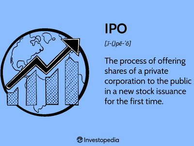

In finance, understanding the mechanics of investment strategies is crucial for maximizing returns. This article explores key themes in the investment landscape, specifically targeting expiration strategies, IPO lockups, and algorithmic trading. By dissecting each of these components, we aim to illuminate their effects on investments and market behavior.

Expiration strategies, often employed around specific financial instruments' maturity dates, play a pivotal role in the market dynamics. These strategies can affect the supply-demand balance, thereby influencing asset prices and market sentiment. They are particularly relevant in understanding the transient changes in volatility and liquidity as contracts approach their expiration.



IPO lockups are another critical aspect, where a predefined period prevents major shareholders from selling their shares following an IPO. This mechanism is designed to ensure market stability and prevent a potential oversupply that could adversely affect stock prices. Understanding IPO lockups is vital for grasping how regulatory frameworks interact with market forces to maintain equilibrium during a company's transition to public trading.

Algorithmic trading, incorporating advanced technologies such as AI and machine learning, significantly reshapes how investments are managed. These algorithms are capable of analyzing vast data sets to identify and exploit market inefficiencies, including those around expiration events. By automating decision-making processes, algorithmic trading can enhance precision and speed, essential attributes in today's fast-paced financial environments.

As financial markets continue to evolve, staying informed about these strategies can provide investors with a significant edge. Our discussion will also highlight the interplay between these strategies and their impact on market volatility and liquidity. This intricate web of interactions underscores the importance of a comprehensive understanding of investment strategy mechanics. By doing so, investors can enhance their decision-making processes in the face of fluctuating market conditions.

## Table of Contents

## Understanding IPO Lockup Periods

An Initial Public Offering (IPO) lockup period is a designated timeframe following an IPO during which key shareholders, such as company executives, insiders, and pre-IPO investors, are restricted from selling their shares. Typically, these lockup periods last between 90 to 180 days. The primary objective is to stabilize the stock price by preventing an excessive supply of shares from entering the market soon after the IPO. This influx could potentially depress the stock price due to the increased supply.

Historically, the expiration of a lockup period has been associated with significant market events. When the lockup expires, the potential for a large [volume](/wiki/volume-trading-strategy) of shares to be sold can lead to increased [volatility](/wiki/volatility-trading-strategies) in the stock's price. Investors and company insiders must therefore be cognizant of these dynamics, as the sale of substantial share volumes can disrupt the demand-supply equilibrium, potentially leading to price adjustments.

The regulatory framework surrounding IPO lockup periods is put in place to protect the interests of new investors by offering a temporary shield against immediate, large-scale sell-offs from insiders. Historically, these regulations are enforced through contractual agreements between the underwriters of the IPO and the shareholders. The specific terms and duration of the lockup can vary depending on the negotiations between the involved parties and the typical practices within the industry.

Strategically, imposing lockup periods enables companies and their underwriters to manage the post-IPO market more effectively. By controlling the timing of insider shares being introduced to the market, companies can better maintain investor confidence and stock price stability in the critical initial months following the IPO. The gradual introduction of shares post-lockup allows for a more measured adjustment in stock prices, reflecting fundamental company performance rather than the immediate pressures of supply imbalance.

For investors, understanding the nuances of lockup periods is essential. The anticipation of a lockup expiration is often accompanied by speculative trading, with investors positioning themselves to capitalize on expected movements in stock price. This environment can be ripe for both opportunities and risks, as the actual market reaction to a lockup expiration can be unpredictable and influenced by numerous factors including overall market conditions, company performance, and investor sentiment.

In conclusion, IPO lockup periods play a vital role in the strategic and regulatory spheres of financial markets. By providing a buffer against sudden supply shocks, they contribute to the orderly functioning and stability of financial markets post-IPO.

## Strategies for Navigating Lockup Expiration

Lockup expirations often lead to a significant increase in the availability of shares in the market, affecting the equilibrium between supply and demand. This influx can create downward pressure on share prices as more shares are introduced into the market ecosystems. Understanding and anticipating the effects of lockup expiration are vital for investors aiming to mitigate risks associated with sudden stock price fluctuations.

Investors should prepare for potential price declines due to the sudden increase in share supply following a lockup expiration. It is common for prices to dip as existing shareholders capitalize on their newfound ability to sell shares. Consequently, strategic planning is essential for managing these anticipated adjustments. One approach involves utilizing options strategies like collars or hedging to safeguard long positions. For instance, a collar strategy involves simultaneously holding a long position in the stock while purchasing put options and selling call options to limit potential losses and gains. Here's a simple Python example to illustrate a basic collar strategy setup:

```python
# Example of a collar strategy setup
stock_price = 100  # hypothetical current stock price
strike_price_put = 95  # strike price for the put option
strike_price_call = 105  # strike price for the call option
premium_put = 2  # premium paid for the put option
premium_call = 2  # premium received from selling the call option

max_profit = strike_price_call - stock_price - premium_put + premium_call
max_loss = stock_price - strike_price_put + premium_put - premium_call

print("Max Profit:", max_profit)
print("Max Loss:", max_loss)
```

Short-selling is another pivotal component of the landscape during lockup expirations. This practice involves betting against a stock by borrowing shares to sell at the current price, with the intention of buying them back at a lower price post-expiration. The anticipation of price drops can lead to significant short-selling activities, intensifying downward pressure. Investors should be aware of the potential for short squeezes, which occur if the stock price unexpectedly rises, forcing short sellers to buy back shares at higher prices, thereby amplifying the price increase.

Several high-profile cases have illustrated the dynamics of short squeezes post-lockup expiration. For example, certain stocks have experienced unforeseen demand surges, triggered by factors such as positive earnings reports or strategic acquisitions, which caught short sellers off guard. These events offer practical insights into navigating the volatility typical of post-lockup periods. By examining such case studies, investors can better anticipate market reactions and tailor their strategies accordingly to protect their portfolios and capitalize on market opportunities.

## Algorithmic Trading and Expiration Strategies

Algorithmic trading has become a cornerstone in the execution of expiration strategies, fundamentally altering how traders and investors navigate the stock market. These algorithms are engineered to identify and exploit short-term market inefficiencies, which frequently occur around events such as lockup expirations. A lockup expiration can result in increased volatility and trading volume, creating opportunities for [algorithmic trading](/wiki/algorithmic-trading) systems to capitalize on price movements.

Several types of algorithms are employed to enhance trading outcomes during such volatile periods. Mean reversion algorithms are designed based on the premise that prices will revert to their historical averages. When a stock's price deviates significantly from its average due to increased supply, such as post-lockup expiration, these algorithms can automatically execute trades that aim to profit from the expected reversion.

Trend-following algorithms, on the other hand, are programmed to identify and trade in the direction of established market trends. When a trend emerges as a result of significant changes in supply and demand dynamics, particularly after a lockup expiry, these algorithms ensure trades are aligned with the ongoing trend, maximizing the potential for profit.

Technological advancements, notably in [artificial intelligence](/wiki/ai-artificial-intelligence) (AI) and [machine learning](/wiki/machine-learning) (ML), have significantly enhanced the capabilities of algorithmic trading systems. AI-driven algorithms are capable of analyzing large datasets at high speed, identifying patterns and predicting risks more accurately than traditional methods. For instance, machine learning models can be used to predict stock price movements or volatility based on historical data, assisting in managing the risks associated with expiration events.

The use of neural networks, a subset of machine learning, has shown promise in handling the complexities of financial markets. These networks can model nonlinear relationships and interactions between various market factors, providing traders with a sophisticated tool to navigate the intricacies of expiration strategies. Python, with its extensive libraries for AI and ML such as TensorFlow and Scikit-learn, is often the programming language of choice for developing such models.

```python
import numpy as np
from sklearn.model_selection import train_test_split
from sklearn.ensemble import RandomForestRegressor

# Sample code to demonstrate machine learning in algorithmic trading
# Assumption: 'features' is a pandas DataFrame with relevant market data, 
# 'target' is the corresponding target output (stock prices or volatility)

# Splitting data into training and testing sets
features_train, features_test, target_train, target_test = train_test_split(features, target, test_size=0.2, random_state=42)

# Instantiating and training a random forest regressor
model = RandomForestRegressor(n_estimators=100, random_state=42)
model.fit(features_train, target_train)

# Predicting and evaluating the model performance on test data
predictions = model.predict(features_test)
mse = np.mean((predictions - target_test) ** 2)
print(f"Mean Squared Error: {mse}")
```

Algorithmic trading continues to reshape traditional investment strategies. The ability to automate decision-making processes based on complex data analysis allows for faster reaction times and enhanced accuracy in trade execution. This evolution reflects a broader trend within financial markets toward increased reliance on data-driven strategies, a trend accelerated by technological capabilities. Consequently, traders who integrate these advancements into their expiration strategies are better positioned to manage risks and capitalize on market opportunities, ensuring a competitive advantage in an ever-evolving marketplace.

## Practical Considerations for Investors

Investors aiming to navigate lockup expirations successfully must account for a variety of factors influencing market and stock behavior. The intricate landscape of stock markets requires a nuanced understanding of how specific elements can affect investment decisions.

### Assessing Market Conditions and Stock Performance

When strategizing expiration events, evaluating both market conditions and individual stock performance is essential. Broad economic indicators and market trends can provide a backdrop that influences stock behavior. For instance, during periods of economic growth, increased investor confidence may mitigate the adverse effects of a lockup expiration, while in times of economic downturn, the influx of shares may exacerbate price declines.

Analyzing stock performance entails investigating recent price movements, trading volumes, and historical performance. Key metrics such as price-to-earnings ratios, profit margins, and other financial ratios can provide insights into a stock's valuation and stability.

### Company-Specific Data

Company-specific information, particularly earnings reports and insider activities, plays a critical role in forecasting post-lockup stock movements. Earnings reports can offer insights into a company's financial health and growth prospects, while insider trading activities may signal insiders’ confidence in the company's future performance. A surge in insider buying before a lockup expiration, for example, may indicate optimistic expectations regarding the company's future, potentially counteracting negative market pressures.

### Investor Sentiment and Market News

Investor sentiment, shaped by recent news and prevailing attitudes toward a company, directly affects stock prices post-lockup. Positive news coverage might buoy a stock despite a lockup expiration, while negative news can amplify downward pressure. Monitoring platforms like financial news services and social media sentiments can provide timely insights into public perceptions and market reactions.

### Leveraging Financial Instruments

In high-volatility periods around lockup expirations, financial instruments such as options and futures can be employed to manage risk and optimize returns. Strategies like protective puts or collars can safeguard investments against potential losses. A protective put, for instance, involves purchasing a put option for stocks you own, setting up a safety net if stock prices fall. Here's a basic Python code snippet illustrating how one might calculate potential outcomes using a protective put:

```python
def protective_put(stock_price, put_strike, put_premium):
    # Payoff from holding stock
    payoff_stock = stock_price
    # Payoff from put option if the stock price falls below the strike price
    payoff_put = max(put_strike - stock_price, 0)
    # Net profit or loss calculation
    net_outcome = payoff_stock + payoff_put - put_premium
    return net_outcome

# Example
stock_price = 100
put_strike = 95
put_premium = 3
result = protective_put(stock_price, put_strike, put_premium)
print(f"Net outcome with protective put: ${result}")
```

### Future Trends in Trading Strategies

Future-oriented trading strategies must consider emerging trends and advancements in technology. The rise of fintech solutions and algorithmic trading tools continues to transform how investors approach trading in the context of IPOs and lockup expirations. As technology advances, the ability to analyze vast datasets in real-time will further enhance decision-making processes, enabling investors to react quickly to market changes.

In conclusion, astute investors place an emphasis on a comprehensive approach that integrates market analysis, company specifics, investor sentiment, and technological advancements. By doing so, they can effectively navigate the complexities associated with lockup expirations and position themselves for favorable outcomes.

## Conclusion

Mastering expiration strategies, IPO lockups, and algorithmic trading is crucial for enhancing investment decision-making. Each of these components plays a distinct role in influencing both individual stock performance and broader market dynamics. A thorough understanding of expiration strategies can enable investors to anticipate and mitigate the risks associated with increased supply and potential price declines following lockup expirations. By recognizing the mechanics of IPO lockups, investors can better interpret market behaviors during lockup release periods and adjust their strategies accordingly.

Algorithmic trading represents a transformative force within modern financial markets, enabling investors to manage risks and exploit market inefficiencies effectively. The application of advanced technologies, such as artificial intelligence and machine learning, ensures that traders can optimize their strategies with precision during volatile periods, including those around expiration events. Staying informed about the latest technological advancements and market trends is essential for maintaining a competitive edge.

As the investment landscape becomes more sophisticated, adaptability becomes indispensable. Investors must engage in continuous education to navigate evolving market conditions and leverage new technologies effectively. This article highlights that understanding the complex interplay between these investment strategies is key to making informed decisions in a volatile marketplace.

Investors equipped with actionable insights can make strategic decisions that optimize returns while minimizing risks. Embracing a nuanced approach to expiration strategies, IPO lockups, and algorithmic trading positions investors for success in an ever-changing financial environment. By applying these insights, individuals can refine their investment approaches and enhance their capacity to respond to market fluctuations proactively.

## References & Further Reading

[1]: Aggarwal, R., Krigman, L., & Womack, K. L. (2002). ["Strategic IPO Underpricing, Information Momentum, and Lockup Expiration Selling."](https://www.sciencedirect.com/science/article/pii/S0304405X02001526) The Journal of Financial Economics, 66(1), 105-137.

[2]: Field, L. C., & Hanka, G. (2001). ["The Expiration of IPO Share Lockups."](https://www.jstor.org/stable/222571) The Journal of Finance, 56(2), 471-500.

[3]: De Prado, M. L. (2018). ["Advances in Financial Machine Learning."](https://www.amazon.com/Advances-Financial-Machine-Learning-Marcos/dp/1119482089) Wiley.

[4]: Chan, E. P. (2009). ["Quantitative Trading: How to Build Your Own Algorithmic Trading Business."](https://github.com/ftvision/quant_trading_echan_book) Wiley.

[5]: Jansen, S. (2020). ["Machine Learning for Algorithmic Trading: Predictive Models to Extract Signals From Market and Alternative Data for Systematic Trading Strategies with Python."](https://www.amazon.com/Machine-Learning-Algorithmic-Trading-alternative/dp/1839217715) Packt Publishing.

[6]: Ritter, J. R. (2003). ["Investment Banking and Securities Issuance."](https://www.sciencedirect.com/science/article/pii/S1574010203010094) Handbook of the Economics of Finance, 1, 255-306.