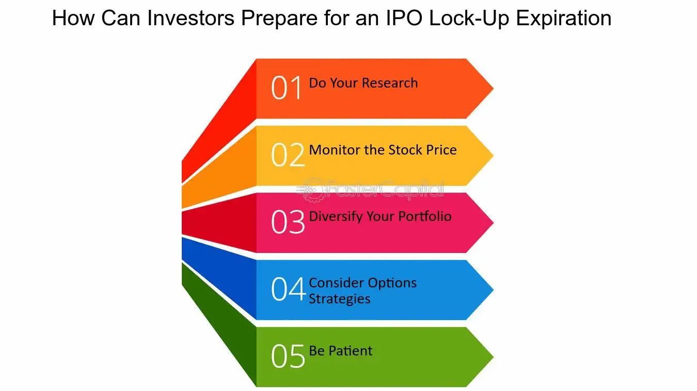

## Table of Contents

## What is an IPO lockup?

An IPO lockup is a period of time after a company goes public when certain shareholders, like company insiders or early investors, are not allowed to sell their shares. This lockup period usually lasts for 90 to 180 days. The main reason for this rule is to keep the stock price stable right after the company goes public. If lots of people started selling their shares right away, it could make the stock price drop a lot.

During the lockup period, the stock might be seen as less risky because fewer shares are being sold. This can help keep the stock price steady. Once the lockup period ends, these shareholders can sell their shares if they want to. Sometimes, when the lockup ends, the stock price can go down if a lot of people decide to sell their shares at the same time. But this isn't always the case, as it depends on how the market feels about the company and its future.

## Why do companies implement IPO lockup periods?

Companies put IPO lockup periods in place to keep their stock price stable right after they go public. When a company first starts selling its shares to the public, it's important that the stock price doesn't drop too much too fast. If insiders and early investors were allowed to sell their shares right away, they might all try to sell at the same time, which could cause the stock price to fall a lot. By having a lockup period, the company makes sure that these big shareholders can't sell their shares for a while, which helps keep the stock price steady.

The lockup period also helps build trust with new investors. When people see that insiders and early investors are holding onto their shares, it can make them feel more confident about the company's future. This is because it shows that the people who know the company best believe in it enough to keep their shares. Usually, the lockup lasts for 90 to 180 days, giving the company time to show its value and performance to the market before more shares can be sold.

## How long does an IPO lockup period typically last?

An IPO lockup period usually lasts between 90 and 180 days. This means that after a company goes public, certain people like company insiders and early investors can't sell their shares for that time.

The lockup period helps keep the stock price steady right after the company goes public. If everyone could sell their shares right away, it might make the stock price drop a lot. By waiting, the company gives itself time to show how well it's doing to new investors.

## What happens when an IPO lockup period expires?

When an IPO lockup period ends, the people who couldn't sell their shares before can now start selling them. This might be company insiders or early investors who got shares before the company went public. If a lot of these people decide to sell their shares at the same time, it can make the stock price go down. This is because more shares are being sold, which can make the stock less valuable.

But it's not always bad news when the lockup period ends. Sometimes, the stock price stays the same or even goes up. It depends on how people feel about the company and its future. If investors think the company is doing well and will keep doing well, they might keep buying the stock even after the lockup period ends. So, the end of the lockup period can be a big moment for the stock, but what happens next depends on a lot of things.

## Can the lockup period be extended, and if so, under what conditions?

Yes, a lockup period can be extended, but it depends on what the company and its shareholders agree to. Sometimes, if the company thinks it's a good idea, they might ask everyone to wait a bit longer before selling their shares. This can happen if the company wants to keep the stock price stable for a little more time or if they think it's better for the company's future.

The decision to extend the lockup period usually needs to be agreed upon by the shareholders who are affected by it. They might agree to wait longer if they believe it will help the company in the long run. But if they don't agree, the lockup period will end as planned. So, extending the lockup period is possible, but it needs everyone to be on the same page.

## What are the potential impacts of lockup expiration on a stock's price?

When the lockup period for an IPO ends, it can have a big impact on the stock's price. If a lot of people who couldn't sell their shares before start selling them all at once, it can make the stock price go down. This is because there are more shares for sale, and that can make the stock less valuable. Investors might see this as a sign that the company isn't doing as well as they thought, which can make them want to sell their shares too.

But the end of the lockup period doesn't always mean the stock price will drop. Sometimes, if the company is doing really well and people are excited about its future, the stock price might stay the same or even go up. It all depends on what investors think about the company. If they believe in it and think it will keep doing well, they might keep buying the stock even after the lockup period ends. So, the end of the lockup period can be a big moment, but what happens next depends on how people feel about the company.

## How can investors prepare for the expiration of an IPO lockup?

Investors can get ready for the end of an IPO lockup by keeping an eye on the company's news and how it's doing. They should look at the company's earnings reports, any new products or services, and what people are saying about the company. This can help them understand if the company is doing well or if there might be problems. If the company is doing great, the stock price might not drop much when the lockup ends. But if there are issues, it could go down.

Another thing investors can do is watch the stock's trading [volume](/wiki/volume-trading-strategy) and price in the days leading up to the lockup expiration. If a lot of people are selling the stock before the lockup ends, it might be a sign that the price could drop more when the lockup is over. Investors might decide to sell some of their shares before the lockup ends to avoid a big drop in price. Or, if they believe in the company, they might hold onto their shares and even buy more if the price goes down, thinking it's a good deal.

## What strategies can insiders use when their lockup period ends?

When the lockup period ends, insiders have a few choices. They might decide to sell some of their shares if they think the stock price is high enough. This can help them make some money, but they need to be careful. If a lot of insiders sell at the same time, it can make the stock price go down. So, they might choose to sell their shares slowly over time instead of all at once. This way, they can try to keep the stock price from dropping too much.

Another thing insiders might do is hold onto their shares. If they believe the company will keep doing well, they might want to keep their shares and wait for the price to go up even more. This can show other investors that the insiders have faith in the company's future. Sometimes, insiders might even buy more shares after the lockup period ends if they think the stock is a good deal. This can be a sign to other investors that the company is doing well and worth investing in.

## Are there any exceptions or early release options from an IPO lockup?

Sometimes, there can be exceptions or early release options from an IPO lockup. These exceptions are usually written into the lockup agreement before the company goes public. For example, some insiders might be allowed to sell a small number of their shares before the lockup period ends. This can happen if they need money for personal reasons or if the company agrees to it. Another exception might be if the company gets bought by another company. In that case, the lockup might end early so everyone can sell their shares.

The decision to let someone out of the lockup early is usually made by the company's board of directors or the underwriters who helped with the IPO. They look at what's best for the company and its shareholders. If letting someone sell their shares early won't hurt the stock price too much, they might agree to it. But these exceptions are not common, and most people have to wait until the lockup period is over before they can sell their shares.

## How do lockup agreements differ across different countries or regions?

Lockup agreements can be different in different countries or regions. In the United States, lockup periods usually last between 90 and 180 days. This is a common rule that helps keep the stock price steady after a company goes public. But in other places, like Europe or Asia, the rules might be different. For example, in some European countries, the lockup period might be shorter or longer, depending on what the company and its investors agree to. The main goal is still the same—to keep the stock price from dropping too much right after the IPO.

In Asia, some countries might have their own special rules about lockup periods. For instance, in China, the lockup period for certain shareholders can be as long as one year. This is to make sure that the stock market stays stable and that investors have time to see how the company is doing. Each country or region might have its own way of deciding how long the lockup period should be and who it applies to. But no matter where you are, the idea behind lockup agreements is to help new public companies have a smooth start on the stock market.

## What role do lockup periods play in the overall IPO strategy of a company?

Lockup periods are a big part of a company's plan when they go public with an IPO. They help keep the stock price from falling too much right after the company starts selling shares to the public. When a company goes public, it wants to make sure that the stock price stays steady. If insiders and early investors could sell their shares right away, they might all try to sell at the same time, which could make the stock price drop a lot. By having a lockup period, the company makes sure that these big shareholders can't sell their shares for a while, which helps keep the stock price stable.

The lockup period also helps build trust with new investors. When people see that insiders and early investors are holding onto their shares, it can make them feel more confident about the company's future. This is because it shows that the people who know the company best believe in it enough to keep their shares. Usually, the lockup lasts for 90 to 180 days, giving the company time to show its value and performance to the market before more shares can be sold. This helps the company have a smooth start on the stock market and can make investors feel more secure about buying the stock.

## How can advanced investors use lockup expiration data to inform their trading decisions?

Advanced investors can use lockup expiration data to make smart choices about when to buy or sell a stock. When a lockup period ends, a lot of people who couldn't sell their shares before might start selling them. If investors see that a lot of shares are going to be sold soon, they might decide to sell their own shares before the price drops. They can look at how many shares are locked up and guess how many might be sold when the lockup ends. This can help them decide if it's a good time to get out of the stock or if they should wait and see what happens.

On the other hand, if investors think the company is doing well and will keep doing well, they might see the end of the lockup period as a chance to buy more shares. If the stock price goes down because a lot of people are selling, it might be a good time to buy at a lower price. Advanced investors can also look at how the stock has been doing before the lockup ends. If the stock price has been going up and the company is doing well, they might think that any drop in price after the lockup ends will be small and short. This way, they can use lockup expiration data to find good times to buy or sell based on what they think will happen to the stock price.

## References & Further Reading

[1]: Aggarwal, R., Krigman, L., & Womack, K. L. (2002). ["Strategic IPO Underpricing, Information Momentum, and Lockup Expiration Selling."](https://www.sciencedirect.com/science/article/pii/S0304405X02001526) The Journal of Financial Economics, 66(1), 105-137.

[2]: Field, L. C., & Hanka, G. (2001). ["The Expiration of IPO Share Lockups."](https://www.jstor.org/stable/222571) The Journal of Finance, 56(2), 471-500.

[3]: De Prado, M. L. (2018). ["Advances in Financial Machine Learning."](https://www.amazon.com/Advances-Financial-Machine-Learning-Marcos/dp/1119482089) Wiley.

[4]: Chan, E. P. (2009). ["Quantitative Trading: How to Build Your Own Algorithmic Trading Business."](https://github.com/ftvision/quant_trading_echan_book) Wiley.

[5]: Jansen, S. (2020). ["Machine Learning for Algorithmic Trading: Predictive Models to Extract Signals From Market and Alternative Data for Systematic Trading Strategies with Python."](https://www.amazon.com/Machine-Learning-Algorithmic-Trading-alternative/dp/1839217715) Packt Publishing.

[6]: Ritter, J. R. (2003). ["Investment Banking and Securities Issuance."](https://www.sciencedirect.com/science/article/pii/S1574010203010094) Handbook of the Economics of Finance, 1, 255-306.