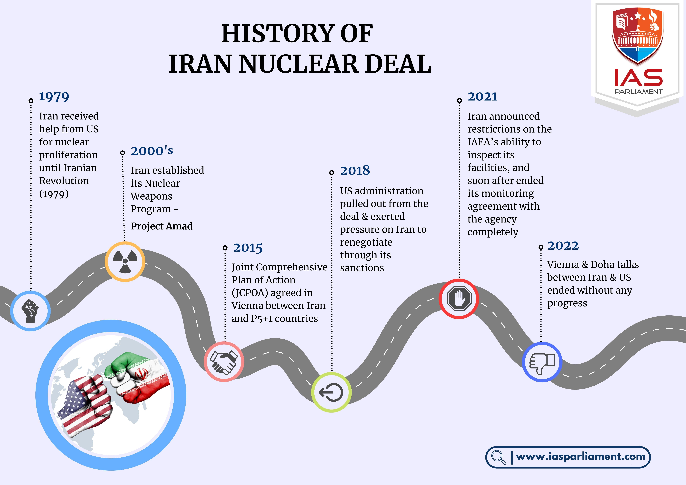

The Iran nuclear deal, formally recognized as the Joint Comprehensive Plan of Action (JCPOA), represents a pivotal framework in international diplomacy aimed at curbing nuclear proliferation. Established in 2015, the JCPOA was the result of extensive negotiations between Iran and the P5+1 group, which includes the permanent members of the United Nations Security Council—China, France, Russia, the United Kingdom, the United States—plus Germany. The primary objective of the agreement is to ensure that Iran’s nuclear program remains exclusively peaceful, placing significant limitations on its uranium enrichment capabilities and thereby extending the time Iran would need to produce enough fissile material for a nuclear weapon, should it choose to pursue one.

The significance of the JCPOA extends beyond Iran's nuclear capabilities. It plays a crucial role in global geopolitics, representing both a diplomatic victory and a mechanism to reduce regional tensions in the Middle East. By fostering trust and cooperation, the JCPOA also serves as a benchmark for future negotiations addressing nuclear non-proliferation and disarmament. However, its fate has been subject to fluctuating political climates and considerable international debate, particularly following the United States’ withdrawal from the agreement in 2018 under the Trump administration.



Parallel to international geopolitical developments is the rise of algorithmic trading in financial markets. Algorithmic trading utilizes complex algorithms to execute trades at speeds and frequencies that are beyond human capability. This technological advancement relies on mathematical models and statistical analysis to identify trading opportunities, offering the promise of increased efficiency and reduced transaction costs. As financial markets grow more interconnected and data-driven, the influence of algorithms is increasingly prominent.

Geopolitical events like the JCPOA play a crucial role in shaping financial markets, leading to fluctuations that can significantly affect asset values and market stability. Trading algorithms are designed to react to such events, processing vast amounts of information to predict market movements and execute trades swiftly. This interaction illustrates the intricate relationship between global events and financial technologies, where algorithmic trading systems navigate uncertainties brought about by international agreements and political decisions.

The purpose of this article is to explore the intersection of the Iran nuclear deal and algorithmic trading, examining how developments related to the JCPOA can influence market dynamics and trading strategies. By understanding this relationship, traders and policymakers can better grasp the implications of geopolitical decisions on financial systems and harness technology to navigate these complex landscapes.

## Table of Contents

## Understanding the JCPOA

## Understanding the JCPOA

The Joint Comprehensive Plan of Action (JCPOA), commonly referred to as the Iran nuclear deal, is a multilateral agreement finalized on July 14, 2015, between Iran and the P5+1 group of world powers: the United States, the United Kingdom, France, Russia, China, and Germany. The JCPOA aims to ensure the peaceful nature of Iran's nuclear program and prevent the development of nuclear weapons. It does so by imposing significant restrictions on Iran's nuclear activities in exchange for relief from economic sanctions that had severely limited its trade opportunities.

### Objectives and Key Components

The primary objective of the JCPOA is to extend the time it would take Iran to produce enough fissile material for a nuclear weapon to at least one year, compared to a time frame believed to be a few months before the agreement. Key components of the JCPOA include:

1. **Uranium Enrichment Limits**: Iran agreed to reduce its stockpile of enriched uranium by 98%, limiting enrichment to a maximum of 3.67% purity, suitable for civilian energy purposes but well below weapons-grade levels.

2. **Centrifuge Reduction**: Iran's operational centrifuges were reduced from approximately 19,000 to about 5,060 at its main enrichment facility, Natanz, for a duration of 10 years.

3. **Reactor Modifications**: The heavy water reactor in Arak was redesigned to block the production of weapons-grade plutonium, and spent fuel from the reactor is to be exported out of the country.

4. **Monitoring and Inspections**: The International Atomic Energy Agency (IAEA) was granted extensive access to Iran's nuclear sites to ensure compliance, involving continuous monitoring and the ability to inspect any suspicious sites.

### Establishment and Stakeholders

The JCPOA was established against a backdrop of more than a decade of tension over Iran's nuclear activities, during which time multiple rounds of negotiations took place. Apart from Iran, the main stakeholders were the P5+1 countries, which played crucial roles in the negotiation and implementation processes. The European Union also facilitated the discussions.

### Chronological Review of Major Events

- **Implementation Day (January 16, 2016)**: Following verification by the IAEA that Iran had met its nuclear commitments, many international sanctions against Iran were lifted, opening new avenues for international trade.

- **U.S. Withdrawal (May 8, 2018)**: U.S. President Donald Trump announced the withdrawal from the JCPOA, citing concerns over the deal's efficacy and Iran's regional behavior, reinstating severe economic sanctions on Iran.

- **Iran's Incremental Non-Compliance**: Following the U.S. withdrawal, Iran began breaching JCPOA limits, including those on uranium enrichment and stockpile size, in a series of steps announced over several months starting in 2019.

- **Ongoing Negotiations**: Efforts led mainly by European nations have been underway to bring the U.S. back into the deal and address concerns surrounding Iran's expanded nuclear activities.

### Impact on Iran's Nuclear Capabilities and International Trade

The JCPOA had a profound impact on limiting Iran's nuclear capabilities, effectively elongating the [breakout](/wiki/breakout-trading) time required for the development of nuclear weapons. By curbing critical nuclear components such as uranium enrichment and reducing centrifuge numbers, the JCPOA aimed to make any weaponization path detectable and slow.

Internationally, the deal's implementation facilitated a surge in trade activities and was seen as a pathway for Iran to reintegrate into the global economy. Sanctions relief allowed Iran to increase oil exports, access billions in frozen overseas assets, and engage in new trade relations, particularly with European and Asian countries.

In conclusion, the JCPOA represents a complex and multifaceted attempt at curbing nuclear proliferation while balancing international diplomatic relations and economic interests. Its history is characterized by significant milestones and continual renegotiations that influence both regional stability and global economic trends.

## Geopolitical Impacts on Financial Markets

Geopolitical events, including international agreements, conflicts, and shifts in political landscapes, have a profound impact on financial markets. These events can cause significant market [volatility](/wiki/volatility-trading-strategies) by affecting investor sentiment, altering commodity prices, and triggering changes in currency valuations. The Iran nuclear deal, formally known as the Joint Comprehensive Plan of Action (JCPOA), serves as a salient example of how such geopolitical developments can influence global markets.

One prominent case that illustrates the effect of geopolitical events on financial markets is the 1990 Gulf War. As tensions in the Middle East escalated, investors reacted to potential disruptions in oil supply, leading to sharp fluctuations in oil prices. This, in turn, affected the stock markets worldwide, as sectors reliant on oil experienced increased volatility. The immediate response saw a spike in oil prices, which initially surged by over 50%, triggering inflationary pressures and affecting international trade [1].

Similarly, the Brexit referendum in 2016, where the United Kingdom voted to leave the European Union, caused unprecedented volatility in currency markets. The British pound plummeted to its lowest level against the US dollar since 1985, reflecting investors' uncertainty about the economic implications of Brexit. These immediate reactions were followed by longer-term strategic adjustments as businesses and investors grappled with the evolving geopolitical landscape [2].

The JCPOA, initially established in 2015, aimed to curb Iran's nuclear capabilities in exchange for the lifting of economic sanctions, impacting key sectors such as oil and finance. The announcement and subsequent implementation of the JCPOA influenced not only oil prices but also the equities of companies with significant exposure to the Iranian market. The initial lifting of sanctions allowed Iran to increase its oil exports, contributing to an oversupplied global oil market and further driving down prices. This had both immediate effects on oil-dependent economies and longer-term implications for global energy markets.

Notably, geopolitical events like the JCPOA can prompt [algorithmic trading](/wiki/algorithmic-trading) strategies that capitalize on market volatility. Algorithms capable of processing vast amounts of data in real time can react to news events faster than human traders, thereby capitalizing on price movements induced by geopolitical developments. For example, trading algorithms may include sentiment analysis tools that parse news feeds and social media to identify changes in public sentiment regarding geopolitical developments, allowing traders to anticipate market movements and adjust their positions accordingly.

While immediate market reactions to geopolitical events often include heightened volatility and rapid price movements, the long-term impact can lead to structural changes in market dynamics. These changes reflect adjustments as markets absorb the new reality and reposition themselves based on the perceived stability or instability prompted by geopolitical developments. Consequently, understanding the interplay between geopolitical events and market responses is crucial for investors and policymakers aiming to navigate these complex landscapes effectively.

References:
[1] Bloomberg News, "How Oil Has Shaped Wars and Wars Have Shaped Oil Prices," August 15, 1990.
[2] Financial Times, "Brexit referendum: The impact on global financial markets," June 24, 2016.

 to Algorithmic Trading

Algorithmic trading, often referred to as algo trading, involves the use of computer programs to facilitate trading decisions in financial markets. This method relies on algorithms—sets of rules or instructions—to automatically perform trading operations, such as buying or selling assets, with minimal human intervention. The rise of algorithmic trading has been driven by its ability to execute trades rapidly, accurately, and inexpensively, significantly enhancing the efficiency of financial markets.

**Role in Modern Financial Markets**

Algorithmic trading plays a crucial role in modern markets, accounting for a substantial portion of trading volumes, particularly in equities and foreign exchange markets. By utilizing advanced computational techniques, algorithms can quickly process large volumes of information and react to market conditions with unprecedented speed and precision. This quick responsiveness allows traders to exploit short-term trading opportunities that would be impractical for manual traders to capture.

**Technology and Mathematical Models**

The backbone of algorithmic trading lies in robust technological frameworks and sophisticated mathematical models. These models can range from simple strategies based on technical indicators, like moving averages, to complex quantitative models involving high-frequency trading and statistical [arbitrage](/wiki/arbitrage).

For instance, a basic moving average crossover strategy can be implemented as follows in Python:

```python
import pandas as pd
import numpy as np

def moving_average_strategy(prices, short_window=40, long_window=100):
    signals = pd.DataFrame(index=prices.index)
    signals['price'] = prices
    signals['short_mavg'] = prices.rolling(window=short_window, min_periods=1, center=False).mean()
    signals['long_mavg'] = prices.rolling(window=long_window, min_periods=1, center=False).mean()
    signals['signal'] = 0.0  
    signals['signal'][short_window:] = np.where(signals['short_mavg'][short_window:] > signals['long_mavg'][short_window:], 1.0, 0.0)   
    signals['positions'] = signals['signal'].diff()
    return signals

# Assume 'data' is a Pandas DataFrame with a column 'Close' representing closing price data
signals = moving_average_strategy(data['Close'])
```

These systems use a variety of methodologies including [machine learning](/wiki/machine-learning), natural language processing, and sentiment analysis to predict market behaviors and identify lucrative trading opportunities. 

**Benefits of Algorithmic Trading**

The benefits of algorithmic trading are manifold. Primarily, it enhances market [liquidity](/wiki/liquidity-risk-premium) and efficiency by executing orders at the best possible prices with minimized market impact. Algorithms can also manage complex data sets effectively, allowing for better diversification and risk management. Increased accuracy reduces transaction costs, and the automation of trading processes eliminates the risk of manual errors and the influence of human emotions and biases.

**Challenges**

Despite its benefits, algorithmic trading presents several challenges. Technical failures, such as system errors, network outages, and software bugs, can have significant financial implications. In addition, the market is continuously evolving, necessitating ongoing adjustments to algorithmic strategies to maintain their effectiveness. There's also the risk of increased market volatility due to automated trading triggering rapid and large [volume](/wiki/volume-trading-strategy) trades in response to new information or market events, sometimes leading to "flash crashes."

In summary, algorithmic trading represents a significant advancement in financial markets by integrating advanced technology and mathematical insights, although it comes with its own set of challenges that require careful management.

## Correlation between JCPOA Developments and Algorithmic Trading

The connection between Joint Comprehensive Plan of Action (JCPOA) announcements and market conditions is a compelling study of how global geopolitical events impact financial systems. JCPOA, focused on regulating Iran's nuclear capabilities, has significant implications for oil markets, currencies, and international sanctions affecting trade.

When JCPOA discussions or announcements take place, markets often respond swiftly. For instance, a positive announcement indicating progress in negotiations can lead to decreased oil prices by signaling potential lifting of sanctions on Iranian oil exports, thereby increasing supply in the global market. Conversely, setbacks in negotiations can trigger oil price spikes, reflecting anticipated supply constraints.

Algorithmic trading strategies are designed to respond to these types of market signals. Algorithms can incorporate news analytics, parsing large volumes of information rapidly. Using natural language processing (NLP), trading systems extract sentiment and keywords from news headlines or social media, translating these into actionable trading signals. For example, an algorithm could be programmed as follows in Python:

```python
import requests
from textblob import TextBlob

def get_sentiment_score(news_headline):
    blob = TextBlob(news_headline)
    return blob.sentiment.polarity

news_headline = "JCPOA negotiations make significant progress"
sentiment_score = get_sentiment_score(news_headline)

if sentiment_score > 0.1:
    # Trigger buy oil stocks due to expected lifting of sanctions
    execute_trade("BUY", "OIL_STOCKS")
elif sentiment_score < -0.1:
    # Trigger sell oil stocks due to potential sanctions
    execute_trade("SELL", "OIL_STOCKS")
```

Furthermore, high-frequency trading ([HFT](/wiki/high-frequency-trading-strategies)) leverages speed as a competitive advantage. These strategies are particularly effective around JCPOA-related announcements because they can execute trades in milliseconds, capitalizing on market shifts before manual traders can react.

Algorithmic traders also use event-driven strategies that rely on identified patterns associated with historical data. For JCPOA, these might include pre-defined triggers based on past price movements correlated with similar geopolitical developments. Machine learning models are increasingly used to refine these strategies, analyzing patterns that suggest how current announcements may impact future market conditions.

The volatile nature of international agreements such as the JCPOA presents unique challenges and opportunities for algorithmic trading. By integrating geopolitical risk analysis into their models, traders can make informed decisions, reduce exposure to adverse market movements, and potentially enhance returns. As trading systems evolve, incorporating more sophisticated technologies like big data and AI will further increase the accuracy and efficiency of trading strategies in response to global events.

## Future Prospects

The Joint Comprehensive Plan of Action (JCPOA) continues to be an influential [factor](/wiki/factor-investing) in global geopolitics and financial markets. Prospective developments in these negotiations or potential changes [carry](/wiki/carry-trading) significant implications for market dynamics. Such geopolitical changes often result in increased volatility, as seen historically, which in turn provides fertile ground for algorithmic trading strategies to exploit. As negotiations surrounding the JCPOA evolve, markets may witness shifts in energy prices, currency valuations, and commodities, due to shifts in sanctions or trade relations with Iran.

The emergence of big data and machine learning augments the capabilities of traders in anticipating and reacting to these geopolitical shifts. Machine learning models can process vast datasets to identify patterns and predict outcomes of political negotiations. For example, sentiment analysis of news articles and social media can offer predictive insights. Algorithms, such as natural language processing models, could be employed to analyze statements by key political figures, enabling traders to make informed predictions.

In Python, a simplistic sentiment analysis model could be implemented using libraries like `nltk` and `TextBlob`. Here's a sample code snippet that demonstrates a basic sentiment analysis tool:

```python
from textblob import TextBlob

def analyze_sentiment(text):
    analysis = TextBlob(text)
    return analysis.sentiment.polarity

text = "The recent developments in the JCPOA talks have created uncertainty in the markets."
print(analyze_sentiment(text))
```

This would output a sentiment polarity score, where a positive score indicates positive sentiment and a negative score indicates negative sentiment. Integrating such machine analysis with high-frequency trading strategies could better position traders to capitalize on the rapid news cycles surrounding JCPOA events.

Looking ahead, the intersection of diplomacy and advanced trading technologies is expected to deepen. Technology will play a critical role in navigating uncertainties and responding swiftly to geopolitical events. With the increasing sophistication of machine learning models, traders could develop more nuanced and precise strategies that account for the complex, non-linear nature of international diplomacy. This evolving landscape suggests a future where financial markets are not only influenced by political events but are also equipped to anticipate and adapt to these changes with unprecedented sophistication. This anticipatory approach could potentially lead to more stabilized markets, as predictive models provide a clearer foresight into the impacts of international negotiations like the JCPOA.

## Conclusion

The Joint Comprehensive Plan of Action (JCPOA) has been a pivotal element with far-reaching implications in global financial markets. As geopolitical developments unfold, they have the potential to significantly influence market conditions. The JCPOA is a prime example of a geopolitical event that brings about market volatility, thereby affecting financial instruments traded across global exchanges.

Algorithmic trading plays a crucial role in navigating these geopolitical risks. By leveraging sophisticated algorithms, traders can analyze real-time data to make split-second decisions. The ability to process large volumes of information allows algorithmic traders to quickly respond to news related to international agreements such as the JCPOA. Algorithms can be designed to detect patterns or specific keywords from news narratives, adjusting trading strategies instantaneously to capitalize on anticipated market movements. This agility is not only crucial for mitigating risks but also for identifying opportunities in markets characterized by uncertainties.

The intersection of geopolitics and financial markets underscores the importance of continued research and development in algorithmic trading. As international diplomacy evolves and events such as amendments or renewals to agreements like the JCPOA occur, the models and strategies employed in algorithmic trading must adapt. Further exploration of the predictive capabilities of big data and machine learning can lead to more sophisticated models that are better suited for anticipating the complex interplay between geopolitical events and market responses.

Encouraging a dialogue among traders and policymakers is essential. A deeper understanding of how international diplomatic events can be quantitatively analyzed could lead to more effective trading strategies and informed policy decisions. As globalization continues to entwine the fates of nations and markets, the synergy between international diplomacy and advanced trading technologies will remain an area ripe for exploration and development.

## References & Further Reading

[1]: U.S. Department of State. ["Joint Comprehensive Plan of Action."](https://2009-2017.state.gov/e/eb/tfs/spi/iran/jcpoa/index.htm) Accessed October 2023.

[2]: Esfandiary, D., & Fitzpatrick, M. (2011). ["Sanctions on Iran: Defining and Enabling 'Success'"](https://www.tandfonline.com/doi/full/10.1080/00396338.2011.621639) Chatham House Report.

[3]: Bloomberg News. ["How Oil Has Shaped Wars and Wars Have Shaped Oil Prices."](https://www.bloomberg.com/news/articles/2023-10-09/what-does-the-israel-hamas-war-mean-for-oil-prices) August 15, 1990.

[4]: Financial Times. ["Brexit referendum: The impact on global financial markets."](https://www.ft.com/content/e39d0315-fd5b-47c8-8560-04bb786f2c13) June 24, 2016.

[5]: Lopez de Prado, M. (2018). ["Advances in Financial Machine Learning"](https://www.amazon.com/Advances-Financial-Machine-Learning-Marcos/dp/1119482089). Wiley.

[6]: Aronson, D. (2006). ["Evidence-Based Technical Analysis: Applying the Scientific Method and Statistical Inference to Trading Signals"](https://www.amazon.com/Evidence-Based-Technical-Analysis-Scientific-Statistical/dp/0470008741). Wiley.

[7]: Chan, E. P. (2008). ["Quantitative Trading: How to Build Your Own Algorithmic Trading Business"](https://github.com/ftvision/quant_trading_echan_book). Wiley.

[8]: Jansen, S. (2020). ["Machine Learning for Algorithmic Trading"](https://github.com/stefan-jansen/machine-learning-for-trading). Packt Publishing.