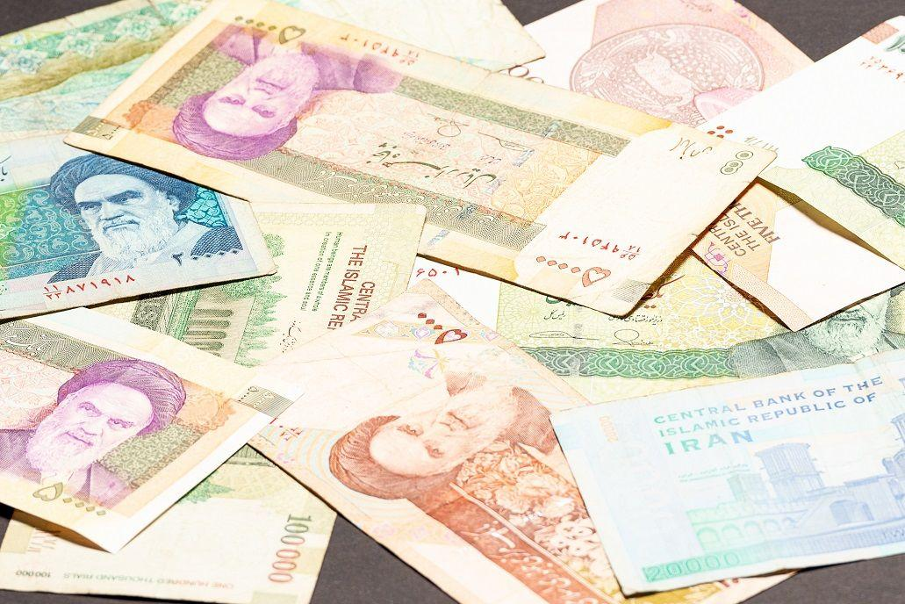

The Iranian Rial (IRR), represented by the ISO code IRR, serves as the official national currency of Iran. The Rial, introduced in the early 20th century, has a storied past and has undergone significant changes, particularly in response to shifting political and economic landscapes. The inherent volatility of the IRR, primarily driven by geopolitical tensions and economic sanctions, presents both challenges and opportunities for traders globally.

With the rise of algorithmic trading—an approach that employs computer algorithms to automate trading decisions—many traders have begun to explore engagement opportunities within this currency market. Algorithmic trading offers the potential to navigate the complexities of volatile currencies by executing trades at speeds and efficiencies unattainable by human traders. This technique can be particularly advantageous in markets like the Iranian Rial, where quick adaptation to rapid changes can significantly influence trading outcomes.



This article examines the nuances of Iranian Rial currency conversion and the implementation of algorithmic trading strategies. It aims to provide a comprehensive exploration of the basics of the IRR, alongside the concept of currency conversion, to illustrate how algorithmic trading can be employed to enhance trading results. Readers will gain insights into effectively utilizing advanced technological tools to approach IRR trading optimally. By the conclusion, the reader will possess a deeper understanding of how to strategically engage with the IRR using contemporary algo trading methodologies.

## Table of Contents

## Understanding the Iranian Rial (IRR)

The Iranian Rial (IRR) is the official currency of Iran, with a history marked by significant changes and challenges. Introduced in 1798, it replaced the qiran in 1932 as part of a modernization effort by the Pahlavi dynasty. Over the years, the Rial has been deeply influenced by domestic economic policies and external geopolitical factors.

One of the primary contributors to the Rial's volatility is geopolitical tension, notably stemming from Iran’s strained relations with Western powers. Sanctions imposed by the United States and the European Union have profoundly impacted Iran's economy, limiting its access to global markets. These sanctions have created scarcity of foreign currency and significantly hampered trade, leading to fluctuations in the Rial's value. For instance, after the 2018 U.S. withdrawal from the Joint Comprehensive Plan of Action (JCPOA) and subsequent sanctions, the Rial experienced precipitous declines in value.

Key economic indicators such as inflation, interest rates, and gross domestic product (GDP) growth also affect the value of the IRR. Iran has experienced high inflation rates due to various economic pressures, which have eroded the purchasing power of the Rial. Additionally, any changes in oil prices, given Iran's dependency on oil revenues, have a direct correlation with the currency's strength or weakness.

The Central Bank of Iran (CBI) plays an essential role in attempts to stabilize the currency. It intervenes by adjusting monetary policies and employing tools such as currency interventions in the foreign exchange market. The CBI's actions aim to manage inflation and support the economy, though their effectiveness is often curtailed by structural economic issues and external sanctions.

Traders face numerous challenges due to the Rial's [volatility](/wiki/volatility-trading-strategies) and market [liquidity](/wiki/liquidity-risk-premium) constraints. The dual exchange rate system, comprising an official rate and a free-market rate, complicates trading and pricing strategies. The lack of transparent financial market infrastructure further aggravates liquidity issues, making it difficult for traders to predict market movements accurately. Additionally, the regulatory environment and potential rapid shifts due to political developments intensify the risk associated with trading in IRR.

Overall, these elements shape the Iranian Rial's market dynamics, requiring traders and investors to carefully navigate the complexities arising from both geopolitical and economic factors.

## Basics of Currency Conversion

Currency conversion is the process of exchanging one country's currency for another to facilitate international trade and financial transactions. It plays a critical role in the global economy, allowing businesses and individuals to engage in cross-border transactions, investments, and travel. Understanding currency conversion is essential for traders as it influences pricing strategies, profit margins, and investment returns.

**Exchange Rates and Determination**

Exchange rates are the prices at which one currency can be exchanged for another. They are influenced by various factors, including economic indicators, interest rates, inflation, political stability, and market speculation. Exchange rates can be of two types: floating, where they fluctuate based on market forces, and pegged or fixed, where they are tied to another currency or basket of currencies by a country's central bank. For example, the Iranian Rial (IRR) has experienced significant fluctuations due to geopolitical tensions and economic sanctions, making it critical for traders to monitor these rates closely.

**Impact of Currency Spreads and Fees on Trading Profits**

Currency spreads refer to the difference between the bid (buying) and ask (selling) price of a currency pair. This spread represents a cost to the trader, affecting overall profitability. For example, a spread of 100 pips on a trade can reduce profits if the currency doesn't move significantly. Additionally, fees imposed by brokers or financial institutions for converting currencies add another layer of cost. Traders need to account for these costs to ensure their trading strategies remain profitable, especially in markets with high spreads and fees.

**Tools and Platforms for Real-Time Currency Conversion**

Several tools and platforms facilitate real-time currency conversion, crucial for traders dealing with volatile currencies like the Iranian Rial. Online platforms such as XE, OANDA, and Bloomberg provide live exchange rates, historical data, and advanced charting tools. API services like CurrencyLayer and Open Exchange Rates allow developers to integrate real-time exchange rate data into their own applications or trading systems. These tools offer critical insights and accurate data for making informed trading decisions.

**Navigating Complexities in Volatile Markets**

Trading in highly volatile markets presents unique challenges. Currency fluctuations can be erratic, and liquidity may be limited, leading to increased risk. Traders must adopt strategies to navigate these complexities, such as hedging against currency risk using derivatives like futures and options. Advanced [algorithmic trading](/wiki/algorithmic-trading) systems can also be employed to automate trading strategies, quickly execute trades based on predefined criteria, and adapt to market changes.

```python
# Example of using a Python library to get real-time exchange rates
import requests

def get_exchange_rate(base_currency, target_currency):
    api_url = 'https://api.exchangeratesapi.io/latest'
    response = requests.get(api_url, params={'base': base_currency, 'symbols': target_currency})
    data = response.json()
    return data['rates'][target_currency]

# Get the exchange rate from IRR to USD
exchange_rate_irr_usd = get_exchange_rate('IRR', 'USD')
print(f'The current exchange rate from IRR to USD is: {exchange_rate_irr_usd}')
```

Understanding the complexities of currency conversion especially in volatile markets is vital for traders. With the Iranian Rial's unique challenges, leveraging technological tools and strategic planning can significantly enhance trading outcomes.

 to Algorithmic Trading

Algorithmic trading is a method of executing trades using automated and pre-programmed trading instructions to account for variables like time, price, and [volume](/wiki/volume-trading-strategy). It fundamentally differs from traditional trading by leveraging advanced mathematical models and computation to optimize execution and reduce manual intervention. In contrast to discretionary trading, where decisions are made based on human judgment and emotions, algorithmic trading relies on technical analysis and historical data patterns to make objective and data-driven decisions.

The benefits of using algorithms in trading currencies, including the Iranian Rial (IRR), are numerous. Algorithms can operate at speeds and frequencies that humans cannot match, providing opportunities to exploit minor price discrepancies. They can improve market liquidity, lower transaction costs, and minimize human error. In the volatile IRR market, algorithmic trading can be particularly beneficial for quickly reacting to price movements and executing trades efficiently.

Several types of algorithmic trading strategies exist, and their application in currency trading varies. These strategies include, but are not limited to:

1. **Statistical Arbitrage**: Exploiting patterns in price spreads of currency pairs by applying statistical and quantitative techniques to identify mispriced assets.

2. **Market Making**: Involves placing both buy and sell limit orders to capitalize on the bid-ask spread.

3. **Trend Following**: Strategies that aim to capitalize on well-established trends in exchange rates.

4. **Mean Reversion**: Based on the idea that asset prices tend to revert to their historical mean or average level.

When developing and deploying trading algorithms specifically for the IRR, several key factors must be considered. Volatility in the IRR market means algorithms need to be resilient and adaptive. Developers should focus on:

- **Market Data Analysis**: Gathering accurate market data is critical due to potential inaccuracies or delays in currency information.
- **Latency and Execution Speed**: Minimizing latency is crucial, especially in a volatile market where quick execution can significantly impact performance.
- **Risk Management**: Incorporating robust risk management frameworks to handle rapid changes in currency prices and external market factors.

Backtesting and optimizing trading algorithms are essential steps in ensuring that they are effective under different market conditions. Backtesting involves simulating the algorithm's trading on historical data to assess its potential performance. This process helps identify any flaws or biases in the trading strategy, allowing for adjustments and optimizations before deploying the algorithm in the live market. Metrics such as Sharpe Ratio, Maximum Drawdown, and Total Return are commonly evaluated during [backtesting](/wiki/backtesting) to quantify risk and reward.

In Python, a simple example of a backtesting setup might involve libraries such as `pandas` for data manipulation and `numpy` for numerical calculations:

```python
import pandas as pd
import numpy as np

# Load historical exchange rate data
data = pd.read_csv('irr_exchange_rate.csv')

# Define a simple moving average strategy
data['SMA'] = data['Price'].rolling(window=30).mean()

# Signal generation
data['Signal'] = np.where(data['Price'] > data['SMA'], 1, 0)

# Backtesting performance
data['Returns'] = data['Price'].pct_change()
data['Strategy Returns'] = data['Signal'].shift(1) * data['Returns']

# Calculate cumulative returns
cumulative_returns = (1 + data['Strategy Returns']).cumprod()

print("Cumulative Returns:", cumulative_returns.iloc[-1])
```

Overall, the integration of algorithmic trading in the IRR market offers traders sophisticated tools to enhance their trading strategies, though it requires careful planning, development, and ongoing adjustments to succeed in an unpredictable market environment.

## Implementing Algo Trading for IRR Conversion

To effectively implement algorithmic trading for Iranian Rial (IRR) conversion, traders must follow systematic steps, select appropriate algorithms and platforms, and employ robust risk management strategies. This section provides a comprehensive approach to setting up such systems, with insights into successful strategies and maintenance practices.

### Steps to Set Up an Algorithmic Trading System for IRR

1. **Define Trading Objectives**: Establish clear goals, such as maximizing returns, minimizing risks, or optimizing transaction costs, which will guide system development.

2. **Data Acquisition and Preprocessing**: Gather historical and real-time data for IRR and relevant currency pairs. This data should be cleaned and normalized to ensure accuracy.

3. **Algorithm Selection**: Choose suitable algorithms based on objectives and market conditions. Strategies like mean reversion, trend following, and arbitrage are popular. For IRR, which tends to be volatile, adaptive algorithms that respond to sudden changes can be beneficial.

4. **Backtesting**: Use historical data to test algorithm performance under various market scenarios. This step helps refine the strategy and identify potential weaknesses.

5. **Trading Platform Selection**: Choose a platform that supports the necessary trading instruments and offers robust security measures. Platforms like MetaTrader and NinjaTrader provide extensive APIs for custom algorithm integration.

6. **Deployment**: Implement the algorithm on the chosen platform. Ensure the infrastructure supports high-speed data processing and order execution to respond swiftly to market changes.

### Choosing the Right Algorithms and Trading Platforms

Selecting algorithms involves evaluating their adaptability to IRR’s volatility. Common strategies include:

- **Trend Following**: Suitable in markets with clear directional movements. These algorithms identify price momentum and execute trades in the trend's direction.

- **Mean Reversion**: Exploits price deviations from historical norms, predicting a return to average prices.

- **Statistical Arbitrage**: Involves using statistical models to identify and exploit pricing inefficiencies.

Platforms should offer features such as real-time analytics, custom scripting capabilities, and strong security protocols to safeguard financial transactions.

### Risk Management Strategies

Effective risk management is crucial to mitigate volatility and currency risks:

- **Position Sizing**: Determine the size of positions based on the account equity and risk tolerance. Using the Kelly Criterion can optimize bet sizing for maximum growth.

- **Diversification**: Spread investments across various currency pairs or strategies to reduce exposure to a single currency's volatility.

- **Stop-Loss and Take-Profit Orders**: Automatically close positions to cap losses and secure profits at predefined levels.

### Case Studies of Successful Algo Trading Strategies

Successful case studies demonstrate the efficacy of algorithmic trading in volatile environments:

- A trading firm employed a combination of machine learning and sentiment analysis to predict IRR movements based on regional news and social media posts, achieving a low volatility strategy with consistent returns.

- Another case involved using high-frequency trading (HFT) techniques to capitalize on micro-arbitrage opportunities across multiple exchanges, leveraging milliseconds advantage in trade execution.

### Continuous Monitoring and Adjustment

To maintain performance, algorithms must be continuously monitored and adjusted as market conditions evolve:

- **Real-Time Monitoring**: Use dashboards and alerts to track performance in real-time, ensuring any deviations from expected behavior are promptly addressed.

- **Algorithm Optimization**: Regularly reevaluate algorithm parameters and assumptions, incorporating new data to improve accuracy.

- **Adaptation to Market Changes**: Implement machine learning models that self-adjust based on detected market patterns, enhancing resilience against unexpected shifts.

By meticulously setting up an algorithmic trading system and employing advanced strategies, traders can enhance their engagement with the Iranian Rial market, leveraging technology to navigate its unique challenges effectively.

## Challenges and Considerations

Trading the Iranian Rial (IRR) involves navigating a plethora of challenges, mainly due to the political and economic circumstances surrounding Iran. The currency's volatility, exacerbated by geopolitical tensions and economic sanctions, poses significant hurdles for traders. Regulatory and access issues remain critical challenges. The U.S. and international sanctions on Iran limit the accessibility of Iranian financial markets, making it difficult for foreign traders to engage directly. These restrictions necessitate the use of intermediaries or secondary markets, which can inevitably increase transaction costs and risks.

Technological and infrastructure limitations also impact algorithmic trading. Iran's cyber environment is restricted and often subjected to limitations, affecting the speed and reliability of data transmission. These infrastructural hurdles can hinder the real-time execution capabilities vital for successful algorithmic trading. Traders must consider latency issues and potential service interruptions that could severely affect trading performance.

Complying with international trading regulations and sanctions is an ongoing concern. Sanctions can change rapidly based on geopolitical developments, requiring traders to stay informed and ensure compliance to avoid legal repercussions. This necessitates constant monitoring of global policy shifts.

Data accuracy and currency liquidity present additional challenges. Limited access to reliable financial data can impede the effectiveness of trading algorithms, as inaccurate or delayed data can lead to poor trading decisions. Moreover, low liquidity in the market can widen spreads, increasing costs and limiting the ability to execute trades at desired prices.

Global and local news significantly influence IRR trading. Political events, economic announcements, and policy changes can cause swift movements in the currency's value. Algorithmic trading systems must integrate news analysis capabilities to adapt strategies in real-time. Implementing news sentiment analysis algorithms, for instance, can help capture market sentiment shifts and adjust trading positions accordingly. For example, in Python, one might use natural language processing (NLP) libraries like NLTK or spaCy to analyze news content and derive actionable insights:

```python
import nltk
from nltk.sentiment import SentimentIntensityAnalyzer

# Initialize the Sentiment Intensity Analyzer
sia = SentimentIntensityAnalyzer()

# Example news headline
headline = "Currency volatility increases as sanctions tighten on Iran."

# Conduct sentiment analysis
sentiment_score = sia.polarity_scores(headline)

print(sentiment_score)  # Outputs insights on whether sentiment is positive, negative, or neutral.
```

This strategy allows algorithms to systematically assess sentiment and adjust trading strategies dynamically, potentially mitigating the impact of unexpected market changes due to news events. Overall, trading the IRR requires a robust understanding of these multifaceted challenges, along with the flexibility to adapt strategies quickly in a highly dynamic environment.

## Conclusion

The Iranian Rial (IRR) holds a unique position in the global currency market due to its significant volatility, which in turn creates opportunities and challenges for traders. Its fluctuations, largely influenced by geopolitical factors and economic sanctions, demand a strategic approach to trading interventions. Algorithmic trading offers substantial benefits for engaging with the IRR by leveraging automation and data analysis to perform trades with precision and speed.

Algorithmic trading strategies, when applied to the IRR, provide the ability to respond swiftly to market changes, optimize trading execution, and minimize human error. Algorithms can process large volumes of data and execute trades in milliseconds, which is particularly advantageous in the volatile market environment associated with the IRR. Furthermore, algo trading offers enhanced options for risk management, enabling traders to implement stop-loss orders, hedge against market movements, and control exposure effectively.

However, IRR trading through algorithmic means is not without challenges. Regulatory constraints, access difficulties, and technological limitations in Iran present hurdles that need to be navigated carefully. Additionally, the accuracy of data and liquidity concerns require continuous monitoring and refinement of trading strategies. Traders must also adapt to the influence of global and local news events on currency values, integrating these factors into their algorithms for improved responsiveness.

Looking to the future, algorithmic trading is poised to play an increasingly vital role in developing and volatile currency markets. Continued advancements in technology, data analysis, and [artificial intelligence](/wiki/ai-artificial-intelligence) are likely to expand the capabilities of trading algorithms, offering greater precision and strategic advantage. Traders are encouraged to harness innovative technologies such as [machine learning](/wiki/machine-learning), blockchain, and cloud computing to enhance their trading frameworks and gain a competitive edge.

Staying informed and agile is paramount in the rapidly changing landscape of currency trading. It is crucial for traders to remain updated with global economic trends, regulatory updates, and technological innovations. This continuous learning approach ensures that they can adapt algorithmic models to evolving market conditions and capitalize on new opportunities. By cultivating a proactive mindset, traders can optimize their strategies and thrive in the dynamic world of IRR trading.

## References & Further Reading

[1]: Bahmani-Oskooee, M., & Saha, S. (2019). "The J-Curve in Iran: An Application of the ARDL Approach." Economic Analysis and Policy, 62, 357-372. doi:10.1016/j.eap.2019.04.003

[2]: Peker, E., & Saigol, R. (2018). ["Sanctions and Iran's Financial Meltdown."](https://onlinelibrary.wiley.com/doi/10.1111/flan.12338) The Wall Street Journal.

[3]: Lopez de Prado, M. (2018). ["Advances in Financial Machine Learning."](https://www.amazon.com/Advances-Financial-Machine-Learning-Marcos/dp/1119482089) Wiley.

[4]: Chan, E. P. (2008). ["Quantitative Trading: How to Build Your Own Algorithmic Trading Business."](https://github.com/ftvision/quant_trading_echan_book) Wiley.

[5]: Jansen, S. (2020). ["Machine Learning for Algorithmic Trading: Predictive models to extract signals from market and alternative data for systematic trading strategies in Python."](https://www.amazon.com/Machine-Learning-Algorithmic-Trading-alternative/dp/1839217715) Packt Publishing.

[6]: Aronson, D. (2006). ["Evidence-Based Technical Analysis: Applying the Scientific Method and Statistical Inference to Trading Signals."](https://www.amazon.com/Evidence-Based-Technical-Analysis-Scientific-Statistical/dp/0470008741) Wiley.

[7]: Sherwood, R. (2018). ["Currency Crisis in Iran: Causes and Solutions."](https://cepr.org/voxeu/columns/lessons-history-three-generations-currency-crises) Reuters.