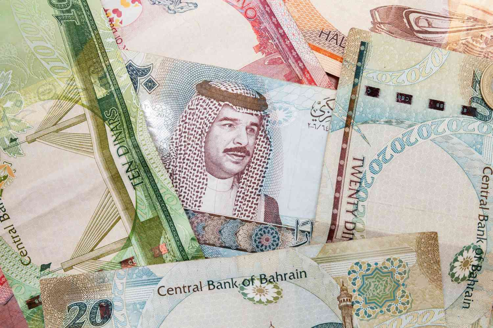

The Iraqi Dinar (IQD) has captured the interest of investors who are drawn to emerging markets due to its intricate historical background and economic possibilities. The currency has been a symbol of both hope and caution; its complex history reflects a tumultuous journey through geopolitical upheavals and economic reforms. For investors, this means both potential opportunities and considerable risks. A key feature of the IQD is its volatility, which has posed challenges but also opened avenues for profit through strategic market engagement.

As technology transforms financial markets, algorithmic trading, or algo trading, has emerged as a modern method to navigate the volatility associated with the IQD. Algo trading uses automated systems to make trading decisions, aiming for optimal execution based on predefined criteria. In the context of the IQD, these algorithms can be tailored to account for its fluctuating value, driven by factors like geopolitical shifts and economic policies.



This article will examine the evolution of the Iraqi Dinar, its present-day economic context, and the impact of algorithmic trading in potentially reducing risks while maximizing profits. For those considering investments in the IQD using algorithmic strategies, understanding these aspects will be crucial. We will also highlight essential considerations for would-be investors, offering a detailed guide to the promising yet challenging landscape of IQD trading.

## Table of Contents

## History of the Iraqi Dinar

The Iraqi Dinar (IQD) has a rich and complex history, reflecting the broader socio-political and economic dynamics of the region. The currency was introduced in 1932, coinciding with Iraq's achievement of nominal independence from British control. It replaced the Indian rupee, which had been in use during the British administration, symbolizing Iraq's newfound autonomy.

Initially, the Iraqi Dinar was pegged to the British pound, a common practice among territories under British influence. This peg to a stable currency provided a period of relative stability until it was eventually shifted to align with the US dollar. Such changes in monetary policy were influenced by global economic trends and internal pressures within Iraq to maintain economic equilibrium.

However, the stability of the IQD was severely disrupted during the Gulf War in the early 1990s. Economic sanctions and military conflict caused the value of the dinar to plummet at an alarming rate. The pre-war value of approximately 3.22 IQD to 1 USD dropped significantly, leading to hyperinflation and erosion of public confidence in the currency.

In 2003, following the US-led invasion of Iraq and the subsequent fall of Saddam Hussein's regime, new banknotes were introduced. This move aimed to stabilize the currency and spur economic recovery. The Coalition Provisional Authority issued these new banknotes, which were part of broader efforts to rebuild Iraq's financial infrastructure.

Despite these efforts, the Iraqi Dinar has remained highly volatile. The [volatility](/wiki/volatility-trading-strategies) is attributed to ongoing geopolitical instability, dependence on oil revenue, and a complex monetary system. Consequently, while the dinar has been subject to various stabilization efforts, it continues to face challenges that affect its standing in global currency markets.

## Current Status and Economics of the Iraqi Dinar

Currently, the Iraqi Dinar (IQD) is pegged at a rate of approximately 1,450 IQD per US dollar, reflecting its controlled exchange regime managed by the Central Bank of Iraq (CBI). This pegged exchange rate system is designed to provide stability in a country where economic and political factors can cause significant fluctuations in currency value. Iraq's economy is predominantly driven by oil exports, a critical [factor](/wiki/factor-investing) influencing the demand for the IQD on the global stage. Since oil transactions are conducted in US dollars, fluctuations in oil prices directly impact Iraq's fiscal health and, by extension, the stability and demand for its currency.

Recent economic conditions have been challenging for Iraq, marked by declining oil prices and internal economic difficulties, such as the need for economic diversification and infrastructure development. These issues have compounded Iraq's financial vulnerabilities, magnifying the importance of maintaining a stable exchange rate for the dinar.

In December 2020, the Central Bank of Iraq undertook a significant decision to devalue the Iraqi Dinar, adjusting the exchange rate to mitigate the economic challenges exacerbated by the global oil market downturn and the impacts of the COVID-19 pandemic. This move was aimed at bolstering governmental revenue through increased local currency denominated earnings from oil exports, albeit at the cost of higher import prices and inflationary pressure.

Due to such economic constraints, the Iraqi Dinar sees limited use outside its domestic borders, resulting in a currency that is not widely traded in international foreign exchange markets. This limitation is reflected in the small number of [forex](/wiki/forex-system) platforms that offer IQD trading services. For investors and traders, the sparse availability of the IQD on global forex platforms points to essential [liquidity](/wiki/liquidity-risk-premium) considerations, which can lead to wider bid-ask spreads and increased transaction costs. These factors collectively shape a complex economic landscape for the Iraqi Dinar, influencing its utility and appeal in both local and international financial markets.

## Understanding Algorithmic Trading

Algorithmic trading employs computer programs to automatically execute trades under pre-defined conditions, optimizing for factors such as timing, quantity, and price. This method is particularly effective in the currency trading sector where speed and precision are crucial, and it enables traders to respond promptly to market changes based on real-time data analysis.

For the Iraqi Dinar (IQD), known for its unpredictability, [algorithmic trading](/wiki/algorithmic-trading) can provide significant advantages. It leverages automated decision-making processes to swiftly respond to economic indicators, such as currency supply changes, interest rates, GDP growth, and geopolitical events, which might otherwise be missed or reacted to more slowly by human traders. 

Algorithms are designed to parse large volumes of data, conduct comparative analyses, and identify patterns that might not be visible to humans. An algorithm can, for example, analyze historical price patterns to predict future movements or use technical indicators like moving averages and Bollinger bands to trigger buy or sell signals based on probabilistic models. The efficacy of algorithmic trading relies on statistical and mathematical models that optimize trading strategies. 

A simple trading strategy might be based on the moving average crossover. Here’s a basic Python example illustrating this concept:

```python
import pandas as pd
import numpy as np

def moving_average_strategy(prices, short_window=40, long_window=100):
    signals = pd.DataFrame(index=prices.index)
    signals['price'] = prices
    signals['short_mavg'] = prices.rolling(window=short_window, min_periods=1, center=False).mean()
    signals['long_mavg'] = prices.rolling(window=long_window, min_periods=1, center=False).mean()

    signals['signal'] = 0.0
    signals['signal'][short_window:] = np.where(signals['short_mavg'][short_window:] 
                                                > signals['long_mavg'][short_window:], 1.0, 0.0)
    signals['positions'] = signals['signal'].diff()

    return signals

# Assuming 'prices' is a DataFrame column of IQD/USD exchange rate
# signals = moving_average_strategy(prices)
```

The aim is to minimize risk by using disciplined trading signals and to capitalize on volatility by executing trades at favorable moments. In doing so, traders can potentially achieve better returns while avoiding emotional pitfalls, such as panic selling or buying, which can distort judgment and strategy.

Algorithmic systems can also backtest strategies using historical data to validate their effectiveness before applying them in live trading environments. This approach not only aids in minimizing risk but also enhances the opportunity to capitalize on market inefficiencies in a disciplined manner. 

Overall, algorithmic trading facilitates the automation of sophisticated trade strategies, allowing for enhanced scalability and consistency in implementation, especially crucial in handling the unpredictable nature of trading currencies like the Iraqi Dinar.

## Algo Trading with the Iraqi Dinar

Incorporating the Iraqi Dinar (IQD) into an algorithmic trading strategy requires an in-depth understanding of both technical factors and the geopolitical landscape intricately linked to this currency. Algorithmic traders aiming to engage with the IQD often begin by analyzing historical data and incorporating real-time news feeds into their trading algorithms. Such data-driven approaches allow traders to identify patterns and trends that human analysts might overlook. A critical feature of these systems is their sensitivity to economic variables specific to the IQD, such as fluctuations in oil prices due to Iraq's strong economic dependency on oil exports. 

Mathematically, traders may employ statistical models to detect and react to price anomalies. For instance, the use of moving averages or autoregressive integrated moving average (ARIMA) models can assist in forecasting future price movements based on historical trends. Python, a popular programming language for developing trading algorithms, offers several libraries such as `pandas` and `numpy` for data manipulation, while `statsmodels` provides advanced modeling capabilities. Below is a simple example of using Python to calculate a moving average:

```python
import pandas as pd

# Assuming 'data' is a DataFrame containing historical IQD exchange rates
data['Moving Average'] = data['IQD_Rate'].rolling(window=30).mean()
```

Due to the economy's reliance on oil, algorithmic strategies must also consider oil market dynamics, which can significantly influence the IQD's value. For instance, a sharp drop in oil prices could lead to a depreciation of the dinar, prompting algorithms to adjust trading positions swiftly to mitigate potential losses.

Execution strategies in IQD trading need to manage liquidity challenges unique to the dinar. The currency's limited global trading [volume](/wiki/volume-trading-strategy) can lead to liquidity constraints, resulting in discrepancies between market prices and execution prices, or slippage. Advanced algorithms may incorporate liquidity metrics to optimize execution and minimize transaction costs. Tools like `QuantLib` in C++ can offer sophisticated financial models and instruments to handle such complexities.

Overall, successful algo trading with the IQD hinges on the capacity to adapt to its geopolitical and economic influences while deftly navigating technical trading challenges.

## Risks Associated with IQD Trading

The Iraqi Dinar (IQD) is a currency that presents numerous risks for traders, primarily due to its high volatility and the geopolitical instability inherent in the region. This volatility is exacerbated by Iraq's political landscape, which often impacts economic policies and, subsequently, currency valuations. This section explores the key risks associated with trading the IQD.

Liquidity poses a significant challenge when trading the IQD. The currency's limited use outside Iraq results in low trading volumes on international forex platforms. As a consequence, traders are likely to encounter wide bid-ask spreads, which can inflate transaction costs. This illiquidity can complicate the execution of large trades without significantly affecting the market price.

Moreover, the foreign exchange market for the IQD is susceptible to scams targeting investors, particularly those who are hopeful of substantial returns due to rumors of potential revaluation. Such scams often involve fraudulent companies or brokers promising exaggerated profits. Investors are advised to exercise extreme caution and conduct thorough due diligence on the credibility of brokers and platforms before committing funds. It is recommended to verify if the broker is regulated by competent authorities to ensure the safekeeping of investments.

To mitigate these risks, traders can implement certain strategies, such as using limit orders to manage spreads and employing rigorous risk management protocols to handle unexpected market movements. Additionally, maintaining awareness of geopolitical developments and Iraqi economic policies is crucial for anticipating factors that may influence IQD volatility.

Risk management is critical in IQD trading, and algorithmic approaches can aid in creating buffer strategies to navigate the market's complexities. Algorithms can be programmed to perform predefined risk assessments and trigger specific actions based on market conditions, potentially reducing exposure to adverse price movements. Adopting a disciplined trading approach is essential for investors who wish to engage in trading Iraqi Dinar in a volatile and often unpredictable market environment.

## Conclusion

The Iraqi Dinar (IQD), while presenting substantial risk, offers unique investment opportunities when managed through a well-structured trading strategy. Algorithmic trading stands out as a contemporary method to navigate the currency's notable volatility. By leveraging sophisticated algorithms, traders can swiftly react to market fluctuations and economic indicators, potentially capitalizing on the high volatility of the IQD.

Investors interested in the IQD should be diligent, undertaking exhaustive research to grasp the associated risks and market conditions. This includes understanding geopolitical instability, liquidity challenges, and the economic dependence of Iraq on oil exports. Evaluating the credibility of brokers and trading platforms is crucial to avoid scams and unreliable transactions.

Investing in IQD, like any engagement with emerging markets, necessitates a commitment to continuous learning and adaptation. Staying informed about global economic trends, technological advancements in trading strategies, and regulatory changes is essential for investors aiming to succeed in this complex arena. The dynamic nature of such investments means that a strategic, informed, and flexible approach is paramount for navigating the opportunities and risks that the IQD presents.

## References & Further Reading

[1]: Bergstra, J., Bardenet, R., Bengio, Y., & Kégl, B. (2011). ["Algorithms for Hyper-Parameter Optimization."](https://dl.acm.org/doi/10.5555/2986459.2986743) Advances in Neural Information Processing Systems 24.

[2]: ["Advances in Financial Machine Learning"](https://www.amazon.com/Advances-Financial-Machine-Learning-Marcos/dp/1119482089) by Marcos Lopez de Prado

[3]: ["Evidence-Based Technical Analysis: Applying the Scientific Method and Statistical Inference to Trading Signals"](https://www.amazon.com/Evidence-Based-Technical-Analysis-Scientific-Statistical/dp/0470008741) by David Aronson

[4]: ["Machine Learning for Algorithmic Trading"](https://github.com/stefan-jansen/machine-learning-for-trading) by Stefan Jansen

[5]: ["Quantitative Trading: How to Build Your Own Algorithmic Trading Business"](https://www.amazon.com/Quantitative-Trading-Build-Algorithmic-Business/dp/1119800064) by Ernest P. Chan