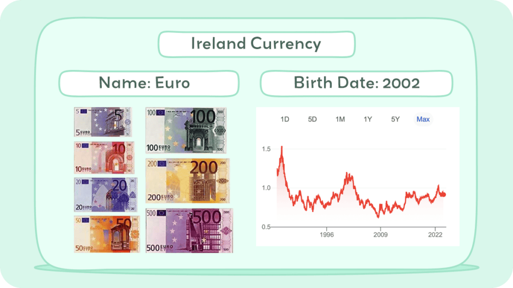

## Table of Contents

## What was the Irish Pound?

The Irish Pound, also known as the Punt, was the currency used in Ireland before the country switched to the Euro in 2002. It was first introduced in 1928, replacing the British pound, which had been used in Ireland up to that point. The Irish Pound was divided into 100 pence and had its own set of coins and banknotes.

Over the years, the Irish Pound went through several changes. In 1971, Ireland decimalized its currency, meaning it switched from using shillings and pence to a system based on 100 pence to a pound. This made transactions easier and aligned the Irish Pound more closely with other decimalized currencies. The Irish Pound was used for everyday transactions in Ireland until it was replaced by the Euro, which is now the official currency of Ireland and many other European countries.

## When was the Irish Pound introduced?

The Irish Pound was first used in 1928. Before that, Ireland used the British pound. The Irish Pound was also called the Punt. It was split into 100 pence and had its own money, like coins and banknotes.

In 1971, Ireland changed its money system. They started using a decimal system, which means they used 100 pence to make one pound. This made buying things easier. The Irish Pound was used every day in Ireland until 2002. That's when Ireland started using the Euro, which is now the money used in Ireland and many other countries in Europe.

## What was the symbol and currency code for the Irish Pound?

The symbol for the Irish Pound was £. It looked just like the British pound symbol. People in Ireland used this symbol when they wrote down prices or amounts of money.

The currency code for the Irish Pound was IEP. This code was used in banks and by people who worked with money. It helped to tell the Irish Pound apart from other currencies.

## How was the value of the Irish Pound determined?

The value of the Irish Pound was determined by how much other countries wanted to trade with Ireland and how strong Ireland's economy was. If Ireland's economy was doing well, more people wanted to buy things from Ireland, which made the Irish Pound stronger. If Ireland's economy was not doing well, fewer people wanted to buy things from Ireland, and the Irish Pound became weaker. The government and the Central Bank of Ireland also played a big role in deciding the value of the Irish Pound. They could change interest rates or make rules about how much money could be bought and sold to keep the value of the Irish Pound stable.

Before 1979, the value of the Irish Pound was often compared to the British pound because Ireland traded a lot with the UK. After 1979, Ireland joined the European Exchange Rate Mechanism (ERM), which was a group of European countries that agreed to keep their currencies' values close to each other. This helped make the Irish Pound more stable and predictable. Being part of the ERM meant that the value of the Irish Pound was influenced by the values of other European currencies, not just the British pound.

## What were the major events that affected the value of the Irish Pound?

Several major events affected the value of the Irish Pound over the years. One big event was the oil crisis in the 1970s. This made everything more expensive and slowed down Ireland's economy. As a result, the Irish Pound became weaker because fewer people wanted to buy things from Ireland. Another event was when Ireland joined the European Exchange Rate Mechanism (ERM) in 1979. This helped make the Irish Pound more stable because it was now tied to other European currencies. Being part of the ERM meant that the Irish Pound's value was influenced by what was happening in other European countries, not just Ireland.

Another important event was the economic boom in Ireland during the 1990s, often called the Celtic Tiger. During this time, Ireland's economy grew very fast, and more people wanted to buy things from Ireland. This made the Irish Pound stronger. However, the global financial crisis in 2008 hit Ireland hard. The economy slowed down a lot, and the Irish Pound became weaker again. Finally, in 2002, Ireland switched to the Euro. This meant the end of the Irish Pound, and its value was no longer determined on its own but became part of the larger Euro currency system.

## When and why did Ireland decide to join the European Monetary System?

Ireland decided to join the European Monetary System (EMS) in 1979. The main reason was to make the Irish Pound more stable. Before joining, the value of the Irish Pound went up and down a lot, which made it hard for businesses and people to plan for the future. By joining the EMS, Ireland's currency would be tied to other European currencies, which would help keep its value more steady.

Joining the EMS was also important because it showed that Ireland wanted to be more connected with Europe. At the time, many European countries were working together more closely, and being part of the EMS was a way for Ireland to be involved in these efforts. This move helped Ireland's economy in the long run by making trade with other European countries easier and more predictable.

## How did the Irish Pound perform against other major currencies before the Euro?

Before the Euro, the Irish Pound's value went up and down a lot compared to other major currencies. It was often compared to the British pound because Ireland traded a lot with the UK. In the 1970s, the oil crisis made everything more expensive, and Ireland's economy slowed down. This made the Irish Pound weaker against other currencies like the US dollar and the German mark. When Ireland joined the European Exchange Rate Mechanism (ERM) in 1979, things started to change. The ERM helped keep the Irish Pound's value more steady because it was now tied to other European currencies.

During the 1990s, Ireland had a big economic boom called the Celtic Tiger. This made the Irish Pound stronger against other currencies because more people wanted to buy things from Ireland. But the global financial crisis in 2008 hit Ireland hard, and the Irish Pound became weaker again. Overall, the Irish Pound's performance against other major currencies depended a lot on what was happening in Ireland's economy and how it was connected to the economies of other countries.

## What was the process of transitioning from the Irish Pound to the Euro?

The transition from the Irish Pound to the Euro started in 1999 when the Euro was first introduced as an electronic currency. This meant that banks and big businesses in Ireland began using the Euro for their transactions, even though people still used the Irish Pound for everyday buying and selling. The government and the Central Bank of Ireland worked together to make sure everything went smoothly. They set up a big plan to help people understand the change and to make sure that the new Euro coins and banknotes would be ready on time.

In January 2002, the Euro coins and banknotes were introduced in Ireland, and people could start using them. For a short time, both the Irish Pound and the Euro were used together. This was called the dual circulation period, and it lasted until the end of February 2002. After that, the Irish Pound was no longer used, and the Euro became the only money in Ireland. The government helped people exchange their old Irish Pound money for Euros at banks and post offices. This made the switch easier for everyone and helped make sure that nobody lost their money during the change.

## When was the Euro officially introduced in Ireland?

The Euro was officially introduced in Ireland in January 2002. Before that, in 1999, the Euro was already being used by banks and big businesses, but people still used the Irish Pound for everyday buying and selling. The government and the Central Bank of Ireland worked hard to make sure everything would go smoothly when the Euro came.

In January 2002, Euro coins and banknotes started being used in Ireland. For a short time, both the Irish Pound and the Euro were used together. This lasted until the end of February 2002. After that, the Irish Pound was no longer used, and the Euro became the only money in Ireland. The government helped people exchange their old Irish Pound money for Euros at banks and post offices, making the switch easier for everyone.

## How has the Euro impacted Ireland's economy compared to the Irish Pound?

Since switching to the Euro, Ireland's economy has seen both good and bad changes compared to when it used the Irish Pound. The Euro has made it easier for Ireland to trade with other countries in Europe because they all use the same money. This has helped Ireland's businesses grow and sell more things to other countries. Also, the Euro is a stronger and more stable currency than the Irish Pound was. This means that people and businesses in Ireland can plan better for the future because they know their money won't go up and down a lot.

But there have been some challenges too. When the global financial crisis happened in 2008, Ireland's economy was hit hard. Being part of the Euro meant Ireland couldn't change its own money's value to help fix the problem, like it could with the Irish Pound. This made the crisis worse for Ireland. Also, because the Euro is used by many countries, Ireland has less control over its own money. If other countries in Europe have problems, it can affect Ireland's economy too, even if Ireland is doing well on its own.

## What are the key differences in monetary policy between the Irish Pound and the Euro?

When Ireland used the Irish Pound, the country had its own central bank that could make decisions about money. This meant Ireland could change interest rates or the value of the Irish Pound to help its economy. If the economy was doing badly, the central bank could make the Irish Pound weaker to help businesses sell more things to other countries. If the economy was doing well, the central bank could make the Irish Pound stronger to keep prices from going up too fast.

Since switching to the Euro, Ireland's money decisions are made by the European Central Bank (ECB), which is in charge of the Euro for all the countries that use it. This means Ireland can't change interest rates or the value of its money on its own anymore. The ECB makes decisions that are good for all the countries using the Euro, not just Ireland. This can be good because it makes the Euro strong and stable, but it can also be hard if Ireland's economy needs something different from what the ECB decides.

## How do exchange rates and inflation rates compare between the Irish Pound and the Euro?

When Ireland used the Irish Pound, its exchange rates and inflation rates could change a lot. The value of the Irish Pound went up and down compared to other currencies like the US dollar or the British pound. This made it hard for businesses to plan because they never knew exactly how much their money would be worth. Inflation, which is when prices go up over time, was also higher with the Irish Pound. Sometimes, the government would change the value of the Irish Pound to try to control inflation, but it was still hard to keep prices steady.

Since switching to the Euro, Ireland's exchange rates and inflation rates have been more stable. The Euro is used by many countries, so its value doesn't change as much as the Irish Pound did. This makes it easier for businesses in Ireland to plan because they know how much their money will be worth. Inflation has also been lower with the Euro. The European Central Bank, which controls the Euro, works to keep prices from going up too fast across all the countries that use the Euro. This helps keep things more predictable for people and businesses in Ireland.

## References & Further Reading

[1]: Barry, F. (2003). ["Economic Integration and Convergence Processes in the EU Cohesion Countries."](https://onlinelibrary.wiley.com/doi/10.1111/j.1468-5965.2003.00468.x) Journal of Common Market Studies.

[2]: Honohan, P. (1995). ["The Irish Pound: From Origins to EMU."](https://www.researchgate.net/publication/227382729_The_Irish_Pound_From_Origins_to_EMU) Central Bank of Ireland Research Technical Papers.

[3]: European Central Bank. ["The Euro and Economic Stability."](https://www.ecb.europa.eu/press/key/date/2024/html/ecb.sp240429~87c3a4f37f.en.html) European Central Bank.

[4]: Diwan, I., & Galindo-Arjoon, M. (2009). ["The Economic Impact of the Euro"](https://papers.ssrn.com/sol3/papers.cfm?abstract_id=1163774) Review of World Economics.

[5]: ["High-Frequency Trading: A Practical Guide to Algorithmic Strategies and Trading Systems"](https://www.ahmetbeyefendi.com/wp-content/uploads/2020/07/High-Frequency-Trading-Irene-Aldridge.pdf) by Irene Aldridge.

