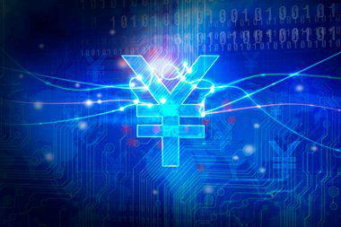

The evolution of currency in Ireland reflects the nation's progression through pivotal economic and political transitions. From the establishment of the Irish pound following independence in 1927 to its eventual replacement by the euro, each phase of currency development underscores significant shifts in Ireland's economic landscape. These changes not only highlight the country's adaptation to European economic standards but also demonstrate the broader implications of currency management and stability on national and regional prosperity.

This article examines the historical trajectory of the Irish pound, detailing its initial parity with the British pound and subsequent journey towards greater autonomy. The transition to the euro marked a crucial milestone, aligning Ireland with the European Union's financial infrastructure and enhancing the country's trade and investment capabilities.



In parallel, advancements in technology have transformed forex markets, with algorithmic trading now playing a pivotal role in defining trading strategies and ensuring optimal execution. Understanding Ireland's currency evolution, alongside the technological advancements in trading, offers valuable insights into the mechanics of currency stability and the formulation of effective trading strategies in today's dynamic financial environment.

## Table of Contents

## The History of the Irish Pound

The Irish pound was introduced in 1927, following Ireland's independence from Britain. This development signified a crucial step in establishing the newly-formed Irish Free State's economic identity. Initially, the Irish pound (punt Éireannach) was pegged at parity with the British pound sterling, simplifying trade and financial transactions between Ireland and Britain. The currency was issued by the Currency Commission of Ireland, later replaced by the Central Bank of Ireland in 1943.

A significant transformation occurred in the 1970s, a decade characterized by substantial changes in the global economic landscape. In 1971, Ireland underwent the process of decimalisation, which involved realigning the currency's subunits from old pence to a decimal system, akin to the shift in the United Kingdom. This conversion was essential for modernizing the currency system and was in line with a similar change in the UK, facilitating smoother transitions for businesses and the public alike.

However, the economic relationship between the Irish and British pounds began to diverge as part of broader economic reforms. In 1979, Ireland joined the European Monetary System (EMS), which marked a crucial pivot away from its fixed link to sterling. This strategic move aimed at stabilizing the Irish currency by pegging it to the European Currency Unit (ECU) rather than the British pound. By doing so, Ireland sought to integrate more closely with European economies, enhancing its economic autonomy and reducing dependency on the UK.

The shift presented both opportunities and challenges for the Irish economy. While the break from British monetary policy allowed for greater control over its economic direction, it also introduced [volatility](/wiki/volatility-trading-strategies), particularly due to fluctuations in exchange rates with sterling. The Irish pound operated within the Exchange Rate Mechanism (ERM) of the EMS, which required maintaining exchange rates within specified bands against other European currencies. Despite these challenges, the decision to decouple from the British pound gradually established the Irish pound's presence in international markets.

The existence of the Irish pound stretched until 2002 when it was replaced by the euro, following Ireland's participation in the European Economic and Monetary Union (EMU). This culmination marked the end of a significant era in Irish monetary history, as the country moved towards deeper integration with its European neighbors. Through the adoption of the euro, Ireland embraced new economic paradigms that aligned with broader EU monetary policies, paving the way for enhanced trade, investment, and economic stability.

## Transition to the Euro

The transition from the Irish pound to the euro marked a significant milestone in Ireland's economic alignment with the European Union. This complex process began in 1999 when Ireland, along with ten other EU countries, entered the third stage of the Economic and Monetary Union (EMU), adopting the euro in non-cash form for commercial and electronic transactions. The currency conversion was governed by a fixed exchange rate, whereby 1 euro was equivalent to 0.787564 Irish pounds. This necessitated detailed logistical planning and systems upgrades across financial institutions to align with EU standards.

The transition culminated in 2002 when euro banknotes and coins were introduced to the public, and the Irish pound ceased to be legal tender. This period required substantial public engagement efforts to familiarize the population with the new currency. Educational campaigns were instrumental in facilitating the public's understanding of the value difference and ensuring a smooth adaptation from pounds to euros.

Moreover, the euro's introduction bolstered Ireland's economic integration within the European Union by eliminating exchange-rate risks and reducing transaction costs among member states. As a result, Ireland's trade and investment climate improved significantly, offering enhanced opportunities for businesses and fostering economic growth. The adoption of the euro played a crucial role in stabilizing Ireland's economy, allowing it to benefit from a larger, more integrated European market.

## Comparing Irish Pound and Euro

The shift from the Irish pound to the euro was marked by a fixed conversion rate of 0.787564 Irish pounds per euro, highlighting the euro's role as a stabilizing force within the European monetary framework. This conversion rate was established to maintain parity in value and facilitate a seamless transition for businesses and consumers alike. By pegging the Irish pound to the euro at this specific rate, the goal was to ensure that the introduction of the euro would foster currency stability across the newly formed Eurozone.

During the early years of the euro's adoption, inflation concerns emerged as a significant challenge. The transition phase witnessed fluctuating inflation rates, largely due to perceived pricing adjustments as businesses and consumers acclimated to the new currency. Despite these initial struggles, the adoption of the euro is credited with bringing about long-term economic stability. The euro's widespread acceptance reduced currency exchange risks, lowered interest rates, and ultimately contributed positively to Ireland's economic environment.

Business adaptation during the transitional period experienced notable fluctuations. Enterprises were required to display prices in both Irish pounds and euros, which initially caused confusion and price volatility in the market. This period of dual pricing was essential for maintaining consumer confidence and ensuring an understanding of exchange values amidst the broader economic shift. Over time, as businesses recalibrated their pricing strategies and consumers became accustomed to the new currency, market stability was restored, facilitating the smooth continuation of Ireland's economic integration within the European Union.

In summary, the comparison between the Irish pound and the euro underscores a period of adjustment characterized by strategic financial planning to align with EU standards. The fixed conversion rate and parallel pricing strategies played pivotal roles in maintaining economic equilibrium, ensuring seamless acceptance and integration of the euro within the Irish economy.

## The Role of Algorithmic Trading in Forex Markets

Algorithmic trading represents a revolutionary approach in the [forex](/wiki/forex-system) markets, allowing for the automation of trading decisions through sophisticated algorithms. These algorithms, a set of predefined instructions, help in optimizing the execution speed and pricing strategies by analyzing vast amounts of market data more efficiently than human traders. This automation enables traders to capitalize on fleeting market opportunities, ensuring that trades are executed at the best possible prices, often within milliseconds.

The transition from the Irish pound to the euro provides a substantial dataset that has been instrumental in developing these trading algorithms. This shift necessitated adaptations in forex markets, with traders recalibrating their models to accommodate the new currency dynamics. The challenges and responses during this period provide valuable insights into market behavior, offering a robust framework for the creation of predictive trading models.

Understanding historical currency shifts, such as those experienced during Ireland's currency transition, is crucial for refining predictive algorithms in forex trading. By analyzing past currency behaviors and market responses, traders can anticipate future trends and adjust their strategies accordingly. This foresight is facilitated by advanced data analysis techniques, including [machine learning](/wiki/machine-learning), which can process and interpret complex data patterns.

For instance, a basic predictive model in [algorithmic trading](/wiki/algorithmic-trading) might employ linear regression to forecast future exchange rates based on historical data. In Python, such a model could be implemented as follows:

```python
import numpy as np
from sklearn.linear_model import LinearRegression

# Historical data for exchange rates (e.g., Irish pound to euro)
X = np.array([[1], [2], [3], [4], [5]])  # Time periods
y = np.array([1.12, 1.15, 1.14, 1.18, 1.21])  # Exchange rates

# Create and train the model
model = LinearRegression()
model.fit(X, y)

# Predict future exchange rate
future_time_period = np.array([[6]])
predicted_rate = model.predict(future_time_period)
print(f"Predicted exchange rate: {predicted_rate[0]}")
```

This simple model illustrates the basic principles of algorithmic trading, where past trading data helps forecast future rates. More advanced models incorporate multiple variables, leverage real-time data feeds, and adapt to market volatility, thereby increasing their accuracy and utility.

Furthermore, algorithmic trading promotes greater [liquidity](/wiki/liquidity-risk-premium) and tighter spreads in the forex market, contributing to overall market efficiency. As algorithms improve, they continuously adapt to evolving market conditions and historical parallels, such as those seen in the Irish currency transition, which enhance their predictive power and operational success.

## Conclusion

The journey from the Irish pound to the euro marks a significant evolution in Ireland's economic history. This transition not only reflects changes within the country but also highlights the broader economic and political shifts that have shaped the European landscape. The adoption of the euro in 2002 signified Ireland's commitment to European integration, facilitating increased trade and investment opportunities across the EU.

Algorithmic trading today benefits from the lessons learned during these historical transitions. The introduction of the euro provided a plethora of data on currency stability and market reactions. Traders and financial institutions have utilized this data to refine algorithms for automated trading, optimizing execution speed and precision. By analyzing historical currency trends, algorithmic trading systems can better predict future market behaviours, thus allowing traders to devise more effective strategies in forex markets.

Furthermore, the adaptability evident in historical currency transitions like Ireland's informs modern trading strategies. These strategies incorporate historical insights to enhance resilience and responsiveness amidst dynamic financial landscapes. As the markets continue to evolve, the integration of past experiences into present-day technologies remains crucial. It underscores the importance of leveraging historical knowledge to inform future advancements, ensuring that trading strategies remain robust and innovative.

## References & Further Reading

[1]: Barry, F. (2003). ["Economic Integration and Convergence Processes in the EU Cohesion Countries."](https://onlinelibrary.wiley.com/doi/10.1111/j.1468-5965.2003.00468.x) Journal of Common Market Studies.

[2]: Honohan, P. (1995). ["The Irish Pound: From Origins to EMU."](https://www.researchgate.net/publication/227382729_The_Irish_Pound_From_Origins_to_EMU) Central Bank of Ireland Research Technical Papers.

[3]: European Central Bank. ["The Euro and Economic Stability."](https://www.ecb.europa.eu/press/key/date/2024/html/ecb.sp240429~87c3a4f37f.en.html) European Central Bank.

[4]: Diwan, I., & Galindo-Arjoon, M. (2009). ["The Economic Impact of the Euro"](https://papers.ssrn.com/sol3/papers.cfm?abstract_id=1163774) Review of World Economics.

[5]: ["High-Frequency Trading: A Practical Guide to Algorithmic Strategies and Trading Systems"](https://www.ahmetbeyefendi.com/wp-content/uploads/2020/07/High-Frequency-Trading-Irene-Aldridge.pdf) by Irene Aldridge.

