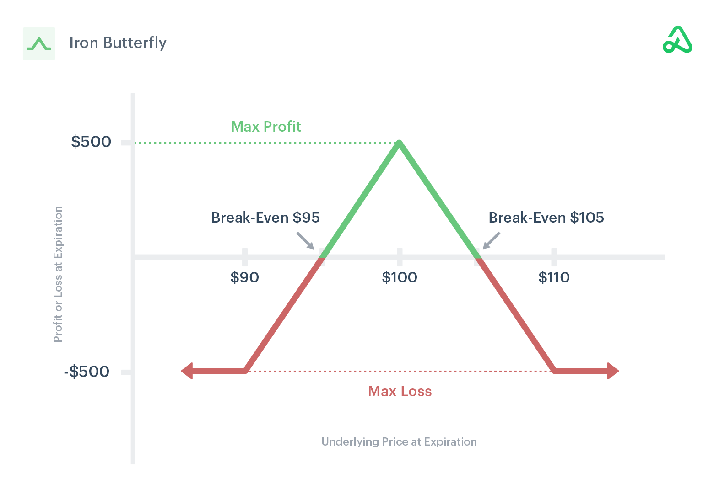

## Table of Contents

## What is the Iron Butterfly option strategy?

The Iron Butterfly option strategy is a way to trade options that aims to make money when the price of the underlying asset, like a stock, doesn't move much. It involves selling an at-the-money call option and an at-the-money put option, and then buying a call option and a put option that are further away from the current price. This creates a "butterfly" shape on a graph, with the middle options being the body and the outer options being the wings.

This strategy is often used when a trader thinks the price of the stock will stay close to its current level until the options expire. The goal is to keep the money received from selling the middle options, which is more than the cost of buying the outer options. However, if the stock price moves too far in either direction, the trader could lose money. The maximum profit is made if the stock price is exactly at the strike price of the middle options at expiration, and the maximum loss is limited to the net cost of setting up the trade.

## How does the Iron Butterfly strategy work?

The Iron Butterfly strategy is a way to make money from options when you think the price of a stock won't change much. You start by selling an at-the-money call option and an at-the-money put option. This means you get money right away because you're selling these options. Then, you buy a call option and a put option that are further away from the current stock price. These outer options cost you money, but they limit how much you can lose if the stock price moves a lot.

The goal is to keep the money you got from selling the middle options, which should be more than what you paid for the outer options. If the stock price stays close to where it started, you can make the most profit when the options expire. But if the stock price moves too far up or down, you might lose money. The most you can lose is the difference between what you paid for the outer options and what you got from selling the middle options. This strategy is like betting on the stock staying still, and it's called an Iron Butterfly because of the shape it makes on a graph.

## What are the key components of an Iron Butterfly?

An Iron Butterfly is made up of four options: two calls and two puts. You start by selling an at-the-money call and an at-the-money put. This means the strike price of these options is close to the current stock price. When you sell these options, you get money right away. Then, you buy a call option with a higher strike price and a put option with a lower strike price. These are the outer options, and they cost you money to buy.

The idea behind the Iron Butterfly is to make money if the stock price doesn't move much. The money you get from selling the middle options should be more than what you pay for the outer options. If the stock price stays close to where it started until the options expire, you can keep the difference as profit. But if the stock price moves a lot in either direction, you might lose money. The most you can lose is the net cost of setting up the trade, which is the money you paid for the outer options minus the money you got from selling the middle options.

## What are the potential risks and rewards of using an Iron Butterfly?

The Iron Butterfly strategy can be rewarding if the stock price stays close to where it started. When you set up an Iron Butterfly, you get money from selling the middle options, which should be more than what you pay for the outer options. If the stock price doesn't move much by the time the options expire, you keep the difference as profit. This makes the Iron Butterfly a good choice if you think the stock will stay steady. The maximum profit you can make is the net credit you received when setting up the trade, which happens if the stock price is exactly at the strike price of the middle options at expiration.

However, there are risks involved with the Iron Butterfly strategy. If the stock price moves too far away from where it started, you could lose money. The most you can lose is the net cost of setting up the trade, which is the money you paid for the outer options minus the money you got from selling the middle options. This loss happens if the stock price goes above the higher strike price or below the lower strike price at expiration. So, while the Iron Butterfly can limit your losses, it's still important to watch the stock price and be ready for the possibility that the stock might move more than you expect.

## In what market conditions is an Iron Butterfly most effective?

An Iron Butterfly works best when the market is calm and the stock price doesn't change much. If you think the stock will stay close to its current price until the options expire, this strategy can be a good choice. You make the most money if the stock price is right at the middle strike price when the options expire. This is because you get to keep the money you received from selling the middle options, which is more than what you paid for the outer options.

However, if the market is very volatile and the stock price moves a lot, an Iron Butterfly might not be the best strategy. If the stock price goes too far up or down, you could lose money. The most you can lose is the difference between what you paid for the outer options and what you got from selling the middle options. So, it's important to use an Iron Butterfly when you expect the market to be stable, not when big changes are likely.

## How do you set up an Iron Butterfly trade?

To set up an Iron Butterfly trade, you start by selling an at-the-money call option and an at-the-money put option. This means the strike price of these options is close to the current price of the stock. When you sell these options, you get money right away. This is called the net credit. Next, you buy a call option with a higher strike price and a put option with a lower strike price. These are called the outer options, and they cost you money. The idea is that the money you get from selling the middle options is more than what you pay for the outer options.

Once you've set up the trade, you hope that the stock price doesn't move much until the options expire. If the stock price stays close to where it started, you can keep the difference between the money you got from selling the middle options and what you paid for the outer options as profit. But if the stock price moves a lot in either direction, you might lose money. The most you can lose is the net cost of setting up the trade, which is the money you paid for the outer options minus the money you got from selling the middle options. So, it's important to use an Iron Butterfly when you think the market will be calm.

## What are the steps to calculate the maximum profit and loss for an Iron Butterfly?

To calculate the maximum profit for an Iron Butterfly, you start by figuring out how much money you got from selling the middle options, which is called the net credit. This is the money you get right away when you set up the trade. The maximum profit is this net credit. You make this profit if the stock price is exactly at the strike price of the middle options when the options expire. So, if you sold the middle options for $200 and bought the outer options for $100, your net credit is $100, and that's your maximum profit if the stock stays at the middle strike price.

To calculate the maximum loss for an Iron Butterfly, you need to look at the net cost of setting up the trade. This is the money you paid for the outer options minus the money you got from selling the middle options. The maximum loss happens if the stock price moves a lot and goes above the higher strike price or below the lower strike price at expiration. Using the same example, if you paid $100 for the outer options and got $200 from selling the middle options, your net cost is $100 minus $200, which equals a negative $100. This means your maximum loss is $100, which is the most you can lose if the stock price moves too far away from the middle strike price.

## How does time decay affect an Iron Butterfly position?

Time decay, or theta, is a big part of an Iron Butterfly strategy. It's the way options lose value as they get closer to expiring. When you set up an Iron Butterfly, you want time decay to work in your favor. The middle options you sell lose value faster than the outer options you buy. This means the money you get from selling the middle options can become more valuable as time goes on, especially if the stock price stays close to where it started.

But if the stock price moves a lot, time decay can still hurt you. If the stock price goes too far up or down, the outer options you bought might start to lose value too. This can make your losses bigger, even though time decay is still working on the middle options. So, you need to keep an eye on the stock price and how much time is left until the options expire to make sure time decay is helping your Iron Butterfly trade.

## What are the differences between an Iron Butterfly and an Iron Condor?

An Iron Butterfly and an Iron Condor are both options trading strategies that aim to make money when the stock price doesn't move much. The main difference is in how they are set up. An Iron Butterfly involves selling an at-the-money call and an at-the-money put, and then buying a call and a put that are further away from the current stock price. This creates a narrow range where you can make the most profit. On the other hand, an Iron Condor involves selling an out-of-the-money call and an out-of-the-money put, and then buying a call and a put that are even further away from the current stock price. This creates a wider range where you can make money.

The risk and reward profiles of these strategies are also different. With an Iron Butterfly, you can make the most profit if the stock price is exactly at the middle strike price when the options expire. But if the stock price moves too far away, you could lose money. The maximum loss is the net cost of setting up the trade. An Iron Condor gives you a wider range where you can make money, so it's a bit safer if the stock price moves a little. But the maximum profit is usually less than with an Iron Butterfly because you're selling options that are further away from the current stock price. Both strategies use time decay to their advantage, but the Iron Condor gives you more room for the stock price to move before you start losing money.

## How can adjustments be made to an Iron Butterfly if the market moves against the position?

If the market moves against your Iron Butterfly position, you can make adjustments to try to reduce your losses or even turn the trade around. One way to do this is by rolling the middle options. This means you close the current middle options and open new ones with a different expiration date or strike price. For example, if the stock price goes up, you might sell new middle call and put options at a higher strike price. This can bring in more money and give you a new chance to make a profit if the stock price stays closer to the new middle strike price.

Another way to adjust an Iron Butterfly is by adjusting the outer options. If the stock price moves a lot, you might buy back the outer options that are losing money and sell new ones that are further away from the current stock price. This can help limit your losses if the stock keeps moving in the same direction. But remember, every adjustment costs money and changes the risk and reward of your trade. So, it's important to think carefully about when and how to make these changes to your Iron Butterfly position.

## What advanced techniques can be used to optimize an Iron Butterfly strategy?

To optimize an Iron Butterfly strategy, you can use a technique called delta hedging. Delta is a measure of how much the price of an option changes when the stock price changes. By keeping an eye on the delta of your Iron Butterfly, you can buy or sell shares of the stock to balance out the changes in the option prices. This can help you make more money if the stock price moves a little bit, and it can also help you lose less money if the stock price moves a lot. Delta hedging takes some work, but it can make your Iron Butterfly trade more successful.

Another advanced technique is to use different expiration dates for the options in your Iron Butterfly. This is called a calendar spread. You might sell the middle options with a shorter expiration date and buy the outer options with a longer expiration date. This can help you take advantage of time decay even more. The middle options will lose value faster because they expire sooner, which can help you make more money if the stock price stays close to where it started. But remember, using different expiration dates can make your trade more complicated, so you need to be careful and keep a close eye on your position.

## Can you provide a real-world example of an Iron Butterfly trade and its outcome?

Let's say you think the stock of XYZ company, which is currently trading at $50, won't move much in the next month. You decide to set up an Iron Butterfly trade. You sell an at-the-money call option and an at-the-money put option, both with a strike price of $50, and you get $200 from selling these options. Then, you buy a call option with a strike price of $55 and a put option with a strike price of $45, and you pay $100 for these outer options. So, your net credit is $100 ($200 - $100). If the stock price stays at $50 when the options expire in a month, you keep the $100 as profit.

But what if the stock price moves? If the stock price goes up to $56, the call option you bought at $55 starts to gain value, but the put option you bought at $45 loses value. The middle options you sold also lose value because they expire worthless. In this case, your loss is limited to the net cost of setting up the trade, which is $100. If the stock price goes down to $44, the put option you bought at $45 starts to gain value, but the call option you bought at $55 loses value. Again, your loss is limited to $100. So, the Iron Butterfly helps you make money if the stock stays still, but it also limits your losses if the stock moves a lot.

## What is the Iron Butterfly Strategy and how does it work?

The Iron Butterfly is an intricate options trading strategy designed to capitalize on expected low volatility in the underlying asset. This strategy generates potential profit by simultaneously utilizing call and put options to form a bounded structure that profits when the underlying asset price remains within a specified range until expiration.

### Construction of an Iron Butterfly

An Iron Butterfly consists of four options contracts, typically constructed using the same expiration date. The setup involves:

1. **Selling an at-the-money (ATM) call option**
2. **Selling an at-the-money (ATM) put option**
3. **Buying an out-of-the-money (OTM) call option**
4. **Buying an out-of-the-money (OTM) put option**

The call and put options sold (ATM) create the central "body" of the butterfly, while the OTM options purchased form the "wings." This combination ensures that the maximum loss is limited, creating a risk-defined strategy. The premiums collected from selling the ATM options help offset the cost of purchasing the OTM options.

### Selecting Strike Prices and Expiration Dates

The Iron Butterfly's profitability substantially depends on selecting appropriate strike prices and expiration dates:

- **Strike Prices:** The ATM strike prices for the call and put options are typically set close to the current price of the underlying asset. Strike prices for the wings are chosen based on the trader's risk appetite and market outlook. Wider wings lead to higher potential profit but also increase the capital requirement.

- **Expiration Dates:** It's crucial to align the strategy's expiration date with expected low volatility periods. Shorter expiration periods reduce the strategy's exposure to unforeseen market movements but narrow the time for anticipated profit realization.

### Functionality of the Iron Butterfly

The Iron Butterfly profits when the underlying asset's price remains between the two breakeven points defined by the strategy at expiration. These breakeven points can be calculated using the formulas:

$$
\text{Lower Breakeven} = \text{Strike price of sold put} + \text{Net Premium Received}
$$

$$
\text{Upper Breakeven} = \text{Strike price of sold call} - \text{Net Premium Received}
$$

Maximum profit is achieved when the underlying asset is at the strike price of the sold options at expiration. Conversely, the maximum loss, predetermined at trade initiation, occurs if the price moves outside the boundaries defined by the OTM options, either breaching the put or call option bought.

In summary, the Iron Butterfly is a strategy best suited for scenarios where minimal price movement is anticipated. By understanding its construction, traders can better manage risk and optimize potential returns by selecting suitable strike prices and expiration dates.

## What is a Step-by-Step Example of an Iron Butterfly Trade?

An Iron Butterfly trade is a popular options strategy designed to profit from a market that doesn’t make significant movements. Here’s how to implement this strategy with a practical example:

### Selecting Options

An Iron Butterfly involves three key components: 
1. Selling an at-the-money (ATM) call and put option.
2. Buying an out-of-the-money (OTM) call and put option.

For example, assume a stock is trading at $100. The steps for constructing an Iron Butterfly might be:

- **Sell 1 ATM Call Option** at a strike price of $100.
- **Sell 1 ATM Put Option** at the same strike price of $100.
- **Buy 1 OTM Call Option** at a higher strike price, say $110.
- **Buy 1 OTM Put Option** at a lower strike price, say $90.

### Setting Up the Trade

The Iron Butterfly profits the most if the stock stays at $100 by expiration. The maximum profit is the net credit received from executing the trade, achieved if the stock closes exactly at $100 on expiration. 

- **Net Credit Received**: This is calculated as the premiums collected from the sold options minus the premiums paid for the options purchased.

### Numerical Example

1. **Premiums Collected**:
   - ATM Call at $100: $5
   - ATM Put at $100: $5
$$
     \text{Total Premiums Collected = } \$5 + \$5 = \$10

$$

2. **Premiums Paid**:
   - OTM Call at $110: $2
   - OTM Put at $90: $2
$$
     \text{Total Premiums Paid = } \$2 + \$2 = \$4

$$

3. **Net Credit**:
$$
   \text{Net Credit = Total Premiums Collected - Total Premiums Paid} = \$10 - \$4 = \$6

$$

### Risk and Reward Visualization

#### Maximum Profit: 
The maximum profit is equal to the net credit of \$6. This occurs if the stock price remains exactly at $100 at expiration.

#### Maximum Loss:
The maximum loss occurs if the stock price is outside the purchased options’ range. The loss is the difference between the strike prices of the bought and sold options minus the net credit.
$$
\text{Maximum Loss = } (110 - 100) - 6 = \$4 \quad (\text{if above } \$110)
$$
$$
\text{Maximum Loss = } (100 - 90) - 6 = \$4 \quad (\text{if below } \$90)
$$

### Real-World Trading Dynamics

Implementing an Iron Butterfly in real trading involves understanding real-time market dynamics, such as [volatility](/wiki/volatility-trading-strategies) and option Greeks. Markets can be unpredictable, and the strategy is sensitive to time decay and volatility changes.

Moreover, [liquidity](/wiki/liquidity-risk-premium) is crucial as low liquidity can widen bid-ask spreads, impacting the trade's profitability. Therefore, selecting highly liquid options and monitoring volatility is essential for successful implementation of the strategy.

By mastering these steps and analyzing market conditions, traders can optimize their approach and enhance the practicality of Iron Butterfly trades in real-world scenarios.

## What are the advantages and risks of an Iron Butterfly?

The Iron Butterfly options strategy, like many financial strategies, presents a unique combination of advantages and risks that traders must carefully consider. This strategy is known for its potential to provide limited risk and steady returns, but it also carries inherent risks, including potential losses and high break-even points.

**Advantages of Iron Butterfly**

One of the main benefits of the Iron Butterfly strategy is its potential for limited risk. By simultaneously buying and selling options with the same expiration date but different strike prices, traders can define their maximum potential loss at the outset. This predefined risk is a significant advantage, as it allows traders to plan their investment and risk management strategies effectively. The structure of the Iron Butterfly—comprised of two short options at the middle strike price and one long option on each side—creates a defined risk profile. The maximum loss occurs when the underlying asset’s price moves beyond the outer wings of the butterfly.

Another advantage is the possibility of steady returns. The Iron Butterfly strategy is most effective in a stable or low-volatility market where the price of the underlying asset remains near the middle strike price until expiration. In such scenarios, the premium collected from the sold options can provide a consistent return if the asset's price does not make significant moves. This can be particularly appealing to traders looking for opportunities to capitalize on market inertia.

**Risks of Iron Butterfly**

Despite its advantages, the Iron Butterfly strategy is not without risks. One major risk is the potential for losses if the market does not behave as anticipated. If the price of the underlying asset moves significantly away from the middle strike price, the trader could face losses. The maximum loss potential is limited but occurs when the asset’s price falls outside the range defined by the outer strike prices at expiration.

Additionally, the Iron Butterfly strategy is associated with high break-even points. The break-even points are calculated by adding and subtracting the net premium received to and from the middle strike price. This can be represented mathematically as:

$$
\text{Upper Break-even} = \text{Middle Strike Price} + \text{Net Premium Received}
$$

$$
\text{Lower Break-even} = \text{Middle Strike Price} - \text{Net Premium Received}
$$

These break-even calculations highlight the narrow range within which the asset’s price must remain for the strategy to be profitable. Consequently, the Iron Butterfly is sensitive to volatility and requires careful monitoring and adjustment.

Understanding both the advantages and risks associated with the Iron Butterfly strategy is crucial for traders. By recognizing the potential for limited risk and steady returns, along with the challenges posed by high break-even points and potential losses, traders can make informed decisions about whether this strategy aligns with their risk tolerance and market outlook. As with any complex trading strategy, comprehensive knowledge and a balanced perspective are vital to successful implementation.

## References & Further Reading

[1]: Hull, J. C. (2017). ["Options, Futures, and Other Derivatives."](https://www.semanticscholar.org/paper/Options%2C-Futures%2C-and-Other-Derivatives-Hull/89bdee500c8623864fc9eb7a471546aa713acc44) Pearson.

[2]: McMillan, L. G. (2012). ["Options as a Strategic Investment."](https://archive.org/details/optionsasstrateg0000mcmi) Prentice Hall Press.

[3]: Johnson, B. (2010). ["Algorithmic Trading and DMA: An Introduction to Direct Access Trading Strategies."](https://archive.org/details/algorithmictradi0000john) 4Myeloma Press.

[4]: Jansen, S. (2018). ["Machine Learning for Algorithmic Trading."](https://github.com/stefan-jansen/machine-learning-for-trading) Packt Publishing.

[5]: Chan, E. P. (2008). ["Quantitative Trading: How to Build Your Own Algorithmic Trading Business."](https://github.com/ftvision/quant_trading_echan_book) Wiley.