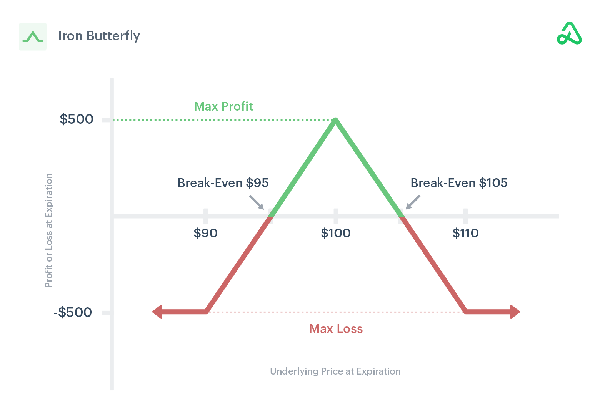

## Table of Contents

## What is the Iron Butterfly trading strategy?

The Iron Butterfly is a type of options trading strategy that traders use when they think the price of a stock will not move much in the near future. It involves buying and selling four different options at the same time. The goal is to make a profit if the stock price stays close to a specific price, called the strike price, when the options expire. To set up an Iron Butterfly, a trader sells an at-the-money call and an at-the-money put, and then buys a call and a put that are further away from the current stock price. This creates a range where the trader can make money.

The main advantage of the Iron Butterfly is that it can be a good way to make money in a market that is not moving much. However, it is also a complex strategy and can be risky if the stock price moves a lot in either direction. If the stock price moves too far away from the strike price, the trader could lose money. Because of this, it's important for traders to understand the risks and have a good plan before using this strategy.

## How does the Iron Butterfly strategy work?

The Iron Butterfly strategy is a way for traders to make money when they think a stock's price won't change much. To do this, they use four options: two that they sell and two that they buy. They start by selling a call and a put option at the same price, which is close to where the stock is trading now. This is called the strike price. Then, they buy a call option at a higher price and a put option at a lower price. This setup makes a range around the strike price where the trader can make money.

If the stock price stays close to the strike price when the options expire, the trader can make a profit. The money they get from selling the call and put at the strike price is more than what they paid for the other two options. But, if the stock price moves too far away from the strike price, the trader could lose money. This is because the options they bought at the higher and lower prices will start to cost more. So, it's important for traders to watch the stock price carefully and know the risks before using the Iron Butterfly strategy.

## What are the key components of an Iron Butterfly trade?

An Iron Butterfly trade is made up of four options. It starts with selling a call option and a put option at the same price, which is called the strike price. This strike price is usually close to where the stock is trading right now. Then, the trader buys another call option at a higher price and another put option at a lower price. These four options together create a range around the strike price where the trader can make money.

If the stock price stays close to the strike price when the options expire, the trader can make a profit. The money from selling the call and put at the strike price is more than what they paid for the other two options. But, if the stock price moves too far away from the strike price, the trader could lose money. The options bought at the higher and lower prices will start to cost more, which can eat into the profit. So, it's important for traders to understand these parts of the Iron Butterfly trade and watch the stock price carefully.

## When is the best time to use an Iron Butterfly strategy?

The best time to use an Iron Butterfly strategy is when you think the price of a stock won't move much in the near future. This could be because the market is calm, or there are no big news events expected that could shake things up. If you believe the stock will stay close to its current price until the options expire, an Iron Butterfly can be a good choice.

However, it's important to remember that the Iron Butterfly is a complex strategy and can be risky if the stock price does move a lot. If the stock price goes too far up or down, you could lose money. So, before using this strategy, make sure you understand the risks and have a plan for what to do if the market doesn't behave as you expect.

## What are the potential risks associated with the Iron Butterfly strategy?

The Iron Butterfly strategy can be risky if the stock price moves a lot. If the stock price goes up or down too much, you could lose money. This is because the options you bought at the higher and lower prices will start to cost more, which can eat into the profit you made from selling the options at the strike price. So, if the stock price moves outside the range you set up, you might end up losing more than you expected.

Another risk is that the Iron Butterfly is a complex strategy. It involves buying and selling four different options at the same time, which can be hard to manage. If you don't understand how all the parts work together, you might make mistakes that cost you money. It's important to have a good plan and know what to do if the market doesn't behave as you expect.

## How can one set up an Iron Butterfly trade?

To set up an Iron Butterfly trade, you need to buy and sell four options at the same time. Start by finding a stock that you think won't move much in price. Then, sell a call option and a put option at the same price, which is called the strike price. This strike price should be close to where the stock is trading now. After that, buy another call option at a higher price and another put option at a lower price. These four options together create a range around the strike price where you can make money.

If the stock price stays close to the strike price when the options expire, you can make a profit. The money you get from selling the call and put at the strike price is more than what you paid for the other two options. But, if the stock price moves too far away from the strike price, you could lose money. The options you bought at the higher and lower prices will start to cost more, which can eat into your profit. So, it's important to watch the stock price carefully and know the risks before setting up an Iron Butterfly trade.

## What are the profit and loss scenarios for an Iron Butterfly?

The Iron Butterfly strategy can make you money if the stock price stays close to the strike price when the options expire. When you set up the trade, you sell a call and a put at the same price, which is the strike price. You also buy a call at a higher price and a put at a lower price. The money you get from selling the call and put at the strike price is more than what you paid for the other two options. So, if the stock price doesn't move much and stays near the strike price, you keep the difference as profit.

However, if the stock price moves too far away from the strike price, you could lose money. If the stock price goes up a lot, the call option you bought at the higher price will start to cost more. If the stock price goes down a lot, the put option you bought at the lower price will start to cost more. Either way, these costs can eat into the profit you made from selling the options at the strike price. So, the Iron Butterfly can be risky if the stock price moves a lot, and it's important to understand these risks before you use this strategy.

## How does volatility affect an Iron Butterfly strategy?

Volatility is how much a stock's price goes up and down. When you use an Iron Butterfly strategy, you want the stock price to stay close to the strike price. If the stock is very volatile, it can move a lot, which is bad for an Iron Butterfly. High volatility means there's a bigger chance the stock price will go outside the range you set up, and that could make you lose money. So, if the market is very volatile, an Iron Butterfly might not be the best choice.

On the other hand, if the stock is not very volatile and stays calm, an Iron Butterfly can work well. When the stock price doesn't move much, it's more likely to stay within the range you set up, and that's when you can make a profit. So, before you use an Iron Butterfly, it's a good idea to check how volatile the stock is. If it's not too volatile, the strategy has a better chance of making money.

## What are the differences between Iron Butterfly and Iron Condor strategies?

The Iron Butterfly and Iron Condor are both options trading strategies that you use when you think a stock won't move much. But they set up different ranges where you can make money. In an Iron Butterfly, you sell a call and a put at the same price, which is the strike price. Then, you buy a call at a higher price and a put at a lower price. This makes a small range around the strike price where you can make money. The Iron Condor is different because it makes a bigger range. You sell a call at a higher price and a put at a lower price, and then buy a call at an even higher price and a put at an even lower price. This gives you a wider range where you can make money.

The main difference between the two strategies is how much room they give the stock to move. The Iron Butterfly has a smaller range, so it's riskier if the stock moves a lot. But if the stock stays close to the strike price, you can make more money with an Iron Butterfly. The Iron Condor gives the stock more room to move, so it's less risky if the stock moves a bit more than you expected. But because it gives the stock more room, the most you can make with an Iron Condor is usually less than with an Iron Butterfly. Both strategies can work well, but they're good for different situations depending on how much you think the stock will move.

## How can adjustments be made to an Iron Butterfly trade?

If the stock price starts to move away from the strike price in an Iron Butterfly trade, you might need to make some changes to help manage the risk. One way to do this is by rolling the short options. This means you close the call and put options you sold at the strike price and then sell new ones at a different price. If the stock price is going up, you might sell new call and put options at a higher strike price. If the stock price is going down, you might sell new call and put options at a lower strike price. This can help keep the stock price within the range where you can make money.

Another way to adjust an Iron Butterfly is by adding more options to the trade. For example, if the stock price is moving up, you could buy more put options at a lower price to protect against the stock going down even more. If the stock price is moving down, you could buy more call options at a higher price to protect against the stock going up even more. These extra options can help limit your losses if the stock price moves too far away from the strike price. But remember, making adjustments can be tricky, so it's important to understand the risks and have a good plan before you start.

## What are some advanced techniques for optimizing Iron Butterfly trades?

One advanced technique for optimizing Iron Butterfly trades is to use delta hedging. Delta is a measure of how much the price of an option will change when the stock price changes. By keeping an eye on the delta of your options, you can buy or sell shares of the stock to balance out the risk. For example, if the delta of your Iron Butterfly is too high, you can sell some shares of the stock to lower it. If the delta is too low, you can buy some shares to raise it. This helps keep the trade stable even if the stock price moves a bit.

Another technique is to use different expiration dates for the options in your Iron Butterfly. Normally, all the options in an Iron Butterfly expire at the same time. But if you use options that expire at different times, you can give yourself more flexibility. For example, you could sell short-term options to collect more money quickly, while buying longer-term options to protect against big moves in the stock price. This can help you make more money if the stock stays calm, and also protect you if the stock starts to move a lot. Just remember, using different expiration dates can make the trade more complex, so make sure you understand what you're doing.

## Can you provide a real-world example of an Iron Butterfly trade and its outcome?

Let's say you think the stock of XYZ Company, which is trading at $50, will stay close to that price for the next month. You decide to set up an Iron Butterfly trade. You sell a call and a put option at a strike price of $50, which is the current price of the stock. You get $2 for each option, so you collect $400 in total. Then, you buy a call option at a strike price of $55 for $1, and a put option at a strike price of $45 for $1. This costs you $200 in total. So, you start the trade with a net credit of $200.

As the month goes on, the stock of XYZ Company stays close to $50, just as you expected. When the options expire, the stock is at $51. The call option you sold at $50 expires worthless because the stock is above the strike price, and the put option you sold at $50 also expires worthless because the stock is above the strike price. The call option you bought at $55 expires worthless too, because the stock didn't go above $55. But the put option you bought at $45 is also worthless, because the stock didn't go below $45. Since all the options expire worthless, you keep the $200 you collected at the start. So, your Iron Butterfly trade was successful, and you made a profit.

## What is the Iron Butterfly Strategy and how does it work?

An Iron Butterfly options strategy combines a bear call spread and a bull put spread with the same expiration date, creating a position that benefits from market stability. This strategy is constructed by selling an at-the-money (ATM) call option and an ATM put option, while simultaneously purchasing an out-of-the-money (OTM) call option and an OTM put option. These create a 'wingspread' with defined risk and reward.

The primary attribute of the Iron Butterfly is that it is a credit spread. This means traders receive a net credit when establishing the position. The maximum potential profit from this setup is the net credit received, which occurs if the price of the underlying asset remains near the strike price of the options sold. Mathematically, the potential profit ($P$) can be expressed as:

$$
P = \text{Net Credit Received at Setup}
$$

This strategy is distinct from a regular butterfly spread, where all trades involve either calls or puts, but not both. In the Iron Butterfly, the combination of both calls and puts helps traders manage risk across varying market movements.

Key to the success of an Iron Butterfly is its deployment in low-[volatility](/wiki/volatility-trading-strategies) environments. The strategy is designed to capitalize on minimal price movements. When volatility is low, the underlying asset is more likely to remain within a narrow range, thereby maximizing the likelihood of achieving the desired profit at expiration.

To summarize, the Iron Butterfly provides traders with a structured approach for capitalizing on market stability, with well-defined risk and reward parameters. Its success heavily depends on appropriate market conditions and careful selection of strike prices.

## What are the advantages and challenges of the Iron Butterfly Strategy?

The Iron Butterfly strategy presents a unique blend of advantages and challenges that make it appealing yet demanding for traders. A notable advantage of the Iron Butterfly strategy is its limited risk and profit potential, allowing traders to engage in positions with a clear understanding of the financial exposure. This makes it particularly suitable for traders who anticipate minimal price movement in the underlying asset.

One of the key benefits of the Iron Butterfly is its efficient use of capital. This strategy involves establishing a position with a net credit, where the premium received from selling the options is greater than the premium paid for the protective options. This means that traders can initiate the strategy with potential for regular income, given that market conditions remain approximately neutral. Moreover, the defined risk profile is advantageous because it allows traders to know their maximum loss upfront, thereby facilitating better risk management. The calculation of potential loss is straightforward, determined by the difference between the strike prices of the bought and sold options, minus the net premium received.

$$
\text{Maximum Loss} = \text{Distance Between Strike Prices} - \text{Net Premium Received}
$$

Despite these advantages, the Iron Butterfly strategy is not without its challenges. One significant challenge is the potential commission costs incurred from trading multiple options legs. These costs can erode profits, especially in smaller accounts or when trading with brokers that have high commission fees. Additionally, the strategy requires meticulous selection of strike prices and precise timing, as the payoff is heavily reliant on the underlying asset's price remaining close to the central strike price.

Market neutrality, although a core advantage of the strategy, can also be limiting. The Iron Butterfly is most effective in stable market conditions and can be adversely affected by high volatility. In volatile markets, the underlying asset's price is likely to deviate significantly from the target strike price, risking the position and possibly leading to losses that approach the maximum defined loss level.

In summary, the Iron Butterfly strategy's success hinges on stable market conditions, effective strike price selection, and the management of transaction costs, as well as the ability to accurately predict market behavior to some extent. Balancing these factors is essential for traders to leverage the advantages while mitigating the inherent challenges.

## References & Further Reading

[1]: Passarelli, D. (2012). ["Trading Options Greeks: How Time, Volatility, and Other Pricing Factors Drive Profits."](https://www.amazon.com/Trading-Options-Greeks-Volatility-Pricing/dp/1118133161) Wiley.

[2]: Natenberg, S. (1994). ["Option Volatility and Pricing: Advanced Trading Strategies and Techniques."](https://www.amazon.com/Option-Volatility-Pricing-Strategies-Techniques/dp/0071818774) McGraw-Hill.

[3]: Hull, J. C. (2018). ["Options, Futures, and Other Derivatives."](https://www.semanticscholar.org/paper/Options%2C-Futures%2C-and-Other-Derivatives-Hull/89bdee500c8623864fc9eb7a471546aa713acc44) Pearson.

[4]: Kolb, R. A., & Overdahl, J. A. (2006). ["Understanding Options."](https://books.google.com/books/about/Understanding_Futures_Markets.html?id=Ykghtb3Ks5sC) Blackwell Publishing.

[5]: Chan, E. (2013). ["Algorithmic Trading: Winning Strategies and Their Rationale."](https://github.com/ftvision/quant_trading_echan_book) Wiley.