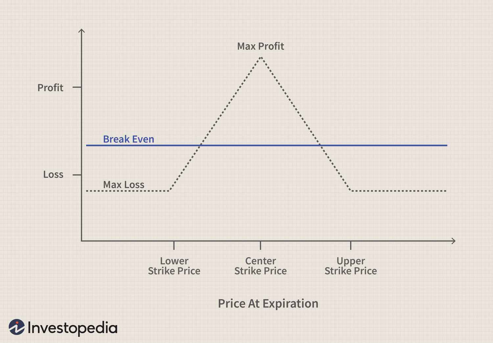

The Iron Butterfly is a trading strategy in the options market that revolves around creating a neutral position using multiple options contracts. This strategy is primarily utilized by traders aiming to profit from an underlying asset's limited price movement. At its core, the Iron Butterfly combines various options to construct a 'wingspread,' offering both a capped risk and potential reward. Unlike other strategies that might capitalize on significant market shifts, the Iron Butterfly thrives in environments characterized by stability and low volatility.

This article will provide a thorough exploration of the Iron Butterfly strategy, breaking down its mechanics, elucidating its benefits, and identifying the optimal conditions for its successful application. Understanding these aspects is crucial for traders who wish to effectively manage risk while seeking profit from a relatively static market environment. Moreover, the integration of algorithmic trading will be highlighted as a method to enhance the strategy's execution. Algorithmic trading can automate the various facets of setting up and adjusting an Iron Butterfly, minimizing human error and potentially increasing profitability.



The following sections will detail the process of setting up and executing the Iron Butterfly, from selecting appropriate strike prices to calculating breakeven points. Furthermore, we will discuss how this strategy is embedded within the larger context of options trading and how algorithmic tools can aid traders. This comprehensive guide is designed to equip both novices and experienced traders with the knowledge necessary to implement the Iron Butterfly effectively.

## Table of Contents

## Understanding the Iron Butterfly Strategy

An Iron Butterfly options strategy combines a bear call spread and a bull put spread with the same expiration date, creating a position that benefits from market stability. This strategy is constructed by selling an at-the-money (ATM) call option and an ATM put option, while simultaneously purchasing an out-of-the-money (OTM) call option and an OTM put option. These create a 'wingspread' with defined risk and reward.

The primary attribute of the Iron Butterfly is that it is a credit spread. This means traders receive a net credit when establishing the position. The maximum potential profit from this setup is the net credit received, which occurs if the price of the underlying asset remains near the strike price of the options sold. Mathematically, the potential profit ($P$) can be expressed as:

$$
P = \text{Net Credit Received at Setup}
$$

This strategy is distinct from a regular butterfly spread, where all trades involve either calls or puts, but not both. In the Iron Butterfly, the combination of both calls and puts helps traders manage risk across varying market movements.

Key to the success of an Iron Butterfly is its deployment in low-[volatility](/wiki/volatility-trading-strategies) environments. The strategy is designed to capitalize on minimal price movements. When volatility is low, the underlying asset is more likely to remain within a narrow range, thereby maximizing the likelihood of achieving the desired profit at expiration.

To summarize, the Iron Butterfly provides traders with a structured approach for capitalizing on market stability, with well-defined risk and reward parameters. Its success heavily depends on appropriate market conditions and careful selection of strike prices.

## How to Set Up an Iron Butterfly Trade

To set up an Iron Butterfly trade, select the central strike price based on where you anticipate the underlying asset will stabilize at expiration. This central strike price is crucial to the strategy's success as it is where the greatest profit potential lies.

1. **Sell One At-the-Money Call and One At-the-Money Put Option**: Begin by selling a call option and a put option, both at the money (ATM). The ATM options are those whose strike price is closest to the current market price of the underlying asset. This setup earns a net credit from the premium received, creating the potential for a maximum profit if the asset's price remains at or near this strike price by expiration.

2. **Buy One Out-of-the-Money Call and One Out-of-the-Money Put Option**: To hedge against significant price movements, purchase one call and one put option that are out of the money (OTM). The OTM call will have a strike price higher than the ATM call's strike price, while the OTM put will have a strike price lower than the ATM put's strike price. This step defines the risk on both sides of the price movement, capping potential losses.

3. **Risk and Reward Balance**: The distance between the strike prices of the purchased (OTM) and sold (ATM) options plays a pivotal role in determining the risk and reward balance of this trade. A wider distance increases potential profit but also increases the potential for loss should the underlying asset move sharply away from the central strike price.

4. **Breakeven Points Calculation**: It is vital to calculate the breakeven points to understand the parameters of profitability. The breakeven points are where the total cost of the setup (net premium received) equals the actual profit or loss. They are calculated as follows:

   - **Upper Breakeven = Central Strike Price + Net Premium Received**
   - **Lower Breakeven = Central Strike Price - Net Premium Received**

   These formulas ensure that you know the price boundaries within which the Iron Butterfly strategy will result in a profit or limited loss.

By carefully setting up and balancing these components, the Iron Butterfly becomes an effective strategy for capitalizing on periods of low volatility and stable price action in the underlying asset.

## Algorithmic Approaches to Iron Butterfly Trading

Algorithmic trading employs computer programs to automate the execution of trades based on predefined criteria, enhancing the efficiency and precision of complex strategies such as the Iron Butterfly. This automated approach is particularly advantageous for managing the multifaceted requirements of options trading, which often involve rapid market movements and intricate setups.

One of the primary benefits of [algorithmic trading](/wiki/algorithmic-trading) in the context of an Iron Butterfly strategy is the automatic selection of optimal strike prices. Algorithms can be designed to monitor a wide range of market indicators and make real-time adjustments to trading positions. For instance, if an algorithm detects significant changes in market volatility, it can dynamically adjust the strike prices or [exit](/wiki/exit-strategy) positions to mitigate risk and capitalize on market movements. This adaptability is crucial for maintaining the stability of an Iron Butterfly position, especially in fluctuating markets.

Algorithms also offer the capability to assess key metrics such as market volatility and implied volatility. Implied volatility is a critical [factor](/wiki/factor-investing) in options trading as it reflects the market's expectations of future volatility. By employing sophisticated algorithms, traders can better time the execution of their Iron Butterfly strategies to coincide with favorable volatility conditions. This can enhance the probability of achieving maximum profitability within the strategy's defined risk-reward framework.

Backtesting is an essential component of developing and refining algorithmic strategies for Iron Butterfly trading. This process involves running simulations of the algorithm on historical market data to evaluate its performance under various market conditions. Backtesting allows traders to assess the effectiveness of their algorithm, identify potential weaknesses, and optimize its rules before deploying it in live trading scenarios. 

Here's an example of how a simple algorithmic setup in Python for [backtesting](/wiki/backtesting) might look like using a hypothetical library:

```python
import algo_trading_library as atl

def iron_butterfly_strategy(data):
    # Define central strike price and wings, using option chain data
    central_strike = data['at_the_money_strike']
    wing_offset = 10  # Example wing offset
    long_call = central_strike + wing_offset
    long_put = central_strike - wing_offset

    # Define trade setup
    short_call = central_strike
    short_put = central_strike

    # Define conditions for entering the trade
    if data['implied_volatility'] < data['threshold']:
        return atl.enter_iron_butterfly(long_call, short_call, long_put, short_put)
    return None

# Backtest the strategy
results = atl.backtest_strategy(iron_butterfly_strategy, 'historical_option_data.csv')

# Evaluate Backtest Results
atl.evaluate_backtest(results)
```

This code outlines a basic structure for backtesting an Iron Butterfly strategy using hypothetical market data. It highlights how algorithmic trading can automate setup adjustments and execute trades based on market conditions.

Incorporating algorithmic approaches into Iron Butterfly trading can significantly enhance a trader's ability to manage risk and optimize returns. By leveraging technology to automate decision-making processes, traders can reduce human error and improve the consistency of strategy execution across different market environments.

## Advantages and Challenges of the Iron Butterfly Strategy

The Iron Butterfly strategy presents a unique blend of advantages and challenges that make it appealing yet demanding for traders. A notable advantage of the Iron Butterfly strategy is its limited risk and profit potential, allowing traders to engage in positions with a clear understanding of the financial exposure. This makes it particularly suitable for traders who anticipate minimal price movement in the underlying asset.

One of the key benefits of the Iron Butterfly is its efficient use of capital. This strategy involves establishing a position with a net credit, where the premium received from selling the options is greater than the premium paid for the protective options. This means that traders can initiate the strategy with potential for regular income, given that market conditions remain approximately neutral. Moreover, the defined risk profile is advantageous because it allows traders to know their maximum loss upfront, thereby facilitating better risk management. The calculation of potential loss is straightforward, determined by the difference between the strike prices of the bought and sold options, minus the net premium received.

$$
\text{Maximum Loss} = \text{Distance Between Strike Prices} - \text{Net Premium Received}
$$

Despite these advantages, the Iron Butterfly strategy is not without its challenges. One significant challenge is the potential commission costs incurred from trading multiple options legs. These costs can erode profits, especially in smaller accounts or when trading with brokers that have high commission fees. Additionally, the strategy requires meticulous selection of strike prices and precise timing, as the payoff is heavily reliant on the underlying asset's price remaining close to the central strike price.

Market neutrality, although a core advantage of the strategy, can also be limiting. The Iron Butterfly is most effective in stable market conditions and can be adversely affected by high volatility. In volatile markets, the underlying asset's price is likely to deviate significantly from the target strike price, risking the position and possibly leading to losses that approach the maximum defined loss level.

In summary, the Iron Butterfly strategy's success hinges on stable market conditions, effective strike price selection, and the management of transaction costs, as well as the ability to accurately predict market behavior to some extent. Balancing these factors is essential for traders to leverage the advantages while mitigating the inherent challenges.

## Conclusion: Is the Iron Butterfly Right for You?

The Iron Butterfly strategy is a sophisticated tool designed for traders aiming to capitalize on periods of low market volatility. By constructing this options strategy, traders can achieve predictable outcomes with a defined risk-reward profile. This predictability is one of its primary attractions; the maximum profit is realized if the underlying asset’s price remains at the central strike price upon expiration, while the maximum loss is capped and known upfront.

Incorporating algorithmic trading can significantly enhance the efficiency of executing an Iron Butterfly. Algorithms can automate the selection of optimal strike prices and manage positions dynamically in response to market conditions, thereby minimizing human error. Through programming, traders can also backtest the strategy under various historical market conditions, providing insight into potential performance and adjustment needs.

However, adopting the Iron Butterfly strategy entails a learning curve. New traders may need time to grasp the nuances of options pricing, implied volatility, and the impact of time decay. Additionally, the requirement to manage multiple positions increases the complexity and potential cost due to commissions on trading multiple legs.

While the regular income potential and defined risk appeal to many, traders must also consider the inherent challenges. The strategy is best suited for markets with low volatility; in more volatile conditions, the risk of the strategy being unprofitable increases significantly. Hence, traders need to exercise discipline and rigor in planning and executing this strategy, taking into account their risk tolerance and market outlook.

Ultimately, the Iron Butterfly can be a useful component of a trader’s toolkit, particularly when market conditions align with its strengths. Those who approach it with a clear understanding and strategic implementation stand to benefit significantly from its structured nature.

## References & Further Reading

[1]: Passarelli, D. (2012). ["Trading Options Greeks: How Time, Volatility, and Other Pricing Factors Drive Profits."](https://www.amazon.com/Trading-Options-Greeks-Volatility-Pricing/dp/1118133161) Wiley.

[2]: Natenberg, S. (1994). ["Option Volatility and Pricing: Advanced Trading Strategies and Techniques."](https://www.amazon.com/Option-Volatility-Pricing-Strategies-Techniques/dp/0071818774) McGraw-Hill.

[3]: Hull, J. C. (2018). ["Options, Futures, and Other Derivatives."](https://www.semanticscholar.org/paper/Options%2C-Futures%2C-and-Other-Derivatives-Hull/89bdee500c8623864fc9eb7a471546aa713acc44) Pearson.

[4]: Kolb, R. A., & Overdahl, J. A. (2006). ["Understanding Options."](https://books.google.com/books/about/Understanding_Futures_Markets.html?id=Ykghtb3Ks5sC) Blackwell Publishing.

[5]: Chan, E. (2013). ["Algorithmic Trading: Winning Strategies and Their Rationale."](https://github.com/ftvision/quant_trading_echan_book) Wiley.