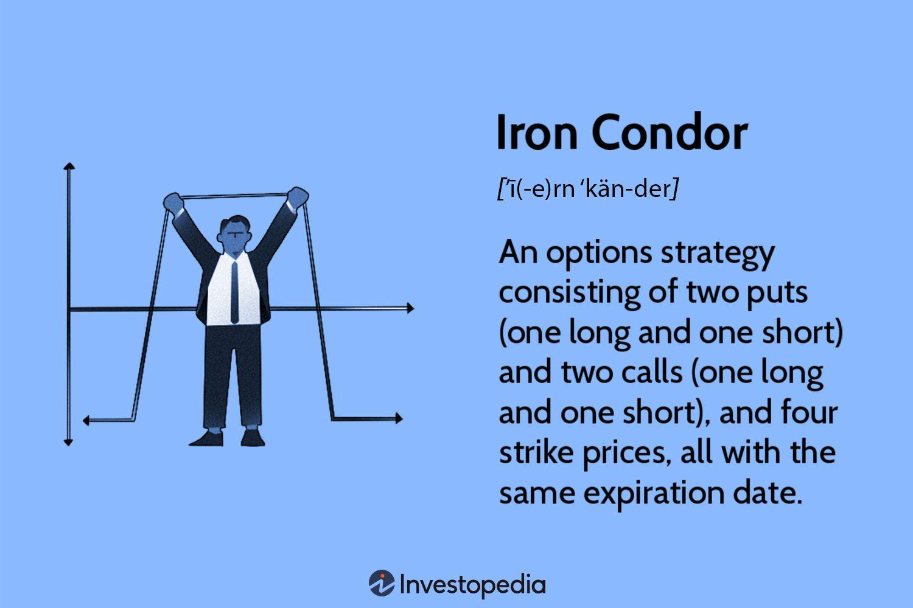

## Table of Contents

## What is an Iron Condor options trading strategy?

An Iron Condor is a type of options trading strategy that traders use to make money when they think the price of a stock or an index will stay within a certain range. It involves buying and selling four different options at the same time. Specifically, you sell an out-of-the-money call option and an out-of-the-money put option, and then you buy a further out-of-the-money call option and a further out-of-the-money put option. This creates a range where the stock price can move without causing a loss, and you earn the difference between the premiums of the options you sold and the ones you bought.

The main goal of an Iron Condor is to make a profit from the premiums of the options that you sold. If the stock price stays within the range that you set with your options, all four options will expire worthless, and you keep the premium as profit. However, if the stock price moves outside of this range, you could lose money. The risk is limited because of the options you bought, which act like insurance. They help to cap your potential losses if the stock price moves too far in either direction.

## How does an Iron Condor work?

An Iron Condor is a way to make money from options when you think a stock's price will stay in a certain range. You do this by buying and selling four different options at the same time. First, you sell a call option and a put option that are just outside the current stock price. These are called out-of-the-money options. Then, you buy a call option and a put option that are even further away from the current stock price. The money you get from selling the first two options is more than what you pay for the other two, so you start with some profit.

If the stock price stays between the prices of the options you sold, all four options will expire without being used. This means you keep the money you made from selling the options as your profit. But if the stock price goes above the higher call option or below the lower put option, you could lose money. The options you bought help limit how much you can lose, acting like insurance. So, an Iron Condor can be a good way to make money if you think the stock will stay steady, but it's important to understand the risks too.

## What are the key components of an Iron Condor?

An Iron Condor is made up of four options that you buy and sell at the same time. First, you sell a call option and a put option that are just a bit away from the current price of the stock. These options are called out-of-the-money because they won't be used if the stock stays where it is. Then, you buy another call option that is even higher and another put option that is even lower than the ones you sold. The money you get from selling the first two options is more than what you pay for the other two, so you start with some profit.

If the stock price stays between the prices of the options you sold, all four options will expire without being used. This means you get to keep the money you made from selling the options as your profit. But if the stock price moves too high or too low and goes past the prices of the options you bought, you could lose money. The options you bought act like insurance to limit how much you can lose, so your risk is capped. An Iron Condor can be a good way to make money if you think the stock will stay steady, but you need to know the risks too.

## What are the potential risks and rewards of using an Iron Condor?

The main reward of using an Iron Condor is that you can make money if the stock price stays within a certain range. You get to keep the money you made from selling the options if they all expire without being used. This can be a good way to make money if you think the stock will stay steady. The amount you can make is limited to the difference between the money you got from selling the options and the money you paid for the other options.

The biggest risk with an Iron Condor is that you can lose money if the stock price moves too much in either direction. If the stock price goes above the higher call option or below the lower put option, you could lose money. The options you bought help limit how much you can lose, but you can still lose more than you made if the stock moves a lot. It's important to understand that while your potential reward is limited, your potential loss is also limited, but it can still be significant if the stock moves outside your expected range.

## How do you set up an Iron Condor trade?

To set up an Iron Condor trade, you first need to choose a stock or index that you think will stay within a certain price range. Then, you sell an out-of-the-money call option and an out-of-the-money put option. These options should be just a bit away from the current price of the stock. For example, if the stock is at $50, you might sell a call option at $55 and a put option at $45. The money you get from selling these options is your starting profit.

Next, you need to buy another call option that is even higher than the one you sold, and another put option that is even lower than the one you sold. These options act like insurance to limit your losses. Using the same example, you might buy a call option at $60 and a put option at $40. The money you pay for these options is less than what you got from selling the first two, so you still have some profit at the start. If the stock stays between $45 and $55 when the options expire, you keep all the money you made from selling the options. But if the stock goes above $55 or below $45, you could lose money, though the options you bought help limit how much you can lose.

## What are the best market conditions for using an Iron Condor?

The best market conditions for using an Iron Condor are when the stock or index you're trading is expected to stay within a certain price range. This means the market should be stable, without big ups or downs. If you think the stock won't move much in either direction, an Iron Condor can be a good choice because you make money if the stock stays between the prices of the options you sold.

It's also good to use an Iron Condor when there's low volatility in the market. Low volatility means the stock price isn't moving around a lot, which is what you want for this strategy. If the market is calm and you expect it to stay that way, an Iron Condor can help you earn money from the premiums of the options you sold, as long as the stock stays within your chosen range.

## How do you manage an Iron Condor position?

Managing an Iron Condor position means watching the stock price to make sure it stays within the range you set. If the stock price starts moving too close to the prices of the options you sold, you might need to make some changes. One way to manage this is by closing out the options that are at risk of being used. This means buying back the call or put option you sold if the stock price gets too close to it. By doing this, you can limit your losses if the stock price keeps moving in that direction.

Another way to manage an Iron Condor is by rolling the options. Rolling means closing the current options and opening new ones with different expiration dates or strike prices. For example, if the stock price is getting close to the call option you sold, you could buy it back and sell a new call option at a higher price or with a later expiration date. This can give you more time for the stock to move back into the safe range. Managing an Iron Condor well means being ready to make these changes to protect your profit and limit your losses.

## What are common adjustments to an Iron Condor?

When you're managing an Iron Condor, you might need to make changes if the stock price starts moving too close to the options you sold. One common adjustment is to close out the options that are at risk. This means buying back the call or put option you sold if the stock price is getting too close to it. By doing this, you can stop the losses from getting bigger if the stock keeps moving that way. It's like cutting your losses before they get too bad.

Another way to adjust an Iron Condor is by rolling the options. Rolling means closing the current options and opening new ones with different dates or prices. If the stock price is near the call option you sold, you could buy it back and sell a new call option at a higher price or with a later date. This can give you more time for the stock to move back into the safe range. Rolling helps you keep the trade going without losing all your profit, but you need to be careful because it can cost more money.

## How does time decay affect an Iron Condor?

Time decay, also known as theta, is good for an Iron Condor because it makes the options you sold lose value as time goes on. When you set up an Iron Condor, you get money from selling options. If the stock price stays between the prices of the options you sold, all the options will lose value as they get closer to expiring. This means you can keep the money you made from selling them. The closer the options get to expiring, the faster they lose value, which is why time decay helps you make money with an Iron Condor.

But time decay can also be a problem if the stock price moves too much. If the stock price gets close to or goes past the options you sold, the options you bought (which are further away) won't lose value as fast. This can make your losses bigger because the options you bought don't help as much to limit your losses. So, while time decay usually helps an Iron Condor, you need to watch the stock price and be ready to make changes if it moves too much.

## What are the differences between an Iron Condor and other options strategies like Iron Butterfly?

An Iron Condor and an Iron Butterfly are both options strategies that you use when you think a stock will stay in a certain price range. The main difference is how they set up their options. In an Iron Condor, you sell a call and a put that are just a bit away from the current stock price, and then you buy a call and a put that are even further away. This creates a wide range where the stock can move without you losing money. On the other hand, an Iron Butterfly uses options that are all centered around the current stock price. You sell an at-the-money call and an at-the-money put, and then buy a call and a put that are the same distance away from the current price. This makes a smaller range where the stock needs to stay for you to make money.

The other big difference is in how much risk and reward you have with each strategy. An Iron Condor has a wider range where the stock can move without causing a loss, so it's less risky than an Iron Butterfly. But because the range is wider, the profit you can make is also smaller. An Iron Butterfly, with its smaller range, can make you more money if the stock stays right where you want it. But if the stock moves too much, you can lose more money because the range is tighter. So, an Iron Condor is good if you want less risk and are okay with less reward, while an Iron Butterfly is better if you want more reward but are willing to take more risk.

## How can you use technical analysis to enhance the effectiveness of an Iron Condor?

You can use technical analysis to make your Iron Condor trade work better by looking at charts and indicators that show where the stock price might go. For example, if you see that the stock has been moving in a tight range for a while, you might choose to set up your Iron Condor so that the options you sell are just outside this range. You can also use tools like support and resistance levels to figure out where the stock might stop moving up or down. If you see that the stock often bounces off a certain price, you can set your options around these levels to increase your chances of the stock staying in your safe range.

Another way technical analysis can help is by using indicators like Bollinger Bands or the Average True Range (ATR) to understand how much the stock price might move. If the Bollinger Bands are tight, it means the stock isn't moving much, which is good for an Iron Condor. If the ATR shows low volatility, it can also tell you that the stock is likely to stay within a small range. By using these tools, you can pick the right strike prices for your options and time your trade better, making it more likely that your Iron Condor will be successful.

## What advanced techniques can be used to optimize an Iron Condor strategy?

One advanced technique to optimize an Iron Condor is to use delta hedging. Delta is a number that shows how much the price of an option changes when the stock price changes. By keeping an eye on the delta of your options, you can buy or sell shares of the stock to balance out your position. This can help you make sure your Iron Condor stays profitable even if the stock price moves a bit. Another technique is to use a dynamic adjustment strategy. This means you watch the stock price closely and make small changes to your options as it moves. For example, if the stock starts moving towards one of the options you sold, you can buy it back and sell a new one at a different price to keep your trade safe.

You can also use different expiration dates to your advantage. Instead of using options that all expire at the same time, you can set up an Iron Condor with options that expire at different times. This is called a calendar spread. By doing this, you can have some options expire sooner, which can help you earn money from time decay faster, while others give you more time for the stock to move back into your safe range. Another advanced technique is to use implied volatility to your advantage. If you think the stock's volatility will go down, you can set up your Iron Condor when the options are more expensive due to high volatility, and then profit as the volatility decreases. This can make your Iron Condor more profitable because the options you sold will lose value faster.

## What is the Iron Condor Strategy and how does it work?

An iron condor is a delta-neutral options trading strategy designed to capitalize on a market environment characterized by low volatility. At its core, the iron condor strategy entails simultaneously engaging in both a call credit spread and a put credit spread, resulting in a position that comprises four distinct options with differing strike prices.

The mechanics of the iron condor are structured as follows:

1. **Call Credit Spread**: This involves selling a call option at a lower strike price and buying another call option at a higher strike price. The premium received from selling the near-the-money call partially offsets the cost of purchasing the out-of-the-money call, which helps in limiting potential losses.

2. **Put Credit Spread**: This spread requires selling a put option at a higher strike price and purchasing a put at a lower strike price. Similar to the call spread, the premium from the sold option offsets the cost of the bought option, managing the potential loss if the underlying asset moves adversely.

The positions are usually equidistant from the current price of the underlying asset, aiming to encompass a range where the asset is expected to remain until the expiration of the options. The strategy profits most when the asset price remains between the middle strike prices, causing all options involved to expire worthless and allowing the trader to pocket the net premiums collected initially.

The formula for the maximum profit is the net premium received:

$$
\text{Maximum Profit} = \text{Net Premium Collected}
$$

The maximum potential loss occurs if the underlying asset's price moves significantly beyond the upper or lower range set by the spread. It is calculated as the difference between the higher strike price and the lower strike price of the spreads, minus the net premium received:

$$
\text{Maximum Loss} = (\text{Strike Price Difference}) - (\text{Net Premium Collected})
$$

This strategic construction makes the iron condor a limited-risk, limited-reward trading strategy, ideally suited for traders expecting minimal price movement. It benefits from the time decay of options, particularly when [volatility](/wiki/volatility-trading-strategies) is lower than expected. However, successful execution involves not only strategic placement within suitable strike price ranges but also careful monitoring of market conditions to allow for adjustments if necessary.

## References & Further Reading

[1]: Wolfinger, J. (2008). ["The Rookie's Guide to Options: The Beginner's Handbook of Trading Equity Options."](https://www.amazon.com/Rookies-Guide-Options-Beginners-Handbook/dp/193435404X) Harriman House.

[2]: Chan, E. (2009). ["Quantitative Trading: How to Build Your Own Algorithmic Trading Business."](https://github.com/ftvision/quant_trading_echan_book) Wiley.

[3]: Passarelli, D. (2012). ["Options Strategies for the Agile Investor."](https://www.oreilly.com/library/view/options-strategies-for/9780132685627/) FT Press.

[4]: Kissell, R. (2013). ["The Science of Algorithmic Trading and Portfolio Management."](https://www.sciencedirect.com/book/9780124016897/the-science-of-algorithmic-trading-and-portfolio-management) Academic Press.

[5]: Natenberg, S. (1994). ["Option Volatility and Pricing: Advanced Trading Strategies and Techniques."](https://www.amazon.com/Option-Volatility-Pricing-Strategies-Techniques/dp/0071818774) McGraw-Hill Education.

[6]: Johnson, R., & Chevallier, J. (2020). ["Financial Derivatives: Pricing and Risk Management."](https://papers.ssrn.com/sol3/papers.cfm?abstract_id=1568206) The MIT Press.