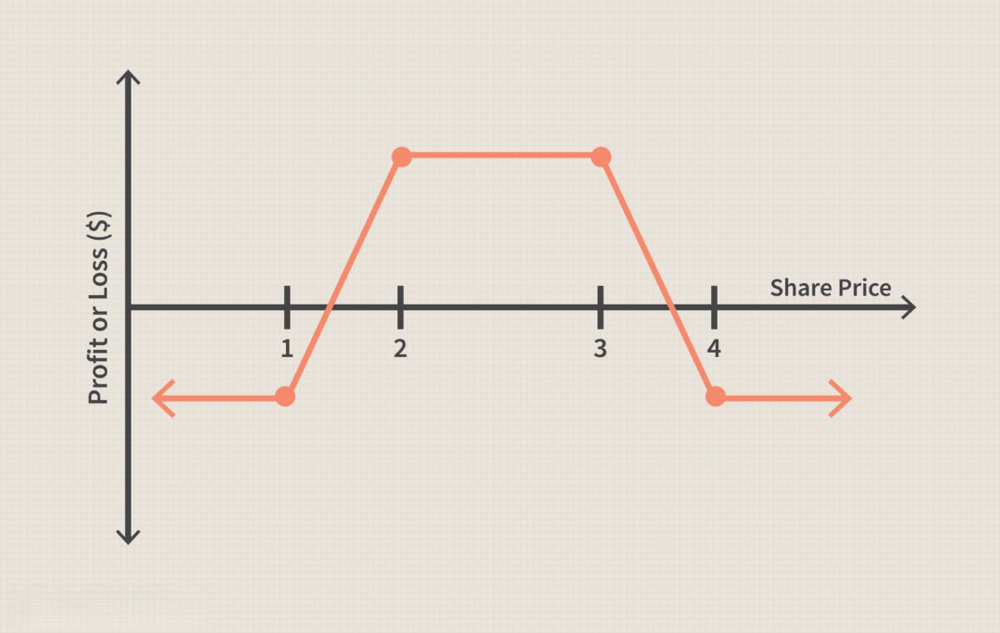

In finance, options trading has emerged as a powerful tool for investors due to its versatility and potential for significant returns. Among the myriad of strategies available, the Iron Condor stands out for its ability to generate consistent income while managing risk. This strategy is highly regarded for its non-directional nature, enabling traders to profit from minimal market movement.

The convergence of finance and technology has ushered in a new era of possibilities, particularly in algorithmic trading. This modern approach uses computer programs to execute trades based on predetermined criteria, maximizing efficiency and accuracy. By integrating algorithmic trading with strategies like the Iron Condor, traders can optimize their investment results and navigate the complexities of the markets with greater precision.



Our article will elucidate the Iron Condor strategy and its application in algorithmic trading to help both seasoned traders and novice investors incorporate these techniques into their portfolios for enhanced performance. Whether you are looking to expand your trading knowledge or seeking innovative methods to boost your portfolio, understanding how to merge these strategies with technology is essential.

Join us in exploring the nuances of options trading fused with advanced algorithms, which offer exciting opportunities for improved trading outcomes.

## Table of Contents

## Understanding Options Trading

Options trading is a sophisticated financial practice that allows investors to trade contracts giving them the right, but not the obligation, to either buy or sell an underlying security at a predetermined price by a certain expiration date. These contracts, known as options, offer unique opportunities and challenges for market participants.

### Basic Concepts of Options Trading

Options are divided into two main types: calls and puts. A *call option* gives the holder the right to purchase the underlying asset, whereas a *put option* provides the right to sell it. The price at which the option can be exercised, known as the *strike price*, and the option's *expiration date* are critical parameters that define the value and behavior of an option.

#### Call Options

A call option increases in value when the underlying asset rises above the strike price prior to expiration. For example, if an investor buys a call option with a strike price of $50 and the market price of the underlying asset rises to $60, the investor could potentially buy the asset at the lower strike price for a profit.

#### Put Options

Conversely, a put option increases in value when the underlying asset declines below the strike price. An investor holding a put option with a $50 strike price will profit if the market price of the asset falls to $40, allowing them to sell the asset at a higher strike price than the market value.

### Options as a Tool for Flexibility and Leverage

The appeal of options trading lies in their inherent flexibility and leverage. Options allow traders to speculate on market direction, hedge against potential losses in other investments, or generate additional income. The use of leverage means that options can produce significant profits from relatively small price movements in the underlying asset, as the initial investment is often considerably lower than what would be required to trade the asset directly.

### Risks and Rewards in Options Trading

While options offer the potential for high returns, they also come with substantial risks. The primary risk is the potential for total loss of the premium paid if the market does not move in the perceived direction before the option expires. Additionally, options can be complex instruments that require a thorough understanding of market scenarios and strategies to be deployed effectively.

For instance, if the market is highly volatile, options might lose value rapidly (a phenomenon known as *theta decay*), as the time value of options diminishes nearing expiration. Moreover, the use of leverage can amplify losses similarly to how it enhances profits, making risk management a critical component of any options trading strategy.

In conclusion, options trading represents a dynamic and complex arena offering both opportunities and challenges for investors. Understanding the key concepts such as calls, puts, strike prices, and expiration dates, and carefully managing inherent risks, are essential to deploy options effectively as a tool for achieving financial objectives.

## Exploring the Iron Condor Strategy

The Iron Condor strategy stands out in options trading for its non-directional nature and potential to generate steady income with limited risk. At its core, an Iron Condor involves the simultaneous construction of two vertical spreads: a bear call spread and a bull put spread.

The bear call spread consists of selling a call option at a lower strike price and buying another call option at a higher strike price within the same expiration period. Conversely, the bull put spread involves selling a put option at a higher strike price and buying another put option at a lower strike price, also within the same expiration. These two spreads collectively create a range-bound strategy where the trader anticipates minimal movement in the underlying asset's price.

The principal advantage of the Iron Condor is its encapsulation of limited risk and limited profit. Unlike highly speculative strategies, the Iron Condor is designed to benefit from a stable or gently fluctuating market. Ideal market conditions include low [volatility](/wiki/volatility-trading-strategies) periods or when there is an expectation of the underlying asset to remain within a specific price range. In such scenarios, the net premium received from the spreads can be retained with the strategy achieving profitability as options expire worthless.

To set up an Iron Condor, consider an underlying asset currently trading at $100. Suppose an investor anticipates minimal price movement and decides to establish an Iron Condor with the following legs:

1. Sell a 95 strike put
2. Buy a 90 strike put
3. Sell a 110 strike call
4. Buy a 115 strike call

In this setup, the maximum profit is achieved if the underlying price at expiration remains between $95 and $110, allowing all options to expire worthless. The profit is equal to the net premium received from these transactions. However, the maximum loss occurs if the price moves beyond the break-even points, calculated as follows:

$$

\text{Lower Break-even} = \text{Lower Put Strike} - \text{Net Premium Received} 
$$
$$

\text{Upper Break-even} = \text{Upper Call Strike} + \text{Net Premium Received} 
$$

The Iron Condor is appealing to traders who seek to manage risk conservatively. This strategy allows investors to have predefined risk and reward limits, making it preferable for those wary of high-risk exposure. Moreover, due to its structure, the Iron Condor is ideal for a market where the trader is confident the price will not experience significant volatility over the term of the options. Thus, it is an effective method for income generation while maintaining a lower-risk profile in options trading.

 to Algorithmic Trading

Algorithmic trading, often referred to as 'algo trading,' involves the use of computer programs to execute trading orders automatically according to a set of predefined criteria. This approach has gained significant traction within the financial markets due to its potential for enhancing trading efficiency and accuracy.

At its core, [algorithmic trading](/wiki/algorithmic-trading) leverages the computational power of computers to process vast amounts of data and execute trades at speeds and frequencies that are beyond human capability. By utilizing algorithms, traders can establish precise criteria for trade execution, such as timing, price, and [volume](/wiki/volume-trading-strategy), which help in reducing manual intervention and human error.

One of the key benefits of algorithmic trading is the speed at which trades can be executed. Computers can analyze multiple market conditions and execute orders within milliseconds, thereby minimizing latency and taking advantage of fleeting trading opportunities. This rapid execution is crucial in high-frequency trading environments where price movements can be minute yet significantly profitable.

Precision is another advantage, as algorithms are programmed to follow specific strategies without deviation. This precision ensures consistency in execution, helping traders adhere strictly to their investment strategies. Additionally, algorithms can be backtested against historical data, which allows traders to assess the viability and potential profitability of strategies before they are deployed in live markets. This [backtesting](/wiki/backtesting) capability facilitates risk assessment and performance optimization of trading strategies, such as the Iron Condor.

Algorithmic trading plays a significant role in executing complex strategies like the Iron Condor efficiently. An Iron Condor involves multiple legs and precise execution, which can be cumbersome and error-prone if done manually. Algorithms can automate the placement and management of the various components of such strategies, ensuring that all parts are synchronized and executed as planned.

Developing and deploying trading algorithms require certain technological prerequisites and expertise. A robust infrastructure capable of handling high-speed data processing is essential. The coding of these algorithms can be done using programming languages like Python, which is popular for its extensive libraries and ease of use in data analysis and algorithm development.

For example, a simple pseudocode for an algorithmic trading strategy may look like this:

```python
def trading_strategy(data):
    # Define strategy criteria
    open_position = False
    for point in data:
        if not open_position and meets_entry_criteria(point):
            execute_trade('buy', point)
            open_position = True
        elif open_position and meets_exit_criteria(point):
            execute_trade('sell', point)
            open_position = False

def meets_entry_criteria(point):
    # Example entry logic
    return point['price'] <= point['moving_average']

def meets_exit_criteria(point):
    # Example exit logic
    return point['price'] > point['moving_average']
```

This code represents basic logic for entering and exiting trades based on a price and moving average crossover strategy, showcasing the structured and methodical nature of algorithmic trading.

In summary, algorithmic trading enhances the ability to execute trades with increased speed and precision, essential for implementing strategies like the Iron Condor. It requires significant technological capabilities and expertise but offers substantial benefits in terms of efficiency and effectiveness in managing complex financial strategies.

## Integrating Iron Condor Strategy with Algorithmic Trading

Combining the Iron Condor strategy with algorithmic trading offers investors the opportunity to enhance trading efficiency and outcomes considerably. Algorithmic trading, with its ability to automate trades and refine strategies based on data-driven insights, aligns well with the structured approach of an Iron Condor, a strategy known for its conservative risk profile and income-generating potential.

**Advantages of Algorithmic Trading with Iron Condor**

One of the main benefits of integrating algorithmic trading into the Iron Condor strategy is the capability for automatic trade placement. Algorithms can be programmed to execute trades when certain criteria are met, streamlining the implementation process and reducing the likelihood of human error. Additionally, algorithms can monitor market conditions continuously, ensuring that the trades conform to predefined thresholds or [exit](/wiki/exit-strategy) strategies, such as adjusting positions in response to volatility spikes that may threaten profitability.

Moreover, algorithmic systems can backtest the Iron Condor strategy against historical data. This process involves simulating the strategy's performance using past market conditions to estimate potential future outcomes. By doing so, traders can gain valuable insights into the strategy's profitability and risk under different market scenarios, allowing them to optimize parameters such as strike prices, expiration dates, and investment scale.

**Challenges of Integrating Algorithmic and Iron Condor Strategies**

Despite these advantages, integrating algorithmic trading with the Iron Condor strategy also presents challenges. One significant risk is algorithmic errors, which can lead to unintended trades or miscalculations in strategy execution. Ensuring robust coding practices and implementing rigorous testing frameworks is necessary to minimize these errors. Furthermore, algorithms might struggle to adapt to sudden and unpredictable market changes without human intervention, emphasizing the importance of constant monitoring and adaptive learning mechanisms.

Market changes, particularly in volatility, can also affect the outcomes of an Iron Condor strategy significantly. Algorithms need to be designed with this adaptability in mind, possibly incorporating [machine learning](/wiki/machine-learning) techniques to refine their predictive capabilities and adjust automatically to new patterns or shifts in market behavior.

**Tools and Platforms for Algorithmic Management of Iron Condor Strategies**

Several tools and platforms support the integration of algorithmic trading with Iron Condor strategies. Trading platforms like MetaTrader and QuantConnect provide resources for developing and testing algorithms. These platforms often include historical data access, risk management modules, and community support for sharing strategies and obtaining feedback.

For Python users, libraries such as Alpaca or Backtrader offer powerful tools for designing, simulating, and optimizing trading strategies, including Iron Condors. These libraries integrate with brokerage APIs to enable paper trading (simulated trades using live market data) and automate real-world execution. Additionally, Python's ecosystem supports data analysis and visualization, crucial for refining strategy parameters and assessing performance metrics.

In conclusion, the strategic combination of the Iron Condor with algorithmic trading presents a promising avenue for enhanced trading efficiency and improved outcomes. While challenges exist, particularly concerning algorithmic errors and market adaptability, modern tools and platforms provide traders with the necessary support to effectively manage and optimize these strategies.

## Benefits and Risks of Algo Trades in Iron Condor Strategies

Algorithmic trading, when combined with the Iron Condor strategy, offers a host of benefits and a set of challenges that need careful consideration. One of the key advantages of utilizing algorithms is the increased time efficiency in managing trades. Algorithms can rapidly execute trades and monitor market conditions in real-time, which is crucial for a strategy like Iron Condor, where timely execution can be the difference between profit and loss. Additionally, algorithms help in eliminating emotional biases, enabling traders to adhere strictly to predefined trading strategies.

Risk management is an essential component of algorithmic strategies. By incorporating stop-loss orders within the algorithm, traders can automatically limit their losses, ensuring that positions are closed when the market moves unfavorably. This automates the decision-making process, allowing for a more disciplined approach to risk management. For instance, in a Python-based trading algorithm, a stop-loss can be implemented as follows:

```python
def execute_trade(position, current_price, stop_loss_price):
    if current_price <= stop_loss_price:
        close_position(position)
        return "Position closed due to stop loss."
    return "Position active."

position = "Iron Condor"
current_price = 95
stop_loss_price = 90

print(execute_trade(position, current_price, stop_loss_price))
```

Learning and adaptation are pivotal in refining algorithms based on real-world performance. Algorithms can be continuously updated and improved using machine learning techniques that learn from past trade data to optimize future trades. Developing an adaptive algorithm involves integrating feedback mechanisms where trade outcomes inform strategy adjustments.

However, there are inherent technological and market risks when using algorithmic trading systems. Algorithms are susceptible to technological failures, such as server downtime, software bugs, or latency issues that can impact trade execution. Market risks include rapid changes in market conditions that could render an algorithm less effective or cause it to make poor trading decisions. Hence, constant monitoring and updates are essential to ensure the robustness of an algorithmic strategy.

Regulatory considerations are also critical. With the increasing scrutiny over algorithmic trading practices, staying compliant with financial regulations is a must. Traders and developers must ensure that their algorithms follow legal requirements, such as audit trails and risk controls. Understanding and adhering to regulations such as the European Union's Markets in Financial Instruments Directive (MiFID II) or the Securities and Exchange Commission (SEC) rules in the US is crucial for legal trading operations.

In summary, while algorithmic trading in Iron Condor strategies presents advantageous opportunities, traders must be diligent in managing risks and complying with regulatory standards. This holistic approach ensures the efficacy and legality of trading endeavors.

## Conclusion

In this article, we explored the integration of the Iron Condor options strategy within the framework of algorithmic trading, highlighting the synergy between these two advanced trading approaches. The Iron Condor strategy is well-regarded for its potential to generate consistent income through a non-directional approach, appealing to traders who favor lower-risk, conservative strategies. Simultaneously, algorithmic trading offers enhanced speed, precision, and the ability to backtest strategies against historical data, making it a valuable tool for executing complex strategies like the Iron Condor.

The promising future of algorithmic trading lies in its ability to streamline and refine options strategies. As financial markets continue to evolve, the role of automation and advanced algorithms in optimizing trading decisions is becoming increasingly critical. Traders are urged to embrace technological advancements and constantly refine their skills to remain competitive in this fast-paced environment.

For those looking to deepen their understanding of options trading and algorithm development, several resources can provide additional insights. Books like "Option Volatility and Pricing" by Sheldon Natenberg and "Algorithmic Trading" by Ernie Chan are excellent starting points. Online courses and webinars offered by platforms such as Coursera, Udemy, and Khan Academy can also enhance knowledge and practical skills in this domain.

In conclusion, as the boundaries of trading innovation are pushed, traders are encouraged to explore new strategies with careful diligence and informed risk management. By staying informed and adopting cutting-edge technologies, traders can enhance their trading portfolios and adapt to the ever-changing financial landscape.

## References & Further Reading

[1]: Natenberg, S. (1994). ["Option Volatility and Pricing: Advanced Trading Strategies and Techniques."](https://www.amazon.com/Option-Volatility-Pricing-Strategies-Techniques/dp/0071818774) McGraw Hill Professional.

[2]: Chan, E. (2009). ["Quantitative Trading: How to Build Your Own Algorithmic Trading Business."](https://github.com/ftvision/quant_trading_echan_book) Wiley.

[3]: Jansen, S. (2020). ["Machine Learning for Algorithmic Trading: Predictive models to extract signals from market and alternative data for systematic trading strategies with Python."](https://www.amazon.com/Machine-Learning-Algorithmic-Trading-alternative/dp/1839217715) Packt Publishing.

[4]: Lopez de Prado, M. (2018). ["Advances in Financial Machine Learning."](https://www.amazon.com/Advances-Financial-Machine-Learning-Marcos/dp/1119482089) Wiley.

[5]: Aronson, D. (2006). ["Evidence-Based Technical Analysis: Applying the Scientific Method and Statistical Inference to Trading Signals."](https://www.amazon.com/Evidence-Based-Technical-Analysis-Scientific-Statistical/dp/0470008741) Wiley.