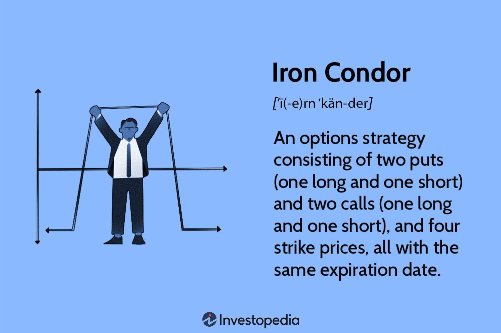

## Table of Contents

## What is an Iron Condor in options trading?

An Iron Condor is a type of options trading strategy that involves four different options contracts. It is designed to make money when the price of the underlying stock or asset stays within a certain range. To set up an Iron Condor, you sell an out-of-the-money call option and an out-of-the-money put option, and then buy a further out-of-the-money call option and a further out-of-the-money put option. This creates a range where you can profit if the stock price stays between the strike prices of the options you sold.

The goal of an Iron Condor is to collect the premium from the options you sold, while limiting your risk with the options you bought. If the stock price stays within the range you set, all four options will expire worthless, and you keep the premium as profit. However, if the stock price moves outside of this range, you could lose money. The maximum loss is limited to the difference between the strike prices of the bought and sold options, minus the premium received. Iron Condors are popular because they can offer a high probability of profit with defined risk, but they require careful management and understanding of options.

## How does an Iron Condor strategy work?

An Iron Condor strategy in options trading is like setting up a safety net around a stock's price. You do this by selling two options that are a bit away from where the stock is now. One is a call option above the current price, and the other is a put option below it. You make money from these because you get paid a premium for selling them. But to keep your risk in check, you also buy two more options that are even further away from the current price. One is a call option way above, and the other is a put option way below. This way, if the stock price stays in the middle, you keep the money you got from selling the options.

If the stock price stays between the two options you sold, all four options will expire without being used, and you get to keep the premium as your profit. It's like betting that the stock won't move too much. But if the stock price goes outside this range, you might lose money. The most you can lose is the difference between the prices of the options you bought and sold, minus the premium you collected. So, an Iron Condor can be a good way to make money if you think the stock will stay steady, but you need to watch it closely and understand how options work.

## What are the key components of an Iron Condor?

An Iron Condor strategy in options trading has four key parts. First, you sell a call option that's a bit above the current stock price. This is called the short call. At the same time, you sell a put option that's a bit below the current stock price. This is the short put. By selling these options, you get paid a premium, which is your potential profit if the stock stays within a certain range.

To limit your risk, you also buy a call option that's even further above the current stock price. This is called the long call. You also buy a put option that's even further below the current stock price, known as the long put. These long options help protect you if the stock price moves too far in either direction. If the stock stays between the short call and short put, all four options expire worthless, and you keep the premium as profit. If the stock moves outside this range, your losses are limited to the difference between the strike prices of the long and short options, minus the premium you received.

## What are the potential risks and rewards of trading an Iron Condor?

Trading an Iron Condor can be a good way to make money if the stock price stays in a certain range. The reward comes from the premium you get when you sell the call and put options. If the stock stays between the strike prices of the options you sold, all four options will expire worthless, and you get to keep the premium as profit. This can be a nice steady income if you pick the right range and time it well.

But there are risks too. The biggest risk is if the stock price moves a lot and goes outside the range you set. If it goes above the short call or below the short put, you could lose money. The most you can lose is the difference between the strike prices of the options you bought and sold, minus the premium you got. This means you need to be careful and watch the stock closely. If the stock moves too much, you might need to adjust your positions or close them early to limit your losses.

## How do you set up an Iron Condor?

Setting up an Iron Condor is like making a sandwich for your stock. You start by [picking](/wiki/asset-class-picking) a stock or an [ETF](/wiki/etf-trading-strategies) that you think won't move too much in price. Then, you sell a call option that's a bit higher than the current price and a put option that's a bit lower. These are called the short call and short put. When you sell these options, you get paid a premium, which is like getting money for your sandwich.

Next, you need to protect your sandwich, so you buy a call option that's even higher than the one you sold and a put option that's even lower than the one you sold. These are called the long call and long put. They help limit how much you can lose if the stock price goes wild. If the stock stays between the prices of the options you sold, all four options will expire without being used, and you get to keep the premium as your profit. But if the stock moves outside this range, you might lose money, but your loss is capped at the difference between the prices of the options you bought and sold, minus the premium you got.

## What are the ideal market conditions for an Iron Condor?

The best time to use an Iron Condor is when the market is calm and not moving around a lot. If you think the stock or ETF you're looking at will stay pretty steady, an Iron Condor can be a good choice. This strategy works well when there's not much news or big events that could shake things up. You want the stock to stay in a tight range, so you can keep the money you got from selling the options.

But, if the market is all over the place or if there's a big event coming up that could make the stock jump around, an Iron Condor might not be the best idea. Big moves in the stock price can make you lose money, even though you have some protection with the options you bought. So, it's important to pick a time when things are likely to stay quiet and the stock won't move too much.

## How do you manage and adjust an Iron Condor position?

Managing an Iron Condor means keeping an eye on the stock price and making changes if it starts to move too close to the edges of your range. If the stock price gets close to the short call or short put, you might want to buy back the option that's in danger. This can help you avoid big losses if the stock keeps moving. You can also roll the options, which means closing the current ones and opening new ones with different strike prices or expiration dates. This can give you more time or a wider range to work with.

Adjusting an Iron Condor can also mean adding more options to your position. For example, if the stock is moving up and getting close to your short call, you might sell another call option at a higher strike price. This can bring in more premium and help balance out your risk. But remember, every change you make can cost money and might change how much you can make or lose. So, it's important to think carefully and maybe practice with a small amount of money first to get the hang of it.

## What are common mistakes to avoid when trading Iron Condors?

One common mistake when trading Iron Condors is not picking the right range for the stock price. If you set the range too tight, the stock might move outside it easily, and you could lose money. It's important to think about how much the stock usually moves and pick a range that gives you a good chance of keeping the premium you got from selling the options. Another mistake is not watching the position closely. Iron Condors need attention because the stock price can change quickly. If you're not paying attention, you might miss the chance to make adjustments and end up losing more than you expected.

Another big mistake is not having a plan for what to do if things go wrong. You need to know when you'll close the position or make adjustments if the stock starts moving too close to your short options. Without a plan, you might panic and make bad decisions. Also, some people try to make too many adjustments, which can get confusing and cost more money. It's better to keep things simple and stick to a clear strategy.

## How can you calculate the maximum profit and loss of an Iron Condor?

To find out the most you can make from an Iron Condor, you just need to look at the premium you got from selling the short call and short put options. This premium is your maximum profit if the stock price stays between the strike prices of these options when they expire. For example, if you sold the options for a total of $200, that's the most you can make. If the stock stays in the range you set, all four options will expire worthless, and you keep the $200 as your profit.

To figure out the most you can lose, you need to look at the difference between the strike prices of the options you bought and sold. The maximum loss is the difference between the strike prices of the long call and short call, or the long put and short put, whichever is bigger, minus the premium you received. For example, if the difference between the strike prices of the long and short call is $500, and you got $200 from selling the options, your maximum loss would be $300 ($500 - $200). This means if the stock price moves outside your range, you could lose up to $300, but no more than that.

## What advanced techniques can be used to enhance Iron Condor strategies?

One way to make your Iron Condor better is by using something called delta hedging. Delta is a number that tells you how much the price of an option might change if the stock price moves. By keeping an eye on the delta of your Iron Condor, you can buy or sell shares of the stock to balance out the risk. If the delta gets too high or too low, you can adjust it by trading the stock. This can help keep your position safer if the stock starts moving a lot.

Another advanced trick is to use different expiration dates for your options. This is called a calendar spread. You can set up your Iron Condor with options that expire at different times. For example, you might sell options that expire in a month and buy options that expire in two months. This can give you more time to be right about the stock staying in your range. It can also help you make more money if the stock stays calm for a longer time. But remember, using different expiration dates can make things more complicated, so you need to be careful and keep a close watch on your position.

## How does the choice of expiration date affect an Iron Condor?

The expiration date you pick for your Iron Condor can make a big difference. If you choose a short expiration date, like a week or two, the options you sell might be cheaper, so you get less money upfront. But, it's easier for the stock to stay in your range for a short time, so you have a better chance of keeping that money. On the other hand, if you pick a longer expiration date, like a month or more, the options you sell will be more expensive, so you get more money. But, it's harder to predict where the stock will be over a longer time, so there's more risk that it might move out of your range.

Choosing the right expiration date is a balancing act. A shorter expiration date means less money but a higher chance of success. A longer expiration date means more money but a higher risk. You need to think about how much the stock usually moves and what you think will happen in the future. If you expect the stock to stay calm for a while, a longer expiration might be better. But if you think there might be big news or events coming up, a shorter expiration could be safer.

## What are the tax implications of trading Iron Condors?

When you trade Iron Condors, you need to think about taxes. The money you make from Iron Condors is usually seen as capital gains by the tax people. If you hold your Iron Condor for less than a year, any profit you make is called a short-term capital gain. This is taxed at your regular income tax rate, which can be pretty high. But if you hold it for more than a year, it becomes a long-term capital gain, which usually has a lower tax rate. So, how long you keep your Iron Condor can make a big difference in how much you pay in taxes.

Also, you can use losses from Iron Condors to help with your taxes. If you lose money on an Iron Condor, you can use that loss to reduce your taxes. You can take the loss off your income for the year, which can lower how much tax you owe. If your losses are more than your gains, you can even [carry](/wiki/carry-trading) the extra loss over to the next year to use against future gains. Just remember to keep good records of all your trades, so you can show the tax people what you did if they ask.

## What is the Iron Condor Strategy and how can it be explored?

The Iron Condor strategy stands out in options trading for its non-directional nature and potential to generate steady income with limited risk. At its core, an Iron Condor involves the simultaneous construction of two vertical spreads: a bear call spread and a bull put spread.

The bear call spread consists of selling a call option at a lower strike price and buying another call option at a higher strike price within the same expiration period. Conversely, the bull put spread involves selling a put option at a higher strike price and buying another put option at a lower strike price, also within the same expiration. These two spreads collectively create a range-bound strategy where the trader anticipates minimal movement in the underlying asset's price.

The principal advantage of the Iron Condor is its encapsulation of limited risk and limited profit. Unlike highly speculative strategies, the Iron Condor is designed to benefit from a stable or gently fluctuating market. Ideal market conditions include low [volatility](/wiki/volatility-trading-strategies) periods or when there is an expectation of the underlying asset to remain within a specific price range. In such scenarios, the net premium received from the spreads can be retained with the strategy achieving profitability as options expire worthless.

To set up an Iron Condor, consider an underlying asset currently trading at $100. Suppose an investor anticipates minimal price movement and decides to establish an Iron Condor with the following legs:

1. Sell a 95 strike put
2. Buy a 90 strike put
3. Sell a 110 strike call
4. Buy a 115 strike call

In this setup, the maximum profit is achieved if the underlying price at expiration remains between $95 and $110, allowing all options to expire worthless. The profit is equal to the net premium received from these transactions. However, the maximum loss occurs if the price moves beyond the break-even points, calculated as follows:

$$

\text{Lower Break-even} = \text{Lower Put Strike} - \text{Net Premium Received} 
$$
$$

\text{Upper Break-even} = \text{Upper Call Strike} + \text{Net Premium Received} 
$$

The Iron Condor is appealing to traders who seek to manage risk conservatively. This strategy allows investors to have predefined risk and reward limits, making it preferable for those wary of high-risk exposure. Moreover, due to its structure, the Iron Condor is ideal for a market where the trader is confident the price will not experience significant volatility over the term of the options. Thus, it is an effective method for income generation while maintaining a lower-risk profile in options trading.

 to Algorithmic Trading

Algorithmic trading, often referred to as 'algo trading,' involves the use of computer programs to execute trading orders automatically according to a set of predefined criteria. This approach has gained significant traction within the financial markets due to its potential for enhancing trading efficiency and accuracy.

At its core, [algorithmic trading](/wiki/algorithmic-trading) leverages the computational power of computers to process vast amounts of data and execute trades at speeds and frequencies that are beyond human capability. By utilizing algorithms, traders can establish precise criteria for trade execution, such as timing, price, and [volume](/wiki/volume-trading-strategy), which help in reducing manual intervention and human error.

One of the key benefits of algorithmic trading is the speed at which trades can be executed. Computers can analyze multiple market conditions and execute orders within milliseconds, thereby minimizing latency and taking advantage of fleeting trading opportunities. This rapid execution is crucial in high-frequency trading environments where price movements can be minute yet significantly profitable.

Precision is another advantage, as algorithms are programmed to follow specific strategies without deviation. This precision ensures consistency in execution, helping traders adhere strictly to their investment strategies. Additionally, algorithms can be backtested against historical data, which allows traders to assess the viability and potential profitability of strategies before they are deployed in live markets. This [backtesting](/wiki/backtesting) capability facilitates risk assessment and performance optimization of trading strategies, such as the Iron Condor.

Algorithmic trading plays a significant role in executing complex strategies like the Iron Condor efficiently. An Iron Condor involves multiple legs and precise execution, which can be cumbersome and error-prone if done manually. Algorithms can automate the placement and management of the various components of such strategies, ensuring that all parts are synchronized and executed as planned.

Developing and deploying trading algorithms require certain technological prerequisites and expertise. A robust infrastructure capable of handling high-speed data processing is essential. The coding of these algorithms can be done using programming languages like Python, which is popular for its extensive libraries and ease of use in data analysis and algorithm development.

For example, a simple pseudocode for an algorithmic trading strategy may look like this:

```python
def trading_strategy(data):
    # Define strategy criteria
    open_position = False
    for point in data:
        if not open_position and meets_entry_criteria(point):
            execute_trade('buy', point)
            open_position = True
        elif open_position and meets_exit_criteria(point):
            execute_trade('sell', point)
            open_position = False

def meets_entry_criteria(point):
    # Example entry logic
    return point['price'] <= point['moving_average']

def meets_exit_criteria(point):
    # Example exit logic
    return point['price'] > point['moving_average']
```

This code represents basic logic for entering and exiting trades based on a price and moving average crossover strategy, showcasing the structured and methodical nature of algorithmic trading.

In summary, algorithmic trading enhances the ability to execute trades with increased speed and precision, essential for implementing strategies like the Iron Condor. It requires significant technological capabilities and expertise but offers substantial benefits in terms of efficiency and effectiveness in managing complex financial strategies.

## References & Further Reading

[1]: Natenberg, S. (1994). ["Option Volatility and Pricing: Advanced Trading Strategies and Techniques."](https://www.amazon.com/Option-Volatility-Pricing-Strategies-Techniques/dp/0071818774) McGraw Hill Professional.

[2]: Chan, E. (2009). ["Quantitative Trading: How to Build Your Own Algorithmic Trading Business."](https://github.com/ftvision/quant_trading_echan_book) Wiley.

[3]: Jansen, S. (2020). ["Machine Learning for Algorithmic Trading: Predictive models to extract signals from market and alternative data for systematic trading strategies with Python."](https://www.amazon.com/Machine-Learning-Algorithmic-Trading-alternative/dp/1839217715) Packt Publishing.

[4]: Lopez de Prado, M. (2018). ["Advances in Financial Machine Learning."](https://www.amazon.com/Advances-Financial-Machine-Learning-Marcos/dp/1119482089) Wiley.

[5]: Aronson, D. (2006). ["Evidence-Based Technical Analysis: Applying the Scientific Method and Statistical Inference to Trading Signals."](https://www.amazon.com/Evidence-Based-Technical-Analysis-Scientific-Statistical/dp/0470008741) Wiley.