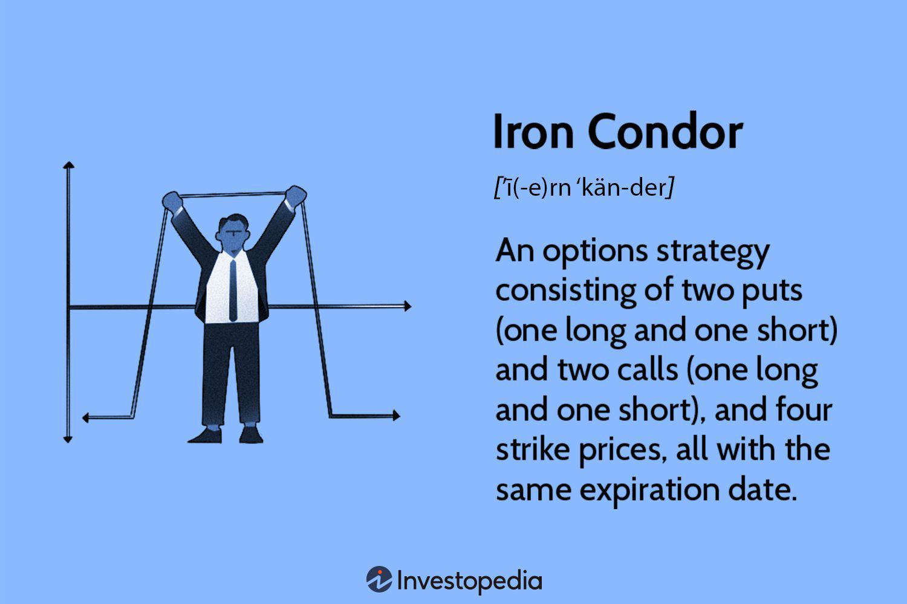

Options trading is a sophisticated endeavor, allowing traders to customize their strategies to align with market expectations. Among the myriad strategies available, the Iron Condor strategy stands out as an effective tool for those seeking consistent returns with limited risk. This options strategy is particularly appealing due to its ability to generate income in range-bound markets, where volatility is low and price movements are relatively stable.

The Iron Condor strategy combines two vertical spreads: the bull put spread and the bear call spread. This configuration creates a position that benefits when the underlying asset's price remains within a predetermined range at expiration. The primary objective is for the options to expire worthless, enabling the trader to retain the net premium received. By understanding the mechanics of the Iron Condor, traders can better approach market conditions with confidence and precision, balancing potential reward with the inherent risks of options trading.



Incorporating algorithmic trading into the Iron Condor strategy further enhances its effectiveness. Algorithmic systems automate the processes of setting up, monitoring, and adjusting trades, which reduces human error and emotional decision-making. These algorithms can help traders quickly respond to market changes, optimizing strike prices and expiration dates for improved strategy performance.

This article aims to explore the Iron Condor strategy in the context of options trading and its implementation through algorithmic trading. By equipping traders with a deeper understanding of this strategy, they can better navigate market conditions and improve their ability to achieve consistent, risk-managed returns.

## Table of Contents

## Understanding the Iron Condor Strategy

The Iron Condor strategy is a neutral options trading approach designed to capitalize on low volatility in the underlying asset, allowing traders to aim for profits by holding a position within a defined price range. This strategy is constructed by combining four different options: a long call and a short call with different strike prices, along with a long put and a short put with distinct strike prices. Specifically, the trader sells an out-of-the-money (OTM) call and an OTM put while simultaneously buying a further OTM call and put for protection.

The concept behind the Iron Condor is to create a net credit upon entering the trade, which represents the maximum potential profit if all options expire worthless, that is, if the market price of the underlying asset remains between the two middle strike prices (of the short call and put). This scenario enables the trader to retain the net premium collected from establishing the position.

The Iron Condor strategy is effective in range-bound markets, as it limits both the maximum profit and the potential losses. The maximum profit is limited to the net credit received at the onset of the trade. The maximum potential loss, on the other hand, is confined to the difference between a pair of call or put strike prices, less the net credit received. Thus, the calculation of maximum loss per contract follows the formula:

$$
\text{Maximum Loss} = (\text{Spread Between Strikes}) - (\text{Net Premium Received})
$$

For example, if the difference between the strike prices is $10 and the collected premium is $2, the maximum potential loss becomes $8 per spread.

In summary, the Iron Condor strategy offers a structured approach to trading in environments of low [volatility](/wiki/volatility-trading-strategies). By carefully setting the strike prices and ensuring alignment with the expected price range of the underlying asset, traders can effectively utilize this strategy to achieve moderate, consistent returns with controlled risk exposure.

## Setting Up an Iron Condor

To set up an Iron Condor, a trader constructs two vertical spreads: a bear call spread and a bull put spread. This strategy involves utilizing four options contracts with the same expiration date but different strike prices. The core principle of an Iron Condor is to benefit from a period of low volatility by capitalizing on the net premium collected from these options.

The first component of the Iron Condor is the bear call spread. To create this, the trader sells an out-of-the-money (OTM) call option and simultaneously purchases a further out-of-the-money call option. The purchased call option serves as a protective measure, limiting potential losses if the underlying asset's price rises significantly beyond the higher strike price.

The second component is the bull put spread, which involves selling an OTM put option and buying a further out-of-the-money put option. Similar to the call spread, the purchased put option serves as protection in the event the underlying asset's price falls sharply below the lower strike price.

Mathematically, if we denote:
- $C_{\text{sell}}$ as the call option sold,
- $C_{\text{buy}}$ as the call option bought (where $\text{Strike price of } C_{\text{buy}} > \text{Strike price of } C_{\text{sell}}$),
- $P_{\text{sell}}$ as the put option sold,
- $P_{\text{buy}}$ as the put option bought (where $\text{Strike price of } P_{\text{buy}} < \text{Strike price of } P_{\text{sell}}$),

The total net credit, which represents the maximum potential profit, can be expressed as:

$$
\text{Net Credit} = (C_{\text{sell}} - C_{\text{buy}}) + (P_{\text{sell}} - P_{\text{buy}})
$$

This net credit is the premium collected upfront and serves as the maximum profit achievable if the underlying asset's price remains within the range set by the short strike prices at expiration.

To execute an Iron Condor effectively, careful consideration of the strike prices and the current market volatility is crucial. The strike prices should be chosen based on a statistical assessment of the likely range of the asset’s price movement, often considering standard deviation metrics or historical volatility patterns. By doing so, the trader can increase the likelihood that the asset will remain within the desired price bounds until expiration, allowing all options involved in the Iron Condor to expire worthless, thus achieving the maximum net credit.

## Benefits and Risks of the Iron Condor Strategy

The Iron Condor strategy is renowned for its ability to limit risk, which is one of its most appealing features for traders. The potential losses are confined to the difference between the strike prices of the call options (or the put options) minus the premium received when establishing the position. This structured risk containment enables traders to engage in market activities with a known maximum loss, thus allowing for informed decision-making in terms of risk management and capital allocation.

One of the primary ways the Iron Condor strategy generates profits is through time decay, or theta decay. Options are wasting assets, meaning they lose value as they approach expiration. In stable, low-volatility market environments, the Iron Condor can consistently realize profits as the extrinsic value of the options sold erodes, enabling traders to capture the premium collected initially when the market remains within a particular range.

However, the Iron Condor does come with inherent risks. Unexpected market movements or spikes in volatility can quickly push the underlying asset beyond the established strike price boundaries. If the price of the asset moves significantly upwards or downwards, it could result in losses up to the calculated maximum. Additionally, the strategy's sensitivity to volatility changes (vega) means that significant changes in implied volatility can adversely affect the profitability of the position.

Moreover, high transaction costs and execution fees are notable considerations when employing the Iron Condor strategy. Due to its structure involving four separate legs—each requiring its own transaction—traders may incur substantial costs that can diminish the overall net profit margin. Consequently, efficient execution and cost management are crucial for maintaining the strategy’s profitability. Careful attention to brokerage fees and the potential impact of slippage is necessary, especially for traders utilizing this strategy frequently.

Here's a simple Python snippet to calculate potential maximum loss:

```python
# Define the variables
premium_received = 2.0  # Premium collected for the Iron Condor
strike_price_diff = 5.0  # Difference between consecutive strike prices on either side

# Calculate maximum loss
max_loss = strike_price_diff - premium_received

print(f"Maximum potential loss is: {max_loss}")
```

In this code, `premium_received` represents the net credit per share received from setting up the Iron Condor, and `strike_price_diff` is the difference in strike prices for the call (or put) options, determining the loss boundary. Proper calculation and risk assessment can help traders manage the Iron Condor's drawbacks while optimizing its potential returns under favorable market conditions.

## Incorporating Algorithmic Trading

Algorithmic trading has revolutionized the way traders implement strategies like the Iron Condor by automating critical aspects of trade management. Automation allows for the seamless setup, monitoring, and execution of trades with precision and speed, which is crucial given the complexities involved in managing four-option legs effectively. 

One of the primary advantages of [algorithmic trading](/wiki/algorithmic-trading) is its ability to reduce human error and emotional influences by following pre-set logical rules and algorithms. This helps traders adhere to their strategy without the interference of emotional decisions which can often lead to suboptimal outcomes.

Sophisticated algorithms can be designed to continuously analyze market conditions, such as price levels, volatility, and interest rates, enabling the optimization of strike prices and expiration dates for Iron Condor strategies. Algorithmic systems can monitor implied volatility and adjust the strike prices selected for both the call and put sides of the Iron Condor to maintain a desired risk-reward ratio. For example, if historical volatility data suggests an increase, the algorithm can reposition the spread to mitigate potential risks.

Consider the process of setting up and adjusting an Iron Condor algorithmically:

1. **Data Collection:** The algorithm collects real-time market data, including the current prices of the underlying asset and its options, recent volatility measures, and interest rates.

2. **Decision Making:** Using this data, the algorithm decides the optimal strike prices for the call and put options. This decision is based on factors such as the historical price range and expected volatility.

3. **Trade Execution:** Once the decision is made, the algorithm executes the trades to set up the Iron Condor by placing simultaneous orders for the four-option legs. This often involves calculating the net premium using the formula:
$$
   \text{Net Premium} = (\text{Premium Received from Short Call} + \text{Premium Received from Short Put}) - (\text{Premium Paid for Long Call} + \text{Premium Paid for Long Put}).

$$

4. **Monitoring and Adjustment:** Post-execution, the algorithm continuously monitors market changes. If it detects that the asset is moving towards one of the strike boundaries, it can initiate adjustments, such as rolling the options to different strike prices or expiration dates.

Python, with its rich ecosystem of financial libraries, is an ideal tool for implementing such algorithms. For instance, libraries like NumPy and Pandas can handle data manipulation, while packages like SciPy and Statsmodels can assist in volatility modeling. An example Python pseudocode snippet for an automated Iron Condor setup might look like:

```python
import pandas as pd
import numpy as np

def calculate_iv(data):
    # Hypothetical function to calculate implied volatility
    return np.std(data['returns']) * np.sqrt(252)

def determine_strike_prices(asset_price, iv):
    upper_bound = asset_price * (1 + iv)
    lower_bound = asset_price * (1 - iv)
    return upper_bound, lower_bound

def execute_iron_condor(asset_price, option_data):
    iv = calculate_iv(option_data)
    call_strike, put_strike = determine_strike_prices(asset_price, iv)
    # Further execution logic goes here

# Example market data
market_data = pd.DataFrame({
    'returns': np.random.normal(0, 1, 100)
})

execute_iron_condor(1000, market_data)
```

Incorporating algorithmic trading enhances the precision and efficiency of the Iron Condor strategy, empowering traders to react swiftly to shifts in market dynamics. This technological enhancement ensures the strategy remains effective even as market conditions evolve, maintaining trader confidence and strategic consistency.

## Practical Example and Case Study

Consider a hypothetical example involving the S&P 500 index to understand the implementation and potential outcomes of an Iron Condor strategy. Suppose the index is trading at 4,000 points, and a trader expects the market to remain relatively stable over the next month. To establish an Iron Condor, the trader sets up two vertical spreads:

1. **Bear Call Spread**: Sell a call option with a strike price of 4,050 and buy another call option with a strike price of 4,100. This creates a bearish position with a net premium collected.

2. **Bull Put Spread**: Sell a put option with a strike price of 3,950 and buy another put option with a strike price of 3,900. This establishes a bullish position with an additional net premium.

The combined strategy results in an Iron Condor, with a total premium received from selling both a call and a put spread. The maximum profit, in this case, is the total premium collected from these transactions.

### Outcomes Analysis

- **Index remains within the strike prices**: If the S&P 500 remains between 3,950 and 4,050 at expiration, all options expire worthless. The trader retains the entire premium as profit.

- **Index exceeds 4,050 or falls below 3,950**: If the index exceeds 4,050, the call spread enters the money, resulting in a loss for the bear call position. Similarly, if the index falls below 3,950, the put spread is affected, leading to a loss in the bull put position. The maximum loss is capped to the difference between the strike prices of each spread, minus the premium received.

### Adjustments and Risk Management

In the event of unexpected volatility, adjustments can be made to mitigate potential losses. One common technique involves "rolling" one wing of the Iron Condor. For example, if the index approaches or surpasses the upper strike price, the trader might consider rolling the call spread to higher strike prices to extend the potential profit zone. Here's a basic approach using Python to calculate potential scenarios:

```python
def iron_condor_profit(index_price, call_strike_1, call_strike_2, put_strike_1, put_strike_2, premium_received):
    if put_strike_1 <= index_price <= call_strike_1:
        return premium_received
    elif index_price > call_strike_1:
        return premium_received - (index_price - call_strike_1)
    elif index_price < put_strike_1:
        return premium_received - (put_strike_1 - index_price)
    else:
        return 0

# Hypothetical example with S&P 500 at expiration
premium_received = 10 # Hypothetical premium in points
index_price_scenarios = [3950, 4000, 4050, 4100]
profit_results = [iron_condor_profit(price, 4050, 4100, 3950, 3900, premium_received) for price in index_price_scenarios]
profit_results
```

This code calculates potential profits or losses based on different expiration index prices and identifies the outcome of the Iron Condor given the predicted range. By understanding these dynamics, traders can better manage their strategies and adjust in response to market changes.

## Conclusion

The Iron Condor strategy is an effective tool for traders aiming to achieve consistent returns with a controlled level of risk. Its strength lies in its ability to generate profits in stable market conditions while capping both potential profits and losses, making it a desirable choice for those who prefer a conservative approach to options trading. The strategy's effectiveness is heavily contingent upon the trader's ability to accurately assess and adapt to market conditions. This necessitates a profound understanding of both technical and fundamental factors that could influence market volatility.

Risk management is a crucial component when implementing the Iron Condor strategy. Traders must be vigilant in setting appropriate strike prices and maturity dates to align with expected market movements. By doing so, they can establish a profit zone that remains effective even when minor market fluctuations occur. Additionally, being prepared with an adjustment strategy, such as rolling options to new strike prices or expirations when unexpected market dynamics arise, can help mitigate potential losses.

Incorporating algorithmic tools into the Iron Condor strategy can significantly enhance the execution process. Algorithms allow traders to automate the setup, monitoring, and adjustment of trades with precision and speed, reducing the likelihood of human error and emotional bias. Advanced algorithms can analyze extensive datasets to optimize the selection of strike prices and expiration dates, thus increasing the probability of successful outcomes.

By embracing a disciplined approach informed by comprehensive market analysis and potentially augmented by algorithmic trading systems, traders can incorporate the Iron Condor strategy into their trading activities with confidence. A commitment to continuous learning and adaptation to evolving market conditions will further reinforce their ability to employ this strategy effectively, whether through manual or automated trading platforms.

## Further Learning and Resources

For individuals interested in gaining a deeper understanding of the Iron Condor strategy and enhancing their proficiency in options trading and algorithmic trading, several educational and practical resources are available. 

Online courses provide structured learning paths and are invaluable for mastering options trading strategies, including the Iron Condor. Websites like Coursera, Udemy, and Khan Academy offer comprehensive courses that cover the basics and advanced aspects of options trading and algorithmic trading, often featuring video lessons, quizzes, and certification upon completion.

Hands-on experience is critical for translating theoretical knowledge into practical skill. Paper trading platforms, such as Thinkorswim by TD Ameritrade or Webull, enable users to practice trading strategies without any financial risk. These platforms simulate real-market conditions, allowing traders to hone their strategies like the Iron Condor in a risk-free environment.

Advanced trading platforms and market analysis tools further enhance a trader's ability to execute and refine their strategies. Platforms like [Interactive Brokers](/wiki/interactive-brokers-api), E*TRADE, and TradeStation offer sophisticated trading tools that support efficient strategy implementation. With features such as data analysis, custom algorithm scripts, and [backtesting](/wiki/backtesting) capabilities, traders can optimize their Iron Condor setups. 

For algorithmic trading, familiarity with programming languages like Python can be valuable. Python libraries such as PyAlgoTrade and Backtrader allow traders to implement and test their strategies algorithmically. Below is a simple Python snippet using Backtrader to simulate an Iron Condor strategy:

```python
import backtrader as bt

class IronCondorStrategy(bt.Strategy):
    def __init__(self):
        # Define your options legs here
        pass

    def next(self):
        # Implement Iron Condor logic based on current market conditions
        if self.conditions_met():
            self.execute_iron_condor()

    def conditions_met(self):
        # Logic to determine if Iron Condor should be executed
        return True

    def execute_iron_condor(self):
        # Execute the Iron Condor trade
        pass

# Initialize cerebro engine
cerebro = bt.Cerebro()
cerebro.addstrategy(IronCondorStrategy)

# Add data feed here
# e.g., cerebro.adddata(bt.feeds.YahooFinanceData(dataname='SPY'))

# Run the strategy
cerebro.run()
```

Lastly, engaging with communities of traders through forums like Reddit's r/options, or participating in webinars by experienced traders, can offer valuable insights and keep traders updated on industry trends and new tools available. These resources collectively support learning and growth in effectively executing the Iron Condor strategy and broader options trading endeavors.

## References & Further Reading

[1]: Natenberg, S. (1994). ["Option Volatility and Pricing: Advanced Trading Strategies and Techniques."](https://www.amazon.com/Option-Volatility-Pricing-Strategies-Techniques/dp/0071818774) McGraw-Hill.

[2]: Cottle, R., Bruce, D. R., & Elders, J. M. (1999). ["Options Trading: The Hidden Reality."](https://www.amazon.com/Options-Trading-Adjustment-Perception-Deception/dp/0977869172) Risk Doctor Press.

[3]: Hull, J. C. (2017). ["Options, Futures, and Other Derivatives."](https://www.semanticscholar.org/paper/Options%2C-Futures%2C-and-Other-Derivatives-Hull/89bdee500c8623864fc9eb7a471546aa713acc44) Pearson.

[4]: Chisholm, A. M. (2011). ["Derivatives Demystified: A Step-by-Step Guide to Forwards, Futures, Swaps and Options."](https://onlinelibrary.wiley.com/doi/book/10.1002/9781119206675) Wiley.

[5]: Fabozzi, F. J., & Modigliani, F. (2009). ["Capital Markets: Institutions and Instruments."](https://archive.org/details/capitalmarketsin0000fabo_b7q6) Prentice Hall.

[6]: Chan, E. (2009). ["Quantitative Trading: How to Build Your Own Algorithmic Trading Business."](https://github.com/ftvision/quant_trading_echan_book) Wiley.

[7]: Lopez de Prado, M. (2018). ["Advances in Financial Machine Learning."](https://www.amazon.com/Advances-Financial-Machine-Learning-Marcos/dp/1119482089) Wiley.