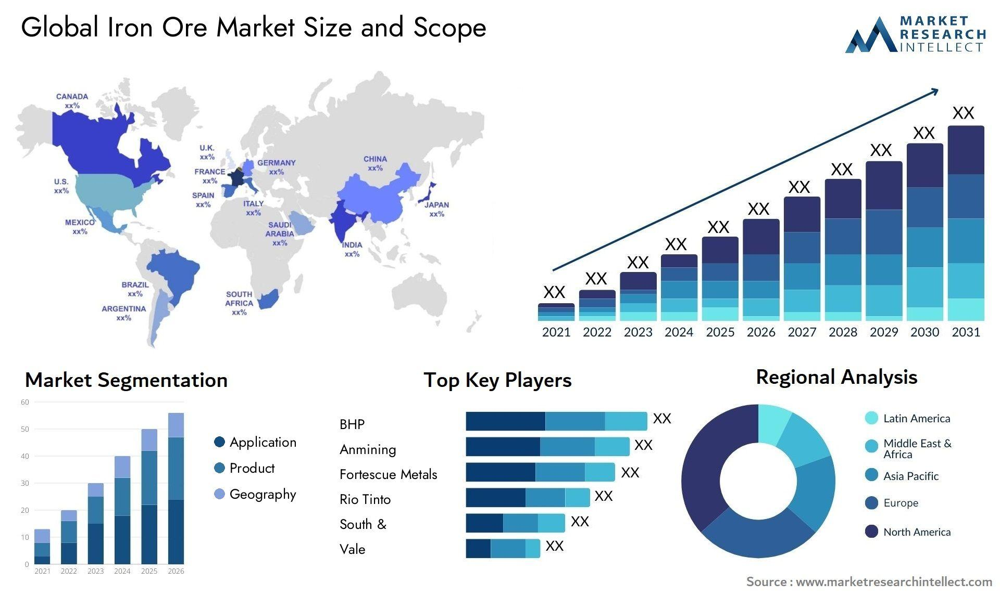

The global iron ore mining industry is integral to the production of steel, a cornerstone material in modern infrastructure and manufacturing. Steel's ubiquity in construction, transportation, and a myriad of industrial applications underscores the significance of iron ore as a fundamental economic resource. Iron ore's status as one of the most traded commodities highlights the importance of comprehending its market dynamics for stakeholders ranging from governments to corporations and individual investors.

Understanding these dynamics involves examining the market's structure, various determinants of price fluctuations, and how technological advancements like algorithmic trading are reshaping the landscape. Over the past decade, iron ore prices have shown considerable volatility, influenced by factors such as global economic activity, supply chain disruptions, and geopolitical uncertainties. This volatility introduces both challenges and opportunities for stakeholders seeking to optimize their positions in the market.



Critical to navigating these complexities is an awareness of the key players within the industry. Major corporations like BHP Billiton, Rio Tinto, and Vale wield significant influence over supply and demand due to their extensive mining operations and strategic roles in the market. These players' decisions regarding production levels, cost management, and technological investments can significantly impact market dynamics.

Moreover, technological innovations are transforming trading practices. The adoption of algorithmic trading, which employs advanced algorithms to analyze data and execute trades, is becoming increasingly prevalent. This adoption aims to enhance trading efficiency and price prediction accuracy, fundamentally altering how trades are conducted and market stability is maintained.

The subsequent sections of this article will provide a comprehensive overview of these elements, exploring price fluctuations, market trends, technological contributions to trading, and the competitive landscape formed by the industry's leading entities. Through this exploration, readers will gain insights into the current state and future prospects of the iron ore market, equipping them with the knowledge to make informed decisions in a rapidly evolving global economy.

## Table of Contents

## Overview of the Iron Ore Market

Iron ore is indispensable for steel production, serving as the primary raw material in a process integral to various sectors, including construction, automotive, and numerous industrial applications. The significance of iron ore can be appreciated by recognizing its pivotal role in producing steel, a key modern infrastructure and manufacturing component.

Australia and Brazil stand out as the predominant global producers and exporters of iron ore. These two countries, with their extensive reserves and advanced mining capabilities, significantly influence global supply. For instance, Australian companies like BHP Billiton and Rio Tinto, alongside Brazil's Vale, are pivotal in the market. Their efficient operations and strategic leverage allow them to maintain prominent positions on the global stage. Australian mines benefit from proximity to the rapidly growing markets in Asia, while Brazil's rich deposits position it as a crucial player in overall supply.

China, on the other hand, is the largest consumer of iron ore. Driven by its rapid industrialization and extensive infrastructure projects, China's demand for steel—and consequently iron ore—has been substantial over the past few decades. This demand is a result of the urbanization efforts and the continuous expansion of the country’s manufacturing sector. The country’s need for iron ore has led to strategic international investment in mining operations, further securing its supply chain.

The demand for iron ore is intrinsically linked to global economic activities, particularly in nations experiencing rapid industrialization like China and India. As these countries expand their industrial bases and urban infrastructure, the requirement for steel intensifies, thereby amplifying the demand for iron ore. This connection indicates that any shift in economic growth rates or industrial productivity in these nations directly impacts global iron ore consumption levels.

In summary, the iron ore market is fundamentally shaped by the symbiosis between production in Australia and Brazil, and consumption, notably in China. The dynamics of demand and supply are tightly interwoven with the economic activities and developmental trajectories of industrial giants, continuously influencing the global iron ore landscape.

## Price Fluctuations and Market Trends

Over the past decade, the iron ore market has been characterized by notable price [volatility](/wiki/volatility-trading-strategies), driven by a complex interplay of global demand fluctuations and supply chain disruptions. China, as the leading consumer of iron ore, significantly influences this dynamic. Construction and infrastructure development in China have been primary drivers of demand, creating substantial price movements in the market. For instance, peak construction periods can lead to surges in iron ore demand, pushing prices upward. Conversely, downturns in construction activities often result in excess supply, leading to price decreases.

External factors also contribute substantially to price volatility. Geopolitical tensions, such as trade disputes between major economies, can result in sudden shifts in market confidence. For example, tariffs and trade restrictions can disrupt the supply chain, affecting the availability and cost of iron ore. Moreover, natural disasters in key mining regions can impede production and export operations, causing immediate supply shortages and subsequent price hikes.

Macroeconomic shifts, such as changes in global economic growth rates, currency fluctuations, and varying levels of industrial production, further complicate the pricing landscape. Economic downturns generally reduce steel demand, thereby diminishing iron ore consumption and leading to price reductions. Conversely, periods of economic growth can lead to increased steel production, boosting iron ore demand and elevating prices.

The following Python code snippet demonstrates a basic model to simulate the impact of these variables on iron ore prices:

```python
import numpy as np

# Parameters affecting iron ore prices
construction_index = np.random.uniform(0.8, 1.2)  # Relative construction activity
geopolitical_factor = np.random.normal(1, 0.1)    # Geopolitical stability
macroeconomic_growth = np.random.normal(1, 0.2)   # Economic growth indicator

# Initial price of iron ore
base_price = 100  # Assumed base price in USD/tonne

# Simulating price fluctuation
def simulate_price(base_price, construction_index, geopolitical_factor, macroeconomic_growth):
    price_fluctuation = construction_index * geopolitical_factor * macroeconomic_growth
    new_price = base_price * price_fluctuation
    return new_price

# Calculated new price
new_price = simulate_price(base_price, construction_index, geopolitical_factor, macroeconomic_growth)
print(f"Simulated Iron Ore Price: ${new_price:.2f} USD/tonne")
```

This simulation accounts for variability in construction activity, geopolitical factors, and macroeconomic growth, offering a simplified view of how these elements can collectively impact iron ore pricing. Understanding these market trends is crucial for stakeholders aiming to anticipate and mitigate the effects of price volatility on their operations and strategies.

## Algorithmic Trading in the Iron Ore Market

Algorithmic trading, a technique once limited primarily to equity and currency markets, has become increasingly prevalent in the commodities sector, including the iron ore market. This practice utilizes advanced algorithms to automate the buying and selling of assets, allowing trades to be executed at optimal prices and speeds. The process is driven by sophisticated computer programs capable of analyzing large datasets in real-time, identifying patterns and trends that human traders may overlook.

The implementation of [algorithmic trading](/wiki/algorithmic-trading) in iron ore markets can significantly enhance strategic decision-making. By processing vast amounts of data such as historical price movements, news reports, and macroeconomic indicators, these algorithms can predict future price trajectories with greater accuracy. For instance, [machine learning](/wiki/machine-learning) models can be trained on past market data to forecast short-term price movements, helping traders to decide when to enter or [exit](/wiki/exit-strategy) positions.

Here is an example of a basic algorithm in Python that leverages historical price data to predict future price movements using a simple moving average strategy:

```python
import pandas as pd

# Load historical iron ore price data
data = pd.read_csv('iron_ore_prices.csv')
data['SMA_20'] = data['Close'].rolling(window=20).mean()
data['SMA_50'] = data['Close'].rolling(window=50).mean()

# Generate trading signals
data['Signal'] = 0
data['Signal'][20:] = np.where(data['SMA_20'][20:] > data['SMA_50'][20:], 1, 0)

# Determine positions by taking the difference of signals
data['Position'] = data['Signal'].diff()

# Supporting traders in decision-making based on moving average crossover strategy
print(data[['Close', 'SMA_20', 'SMA_50', 'Signal', 'Position']].tail())
```

This script uses the price data to calculate two moving averages (SMA_20 and SMA_50) and generates trading signals when the faster moving average crosses above or below the slower one. Such strategies, though rudimentary, form the basis for more complex algorithms that also incorporate other trading signals and data sources.

The incorporation of algorithmic trading not only refines trade execution but also plays a pivotal role in risk management. By rapidly absorbing new information from diverse sources, automated systems can adjust positions more swiftly in response to market fluctuations or unexpected news events, potentially stabilizing market behavior. This capability to quickly adapt to changing conditions helps mitigate risk exposure and can contribute to less volatile market dynamics.

In summary, as the iron ore market continues to evolve, the role of algorithmic trading is expanding, offering increased efficiency and reduced response times in trade execution. Its ability to analyze and act upon data at unprecedented speeds positions algorithmic trading as an essential tool in modern financial markets, optimizing both performance and risk management in iron ore trading practices.

## Impact of Technological Advances on Iron Ore Trading

Technological advancements are significantly impacting the iron ore trading landscape by fostering greater transparency, efficiency, and decision-making capabilities. The integration of [artificial intelligence](/wiki/ai-artificial-intelligence) (AI), machine learning, and blockchain technology is transforming traditional trading and mining operations, reshaping the industry's dynamics.

AI and machine learning are playing crucial roles in analyzing vast datasets, enabling traders to identify trends and make predictions about price movements more accurately. These technologies process immense amounts of information from various sources such as market reports, news articles, and trading volumes in real-time. This capability allows for enhanced strategic decision-making, reducing uncertainty and risk in trading activities. For instance, algorithms can evaluate historical data and identify patterns that may indicate future market movements, supporting traders in optimizing their operations.

Blockchain technology further enhances this digital transformation by offering secure and transparent transactions, minimizing fraud risks, and streamlining the trading process. The deployment of blockchain ensures that each transaction is recorded in a decentralized ledger, which is accessible to all parties involved. This transparency ensures that data integrity is maintained and provides verifiable records of trades, reducing the likelihood of discrepancies and disputes.

Digital trading platforms are also benefiting from these technological advancements. Such platforms facilitate improved access to market data, fostering a more efficient and informed decision-making process. Traders can leverage these platforms to obtain real-time market insights, which significantly enhances their trading strategies and aligns with market dynamics.

Moreover, iron ore companies are harnessing technology to optimize their mining operations. By investing in AI-driven processes and machine learning algorithms, companies can improve mining efficiency and reduce operational costs. Enhanced data analytics enable companies to better predict and manage supply chains, potentially altering the global supply dynamics over time. For example, machine learning algorithms can optimize logistics by predicting equipment maintenance needs and improving resource allocation, leading to cost-effective and efficient mining operations.

In conclusion, the adoption of cutting-edge technologies is revolutionizing the iron ore trading industry. The collaborative use of AI, machine learning, and blockchain not only paves the way for a more transparent and efficient trading environment but also supports the optimization of mining operations and cost reduction, substantially influencing the global iron ore supply chain. These advancements position companies and traders to navigate market complexities with improved agility and foresight.

## Key Players and Competitive Landscape

Major companies like BHP Billiton, Rio Tinto, and Vale are pivotal in the iron ore industry due to their substantial mining operations and competitive cost structures. These companies have established a stronghold in the market by leveraging economies of scale, which enable them to maintain profitability even amidst market fluctuations.

**1. Economies of Scale**

Economies of scale play a crucial role in these companies' ability to remain profitable. By producing large quantities of iron ore, they can reduce the average cost per unit, benefiting from operational efficiencies. These efficiencies include optimized use of machinery, streamlined logistics, and advanced technology, all of which contribute to reducing production costs. For instance, by spreading fixed costs over a larger output, these companies achieve lower average costs, thereby improving their competitive edge.

**2. Production Capacity**

Production capacity is a significant [factor](/wiki/factor-investing) shaping the competitive landscape. BHP Billiton, Rio Tinto, and Vale have developed extensive infrastructures that support large-scale mining operations. Their ability to produce substantial quantities of iron ore not only meets the high market demand but also positions them strategically to influence global supply dynamics. Increased production capacity allows these companies to respond effectively to demand shifts, securing their market position.

**3. Cost Management**

Effective cost management is another critical aspect of these companies' competitive strategies. By implementing advanced cost-control measures, they manage to keep expenses low relative to their output. This involves investing in cutting-edge technology for automating processes, optimizing workforce efficiency, and minimizing waste. Moreover, by negotiating favorable terms with suppliers and streamlining their supply chains, these companies further enhance their cost management strategies.

**4. Market Access**

Access to international markets is essential for these major players. BHP Billiton, Rio Tinto, and Vale have established comprehensive distribution networks, enabling them to efficiently export iron ore to key consumer markets worldwide. Their strategic locations, along with established maritime routes, enable them to effectively serve demand centers, notably in rapidly industrializing countries like China. This geographical advantage enhances their ability to capture and sustain market share.

In conclusion, the competitive landscape of the iron ore industry is shaped by the strategic attributes of industry leaders like BHP Billiton, Rio Tinto, and Vale. Their focus on economies of scale, production capacity, cost management, and market access cements their dominance and resilience in the face of market volatility, underscoring their influence on global supply and demand dynamics.

## The Future Outlook of Iron Ore Market Dynamics

The global demand for steel is projected to experience sustained growth due to ongoing urbanization and infrastructure development initiatives, particularly in emerging economies. This growth is poised to bolster a stable demand for iron ore, as steel remains a fundamental component in both residential and commercial construction. According to the World Steel Association, global steel demand is expected to expand by approximately 1-2% annually over the next decade, fueled by significant construction activities and industrial advancements ([source](https://worldsteel.org)).

Advancements in mining technology are anticipated to bring substantial improvements to iron ore production, optimizing both efficiency and environmental sustainability. Innovations such as autonomous mining equipment, advanced data analytics, and remote operation capabilities are being integrated into mining operations. These technologies not only enhance resource extraction efficiency but also reduce the environmental impact through lower emissions and minimized wastage. The introduction of renewable energy sources and electric machinery in mines further contributes to reducing the carbon footprint of iron ore mining, aligning with global sustainability goals ([source](https://www.iea.org)).

Algorithmic trading is expected to play an increasingly significant role in the iron ore market, leveraging artificial intelligence and machine learning to enhance trading efficiency and market stability. These algorithms are capable of analyzing vast datasets in real-time to predict price movements with greater accuracy, facilitating strategic decision-making for traders and investors. As algorithmic trading becomes more sophisticated, it is likely to contribute to more stable market operations by swiftly incorporating new information into market prices, thus mitigating extreme volatility.

In conclusion, the future outlook for iron ore market dynamics appears promising, with stable demand supported by global development trends and technological advancements enhancing production and trading efficiency. The industry is poised to adapt to these changes, ensuring continued competitiveness and alignment with sustainable practices for long-term viability.

## Conclusion

Understanding the iron ore market dynamics is vital for investors, producers, and consumers aiming to navigate its complexities efficiently. The iron ore market is characterized by its susceptibility to economic changes, which impacts its supply and demand equilibrium. Analyzing factors such as global economic activity, the roles of major producers like Australia and Brazil, and the demand from industrializing nations provides insight into market trends. 

Technological advancements, notably algorithmic trading, are revolutionizing the traditional trading landscape. These advancements allow for more precise analysis of market data, leading to informed trading decisions and potentially more stable market conditions. Algorithms can rapidly process vast amounts of data to predict price fluctuations, enabling stakeholders to execute trades with greater efficiency. This transformation presents new opportunities by enhancing market transparency and reducing transaction times. However, it also introduces challenges, such as the need for robust cybersecurity measures and the potential for market dependency on automated systems. 

To remain competitive and sustainable, the iron ore industry must adapt to these technological changes, integrating them into operational strategies. This involves investing in digital infrastructure and ensuring that workforce skills align with these advancements. Addressing environmental concerns through sustainable practices is also critical, as the industry moves towards minimizing its ecological footprint. By embracing these technological and environmental transformations, the iron ore market can position itself for future growth and stability, benefiting all stakeholders involved.

## References & Further Reading

[1]: Hojgaard, B., & Vigna, E. (2007). ["Value-at-Risk in Trading Systems and Dynamic Hedging: An Option-Pricing Approach."](https://www.wallstreetmojo.com/dynamic-hedging/) Mathematical Finance, 17(1).

[2]: Sommer, P. (2020). ["Advances in Industrial Automation and Machine Learning in Iron Ore Trading."](https://www.sciencedirect.com/science/article/pii/S2095809920302502) Springer.

[3]: ["Algorithmic Trading & DMA: An Introduction to Direct Access Trading Strategies"](https://www.amazon.com/Algorithmic-Trading-DMA-introduction-strategies/dp/0956399207) by Barry Johnson.

[4]: Hull, J. (2015). ["Options, Futures, and Other Derivatives."](https://books.google.com/books/about/Options_Futures_and_Other_Derivatives_Gl.html?id=sdg2EAAAQBAJ) Pearson Education. 

[5]: ["Mining Technology: Global Developments and Innovations for Sustainable Future"](https://www.sciencedirect.com/science/article/pii/S0959652619306481) by Prashant R.K. (2019).

[6]: ["World Steel Association reports on ongoing demand trends"](https://worldsteel.org/media/press-releases/2024/worldsteel-short-range-outlook-october-2024/).

[7]: International Energy Agency (IEA). ["Iron Ore: Market Developments and Policy Responses."](https://www.iea.org/reports/global-critical-minerals-outlook-2024)