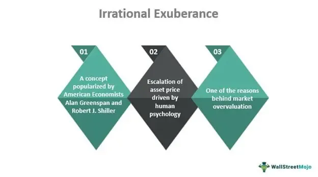

The concepts of irrational exuberance and economic bubbles are fundamental to understanding the dynamics of financial markets, acting as catalysts for significant market fluctuations. Irrational exuberance, a term popularized by the former Federal Reserve Chairman Alan Greenspan, describes the unsustainable enthusiasm of investors that drives asset prices beyond their intrinsic values. This often leads to economic bubbles, where the rapid escalation of market value is driven by speculative activity, eventually leading to a sharp contraction. Both phenomena play significant roles in shaping the financial landscape, influencing investment strategies, and posing challenges to market stability.

Algorithmic trading, which involves the use of automated systems to execute trades based on pre-set conditions, interacts intricately with these phenomena. Algorithms can both mitigate and exacerbate the effects of irrational exuberance by capitalizing on transient opportunities and executing trades at speeds beyond human capability. While they have the potential to stabilize markets through enhanced efficiency and liquidity provision, they can also amplify volatility through programmed responses to spurious market signals.



Understanding irrational exuberance and economic bubbles is crucial in today's deeply interconnected financial markets, where emotional decision-making can have outsized effects due to rapid information dissemination. This comprehension is foundational for the emerging fields of behavioral finance and quantitative trading. Behavioral finance studies the effects of psychological influences on investors and market trends, suggesting that human behavior often deviates from traditional economic theories that assume rational actors. Quantitative trading, leveraging disciplines such as statistics and machine learning, seeks to identify patterns and trends that can inform trading strategies.

The integration of behavioral insights into trading strategies aims to bridge the gap between traditional economic theories and the realities of market psychology. Recognizing cognitive biases and emotional influences on market behavior enables the design of more robust trading systems that are better equipped to handle real-world conditions. By combining algorithmic precision with behavioral understanding, market participants can develop strategies that anticipate irrational market movements, potentially enhancing returns and managing risks more effectively.

This introduction sets the stage for exploring these concepts in greater detail, looking at the interplay between human psychology and algorithmic systems, and framing the broader discussion around the future of finance in an era dominated by data and computation. The goal is not merely to understand past market phenomena but to equip investors and practitioners with the tools necessary to thrive in constantly evolving financial markets.

## Table of Contents

## Understanding Irrational Exuberance

Irrational exuberance is a term used to describe the phenomenon where investor enthusiasm drives asset prices significantly above their intrinsic values. Coined by economist Alan Greenspan in a 1996 speech, the term gained prominence when Greespan, then the Chairman of the Federal Reserve, used it to caution against the overvaluation of stock markets. His concern was that excessive exuberance among investors could lead to unsustainable market conditions, culminating in severe financial corrections.

Historical instances of irrational exuberance often result in economic bubbles, where the price of assets such as stocks, real estate, or commodities escalates based on speculative behavior rather than fundamental valuation. A classic example is the Dot-com Bubble of the late 1990s. As internet-based companies surged in popularity, expectations of rapid profits drove up stock prices to unprecedented levels, despite many companies having no viable business models or earnings. When the bubble burst in 2000, it led to significant market corrections and financial losses for investors, highlighting the dangers posed by hyper-optimistic speculation.

Another notable case is the Housing Market Crisis leading up to the 2008 financial meltdown. In this scenario, irrational exuberance was fueled by high demand for real estate, lax lending standards, and complex financial products that obscured risk levels. As property values soared, many investors and institutions failed to assess the true risks involved, leading to a catastrophic collapse when the housing bubble burst, causing widespread economic repercussions.

Psychological factors play a crucial role in the formation of economic bubbles. Behavioral biases, such as herd behavior and overconfidence, often exacerbate irrational exuberance. Herd behavior occurs when investors collectively follow market trends, sometimes ignoring detailed analysis or risk assessments. Overconfidence leads investors to overestimate their understanding and ability to predict market movements, resulting in risky investments that inflate asset prices beyond sustainable levels.

By understanding irrational exuberance and its influence on financial markets, investors and regulators can better identify and mitigate the risks associated with economic bubbles. Notably, recognizing the psychological underpinnings that drive investor behavior offers a pathway to developing more stable and rational market environments.

## Economic Bubbles and Their Consequences

An economic bubble is a market phenomenon characterized by the rapid escalation of asset prices to levels significantly inflated beyond their intrinsic value. Bubbles typically form when exuberant market behavior drives asset prices higher, with participants fueled by a collective belief in the continued appreciation of these prices. A critical element in bubble formation is the detachment of prices from the underlying value, often driven by speculative fervor, excessive leverage, and herd behavior.

Historically, economic bubbles have been a recurring feature of financial markets. One notable example is the Dot-com Bubble of the late 1990s, where speculative investments in Internet-based companies led to soaring stock prices, only to result in a dramatic collapse in the early 2000s. Similarly, the Housing Market Bubble in the mid-2000s was fueled by easy credit, low interest rates, and speculative investing in real estate, culminating in the Financial Crisis of 2007-2008.

The aftermath of a bubble's burst often has profound consequences on both the broader economy and individuals. The collapse typically results in significant financial losses, a contraction in credit availability, and a slowdown in economic activity. For individuals, a bursting bubble can lead to loss of wealth, unemployment, and reduced consumer confidence. In the 2008 financial crisis, many individuals lost their homes due to mortgage defaults, leading to a long and painful economic recovery process.

From these historical episodes, several lessons can be discerned. Bubbles highlight the dangers of excessive speculation and leverage, the critical importance of robust risk management practices, and the necessity of maintaining regulatory oversight. During the Dot-com Bubble, lack of sustainable business models contributed to the downfall, while the excessive risk-taking in the housing market underscored the need for prudent financial practices.

Central banks and governments play vital roles in responding to bubble formations. Their interventions can range from regulatory measures aimed at curbing speculative activities to monetary policies designed to cool overheated markets. For instance, central banks may raise interest rates or use macroprudential measures to tighten credit conditions, attempting to prevent or mitigate the impact of bubbles. Post-bubble, government responses might include economic stimulus packages, bailouts, or reforms intended to stabilize financial markets and bolster economic recovery.

Analyzing economic bubbles and their consequences provides essential insights into market dynamics, emphasizing the need for vigilance, informed policy-making, and comprehensive market regulations to safeguard economic stability.

## Behavioral Biases in Trading Decisions

Behavioral biases significantly affect trading decisions, often leading to irrational outcomes that can destabilize financial markets. Two prevalent biases are overconfidence and herding.

Overconfidence bias is characterized by traders overestimating their knowledge, predictive skills, or control over events. This often results in excessive trading, disregard for risk, and an overestimation of the precision of their information. Overconfident traders may believe they have superior insights, leading to a higher turnover of stocks, which can inflate prices and create [volatility](/wiki/volatility-trading-strategies). Studies have shown that overconfidence can lead to suboptimal trading performance. For instance, Barber and Odean's research found that individual investors' excessive trading, fueled by overconfidence, often erodes returns.

Herding behavior involves aligning investment decisions with the majority without reliance on their analysis. This occurs due to conformity, fear of missing out, or the assumption that the group may possess superior information. Herding can drive asset prices away from their intrinsic value, contributing to market bubbles. When large groups of traders buy the same asset solely because others are doing so, the asset's price can soar without any fundamental justification, eventually leading to a sharp correction.

These biases collectively impact market efficiency and stability. Markets theoretically thrive on the efficient aggregation of diverse independent opinions, acting as a mechanism for price discovery. However, when biases like overconfidence and herding predominate, they distort this process, leading to price anomalies and increased volatility. The Efficient Market Hypothesis, which assumes that all available information is already reflected in stock prices, falters in scenarios heavily influenced by behavioral biases. 

Recognizing and managing these biases requires both introspection and systematic approaches. Traders and investors should maintain rigorous records of their trades, decisions, and the rationale behind them to identify patterns indicative of behavioral biases. Quantitative models can aid in recognizing anomalies in decision-making processes; for example, implementing risk-adjusted performance metrics to evaluate trades can unveil overconfidence. Additionally, algorithm-based alerts can be set up to flag deviations from proven strategies.

Education and awareness are crucial in mitigating these biases. Market participants should be instructed on common psychological pitfalls, encouraging a mindset that questions perceived certainties and embraces diverse perspectives. Workshops, courses, and simulations can help traders understand and manage emotions associated with financial decision-making. Techniques such as cognitive-behavioral strategies and the use of decision-support systems can further assist in recognizing and addressing biases. 

Efforts to understand and mitigate behavioral biases in trading are essential for maintaining market integrity, promoting stability, and enhancing the efficiency of financial markets. Through education, technological tools, and awareness, traders can better align their decisions with objective analysis rather than behavioral impulses.

## Algorithmic Trading and Behavioral Finance

Algorithmic trading refers to the use of computer programs and systems to execute trades in financial markets based on predefined criteria. These algorithms can process vast amounts of data at speeds unattainable by human traders, making them integral to modern financial markets. According to various studies, [algorithmic trading](/wiki/algorithmic-trading) now accounts for a significant portion of trading [volume](/wiki/volume-trading-strategy) in major stock exchanges worldwide, due to its efficiency and the ability to minimize human error.

Algorithms in financial markets have the dual capability to mitigate and amplify irrational exuberance. They can mitigate such exuberance by implementing strict rules that prevent emotional decision-making, thus reducing the likelihood of buying into overhyped assets. For instance, algorithms can be programmed to automatically rebalance portfolios when certain asset prices exceed their historical volatility thresholds, thereby safeguarding against overvaluation.

However, algorithms can also amplify irrational exuberance. High-frequency trading ([HFT](/wiki/high-frequency-trading-strategies)), a subset of algorithmic trading, can exacerbate price swings and increase market volatility, particularly when multiple algorithms react to the same market signals simultaneously. This can lead to flash crashes, where asset prices plummet within minutes, only to recover shortly after. An infamous example occurred on May 6, 2010, when the U.S. stock market experienced a flash crash that wiped off nearly $1 trillion in market value within minutes.

Integrating behavioral finance insights into algorithmic systems has been an emerging area of interest. Behavioral finance studies have identified patterns in human decision-making that deviate from rationality, such as overconfidence and loss aversion. Algorithms can incorporate these insights to predict potential market movements caused by psychological factors. For instance, [machine learning](/wiki/machine-learning) models can analyze historical price data alongside investor sentiment gathered from social media platforms to forecast short-term price movements driven by collective trader behavior.

The potential of machine learning in predicting and exploiting market irrationalities is vast. Techniques such as natural language processing (NLP) can gauge public sentiment by analyzing news articles and social media posts. Such information can be used to anticipate shifts in market dynamics before they are reflected in price movements. For example, a machine learning system may flag a spike in positive sentiment towards a tech company before an earnings report, suggesting potential buying opportunities.

The use of [artificial intelligence](/wiki/ai-artificial-intelligence) (AI) in trading also comes with ethical implications and challenges. The opacity of AI algorithms, often referred to as the "black box problem," can make it difficult to understand how decisions are made, raising concerns about accountability. Unintended biases in AI models can lead to market manipulation, either inadvertently or maliciously. Regulators face challenges in defining and enforcing rules that ensure these systems operate fairly and transparently. Moreover, the rapid evolution of these technologies can outpace current regulatory frameworks, necessitating continuous adaptation and oversight.

In summary, while algorithmic trading provides efficiencies and new capabilities in managing irrational market behaviors, it also introduces complexities that necessitate careful consideration of ethical and regulatory challenges. These developments underscore the importance of advancing our understanding of the interplay between technology and human psychology in financial markets.

## Strategies to Counteract Irrational Exuberance

Recognizing and avoiding economic bubbles is crucial for investors seeking to protect their portfolios from the adverse effects of sudden market corrections. One effective strategy is conducting thorough [fundamental analysis](/wiki/fundamental-analysis) to evaluate the intrinsic value of assets. This involves assessing financial statements, market trends, and economic indicators to ensure that asset prices align with their true economic worth. Moreover, investors should remain vigilant for warning signs of bubbles, such as excessive market speculation, rapid price increases without corresponding fundamental improvements, and high levels of margin debt.

To manage emotional decision-making, investors can adopt various approaches. One important method is to establish a disciplined investment strategy that includes predefined entry and [exit](/wiki/exit-strategy) points, helping to mitigate the influence of emotions. Additionally, employing techniques like diversification can reduce exposure to any single asset or market, thus lowering the overall risk. Mindfulness and cognitive behavioral techniques may also assist investors in maintaining a rational perspective and avoiding impulsive decisions driven by fear or greed.

Algorithmic strategies offer a sophisticated means of leveraging irrational behaviors in the market. By utilizing advanced data analytics and machine learning models, algorithms can identify patterns and trends that suggest overvaluation or undervaluation due to irrational exuberance. These models might incorporate sentiment analysis from social media, trading volumes, and volatility metrics to predict and respond to market anomalies.

Best practices for risk management in volatile times focus on maintaining [liquidity](/wiki/liquidity-risk-premium) and flexibility. Investors should ensure that their positions are not overly leveraged, as high levels of debt can exacerbate losses during market downturns. Additionally, implementing stop-loss orders and regularly reviewing asset allocations can provide added security against unforeseen market movements. Stress testing portfolios against various economic scenarios can also prepare investors for potential downturns.

Regulatory and institutional roles are vital in maintaining market stability and preventing the formation of bubbles. Regulators can enhance transparency by requiring more comprehensive disclosure of financial information, thereby enabling more informed investment decisions. Moreover, maintaining effective oversight on leverage levels and speculative activities within financial institutions can mitigate systemic risks. Central banks and government bodies might also intervene by adjusting monetary policies or implementing macroprudential measures aimed at cooling overheated markets, supporting a stable economic environment.

## Future Perspectives: Balancing AI and Human Psychology

The convergence of artificial intelligence (AI) and behavioral finance is set to redefine financial markets by enhancing market predictions and understanding investor psychology. AI algorithms, equipped with machine learning capabilities, can process vast amounts of data to identify patterns and trends, thus offering significant potential to incorporate insights from human behavior. Unlike traditional models, which primarily focus on quantitative data, AI can integrate qualitative aspects, such as sentiment analysis derived from news articles, social media, and other non-financial datasets, to predict market movements.

AI's integration with behavioral finance holds the promise of more accurate market forecasts. Machine learning algorithms excel at recognizing subtle patterns and anomalies within complex datasets. For example, natural language processing (NLP) can quantify sentiment from unstructured text, providing a proxy for investor mood and helping to anticipate market reactions. In Python, libraries like `TextBlob` and `VADER` offer functionalities to perform sentiment analysis, aiding in capturing behavioral nuances:

```python
from vaderSentiment.vaderSentiment import SentimentIntensityAnalyzer

def analyze_sentiment(text):
    analyzer = SentimentIntensityAnalyzer()
    return analyzer.polarity_scores(text)

# Example usage
news_article = "The market is showing signs of volatility amidst global tensions."
sentiment = analyze_sentiment(news_article)
print(sentiment)
```

As AI systems gain dominance in trading, the role of humans is evolving. Humans are progressively transitioning from direct decision-making roles to oversight and strategy development, ensuring AI aligns with broader market objectives. Human intuition and ethical considerations remain crucial, especially in situations where AI may misunderstand contextual subtleties.

Balancing quantitative models and qualitative insights presents both opportunities and challenges. While quantitative models provide precision and scalability, qualitative insights contribute a nuanced understanding of market dynamics influenced by human behavior. This balance is essential for developing AI systems that are both efficient and adaptable to complex market conditions.

The future economic landscape is likely to witness a more symbiotic relationship between AI and human psychology. As AI continues to refine its ability to interpret behavioral cues, markets may experience greater efficiency and stability. However, this evolution also demands new regulatory frameworks to address ethical concerns related to data privacy, algorithmic bias, and market manipulation. Continuous adaptation and research are imperative to harness AI's full potential while safeguarding against unintended repercussions.

In summary, the integration of AI with behavioral finance offers promising avenues for enhancing market predictions and decision-making processes. By leveraging AI's computational prowess and incorporating human psychological insights, financial markets can achieve a more comprehensive and robust understanding of investor behavior, paving the way for a transformative economic future.

## Conclusion

The interactions between irrational exuberance, economic bubbles, and algorithmic trading present significant dynamics in financial markets. Irrational exuberance, a term popularized by Alan Greenspan, reflects excessive investor enthusiasm that inflates asset prices beyond their fundamental values, leading to economic bubbles. These bubbles, when burst, can have severe repercussions on global economies, affecting both individual investors and broader economic structures.

Behavioral finance plays a crucial role in understanding these phenomena. Common behavioral biases, such as overconfidence and herd mentality, can drive irrational decision-making, undermining market efficiency and stability. Integrating behavioral finance insights into trading strategies provides a framework for navigating the complexities of market behaviors, enabling more informed and strategic decision-making.

Algorithmic trading, leveraging advanced computational methods, can address some of these challenges by offering tools to predict and capitalize on market irrationalities. Machine learning, in particular, holds promise for identifying patterns and signals that may not be apparent through traditional analysis. However, these technologies also pose ethical and practical challenges, such as the potential for amplifying irrational market behaviors if not properly regulated and managed.

Looking forward, there are significant opportunities to enhance market predictions by blending AI capabilities with an understanding of human psychology. This approach could lead to more resilient and adaptive trading systems. Nonetheless, it is imperative for both market participants and regulators to recognize the evolving landscape and ensure that their practices and policies are prepared to address the complexity and rapid changes in financial markets. Ongoing research and adaptation will be vital to harness the benefits while mitigating the risks associated with irrational exuberance and its consequences in the market. Building awareness and preparedness remain essential to sustaining stability and fostering growth in financial ecosystems.

## References & Further Reading

[1]: Shiller, R. J. (2005). ["Irrational Exuberance."](https://www.jstor.org/stable/j.ctt7st4s) Princeton University Press.

[2]: Malkiel, B. G. (2003). ["The Efficient Market Hypothesis and Its Critics."](https://pubs.aeaweb.org/doi/10.1257/089533003321164958) Journal of Economic Perspectives, 17(1), 59-82.

[3]: Lo, A. W. (2004). ["The Adaptive Markets Hypothesis: Market Efficiency from an Evolutionary Perspective."](https://www.researchgate.net/publication/228183756_The_Adaptive_Markets_Hypothesis_Market_Efficiency_from_an_Evolutionary_Perspective) The Journal of Portfolio Management.

[4]: Barber, B. M., & Odean, T. (2001). ["Boys Will Be Boys: Gender, Overconfidence, and Common Stock Investment."](https://academic.oup.com/qje/article/116/1/261/1939000) Quarterly Journal of Economics, 116(1), 261–292.

[5]: Hirshleifer, D. (2001). ["Investor Psychology and Asset Pricing."](https://onlinelibrary.wiley.com/doi/abs/10.1111/0022-1082.00379) The Journal of Financial Economics, 56(2), 153-200.

[6]: Sornette, D. (2003). ["Why Stock Markets Crash: Critical Events in Complex Financial Systems."](https://archive.org/details/whystockmarketsc00sorn) Princeton University Press.

[7]: Chan, E. (2009). ["Quantitative Trading: How to Build Your Own Algorithmic Trading Business."](https://github.com/ftvision/quant_trading_echan_book) John Wiley & Sons.