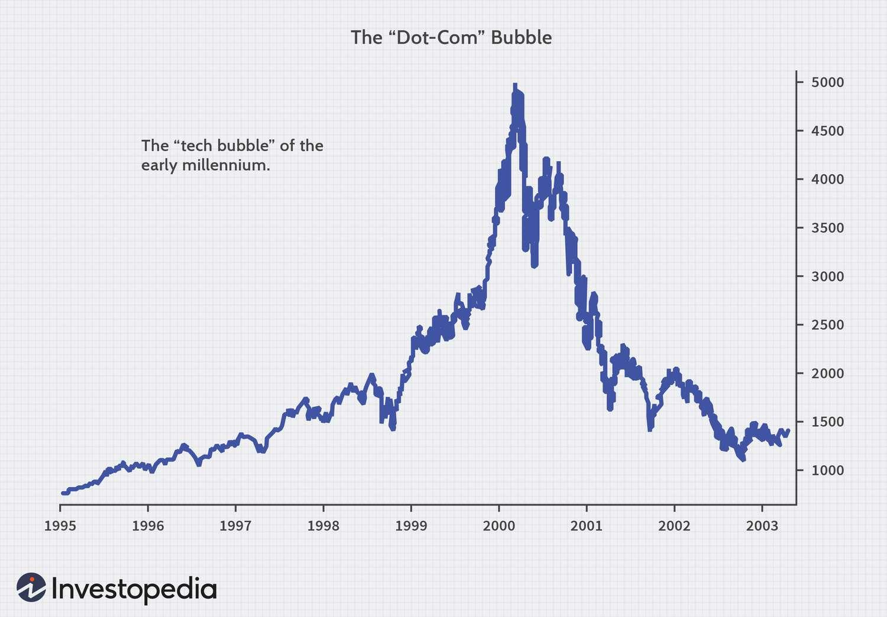

## Table of Contents

## What is the term 'Irrational Exuberance'?

'Irrational Exuberance' is a term used to describe when people get overly excited and optimistic about something, especially in the stock market. It was first used by Alan Greenspan, who was the head of the Federal Reserve, in a speech back in 1996. He was worried that people were getting too excited about the stock market and that this could lead to problems.

When people are irrationally exuberant, they might invest a lot of money in stocks without thinking carefully about the risks. This can cause stock prices to go up a lot, but it can also lead to a big drop if everyone suddenly realizes they were too optimistic. This term is often used to warn about bubbles in the market, where prices are much higher than they should be because of too much excitement.

## Who coined the phrase 'Irrational Exuberance'?

The phrase 'Irrational Exuberance' was first used by Alan Greenspan. He was the head of the Federal Reserve, which is like the boss of the money system in the United States. Greenspan used this term in a speech he gave in 1996. He was talking about how people were getting too excited about the stock market and not thinking about the risks.

Greenspan was worried that this excitement could cause problems. When people are irrationally exuberant, they might put a lot of money into stocks without thinking carefully. This can make stock prices go up a lot, but it can also lead to a big drop if everyone suddenly realizes they were too optimistic. So, the phrase 'Irrational Exuberance' is a warning about getting too excited and not thinking about the risks.

## When was the term 'Irrational Exuberance' first used?

The term 'Irrational Exuberance' was first used by Alan Greenspan in a speech he gave on December 5, 1996. Alan Greenspan was the head of the Federal Reserve, which is like the boss of the money system in the United States. In his speech, he talked about how people were getting too excited about the stock market and not thinking about the risks.

Greenspan used the term to warn that this excitement could cause problems. When people are irrationally exuberant, they might put a lot of money into stocks without thinking carefully. This can make stock prices go up a lot, but it can also lead to a big drop if everyone suddenly realizes they were too optimistic. So, the phrase 'Irrational Exuberance' is a warning about getting too excited and not thinking about the risks.

## What does 'Irrational Exuberance' signify in the context of economics?

'Irrational Exuberance' in economics means that people are getting too excited and optimistic about something, usually the stock market. It was first used by Alan Greenspan, who was in charge of the Federal Reserve, in a speech in 1996. He was worried that people were not thinking carefully about the risks and were just putting a lot of money into stocks because everyone else was doing it. This can make stock prices go up a lot, but it's not based on the real value of the companies.

When people are irrationally exuberant, it can lead to what's called a 'bubble' in the market. A bubble is when prices are much higher than they should be because of too much excitement. If everyone suddenly realizes they were too optimistic, the bubble can burst, and prices can drop a lot. This can cause big problems in the economy. So, 'Irrational Exuberance' is a warning sign that people should be careful and think about the risks before getting too excited.

## Can you provide a simple example of 'Irrational Exuberance' in the stock market?

Imagine there's a new company called "TechBoom" that makes a cool new gadget. Everyone starts talking about how amazing TechBoom is and how their gadget will change the world. People start buying TechBoom's stock because they think it's going to keep going up and up. They're not really looking at whether the company is making money or if the gadget is actually that great. They're just excited because everyone else is excited. This is an example of 'Irrational Exuberance.'

Then, one day, people start to realize that TechBoom's gadget isn't as amazing as they thought. Maybe it's not selling as well as expected, or maybe there are problems with it. Suddenly, everyone who bought the stock because they were excited starts to sell it. The price of TechBoom's stock drops a lot because there's no real reason for it to be so high. This shows how 'Irrational Exuberance' can lead to a big drop in stock prices when the excitement goes away.

## How does 'Irrational Exuberance' lead to economic bubbles?

'Irrational Exuberance' leads to economic bubbles because it makes people too excited and optimistic about something, like stocks or real estate. When everyone starts buying into this excitement, the prices of these things go up a lot. People aren't buying because the thing is actually worth that much; they're buying because everyone else is, and they think the price will keep going up. This creates a bubble where the price is much higher than it should be, based on the real value of the thing.

Eventually, the bubble can burst. This happens when people start to realize that the thing they were excited about isn't as great as they thought. Maybe the company isn't making as much money as expected, or the real estate market starts to slow down. When this happens, everyone who bought in because of the excitement starts to sell. The price drops a lot because there's no real reason for it to be so high. This can cause big problems in the economy, like a crash or a recession, because so many people were caught up in the 'Irrational Exuberance.'

## What are some historical examples of 'Irrational Exuberance' leading to market crashes?

One famous example of 'Irrational Exuberance' leading to a market crash is the Dot-com Bubble in the late 1990s and early 2000s. People got really excited about internet companies, thinking they would make a lot of money. They started buying stocks in these companies even if they weren't making any profit yet. The stock prices went up and up because of this excitement. But then, in 2000, people started to realize that many of these companies weren't going to be as successful as they thought. The bubble burst, and the stock market crashed, causing a lot of people to lose money.

Another example is the Housing Bubble that led to the 2008 Financial Crisis. In the early 2000s, people got very excited about buying houses. They thought house prices would keep going up forever. Banks were giving out loans to people who couldn't really afford them, and everyone was buying houses because they thought they could sell them for more money later. But in 2006, house prices started to fall. People couldn't pay their loans, and banks started to fail. This led to a big crash in the housing market and a global financial crisis.

## How can investors identify 'Irrational Exuberance' in current market conditions?

Investors can identify 'Irrational Exuberance' by looking at how excited people are about the market and whether that excitement is based on real facts. If everyone is talking about a certain stock or market and the prices are going up a lot, but there's no good reason for it, that might be a sign of 'Irrational Exuberance.' For example, if a company's stock price is going up because of a new product, but the product isn't selling well or the company isn't making money, that's a red flag. Investors should also watch out for stories in the news or on social media that make it seem like everyone is getting rich quickly from investing in something.

Another way to spot 'Irrational Exuberance' is by looking at how much people are willing to pay for stocks compared to how much money the companies are actually making. If stock prices are much higher than the company's earnings, that could mean people are buying because they're excited, not because the company is doing well. Investors can use tools like the price-to-earnings ratio to see if stocks are overpriced. If the ratio is very high, it might mean that people are being irrationally exuberant. By staying calm and looking at the facts, investors can avoid getting caught up in the excitement and making risky decisions.

## What are the psychological factors that contribute to 'Irrational Exuberance'?

One big psychological [factor](/wiki/factor-investing) that contributes to 'Irrational Exuberance' is something called the 'herd mentality.' This means that people tend to do what everyone else is doing, even if it doesn't make sense. When they see others getting excited about a stock or a market, they want to join in because they don't want to miss out. This can make the excitement grow and grow, even if there's no good reason for it. People start buying things just because everyone else is, not because they've thought carefully about the risks.

Another factor is 'overconfidence.' When people see the market going up, they start to think they're really good at [picking](/wiki/asset-class-picking) stocks or making money. They might think they can't lose, so they take bigger and bigger risks. This overconfidence can make them ignore warning signs and keep buying even when prices are too high. It's like they think the good times will never end, so they keep getting more and more excited. Both herd mentality and overconfidence can lead to 'Irrational Exuberance' and cause big problems when the excitement finally goes away.

## How do central banks and regulators respond to signs of 'Irrational Exuberance'?

When central banks and regulators see signs of 'Irrational Exuberance,' they often try to calm things down. They might raise interest rates to make it more expensive to borrow money. This can slow down the excitement because people might not want to take out loans to buy stocks or houses if it's too expensive. Central banks might also use other tools like changing the amount of money banks have to keep in reserve. By making these changes, they hope to stop the bubble from growing too big and causing problems later.

Regulators also keep a close eye on the market and might step in with new rules if they think things are getting out of hand. For example, they might make it harder for people to get loans for buying houses or stocks if they see too much excitement. They might also warn people about the risks of investing too much in something that's getting too popular. By doing these things, regulators try to protect people from losing a lot of money when the bubble finally bursts.

## What are the long-term impacts of 'Irrational Exuberance' on the economy?

When 'Irrational Exuberance' leads to a market bubble and then a crash, it can hurt the economy a lot in the long run. People who lose money in the crash might stop spending as much. This can slow down the whole economy because businesses make less money when people aren't buying things. Companies might have to lay off workers, and unemployment can go up. It can take a long time for the economy to get better after a big crash caused by 'Irrational Exuberance.'

Also, when a bubble bursts, it can make people scared to invest again. They might remember how much they lost and decide to keep their money safe instead of putting it back into the market. This can make it hard for businesses to get the money they need to grow. It can also make the economy grow more slowly because there's less money moving around. So, the long-term impacts of 'Irrational Exuberance' can be really big and can affect the economy for years after the bubble bursts.

## How can understanding 'Irrational Exuberance' help in developing better investment strategies?

Understanding 'Irrational Exuberance' can help investors make smarter choices by teaching them to look past the excitement and focus on the real value of what they're buying. When everyone is talking about a stock or a market and prices are going up a lot, it's easy to get caught up in the excitement. But if investors know about 'Irrational Exuberance,' they can stop and ask if the price is really based on how well the company is doing. They can look at things like how much money the company is making and whether the price of the stock makes sense. By doing this, they can avoid buying things just because everyone else is and instead make decisions based on facts.

This knowledge can also help investors be more patient and not rush into buying something just because it's popular. They can wait to see if the excitement is real or if it's just 'Irrational Exuberance.' If they see that prices are much higher than they should be, they might decide to wait until the bubble bursts and prices go down. This way, they can buy things at a better price and avoid losing money when the market crashes. By understanding 'Irrational Exuberance,' investors can develop strategies that help them make money over the long term, instead of trying to get rich quickly and risking big losses.

## References & Further Reading

[1]: Shiller, R. J. (2005). ["Irrational Exuberance."](https://www.jstor.org/stable/j.ctt7st4s) Princeton University Press.

[2]: Malkiel, B. G. (2003). ["The Efficient Market Hypothesis and Its Critics."](https://pubs.aeaweb.org/doi/10.1257/089533003321164958) Journal of Economic Perspectives, 17(1), 59-82.

[3]: Lo, A. W. (2004). ["The Adaptive Markets Hypothesis: Market Efficiency from an Evolutionary Perspective."](https://www.researchgate.net/publication/228183756_The_Adaptive_Markets_Hypothesis_Market_Efficiency_from_an_Evolutionary_Perspective) The Journal of Portfolio Management.

[4]: Barber, B. M., & Odean, T. (2001). ["Boys Will Be Boys: Gender, Overconfidence, and Common Stock Investment."](https://academic.oup.com/qje/article/116/1/261/1939000) Quarterly Journal of Economics, 116(1), 261–292.

[5]: Hirshleifer, D. (2001). ["Investor Psychology and Asset Pricing."](https://onlinelibrary.wiley.com/doi/abs/10.1111/0022-1082.00379) The Journal of Financial Economics, 56(2), 153-200.

[6]: Sornette, D. (2003). ["Why Stock Markets Crash: Critical Events in Complex Financial Systems."](https://archive.org/details/whystockmarketsc00sorn) Princeton University Press.

[7]: Chan, E. (2009). ["Quantitative Trading: How to Build Your Own Algorithmic Trading Business."](https://github.com/ftvision/quant_trading_echan_book) John Wiley & Sons.