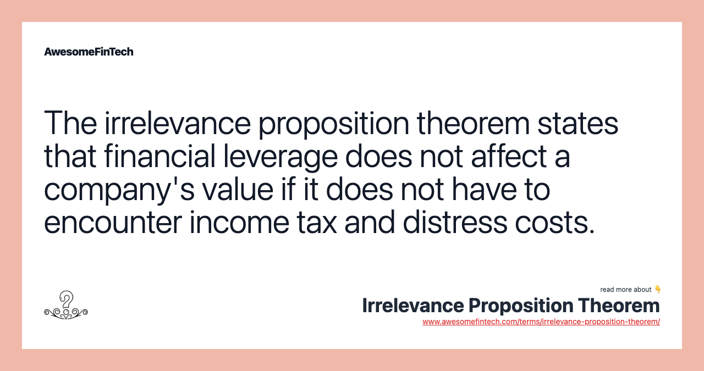

## Table of Contents

## What is the Irrelevance Proposition Theorem?

The Irrelevance Proposition Theorem is an idea from finance that says how a company pays for things doesn't change its value. It was first talked about by two economists, Franco Modigliani and Merton Miller, in the 1950s. They said that whether a company uses its own money or borrows money from others, it doesn't matter. The value of the company stays the same. This idea is called the "MM theorem" after the two economists.

However, this theorem works only if some special conditions are met. These conditions include things like no taxes, no costs for going bankrupt, and everyone knowing everything about the company. In the real world, these conditions are hard to meet. So, in real life, how a company pays for things can actually change its value. For example, if a company borrows money, it might have to pay more in taxes or face higher risks of going bankrupt. These real-world factors make the theorem less useful but it's still an important idea in understanding finance.

## Who developed the Irrelevance Proposition Theorem?

The Irrelevance Proposition Theorem was developed by two economists named Franco Modigliani and Merton Miller in the 1950s. They came up with this idea to explain that the way a company chooses to finance its operations, whether by using its own money or borrowing from others, does not affect its overall value. This theory is often called the "MM theorem" after Modigliani and Miller.

The theorem suggests that under certain ideal conditions, the value of a company remains the same no matter how it is financed. These conditions include no taxes, no costs associated with bankruptcy, and everyone having perfect information about the company. However, in the real world, these conditions are rarely met. Factors like taxes, bankruptcy costs, and imperfect information can make the way a company finances itself actually matter. Despite these limitations, the Irrelevance Proposition Theorem remains a foundational concept in finance.

## In which field is the Irrelevance Proposition Theorem primarily used?

The Irrelevance Proposition Theorem is mainly used in the field of finance. It helps people understand how companies can pay for things without changing their overall value. This idea was first talked about by Franco Modigliani and Merton Miller, so it's also called the MM theorem. They said that whether a company uses its own money or borrows from others, it doesn't matter to the company's value if certain perfect conditions are met.

In the real world, these perfect conditions are hard to find. Things like taxes, the risk of going bankrupt, and not everyone knowing everything about the company can make a difference. So, while the theorem is very useful for learning about finance, it's not always perfect for real-life situations. Still, it's an important tool that helps finance experts think about how companies should pay for things.

## Can you explain the basic assumptions of the Irrelevance Proposition Theorem?

The Irrelevance Proposition Theorem, also known as the MM theorem after Franco Modigliani and Merton Miller, relies on some basic assumptions to work. The first big assumption is that there are no taxes. This means the government doesn't take any money from the company's earnings or from the money it borrows. The second assumption is that there are no costs if the company goes bankrupt. This means that if the company can't pay back its loans, it won't have to pay any extra money for lawyers or other fees.

Another important assumption is that everyone has perfect information. This means that all investors know everything about the company, like how much money it makes, how much it owes, and what its future plans are. The last assumption is that people can borrow and lend money at the same [interest rate](/wiki/interest-rate-trading-strategies) as the company. This means that if the company can borrow money at a certain rate, then anyone else can too. These assumptions make the theorem work, but they are not realistic in the real world, where taxes, bankruptcy costs, and imperfect information can change things a lot.

## How does the Irrelevance Proposition Theorem relate to capital structure?

The Irrelevance Proposition Theorem, or the MM theorem, talks about how a company's value doesn't change based on its capital structure. Capital structure means the way a company pays for things, like using its own money (equity) or borrowing money (debt). The theorem says that if a company uses more debt or more equity, it doesn't matter. The value of the company stays the same. This idea was first thought of by Franco Modigliani and Merton Miller, and it's called the MM theorem after them.

The theorem works only if some special conditions are met. These conditions include no taxes, no costs if the company goes bankrupt, and everyone knowing everything about the company. In the real world, these conditions are hard to find. For example, if a company borrows money, it might have to pay more in taxes or face a higher risk of going bankrupt. These real-world factors can make the capital structure actually matter. Even though the theorem has these limitations, it's still a key idea in understanding how companies should think about paying for things.

## What is the difference between Modigliani-Miller Proposition I and Proposition II in the context of the Irrelevance Proposition Theorem?

Modigliani-Miller Proposition I, which is part of the Irrelevance Proposition Theorem, says that a company's value doesn't change no matter how it pays for things. It doesn't matter if the company uses its own money or borrows money from others. The value stays the same as long as some special conditions are met, like no taxes and everyone knowing everything about the company. But in the real world, these conditions are hard to find, so the way a company pays for things can actually change its value.

Modigliani-Miller Proposition II goes a bit further. It talks about how the cost of using the company's own money (equity) changes when the company borrows more money (debt). It says that as a company borrows more, the cost of using its own money goes up. This happens because borrowing more money makes the company riskier, so people want more money back for investing in it. Like Proposition I, Proposition II also depends on those special conditions that are hard to find in real life. Both propositions help us understand how companies should think about paying for things, even if they're not perfect for real-world situations.

## How do taxes affect the validity of the Irrelevance Proposition Theorem?

The Irrelevance Proposition Theorem, also known as the MM theorem, says that how a company pays for things doesn't change its value. This idea was thought up by Franco Modigliani and Merton Miller. They said that whether a company uses its own money or borrows money from others, it doesn't matter. The value of the company stays the same. But this only works if there are no taxes. If there are no taxes, then borrowing money or using the company's own money doesn't make a difference to the company's value.

In the real world, though, taxes do exist. When a company borrows money, it can get a tax break on the interest it pays on that money. This means the company can pay less in taxes if it borrows money instead of using its own. Because of this, the way a company pays for things can actually change its value when taxes are around. So, the Irrelevance Proposition Theorem isn't as useful in real life because taxes make a big difference.

## What role do bankruptcy costs play in the Irrelevance Proposition Theorem?

The Irrelevance Proposition Theorem, also called the MM theorem, says that how a company pays for things doesn't change its value. This idea was thought up by Franco Modigliani and Merton Miller. They said that whether a company uses its own money or borrows money from others, it doesn't matter. The value of the company stays the same. But this only works if there are no costs if the company goes bankrupt. If there are no bankruptcy costs, then borrowing money or using the company's own money doesn't make a difference to the company's value.

In the real world, though, there are costs if a company goes bankrupt. If a company borrows a lot of money and can't pay it back, it might have to pay lawyers and other fees to deal with the bankruptcy. These costs can make the company's value go down. Because of this, the way a company pays for things can actually change its value when there are bankruptcy costs. So, the Irrelevance Proposition Theorem isn't as useful in real life because bankruptcy costs make a big difference.

## Can you discuss the impact of agency costs on the Irrelevance Proposition Theorem?

The Irrelevance Proposition Theorem, also known as the MM theorem, says that how a company pays for things doesn't change its value. This idea was thought up by Franco Modigliani and Merton Miller. They said that whether a company uses its own money or borrows money from others, it doesn't matter. The value of the company stays the same. But this only works if there are no agency costs. Agency costs are the costs that come up because the people who run the company (managers) might not always do what's best for the people who own the company (shareholders).

In the real world, though, agency costs do exist. When a company borrows money, managers might take more risks to try to make more money. This is because they want to pay back the loans and make the company look good. But these risks can make the company's value go down if things don't work out. Because of this, the way a company pays for things can actually change its value when there are agency costs. So, the Irrelevance Proposition Theorem isn't as useful in real life because agency costs make a big difference.

## How have empirical studies supported or challenged the Irrelevance Proposition Theorem?

Empirical studies have both supported and challenged the Irrelevance Proposition Theorem, also known as the MM theorem. Some studies have found that in certain situations, the theorem holds true. For example, in markets where there are few taxes and low bankruptcy costs, the way a company pays for things doesn't seem to change its value much. This supports the idea that under ideal conditions, the capital structure doesn't matter. However, these situations are rare and hard to find in the real world.

Most empirical studies have challenged the theorem by showing that in real-life situations, taxes, bankruptcy costs, and other factors do affect a company's value. For instance, when companies borrow money, they can get tax breaks on the interest they pay, which makes borrowing more attractive and can increase the company's value. Also, high levels of debt can increase the risk of bankruptcy, which can lower the company's value. These findings show that the way a company pays for things can indeed change its value in the real world, making the Irrelevance Proposition Theorem less applicable in practice.

## What are some real-world applications or limitations of the Irrelevance Proposition Theorem?

The Irrelevance Proposition Theorem, or the MM theorem, is used in finance to help companies decide how to pay for things. It says that whether a company uses its own money or borrows money from others, it doesn't change the company's value. This idea helps companies think about how to mix their own money and borrowed money in a way that keeps their value the same. In some cases, like in markets with low taxes and low bankruptcy costs, companies have seen that their value stays the same no matter how they pay for things. This supports the theorem and shows how it can be useful in real life.

However, the theorem has big limitations in the real world. Most places have taxes, and when a company borrows money, it can get tax breaks on the interest it pays. This makes borrowing money more attractive and can actually increase the company's value. Also, if a company borrows a lot of money and can't pay it back, it might go bankrupt. The costs of going bankrupt can lower the company's value. Because of these real-world factors like taxes and bankruptcy costs, the way a company pays for things can change its value. So, while the Irrelevance Proposition Theorem is a helpful idea in finance, it's not always useful in real-life situations where these factors matter a lot.

## How has the Irrelevance Proposition Theorem evolved since its inception, and what are the current debates surrounding it?

Since Franco Modigliani and Merton Miller first came up with the Irrelevance Proposition Theorem in the 1950s, it has changed a lot. At first, the theorem said that how a company pays for things doesn't change its value, as long as there are no taxes, no costs if the company goes bankrupt, and everyone knows everything about the company. Over time, people realized that these perfect conditions are hard to find in the real world. So, they started to add new ideas to the theorem to make it more useful. For example, they added the idea that taxes can make borrowing money more attractive because companies can get tax breaks on the interest they pay. They also talked about how the risk of going bankrupt can change a company's value.

Today, there are still debates about the Irrelevance Proposition Theorem. Some people think it's still a good way to understand how companies should pay for things, even if it's not perfect. They say it helps us see the big picture and think about how different ways of paying for things can affect a company's value. Others argue that the theorem is too simple and doesn't work well in the real world because of things like taxes, bankruptcy costs, and the fact that not everyone knows everything about a company. They say we need to look at more than just the theorem to make good decisions about how companies should pay for things. These debates show that while the theorem is an important idea in finance, it's still not perfect and people are always trying to make it better.

## What is the Understanding of the Irrelevance Proposition Theory?

The irrelevance proposition, widely known as the Modigliani-Miller theorem, represents a cornerstone of modern corporate finance theory, first introduced in 1958 by Merton Miller and Franco Modigliani. This theorem posits that, under certain conditions, the market value of a firm is unaffected by its capital structure. In other words, the choice between financing through debt or equity does not influence the company’s value when considering an ideal market environment characterized by the absence of taxes, no bankruptcy costs, and symmetrical information among investors and market participants.

Mathematically, the core proposition can be expressed as:

$$
V_L = V_U
$$

Where:
- $V_L$ is the value of a levered firm (using both debt and equity)
- $V_U$ is the value of an unlevered firm (using only equity)

This equation implies that, without the influence of external factors such as taxes or bankruptcy risks, the capital structure choice (whether to take on debt or to issue new equity) has no impact on the firm's market value.

Miller and Modigliani's assumptions form the basis of this theoretical proposition. These assumptions include:
1. **No Taxes**: The theorem considers a world without taxes, which eliminates the tax shield benefit that debt financing typically provides.
2. **No Bankruptcy Costs**: It assumes firms do not incur any direct or indirect costs associated with bankruptcy or financial distress.
3. **Symmetrical Information**: All parties have equal access to information about the firm's financial state, eliminating information asymmetry between insiders and outsiders.
4. **Market Efficiency**: Markets are perfectly competitive and efficient, meaning that securities are fairly priced at all times.

In this idealized scenario, investors can replicate the cash flows of any firm with a personal portfolio by adjusting their own leverage. This "Homemade Leverage" hypothesis underpins the irrelevance proposition, suggesting that investors can create their preferred capital structure independently, thereby neutralizing the effects of corporate capital decisions on firm value.

While theoretical in nature, the Modigliani-Miller theorem serves as an essential benchmark in corporate finance, against which real-world complexities and frictions are measured. It highlights the scenarios where capital structure may indeed influence value, primarily by bringing attention to the deviations from the theorem’s assumptions.

## What are examples of the Irrelevance Proposition in Economics?

Consider a hypothetical company, referred to as Company ABC, with a valuation of $200,000. According to the irrelevance proposition, also known as the Modigliani-Miller theorem, this valuation remains constant regardless of how the company's capital is distributed between debt and equity, assuming a market devoid of taxes, bankruptcy costs, and with perfect information symmetry. 

In this scenario, Company ABC can finance its operations entirely through equity, entirely through debt, or a combination of both, yet its overall market value theoretically remains $200,000. This notion highlights the theorem's focus on internal value distribution as opposed to external financial structuring. To further illustrate, if Company ABC chooses to issue $100,000 in debt and $100,000 in equity, this distribution does not alter its total value of $200,000 under the condition that there are no tax shields or added bankruptcy risk associated with the debt, factors typically overlooked in this idealized model.

Mathematically, the Modigliani-Miller theorem is expressed as:

$$
V_L = V_U
$$

where $V_L$ is the value of a leveraged firm, and $V_U$ is the value of an unleveraged firm. The implication here is that changes in the financing structure, whether leveraging or deleveraging, do not impact the company's overall valuation in a frictionless market environment.

Such theoretical examples underscore the emphasis on internal value distribution and suggest that external financial structuring, while important in practice due to the presence of taxes, financial distress costs, and market imperfections, does not influence firm value in the simplified assumptions of the theorem. This theoretical framework serves as a baseline for considering more complex, real-world financial decisions.

## References & Further Reading

[1]: Modigliani, F., & Miller, M. H. (1958). ["The Cost of Capital, Corporation Finance and the Theory of Investment."](https://www.semanticscholar.org/paper/The-Cost-of-Capital%2C-Corporation-Finance-and-the-of-Miller/81c84afa78c3445b783db0b9dbec3b70f2cb3a19) The American Economic Review, 48(3), 261-297. 

[2]: Ross, S. A., Westerfield, R. W., Jaffe, J., & Jordan, B. D. (2008). ["Corporate Finance."](https://www.mheducation.com/highered/product/Corporate-Finance-Ross.html) McGraw-Hill Education.

[3]: Brealey, R. A., Myers, S. C., & Allen, F. (2019). ["Principles of Corporate Finance."](https://www.mheducation.com/highered/product/principles-corporate-finance-brealey-myers/M9781264080946.html) McGraw-Hill Education.

[4]: Bodie, Z., Kane, A., & Marcus, A. J. (2010). ["Investments."](https://books.google.com/books/about/EBOOK_Investments_Global_edition.html?id=BMsvEAAAQBAJ) McGraw-Hill Education.

[5]: Van Horne, J. C., & Wachowicz, J. M. (2008). ["Fundamentals of Financial Management."](https://archive.org/details/fundamentalsoffi0012vanh) Pearson Education.