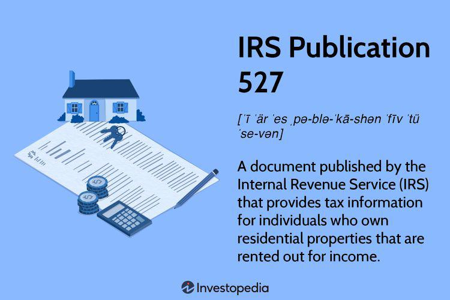

The tax implications for rental property owners are significant, and understanding them is crucial for effective financial management. Central to this understanding is the IRS Publication 527, a key document designed to guide property owners through the complexities of residential rental property taxation. This publication outlines the types of rental income to be reported and the associated deductible expenses, providing clarity on tax obligations and opportunities for minimizing tax liabilities through strategic deductions and depreciation.

IRS Publication 527 is invaluable for rental property owners, offering detailed guidance on the forms and records necessary for accurate tax reporting. It specifies deductions that can substantially lower taxable income, such as mortgage interest, property tax, operational costs, and depreciation. This clarity helps property owners align with IRS regulations while optimizing their investment returns.



Algorithmic trading, though traditionally associated with financial markets, has increasingly become relevant to real estate investments. As computational algorithms can efficiently analyze large datasets, they enable investors to discern market trends and optimize their portfolios. In the context of real estate, this means that investors can use algorithmic strategies to navigate market fluctuations, identify lucrative investment opportunities, and effectively manage risk.

The intersection of tax rules, real estate investment strategies, and algorithmic trading presents a modern approach to maximizing returns. By applying insights gained from IRS guidelines and tax benefits in rental property investments, alongside leveraging the analytical power of algorithms, investors can craft strategies that enhance profitability while ensuring regulatory compliance.

Integrating these elements—real estate taxation rules, IRS guidance, and algorithmic methodologies—not only highlights the importance of informed tax strategies in rental property investments but also underscores the benefits of embracing technology for enhanced decision-making. This synergy facilitates smarter investment choices, potentially increasing yield while safeguarding compliance with tax obligations.

## Table of Contents

## Understanding IRS Publication 527

IRS Publication 527 is a pivotal resource for rental property owners, offering comprehensive guidance on the tax implications associated with residential rental properties. It provides clarity on the various types of rental income that must be reported, such as rental payments received, advance rent, and expenses paid by the tenant. Understanding the classifications and treatments outlined in this publication is essential for ensuring compliance and maximizing tax efficiency.

### Types of Rental Income
IRS Publication 527 categorizes rental income into several components. Primarily, it includes regular rental payments from tenants, which must be reported in the year they are received. Advance rent, or any payment received for use in future tax years, is also treated as income in the year it is acquired. For example, if a landlord receives two years' worth of rent upfront, the total amount is considered income for the year of receipt. Expenses paid directly by the tenant, such as repairs or utilities, should be reported as income, and the corresponding expense is deductible.

### Eligible Deductions
One of the core advantages of IRS Publication 527 is its detailed explanation of eligible deductions, which can significantly reduce taxable income. Commonly deductible expenses include mortgage interest, property tax, operating expenses, depreciation, and repairs. Deducting these costs helps landlords offset their rental income, reducing the taxable amount. For instance, if a property owner incurs a total expense of $8,000 on mortgage interest, property taxes, and utilities, this amount can be subtracted from the gross rental income to determine the taxable income.

### Role of Depreciation
Depreciation is a central tenet of rental property taxation and is extensively covered in Publication 527. It allows property owners to deduct a portion of the property's value over several years, representing the wear and tear or obsolescence of the property. According to IRS guidelines, residential rental properties are depreciated over a recovery period of 27.5 years using the Modified Accelerated Cost Recovery System (MACRS). For example, if a property, excluding land value, is valued at $275,000, the annual depreciation deduction would be approximately $10,000.

### Rental Scenarios
Publication 527 also addresses varied rental scenarios, such as mixed-use properties where only a part of the property is rented out. In such cases, expenses must be divided based on usage. If 40% of a homeowner's residence is rented, then only 40% of expenses like mortgage interest and utilities are deductible as rental expenses.

### Partial Property Usage
Handling tax implications for properties that are partially rented requires careful calculation of income and expenses. For instance, if a homeowner rents out a room in their house, they should calculate the portion of housing expenses attributable to the rental space. This includes dividing utility costs, maintenance, and even qualifying improvements between personal and rental use. This precise allocation ensures compliance and optimizes allowable deductions.

In summary, IRS Publication 527 is indispensable for rental property owners, meticulously guiding them through reporting income, claiming deductions, and factoring depreciation. Its structured approach helps property owners navigate the complexities of rental income taxation, ensuring both compliance and strategic financial management.

## Tax Deductions and Depreciation

Rental property owners can benefit significantly from understanding and utilizing tax deductions and depreciation as outlined in IRS Publication 527. These financial strategies can substantially reduce taxable income, thereby improving the profitability of rental investments.

### Allowed Deductions

Rental property owners can claim various expenses as deductions against their taxable rental income. Key deductions include:

1. **Mortgage Interest**: The interest portion of mortgage payments for rental properties is deductible, reducing the overall taxable income.
2. **Insurance Premiums**: Payments for rental property insurance policies, including fire and theft insurance, can also be deducted.
3. **Property Taxes**: State and local property taxes are deductible as rental expenses.
4. **Repairs and Maintenance**: Costs associated with maintaining and repairing the rental property are deductible in the year they were incurred.
5. **Utilities and Operating Costs**: If landlords pay for utilities such as water, gas, or electricity, these too are deductible expenses.

### Depreciation

Depreciation is a non-cash deduction allowing property owners to recover the cost of property wear and tear over a specific period. Generally, residential rental property is depreciated using the Modified Accelerated Cost Recovery System (MACRS) over 27.5 years. Depreciation can significantly impact taxable income by allowing property owners to deduct a portion of the property's value annually.

#### Impact on Taxable Income

Depreciation serves to offset income by reducing the taxable rental income. For instance, assume a rental property:

- Purchase Price: $275,000 (excluding land value, which is not depreciable)
- Depreciable basis: $250,000
- Annual Depreciation Deduction: $250,000 / 27.5 ≈ $9,090.91

This deduction reduces the taxable income by approximately $9,090.91 each year during the property's recovery period.

#### Calculating and Claiming Depreciation

Property owners can use IRS Form 4562, "Depreciation and Amortization," to calculate and report depreciation expenses. It's crucial to maintain accurate records of the property's cost basis, improvements, and other relevant documentation to substantiate claims.

### Special Cases and the $25,000 Special Allowance

Under certain circumstances, rental activities can result in a loss. Generally, passive loss rules limit the ability to deduct such losses. However, there is a $25,000 special allowance for active participants in rental real estate. This allows individuals [earning](/wiki/earning-announcement) $100,000 or less to deduct up to $25,000 of rental losses against other types of income. This allowance phases out between $100,000 and $150,000 of adjusted gross income (AGI).

These tax strategies, particularly when coupled with professional advice, can enhance the financial position of rental property owners while maintaining compliance with IRS regulations. Understanding these deductions is not only beneficial for reducing immediate tax liabilities but also for long-term planning and investment optimization.

## Efficient Reporting of Rental Income and Expenses

Efficient reporting of rental income and expenses is crucial for rental property owners to comply with IRS regulations and optimize their tax outcomes. The IRS mandates specific forms, and understanding how to accurately complete these is essential. 

**Guidelines for Using IRS-Mandated Forms**

One of the primary forms required for reporting rental income and expenses is Schedule E (Form 1040), "Supplemental Income and Loss." This form is pivotal as it summarizes the income and deductible expenses related to rental real estate. It encompasses the reporting of expenses such as mortgage interest, property taxes, operating expenses, depreciation, and repairs. Accurate completion of Schedule E helps in determining the net income or loss from rental properties, which is then transferred to Form 1040, impacting the overall taxable income of the property owner.

**Understanding Schedule E and Its Importance**

Schedule E is divided into sections that allow property owners to detail income and expenses for each rental property they own. It's crucial for property owners to accurately segregate expenses for each property to prevent errors that could trigger audits or penalties. Accurate reporting on Schedule E ensures that all allowable deductions are claimed, thereby reducing taxable income effectively. 

An important aspect to consider when filing Schedule E is ensuring all income sources are reported, including rental payments, security deposits retained by the landlord, and any services rendered by tenants in lieu of rent.

**Common Mistakes and How to Avoid Them**

A frequent error made by rental property owners is either underreporting or overreporting income and expenses. Ensuring all figures are supported by proper documentation such as receipts, bank statements, and lease agreements is critical. Another common mistake is misclassifying improvements and repairs; improvements must be capitalized and depreciated rather than being deducted as current expenses.

To avoid these mistakes, maintaining a comprehensive record-keeping system throughout the year can prevent inaccuracies and facilitate the tax filing process.

**Handling Advanced Rent and Tenant-Paid Expenses**

Advanced rent is any amount received before the period it covers, and it must be reported as income in the year it is received, regardless of the accounting method used. This preemptive reporting is essential to comply with IRS rules.

Similarly, when tenants pay any of the landlord's expenses, those payments must be counted as rental income. For instance, if a tenant pays a utility bill that is in the landlord's name, the landlord must include the amount of the bill in their rental income, while still deducting the expense as if they had paid it themselves.

**Reporting Personal Use of Rental Property**

If a rental property is occasionally used for personal use, it must be identified as a personal residence rather than a rental property under specific circumstances. To determine this, the IRS uses the "14-day rule," which states that if personal use exceeds either 14 days or 10% of the total days rented at a fair market price, the property is considered a personal residence.

This classification has implications for reporting and deductible expenses, as expenses must be prorated between personal and rental use. Careful record-keeping of days used for personal versus rental use is necessary to accurately calculate allowable deductions under this scenario.

In conclusion, efficient reporting of rental income and expenses using IRS-mandated forms like Schedule E is fundamental for rental property owners. Understanding the requirements and avoiding common pitfalls ensures compliance and maximizes tax benefits.

## Special Situations and Exceptions

When rental properties undergo changes in their use, such as being converted from primary residences to rental units, special tax situations and exceptions can arise. Understanding these scenarios is crucial for accurate tax reporting and compliance with IRS regulations.

### Handling Properties Converted to Rental Use

When a property is converted to rental use, the initial step involves determining its adjusted basis for depreciation. This basis is typically the lesser of the fair market value (FMV) on the date of conversion or the property's adjusted basis (original cost plus improvements minus any depreciation taken while the property was used personally). This value becomes crucial for calculating depreciation expenses accurately.

### Reporting Income and Expenses for Part-Time or Special-Condition Rentals

For properties rented out part-time or under unique conditions, such as seasonal rentals or shared use with segments for personal use, differentiating personal and rental use is essential. The IRS provides formulae to allocate expenses accurately between personal and rental use. For instance:

$$
\text{Rental Expense} = \left( \frac{\text{Days Rented}}{\text{Total Days Used}} \right) \times \text{Total Expense}
$$

### Understanding and Applying Exceptions

Certain exceptions allow property owners to forgo reporting rental income. If a property is rented for fewer than 15 days within a year while it's predominantly used as a personal residence, this income may be excluded from taxable income, relieving owners from the burden of reporting under the "vacation home" rules.

### Tax-Free Treatment in Specific Rental Cases

Occasionally, the IRS grants tax-free treatment for rental income, such as temporary leasing arrangements resulting from casualty displacement (e.g., following a natural disaster). Taxpayers should stay attuned to announcements that specify circumstances where tax relief measures apply, as seen with IRS Disaster Relief Statements.

### Legal Aspects including Lease Cancellations and Tenant Property Payments

Lease cancellations can invoke specific considerations, where payments received from tenants as part of a lease termination agreement are classified as ordinary rental income. Similarly, tenant payments that directly cover property expenses, like repairs, should be reported, ensuring all income streams related to rental activities are appropriately documented.

In these complex scenarios, understanding each unique situation under IRS rulings helps taxpayers achieve compliance while leveraging potential financial benefits. Consulting tax professionals is advisable to navigate these intricacies effectively.

## Algorithmic Trading in Real Estate Markets

Algorithmic trading refers to the use of computational algorithms to automate and enhance the decision-making process in trading. Within the context of real estate investments, [algorithmic trading](/wiki/algorithmic-trading) has emerged as a significant tool due to its ability to process large datasets and perform complex analyses more efficiently than human capabilities. Real estate markets, known for their vast amount of data, can benefit from the speed and precision of algorithmic trading.

Algorithms can analyze real estate market trends by evaluating historical price data, current economic indicators, and other market factors. For instance, they can identify patterns and anomalies that might indicate future price movements. By using [machine learning](/wiki/machine-learning) techniques, algorithms can adapt to new data inputs, continuously refining their models to improve prediction accuracy.

Optimizing real estate portfolios through algorithmic trading involves using algorithms to balance risk and expected return systematically. By modeling various investment scenarios and constraints, algorithms can suggest asset allocations that maximize returns while minimizing risk. This process includes considering factors such as geographic diversification, property types, and economic forecasts.

Risk management in real estate investments can be enhanced with algorithmic strategies. Algorithms can simulate various market conditions to stress-test portfolios, providing insights into potential vulnerabilities. They can also detect risk factors in real time, allowing for timely decisions to mitigate potential losses. For example, stop-loss orders or alerts can be automated based on specific risk thresholds.

Integration of real estate market analytics with IRS tax regulations can also be achieved through algorithmic trading. Algorithms can be programmed to consider tax implications when analyzing investment decisions and optimizing portfolios. For instance, they can account for depreciation schedules and tax deductions related to rental properties, ensuring compliance with regulations such as those outlined in IRS Publication 527. This integration helps in effectively managing after-tax returns, thereby enhancing the overall strategy for real estate investments.

```python
# Example of a simple algorithm for real estate trend analysis using moving average

import numpy as np
import pandas as pd

def moving_average_strategy(prices, short_window=40, long_window=100):
    """
    Implements a simple moving average strategy.
    Buy when the short-term moving average crosses above the long-term moving average.
    Sell when it crosses below.

    :param prices: A Pandas Series of real estate prices 
    :param short_window: Short moving average period
    :param long_window: Long moving average period

    :return: Trading signals
    """

    signals = pd.DataFrame(index=prices.index)
    signals['price'] = prices
    signals['short_mavg'] = prices.rolling(window=short_window, min_periods=1, center=False).mean()
    signals['long_mavg'] = prices.rolling(window=long_window, min_periods=1, center=False).mean()

    signals['signal'] = 0.0
    signals['signal'][short_window:] = np.where(signals['short_mavg'][short_window:] 
                                                  > signals['long_mavg'][short_window:], 1.0, 0.0)   
    signals['positions'] = signals['signal'].diff()

    return signals

# Example usage
prices = pd.Series(np.random.randn(1000), name='Real_Estate_Prices')
signals = moving_average_strategy(prices)

print(signals.head())
```

Through these strategies, algorithmic trading acts as a powerful tool in understanding, predicting, and optimizing real estate investments, providing investors with a competitive edge in the market.

## Concluding Thoughts

IRS Publication 527 serves as an essential resource for rental property owners, outlining critical guidelines for accurately managing taxation issues related to residential rental property. This publication simplifies complex tax regulations, empowering property owners with the knowledge to fulfill their tax obligations efficiently. It is crucial to comprehend the intricacies of tax deductions, particularly depreciation, as they directly influence taxable income. By understanding allowed deductions such as mortgage interest and property management expenses, investors can effectively reduce their tax liability.

Depreciation is a pivotal element in rental property taxation. It allows property owners to recover the costs of property investments over time, effectively offsetting rental income. The strategic implementation of tax deductions and depreciation not only impacts immediate taxable income but can also lead to significant financial savings in the long term, enhancing overall investment returns.

The integration of algorithmic trading principles with real estate investments offers innovative approaches to optimizing property portfolios. Algorithms can analyze real estate market trends, enabling investors to make data-driven decisions and strategically allocate resources for maximized returns. By incorporating real estate market analytics with IRS tax regulations, investors can create a sophisticated strategy that blends financial technology with sound tax practices.

Staying informed and consulting with tax professionals is crucial for compliance and long-term success in rental property investments. As tax laws evolve, maintaining a current understanding of these regulations is essential to avoid pitfalls and optimize financial outcomes. The fusion of technology with real estate tax strategies equips property owners with tools to navigate the dynamic landscape of real estate investments, making informed decisions that align with both market movements and tax requirements.

## References & Further Reading

[1]: ["IRS Publication 527 - Residential Rental Property (Including Rental of Vacation Homes)"](https://www.irs.gov/publications/p527), Internal Revenue Service.

[2]: Miller, B. W. (2021). ["Surviving and Thriving in Uncertain Real Estate Markets"](https://www.tandfonline.com/doi/full/10.1080/26437015.2024.2390859). Springer International Publishing.

[3]: ["Tax Deductions for Rental Property Owners"](https://www.irs.gov/businesses/small-businesses-self-employed/tips-on-rental-real-estate-income-deductions-and-recordkeeping), Nolo.

[4]: ["The Book on Tax Strategies for the Savvy Real Estate Investor: Powerful techniques anyone can use to deduct more, invest smarter, and pay far less to the IRS"](https://www.amazon.com/Book-Strategies-Savvy-Estate-Investor/dp/0990711765) by Amanda Han and Matthew MacFarland.

[5]: Lopez de Prado, M. (2018). ["Advances in Financial Machine Learning"](https://www.amazon.com/Advances-Financial-Machine-Learning-Marcos/dp/1119482089). Wiley.

[6]: Chan, E. (2009). ["Quantitative Trading: How to Build Your Own Algorithmic Trading Business"](https://github.com/ftvision/quant_trading_echan_book). Wiley.