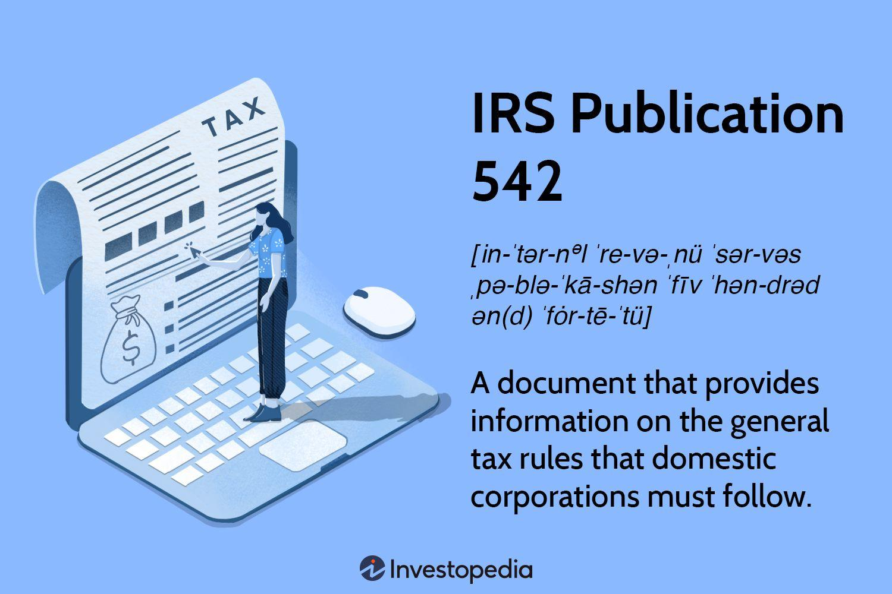

The rise of algorithmic trading has revolutionized financial markets by providing firms with sophisticated tools to execute trades at unprecedented speeds. This technological advancement leverages complex algorithms and high-frequency data analysis, enabling firms to optimize their trade execution strategies effectively. The impact of this shift can be seen in the increased market efficiency and significant profitability potential for traders who successfully implement these strategies.

Despite these advantages, algorithmic trading introduces new challenges for corporate entities, particularly concerning the understanding of tax implications associated with high-frequency trading activities. As these firms operate with vast volumes of transactions, the complexity of tax calculations increases, necessitating a robust grasp of corporate tax regulations. Compliance with IRS guidelines, such as those outlined in IRS Publication 542, is essential for firms to avoid potential penalties and ensure accurate tax reporting.

IRS Publication 542 provides detailed guidance on tax rules applicable to domestic corporations, encapsulating the intricate tax landscape that algorithmic trading firms must navigate. These regulations impact various aspects of corporate tax strategy, including methods for record-keeping, allowable deductions, and the application of tax tables. Understanding these regulations is crucial, as it can significantly influence a firm's overall tax strategy and financial health.

As the IRS continually updates its tax regulations to reflect legislative changes, corporations engaged in algorithmic trading must remain vigilant. Recent updates can have profound implications for firms employing algorithmic strategies, necessitating continuous adaptation to remain compliant. This article aims to explore the specifics of IRS Publication 542, emphasizing its relevance for algorithmic trading firms and how these entities can align their trading activities with current tax compliance requirements. Understanding these elements is vital for maintaining a competitive edge in the dynamically evolving financial markets.

## Table of Contents

## Overview of IRS Publication 542

IRS Publication 542 is a critical resource crafted by the Internal Revenue Service (IRS) to provide clarity on tax obligations for domestic corporations. It offers an extensive overview of how these entities should calculate their taxes in compliance with federal regulations. The publication is instrumental for corporations, facilitating a clear understanding of their tax liabilities within the United States.

The document meticulously describes the types of organizations that qualify as corporations for tax purposes. This classification is central to ensuring that businesses comply with the appropriate tax structures. IRS Publication 542 also specifies the required methods for record-keeping, ensuring that corporations maintain accurate financial records. Proper documentation is crucial for auditing processes and for substantiating corporate transactions and their tax implications.

Furthermore, the publication details the types of deductions that corporations can claim. These deductions play a vital role in reducing taxable income and thereby minimizing tax liabilities. Understanding which expenses are deductible is essential for companies seeking to optimize their tax positions.

In addition to guiding on deductions, IRS Publication 542 provides applicable tax tables that assist corporations in computing their exact tax dues. These tables are vital for ensuring precise calculations and subsequent compliance with federal tax obligations.

To maintain its relevance in a dynamic economic and legislative environment, IRS Publication 542 is routinely updated. These updates mirror changes in legislation and tax law, ensuring that the publication remains an authoritative resource for current corporate entities. Companies engaged in intricate financial activities, such as [algorithmic trading](/wiki/algorithmic-trading), particularly benefit from the guidance offered in the publication. The nature of these activities often involves complex transactions that necessitate nuanced understanding and application of tax rules.

By clearly outlining the rules for calculating and filing corporate taxes, IRS Publication 542 demystifies the complexities associated with corporate taxation. Its straightforward language allows businesses to easily navigate tax requirements, promoting adherence and reducing the risk of inadvertent non-compliance. Overall, IRS Publication 542 is an indispensable tool for corporations striving to align with regulatory standards while efficiently managing their tax obligations.

## Relevance of IRS Publication 542 to Algorithmic Trading

Algorithmic trading is a prevalent practice among corporations, leveraging automated systems to execute high-speed financial transactions based on predetermined algorithms. This advanced form of trading can lead to intricate financial activities, making it imperative for firms to adhere to meticulous accounting methods as outlined in IRS Publication 542.

### Classification as a Corporation

Understanding whether an algorithmic trading firm qualifies as a corporation under IRS guidelines is fundamental to ensuring they meet the appropriate taxation requirements. IRS Publication 542 provides detailed descriptions of entities classified as corporations for tax purposes. Corporate classification affects the firm's tax obligations, including the method of reporting income and potential deductions allowable under IRS regulations.

### Accounting Methods and Periods

The publication underscores the importance of adopting standardized accounting periods and methods to accurately report revenues and expenses associated with trading activities. Algorithmic trading involves numerous transactions often recorded at microsecond intervals, necessitating precise and consistent accounting practices to ensure compliance. Reliable methodology in financial documentation allows firms to maintain accurate records, crucial for both internal auditing and IRS reviews.

### Deductions and Capital Contributions

Algorithmic trading firms must be aware of specific deductions relevant to their operations, as highlighted by IRS Publication 542. These may include deductions for trading-related expenses, technology acquisition, and operating costs. Additionally, the publication offers guidance on the management of capital contributions and distributions, ensuring firms understand their impact on corporate tax liabilities. Proper handling of these aspects can significantly affect a firm's financial statements and tax position.

### Tax Compliance Alignment

The guidelines provided in IRS Publication 542 are instrumental in helping algorithmic trading firms align their operations with tax compliance requirements. By systematically adhering to these principles, firms can ensure that they fulfill their corporate tax obligations, minimize tax liabilities, and reduce the risk of penalties due to non-compliance. Proper tax compliance not only satisfies regulatory demands but also supports the strategic financial positioning of trading entities in a competitive market.

In summary, for algorithmic trading firms, the intricacies of IRS tax regulations necessitate a comprehensive understanding of corporate classification, meticulous accounting, recognition of permissible deductions, and prudent financial management. IRS Publication 542 serves as a foundational resource in navigating these complexities, enabling algorithmic trading entities to ensure full compliance and optimize their tax strategy.

## Key Tax Considerations for Algorithmic Trading Firms

Algorithmic trading firms operate in a fast-paced environment where understanding tax obligations can significantly influence financial planning and performance. A fundamental aspect of their tax consideration is identifying goods and services eligible for corporate deductions under IRS regulations. This involves distinguishing between deductible and non-deductible expenses, such as those directly tied to trading activities, technology infrastructure, and other operational costs.

Managing capital contributions effectively and comprehending their impact on corporate tax liability is another critical concern. IRS Publication 542 outlines that capital contributions may not be treated as taxable income for the recipient corporation, affecting the computation of taxable income and overall tax liability.

Algorithmic trading firms frequently engage in high-frequency trading, where mark-to-market (MTM) accounting becomes relevant. MTM accounting requires firms to assess assets and liabilities at their fair market value at the end of each tax period. This can have significant implications on reported earnings and must be accurately represented in financial statements to reflect true financial health.

An understanding of the rules governing trading gains and losses, and their treatment in financial statements, is crucial. IRS regulations require firms to determine whether these are short-term or long-term, impacting how they are taxed. This classification affects the tax rate applied and ultimately influences the firm’s tax liability.

Moreover, ensuring compliance with the Corporate Alternative Minimum Tax (CAMT) is vital for algorithmic trading firms. Publication 542 highlights the conditions under which CAMT may apply, aiming to ensure corporations pay a minimum amount of tax regardless of deductions or credits. Algorithmic trading corporations must calculate their regular tax liability and compare it with the minimum tax to determine if any additional tax is owed.

Understanding IRS expectations concerning tax filings, estimated tax payments, and associated penalties is essential. Algorithmic trading firms must adhere to strict timelines for tax filings and payments to avoid penalties, which could affect their financial standing. Regularly reviewing IRS guidelines and using approved calculation methods to determine estimated tax obligations will help maintain compliance and prevent costly fines.

In conclusion, by comprehensively integrating these key tax considerations, algorithmic trading firms can optimize their tax strategy, ensuring compliance while enhancing their financial efficiency.

## Recent Developments and Updates

Recent changes in tax legislation, notably those brought about by the Inflation Reduction Act of 2022, have substantial implications for corporate entities, prompting necessary adjustments in compliance strategies. One of the critical changes involves the revision of Form 1120-W, which is used by corporations to calculate and report estimated tax payments. For firms heavily reliant on historical forms for tax calculations, these revisions necessitate a thorough review and adaptation of their tax payment processes to ensure accuracy and compliance.

Additionally, alterations in the corporate alternative minimum tax (CAMT) rates highlight the importance of continuously monitoring legislative developments. The CAMT, which serves to ensure that corporations pay at least a minimum amount of tax, can significantly impact the financial planning and reporting of corporations. The revised CAMT rates require firms to reassess their tax liability calculations and adjust their strategies accordingly to avoid unexpected liabilities.

IRS Publication 542 has also undergone revisions to integrate changes that affect investment and banking institutions, particularly those engaged in foreign trade and stock exchange activities. These updates are essential for algorithmic trading firms to consider, as they directly impact how these entities report and manage their trading activities for tax purposes. Failure to align with these revisions could lead to discrepancies in tax reporting and potential repercussions from the IRS.

To navigate these complexities, algorithmic trading firms must stay abreast of the latest updates. Utilizing resources such as the IRS website and engaging professional tax advisory services are instrumental in maintaining compliance and optimizing tax strategies. These resources provide valuable insights into legislative changes and offer guidance on implementing necessary adjustments to tax compliance strategies. By remaining informed and proactive, corporations can effectively manage their tax obligations and mitigate potential risks associated with tax reporting discrepancies.

## Conclusion

IRS Publication 542 plays a pivotal role in guiding corporations, particularly those engaged in algorithmic trading, on proper tax management and compliance. This publication provides a comprehensive overview of corporate tax obligations, assisting trading firms in making informed financial decisions. Understanding the intricacies of corporate tax rules as outlined in IRS Publication 542 allows firms to accurately compute their tax liabilities and identify applicable deductions.

Algorithmic trading, characterized by high-frequency financial transactions executed through automated systems, necessitates precise and meticulous financial reporting. IRS Publication 542 offers clarity on the accounting methods and record-keeping practices that corporations should employ to maintain compliance. The document's guidelines are essential for ensuring that trading gains and losses are treated correctly in financial statements, adhering to regulations such as mark-to-market accounting where applicable.

Continuous updates and revisions from the IRS underscore the importance of regularly reviewing and adapting corporate tax strategies. Recent legislative changes, such as those introduced by the Inflation Reduction Act of 2022, have significant implications for corporate entities and necessitate adjustments in compliance approaches. By keeping abreast of these developments, trading firms can optimize their tax positions, thereby minimizing liabilities and avoiding costly penalties.

Given the complexity inherent in algorithmic trading, professional tax planning and consultation are of paramount importance. Engaging with tax advisory services can offer insights into navigating the nuanced tax landscape, ensuring alignment with current IRS guidelines, and maximizing corporate tax efficiency.

Staying current with IRS publications, regulations, and guidelines is critical for corporate entities involved in dynamic and high-tech financial activities. By adhering to the principles set forth in IRS Publication 542, firms not only uphold their legal obligations but also bolster their financial health through strategic tax management.

## References & Further Reading

[1]: IRS. (2022). ["Publication 542: Corporations."](https://www.irs.gov/publications/p542)

[2]: Bergstra, J., Bardenet, R., Bengio, Y., & Kégl, B. (2011). ["Algorithms for Hyper-Parameter Optimization."](https://dl.acm.org/doi/10.5555/2986459.2986743) Advances in Neural Information Processing Systems 24.

[3]: ["Quantitative Trading: How to Build Your Own Algorithmic Trading Business"](https://www.amazon.com/Quantitative-Trading-Build-Algorithmic-Business/dp/1119800064) by Ernest P. Chan

[4]: ["Advances in Financial Machine Learning"](https://www.amazon.com/Advances-Financial-Machine-Learning-Marcos/dp/1119482089) by Marcos Lopez de Prado

[5]: ["Machine Learning for Algorithmic Trading"](https://github.com/stefan-jansen/machine-learning-for-trading) by Stefan Jansen