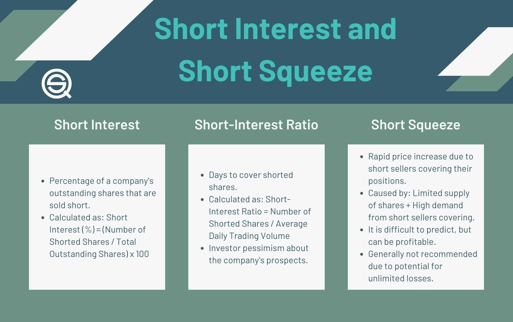

## Table of Contents

## What is short interest?

Short interest refers to the total number of shares of a stock that investors have sold short but have not yet repurchased to close out their positions. When someone sells a stock short, they are betting that the price of the stock will go down. They borrow shares from a broker and sell them on the market, hoping to buy them back later at a lower price to return to the lender, pocketing the difference as profit.

Short interest is often expressed as a percentage or as a number of days to cover. The days to cover is calculated by dividing the total short interest by the average daily trading volume of the stock. A high short interest can indicate that many investors are pessimistic about the stock's future performance. However, if the stock price starts to rise, these short sellers may rush to buy back the shares to limit their losses, which can drive the stock price even higher in a phenomenon known as a short squeeze.

## How is short interest measured?

Short interest is measured by counting the total number of shares that investors have borrowed and sold short. This count happens at specific times, usually twice a month. The goal is to see how many shares are still shorted and haven't been bought back yet. This information is reported by brokers and gathered by financial organizations like stock exchanges or regulatory bodies.

Once the total number of shorted shares is known, it can be shown in different ways. One common way is as a percentage of the total number of shares that the company has. Another way is by calculating the "days to cover," which is how many days it would take for all the short sellers to buy back the shares they borrowed, based on how many shares are traded each day. This helps investors understand how much pressure there might be on the stock's price from short sellers.

## What does high short interest indicate about a stock?

High short interest means a lot of investors are betting that the stock's price will go down. They borrow the stock and sell it, hoping to buy it back cheaper later. When many people do this, it shows they think the company isn't doing well or might have problems soon. It's like a lot of people are saying, "I don't want to own this stock because I think it will lose value."

However, high short interest can also lead to something called a short squeeze. If the stock's price starts to go up instead of down, the people who shorted the stock might panic. They will rush to buy the stock back to avoid losing more money. This buying can push the stock's price even higher, making it hard for short sellers to get out without losing a lot. So, high short interest can make a stock more unpredictable and risky.

## Can high short interest lead to a short squeeze?

Yes, high short interest can lead to a short squeeze. A short squeeze happens when a lot of people have bet that a stock's price will go down by borrowing and selling the stock. If the stock's price starts to go up instead, these people get worried. They need to buy the stock back to return it to who they borrowed it from, but now it costs more than they sold it for.

When many short sellers try to buy back the stock at the same time, it can push the price up even more. This rush to buy can turn into a frenzy, making the stock's price rise quickly. It's like a game of musical chairs where everyone is trying to sit down at once, but there aren't enough chairs. This can cause big price jumps and make the stock very unpredictable.

## How does high short interest affect stock price volatility?

High short interest can make a stock's price move up and down a lot, which is called volatility. When a lot of people bet that a stock's price will go down by shorting it, it means they think the company is not doing well. If something good happens to the company, like better earnings or good news, the stock price might start to go up. This can make short sellers worried because they need to buy the stock back to close their bets, but now it costs more. Their rush to buy can push the price up even more, making the stock's price jump around a lot.

This situation can lead to what's called a short squeeze, where the price goes up quickly because so many people are trying to buy back the stock at the same time. It's like a game where everyone is trying to get out of a crowded room at once. The more people trying to buy back the stock, the more the price can swing up and down. So, high short interest can make a stock's price very unpredictable and risky for everyone involved.

## What are the risks of investing in a stock with high short interest?

Investing in a stock with high short interest can be risky. It means a lot of people think the stock's price will go down. If you buy the stock and it does go down, you could lose money. Also, if the company has problems or bad news, the stock price might drop even more because short sellers will keep betting against it.

But there's another risk too. If the stock's price starts to go up, it can cause a short squeeze. This happens when short sellers rush to buy back the stock to avoid losing more money. The price can go up really fast, which is good if you own the stock, but it can also make the stock very unpredictable. If you bought the stock hoping for a short squeeze but it doesn't happen, or if the price goes down after the squeeze, you could still lose money. So, high short interest makes the stock's price move a lot, which can be risky for investors.

## How can investors use short interest data to make investment decisions?

Investors can use short interest data to understand how other people feel about a stock. If a lot of people are betting that the stock's price will go down, it means they think the company might have problems. This can be a warning sign for investors. They might decide not to buy the stock or to sell it if they already own it, because high short interest suggests the stock could go down in value. It's like seeing a lot of people leaving a party early; it might make you think there's a reason to leave too.

On the other hand, some investors look for stocks with high short interest because they think there might be a short squeeze. If the stock's price starts to go up, short sellers will have to buy it back, which can push the price up even more. If an investor believes the company is doing better than people think, they might buy the stock hoping for a quick price jump. But this is risky because if the short squeeze doesn't happen, or if the stock goes down after the squeeze, the investor could lose money. So, short interest data can be a useful tool, but it needs to be used carefully.

## What historical examples show the impact of high short interest on stock performance?

One famous example of high short interest affecting stock performance is the case of GameStop in early 2021. A lot of people were betting that GameStop's stock price would go down because they thought the company was not doing well. But some investors on social media, especially on Reddit, thought the stock was undervalued and started buying it. This caused the stock price to go up quickly, which made short sellers panic. They had to buy back the stock to avoid losing more money, which pushed the price even higher. This is called a short squeeze, and it made GameStop's stock price jump from around $20 to over $400 in just a few weeks.

Another example is the case of Volkswagen in 2008. At the time, Porsche was secretly buying up a lot of Volkswagen shares, which made the short interest in Volkswagen very high. Many investors were betting that Volkswagen's stock price would go down. But when Porsche announced it had a big stake in Volkswagen, the stock price shot up because short sellers had to buy back the shares they had borrowed. This caused Volkswagen's stock to become the most valuable in the world for a short time, with its price going from around €200 to over €1,000 in just a few days. These examples show how high short interest can lead to big changes in stock prices, making them very unpredictable.

## How do market makers and institutional investors view high short interest?

Market makers and institutional investors often see high short interest as a sign that a lot of people think a stock's price will go down. They might be careful about getting involved with the stock because it could mean the company has problems. If they do invest, they might do it slowly and watch the stock closely. They know that if the stock starts to go up, it could cause a short squeeze, where short sellers rush to buy back the stock, pushing the price up even more. This can make the stock very unpredictable and risky.

Institutional investors, like big funds that manage a lot of money, might also use high short interest as part of their strategy. If they believe the company is doing better than people think, they might buy the stock hoping for a short squeeze. But they know this is risky because if the stock doesn't go up, or if it goes down after a short squeeze, they could lose money. So, they often do a lot of research and think carefully before making a move based on short interest data.

## What role does short interest play in market sentiment analysis?

Short interest is a big part of understanding how people feel about a stock. It shows how many investors are betting that the stock's price will go down. If a lot of people are shorting a stock, it means they think the company is not doing well. This can be a warning sign for other investors. They might see high short interest and think, "Maybe I should be careful with this stock too." It's like seeing a lot of people leaving a party early; it might make you think there's a reason to leave too.

But short interest can also show when people are feeling hopeful about a stock. If a stock has high short interest but then starts to go up, it can cause a short squeeze. This is when short sellers rush to buy back the stock to avoid losing more money, which can push the price up even more. Some investors look for stocks with high short interest because they think there might be a chance for a quick price jump. So, short interest can tell us a lot about what investors are thinking and feeling about a stock, helping to guide decisions on whether to buy, sell, or hold.

## How can short interest be used as a contrarian indicator?

Short interest can be used as a contrarian indicator when investors think the opposite of what most people are betting on. If a lot of people are shorting a stock, it means they think the stock's price will go down. But if you believe the company is doing better than people think, you might see high short interest as a chance to buy the stock. You're betting that the stock will go up instead, going against what most people believe. If you're right, and the stock does go up, it can cause a short squeeze where short sellers rush to buy back the stock, pushing the price even higher.

Using short interest as a contrarian indicator is risky but can be rewarding. If the stock doesn't go up, or if it goes down after a short squeeze, you could lose money. But if you do your research and believe strongly in the company's future, high short interest can be a signal that the stock is undervalued. It's like finding a good deal at a store because everyone else thinks it's not worth much. By going against the crowd, you might find opportunities that others are missing.

## What advanced metrics, beyond simple short interest, should expert investors consider?

Expert investors should look at the "days to cover" metric, which shows how many days it would take for all the short sellers to buy back the shares they borrowed. This is calculated by dividing the total short interest by the average number of shares traded each day. A high number of days to cover can mean there's a lot of pressure on the stock's price because if it starts to go up, short sellers might rush to buy back the shares, causing a short squeeze. This can help investors understand how risky a stock might be.

Another important metric is the short interest ratio, which is the short interest as a percentage of the total number of shares that the company has. A high short interest ratio means a lot of people are betting against the stock, which can be a sign that the company is in trouble. But it can also mean there's a chance for a short squeeze if the stock starts to go up. By looking at these advanced metrics, expert investors can get a better idea of what might happen to a stock's price and make smarter decisions.

## What is Short Interest and How Can It Be Understood?

Short interest is a critical metric in financial markets, specifically indicating the proportion of a company's shares that have been sold short but have yet to be repurchased or "covered." Short selling is a strategy where investors borrow shares and sell them with the hope that the stock price will decline, allowing them to purchase the shares back at a lower price to return to the lender, thus securing a profit. Therefore, the short interest metric is an essential indicator of market sentiment toward a stock, often reflecting widespread skepticism or negative outlook on the company's future performance.

**Market Sentiment Indicator**

The percentage of short interest can offer insights into how investors view a company's prospects. Analysts and traders consider a high short interest percentage as a signal of market pessimism. When a large fraction of shares is sold short, it may suggest that investors anticipate the stock price will fall due to factors such as poor financial performance, unfavorable industry trends, or other negative news about the company.

**Calculation of Short Interest Ratio**

The short interest ratio (SIR), also known as days to cover, measures the expected number of days it would take to cover all short positions based on the average daily trading [volume](/wiki/volume-trading-strategy). It is calculated as follows:

$$

\text{Short Interest Ratio (SIR)} = \frac{\text{Total number of shares sold short}}{\text{Average daily trading volume}} 
$$

The SIR provides additional context by indicating how liquid a company's stock is relative to the volume of short positions. A higher SIR suggests that it would take longer to cover all short positions, potentially making the stock more susceptible to [volatility](/wiki/volatility-trading-strategies) and events like short squeezes, where rapid price increases might force short sellers to cover their positions at higher prices.

**Significance in the Market**

Short interest data is a valuable input for investors to gauge potential stock volatility and price movement. High short interest, combined with high SIR, might imply a possible short squeeze scenario, which could lead to sudden and significant price hikes, adding a layer of risk and opportunity for traders. Conversely, persistently high short interest without subsequent price movement may reinforce the negative sentiment about the company's fundamentals. Therefore, understanding these metrics not only helps in assessing overall market mood but also in formulating investment strategies that align with an individual's or institution's risk tolerance. 

By paying attention to short interest and related ratios, traders and algorithmic systems can make more informed decisions. Specific algorithms may even be designed to exploit movements in stocks with varying levels of short interest, adjusting strategies based on the calculated levels of investor sentiment and potential market reactions.

## Is High Short Interest Good or Bad?

Stocks with high short interest have long been a subject of interest and concern in financial markets. Empirical evidence suggests a tendency for these stocks to underperform over longer periods. The underperformance hypothesis is grounded in the idea that high short interest reflects widespread investor skepticism about a company's future prospects. Traders anticipating a company's decline or potential challenges may short the stock, thereby elevating its short interest levels. 

A study published in the "Journal of Finance" found that stocks with high short interest generally exhibit lower future returns compared to those with lower short interest (Desai et al., 2002). This pattern is attributed to informational short selling, where informed investors bet against stocks they believe are overvalued, often due to poor fundamentals or overhyped growth narratives. Such conditions can lead to a correction of the stock price over time, aligning with the informed investors' expectations.

### Algorithmic Trading and Risk Assessment

For algorithmic traders, engaging with high short interest stocks requires a nuanced approach to risk management. High short interest can result in pronounced price volatility, driven by factors such as short squeezes, abrupt news impacts, or shifts in market sentiment. Algorithms must be adept at assessing these risks and managing positions to avoid adverse effects of rapid price changes.

Risk assessment can be enhanced by employing quantitative models that incorporate short interest data as a key variable. For example, employing a risk-adjusted performance metric, such as the Sharpe Ratio, could help traders evaluate whether the potential returns from short-interest-driven trades justify the increased volatility. The formula for the Sharpe Ratio is:

$$
\text{Sharpe Ratio} = \frac{E(R_p - R_f)}{\sigma_p}
$$

where $E(R_p - R_f)$ is the expected return of the portfolio minus the risk-free rate, and $\sigma_p$ is the standard deviation of the portfolio's excess return.

### Research Findings and Expert Opinions

Research into high short interest reveals conflicting perspectives, with some studies indicating that such stocks tend to underperform, while others suggest that they can offer opportunities given the right conditions. High short interest can signal the presence of significant pessimism, but not all short-interest-focused strategies will yield negative returns. Some traders view high short interest as a contrarian indicator, suggesting potential value in stocks oversold by the market.

Experts in [algorithmic trading](/wiki/algorithmic-trading) often emphasize that aligning trading strategies with market data is critical. High short interest may conflict with common algorithmic trading goals, such as minimizing drawdowns and optimizing risk-adjusted returns. Consequently, traders might prefer to integrate short interest metrics into broader analytical frameworks to inform decision-making processes.

### Aligning with Trading Goals

Whether high short interest aligns or clashes with algorithmic trading strategies largely depends on the specific goals set by traders. For those targeting short-term profits, exploiting episodic events like short squeezes could be beneficial. However, for traders focused on stability and long-term capital growth, the inherent risks of high short interest may outweigh potential gains. 

Tools like [machine learning](/wiki/machine-learning) algorithms can be employed to identify patterns and predict movements related to short interest, thus offering a sophisticated means to navigate high-risk environments. Integrating predictive analytics into trading models can aid in transforming high short interest from an unpredictable challenge into a strategic asset.

Ultimately, while high short interest presents the dual possibilities of disadvantage through underperformance and opportunity through measured risk-taking, the decision for algorithmic traders lies in aligning these potentials with their overarching trading objectives.

## References & Further Reading

[1]: Desai, H., Ramesh, K., Thiagarajan, S. R., & Balachandran, B. V. (2002). [An investigation of the informational role of short interest in the Nasdaq market.](https://www.jstor.org/stable/3094511) Journal of Finance, 57(5), 2263-2287.

[2]: Investopedia. [Understanding the Short Squeeze.](https://www.investopedia.com/terms/s/shortsqueeze.asp)

[3]: Lopez de Prado, M. (2018). [Advances in Financial Machine Learning.](https://www.amazon.com/Advances-Financial-Machine-Learning-Marcos/dp/1119482089) Wiley.

[4]: Chan, E. P. (2009). [Quantitative Trading: How to Build Your Own Algorithmic Trading Business.](https://github.com/ftvision/quant_trading_echan_book) Wiley.

[5]: Jansen, S. (2020). [Machine Learning for Algorithmic Trading.](https://www.amazon.com/Machine-Learning-Algorithmic-Trading-alternative/dp/1839217715) Packt Publishing.

[6]: Markit. [Understanding Short Interest: A Comprehensive Look.](https://cdn.ihsmarkit.com/www/pdf/0321/x20170814_YL_New_Insights_in_Short_Interest.pdf)

[7]: Reuters. [Explainer: What is a Short Squeeze and How to Trade it.](https://www.investopedia.com/terms/s/shortsqueeze.asp)

[8]: Aronson, D. R. (2007). [Evidence-Based Technical Analysis: Applying the Scientific Method and Statistical Inference to Trading Signals.](https://www.amazon.com/Evidence-Based-Technical-Analysis-Scientific-Statistical/dp/0470008741) Wiley.