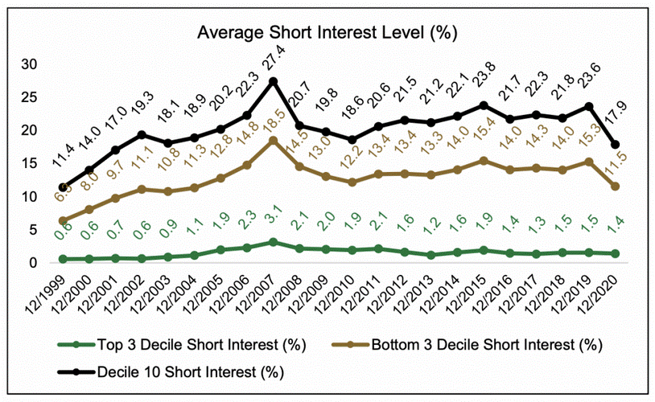

High short interest in stocks has become a focal point in the landscape of algorithmic trading. This phenomenon, which involves a substantial portion of a company's shares being sold short but not yet covered, captures the attention of traders due to the potential implications on stock price volatility and market sentiment. In this article, we aim to examine whether high short interest acts as a boon or bane for algorithmic traders.

To achieve this, we will begin by clearly defining what short interest entails and how it serves as a barometer for market sentiment towards specific stocks. The concept of short interest ratio, a metric used to gauge the level of short interest relative to a stock's average daily trading volume, will also be dissected to elucidate its significance in market dynamics. 



An analysis of the ramifications of high short interest on trading effectiveness and strategy outcomes is crucial. Algorithmic trading, which relies heavily on quantitative models and strategies, must consider how high short interest affects stock price movements and liquidity. Through a detailed examination, we will discuss whether high short interest represents an attractive trading opportunity or a significant risk factor.

In exploring the real-world impacts of high short interest, the Gamestop short squeeze incident serves as a quintessential example. This case will aid in understanding how algo traders engage with stocks experiencing a short squeeze, where high short interest leads to rapid and significant price increases as short sellers rush to cover their positions.

Our objective is to furnish a thorough understanding of high short interest and its potential implications for algo trading. By exploring empirical evidence and theoretical perspectives, we strive to equip traders with the insights necessary to navigate the complex interplay between high short interest and algorithmic trading strategies effectively.

## Table of Contents

## Understanding Short Interest

Short interest is a critical metric in financial markets, specifically indicating the proportion of a company's shares that have been sold short but have yet to be repurchased or "covered." Short selling is a strategy where investors borrow shares and sell them with the hope that the stock price will decline, allowing them to purchase the shares back at a lower price to return to the lender, thus securing a profit. Therefore, the short interest metric is an essential indicator of market sentiment toward a stock, often reflecting widespread skepticism or negative outlook on the company's future performance.

**Market Sentiment Indicator**

The percentage of short interest can offer insights into how investors view a company's prospects. Analysts and traders consider a high short interest percentage as a signal of market pessimism. When a large fraction of shares is sold short, it may suggest that investors anticipate the stock price will fall due to factors such as poor financial performance, unfavorable industry trends, or other negative news about the company.

**Calculation of Short Interest Ratio**

The short interest ratio (SIR), also known as days to cover, measures the expected number of days it would take to cover all short positions based on the average daily trading [volume](/wiki/volume-trading-strategy). It is calculated as follows:

$$

\text{Short Interest Ratio (SIR)} = \frac{\text{Total number of shares sold short}}{\text{Average daily trading volume}} 
$$

The SIR provides additional context by indicating how liquid a company's stock is relative to the volume of short positions. A higher SIR suggests that it would take longer to cover all short positions, potentially making the stock more susceptible to [volatility](/wiki/volatility-trading-strategies) and events like short squeezes, where rapid price increases might force short sellers to cover their positions at higher prices.

**Significance in the Market**

Short interest data is a valuable input for investors to gauge potential stock volatility and price movement. High short interest, combined with high SIR, might imply a possible short squeeze scenario, which could lead to sudden and significant price hikes, adding a layer of risk and opportunity for traders. Conversely, persistently high short interest without subsequent price movement may reinforce the negative sentiment about the company's fundamentals. Therefore, understanding these metrics not only helps in assessing overall market mood but also in formulating investment strategies that align with an individual's or institution's risk tolerance. 

By paying attention to short interest and related ratios, traders and algorithmic systems can make more informed decisions. Specific algorithms may even be designed to exploit movements in stocks with varying levels of short interest, adjusting strategies based on the calculated levels of investor sentiment and potential market reactions.

## High Short Interest: A Double-Edged Sword

High short interest stands as a critical [factor](/wiki/factor-investing) that algorithmic traders must examine carefully, acting as both a potential boon and a liability. Short interest levels help signal market sentiment, particularly pessimistic views on a stock's potential decline. The dual nature of high short interest becomes evident as traders navigate both opportunities for profit and the risks of volatility.

**Opportunities through Short Squeezes**

One significant opportunity that high short interest offers to algorithmic traders is the potential for a short squeeze. A short squeeze occurs when a stock with high short interest starts rising in price, pressuring short sellers to cover their positions by buying the stock, thus driving the price even higher. This scenario can create lucrative opportunities for [algorithmic trading](/wiki/algorithmic-trading) systems that are designed to detect and capitalize on these rapid price ascents. Algorithms can be programmed to scan for stocks with high short interest ratios and incorporate [momentum](/wiki/momentum) indicators to predict potential short squeezes. Such strategies could leverage [machine learning](/wiki/machine-learning) models to analyze historical data, monitor social sentiment, and identify triggers that may precipitate a squeeze.

**Risks of Volatility and Price Changes**

Conversely, the promise of a high short interest does not come without its risks. Stocks with high short interest are prone to extreme volatility and sudden price changes, which can be detrimental to traders not prepared for such rapid shifts. Algorithmic trading systems need to incorporate risk management tactics like stop-loss orders or real-time volatility adjustments to mitigate potential losses. The unpredictability in trading high short interest stocks necessitates the use of advanced statistical models that can respond quickly to changing market conditions. Volatility can erode algorithmic strategies that aren't dynamically adjusted or based on robust predictive analytics.

**Comparing Benefits and Downsides**

The benefits of trading stocks with high short interest are observed in the potential for significant returns during short squeezes, but this is counterbalanced by the increased risk of price fluctuations. Algorithmic traders must weigh these factors and design strategies that either capitalize on or mitigate the effects of short interest-driven volatility. This balance can be achieved by implementing a diversified portfolio strategy, where short interest plays a role but does not dominate the entire trading strategy. Python-based algorithmic scripts can be enhanced with libraries like NumPy and pandas to calculate optimal trade execution times and risk exposure, enhancing trading efficacy while accounting for both the upsides and downsides of high short interest.

In conclusion, high short interest serves as a double-edged sword for algorithmic traders. It offers unique opportunities for profit, primarily through short squeezes, but also poses considerable risks due to heightened volatility. A strategic, measured approach that integrates risk management, real-time data analysis, and adaptive trading algorithms can help navigate the complexities of trading high short interest stocks effectively.

## The Role of Short Squeezes in Algorithmic Trading

Short squeezes represent a rapid escalation in stock prices that occur when short sellers—who have bet against the stock—are compelled to buy shares to cover their positions. This buying panic can lead to significant price surges, creating conditions that algorithmic trading strategies can exploit.

Algorithmic trading strategies are particularly well-suited to capitalize on short squeeze opportunities due to their ability to process vast amounts of market data swiftly and execute trades with precision. Algorithms can be programmed to detect the patterns that typically precede a short squeeze, such as an unusually high short interest ratio combined with increasing stock price momentum and trading volume.

To illustrate the efficiency of algorithmic trading during short squeezes, the case of Gamestop in early 2021 serves as a crucial example. During this incident, the stock experienced a massive short squeeze, driven by a combination of high short interest and coordinated buying by retail investors. Algorithms that were designed to detect and react to sharp price movements were able to engage in timely buy orders, reaping substantial profits from the rapid price increments. These algorithms leveraged high-frequency trading ([HFT](/wiki/high-frequency-trading-strategies)) methods, which allowed them to rapidly respond to the influx of market orders and volatility.

The potential for predicting short squeezes provides a strategic edge in algorithmic trading. Traders can enhance their algorithms to monitor for a confluence of factors like short interest ratio spikes, social media sentiment indicators, and unusual options activity. Quantitative models can be employed to weigh these indicators, offering predictive insights. For instance, machine learning models trained on historical data can classify stocks with a high likelihood of experiencing a short squeeze based on observed features.

Here is a basic conceptual example of how Python could be used to identify potential short squeeze candidates:

```python
import pandas as pd

# Load stock data
data = pd.read_csv('stock_data.csv')

# Define short squeeze conditions
high_short_interest = data['ShortInterest'] > data['ShortInterest'].quantile(0.90)
increasing_volume = data['Volume'].pct_change() > 0.2
upward_price_movement = data['Price'].pct_change() > 0.05

# Identify potential short squeeze stocks
potential_squeeze = data[high_short_interest & increasing_volume & upward_price_movement]
print(potential_squeeze[['Stock', 'ShortInterest', 'Volume', 'Price']])
```

This code filters stocks that exhibit attributes of a short squeeze, albeit a more sophisticated model would incorporate additional market signals and historical trend analysis.

Incorporating predictive analytics in algorithmic strategies is crucial. Traders aim not just to detect immediate short squeeze candidates but to anticipate future events based on current data trends. This involves continuously [backtesting](/wiki/backtesting) and refining models to enhance prediction accuracy and reliability.

In conclusion, short squeezes present unique opportunities and challenges for algorithmic trading. The ability to predict and react to these events can significantly enhance a trader's portfolio performance, provided that their strategies are robust and adaptive to dynamic market conditions.

## Is High Short Interest Good or Bad?

Stocks with high short interest have long been a subject of interest and concern in financial markets. Empirical evidence suggests a tendency for these stocks to underperform over longer periods. The underperformance hypothesis is grounded in the idea that high short interest reflects widespread investor skepticism about a company's future prospects. Traders anticipating a company's decline or potential challenges may short the stock, thereby elevating its short interest levels. 

A study published in the "Journal of Finance" found that stocks with high short interest generally exhibit lower future returns compared to those with lower short interest (Desai et al., 2002). This pattern is attributed to informational short selling, where informed investors bet against stocks they believe are overvalued, often due to poor fundamentals or overhyped growth narratives. Such conditions can lead to a correction of the stock price over time, aligning with the informed investors' expectations.

### Algorithmic Trading and Risk Assessment

For algorithmic traders, engaging with high short interest stocks requires a nuanced approach to risk management. High short interest can result in pronounced price volatility, driven by factors such as short squeezes, abrupt news impacts, or shifts in market sentiment. Algorithms must be adept at assessing these risks and managing positions to avoid adverse effects of rapid price changes.

Risk assessment can be enhanced by employing quantitative models that incorporate short interest data as a key variable. For example, employing a risk-adjusted performance metric, such as the Sharpe Ratio, could help traders evaluate whether the potential returns from short-interest-driven trades justify the increased volatility. The formula for the Sharpe Ratio is:

$$
\text{Sharpe Ratio} = \frac{E(R_p - R_f)}{\sigma_p}
$$

where $E(R_p - R_f)$ is the expected return of the portfolio minus the risk-free rate, and $\sigma_p$ is the standard deviation of the portfolio's excess return.

### Research Findings and Expert Opinions

Research into high short interest reveals conflicting perspectives, with some studies indicating that such stocks tend to underperform, while others suggest that they can offer opportunities given the right conditions. High short interest can signal the presence of significant pessimism, but not all short-interest-focused strategies will yield negative returns. Some traders view high short interest as a contrarian indicator, suggesting potential value in stocks oversold by the market.

Experts in algorithmic trading often emphasize that aligning trading strategies with market data is critical. High short interest may conflict with common algorithmic trading goals, such as minimizing drawdowns and optimizing risk-adjusted returns. Consequently, traders might prefer to integrate short interest metrics into broader analytical frameworks to inform decision-making processes.

### Aligning with Trading Goals

Whether high short interest aligns or clashes with algorithmic trading strategies largely depends on the specific goals set by traders. For those targeting short-term profits, exploiting episodic events like short squeezes could be beneficial. However, for traders focused on stability and long-term capital growth, the inherent risks of high short interest may outweigh potential gains. 

Tools like machine learning algorithms can be employed to identify patterns and predict movements related to short interest, thus offering a sophisticated means to navigate high-risk environments. Integrating predictive analytics into trading models can aid in transforming high short interest from an unpredictable challenge into a strategic asset.

Ultimately, while high short interest presents the dual possibilities of disadvantage through underperformance and opportunity through measured risk-taking, the decision for algorithmic traders lies in aligning these potentials with their overarching trading objectives.

## Conclusion: Balancing Risks and Rewards

High short interest presents both challenges and opportunities for algorithmic trading strategies. It requires traders to carefully assess the potential rewards of capitalizing on short squeezes while managing the inherent risks associated with volatility and rapid price movements. To effectively incorporate high short interest data into trading algorithms, traders should employ a balanced approach that integrates risk management and strategic foresight.

First, understanding the dual nature of high short interest is crucial. While it provides the potential for significant gains during short squeezes, it also brings heightened risk due to unpredictable market shifts. Algorithmic traders should employ strategies that take advantage of these dynamics. For instance, algorithms can be programmed to detect potential short squeeze scenarios using criteria such as increasing short interest ratios and sudden upward stock movements. A simplified example of a Python algorithmic trading function might look like this:

```python
def detect_short_squeeze(short_interest_ratio, price_movement):
    if short_interest_ratio > 0.2 and price_movement > 0.05:
        return "Potential Short Squeeze Detected"
    return "No Squeeze"
```

By employing such algorithms, traders can swiftly respond to market opportunities while mitigating risks. Additionally, historical data analysis plays a pivotal role in crafting strategies for high short interest stocks. Analyzing past performance and volatility patterns of similar stocks during periods of high short interest can yield insights into potential future behaviors.

Moreover, traders should ensure that their strategies account for the broader market context. For instance, the overall market sentiment and macroeconomic factors might influence the effectiveness of trading strategies that rely heavily on short interest data. A well-defined strategy will incorporate insights from various analytical dimensions, enhancing the robustness of algorithmic trading outcomes.

Finally, actionable insights for integrating high short interest data involve continuously refining algorithms and updating risk management frameworks. This dynamic approach will enable traders to adapt to evolving market conditions and make informed decisions that balance potential profits with associated risks. Adopting a comprehensive strategy that factors in volatility and historical performance could significantly improve the success rate of algorithmic trading in high short interest scenarios.

## References & Further Reading

[1]: Desai, H., Ramesh, K., Thiagarajan, S. R., & Balachandran, B. V. (2002). [An investigation of the informational role of short interest in the Nasdaq market.](https://www.jstor.org/stable/3094511) Journal of Finance, 57(5), 2263-2287.

[2]: Investopedia. [Understanding the Short Squeeze.](https://www.investopedia.com/terms/s/shortsqueeze.asp)

[3]: Lopez de Prado, M. (2018). [Advances in Financial Machine Learning.](https://www.amazon.com/Advances-Financial-Machine-Learning-Marcos/dp/1119482089) Wiley.

[4]: Chan, E. P. (2009). [Quantitative Trading: How to Build Your Own Algorithmic Trading Business.](https://github.com/ftvision/quant_trading_echan_book) Wiley.

[5]: Jansen, S. (2020). [Machine Learning for Algorithmic Trading.](https://www.amazon.com/Machine-Learning-Algorithmic-Trading-alternative/dp/1839217715) Packt Publishing.

[6]: Markit. [Understanding Short Interest: A Comprehensive Look.](https://cdn.ihsmarkit.com/www/pdf/0321/x20170814_YL_New_Insights_in_Short_Interest.pdf)

[7]: Reuters. [Explainer: What is a Short Squeeze and How to Trade it.](https://www.investopedia.com/terms/s/shortsqueeze.asp)

[8]: Aronson, D. R. (2007). [Evidence-Based Technical Analysis: Applying the Scientific Method and Statistical Inference to Trading Signals.](https://www.amazon.com/Evidence-Based-Technical-Analysis-Scientific-Statistical/dp/0470008741) Wiley.