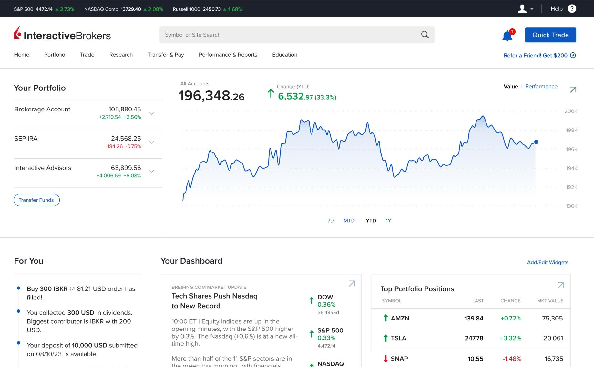

## Table of Contents

## What is Interactive Brokers and what services do they offer?

Interactive Brokers is a company that helps people and businesses buy and sell things like stocks, bonds, and other investments. They are known for their low fees and for being good at using technology to make trading easier. People from many different countries use Interactive Brokers because it lets them trade in lots of different markets around the world.

They offer many services to their customers. One main service is letting people trade stocks, options, futures, and forex from one account. They also have tools that help people decide what to buy and sell, like charts and research reports. Another service they offer is the ability to borrow money to buy more investments, which can be risky but can also lead to bigger profits. Overall, Interactive Brokers is a popular choice for people who want to trade a lot and need a powerful platform to do it.

## How long has Interactive Brokers been in operation?

Interactive Brokers has been around for a long time. They started their business in 1977. That means they have been helping people buy and sell investments for over 40 years.

At first, they were called T.P. & Co. Later, in 1993, they changed their name to [Interactive Brokers](/wiki/interactive-brokers-api). Over the years, they have grown a lot and now help people all over the world with their trading needs.

## Is Interactive Brokers regulated by financial authorities?

Yes, Interactive Brokers is regulated by financial authorities. This means they follow rules set by government groups to make sure they are doing things the right way. In the United States, they are watched over by the Securities and Exchange Commission (SEC) and the Financial Industry Regulatory Authority (FINRA). These groups make sure that Interactive Brokers is honest and fair with its customers.

Interactive Brokers is also regulated in other countries where they do business. For example, in the United Kingdom, they are overseen by the Financial Conduct Authority (FCA). In Canada, they are regulated by the Investment Industry Regulatory Organization of Canada (IIROC). Being regulated in many places shows that Interactive Brokers follows rules in different parts of the world to keep their customers safe.

## What types of security measures does Interactive Brokers use to protect user data and funds?

Interactive Brokers takes security very seriously to keep your data and money safe. They use strong encryption to protect your information when you log in and do trades. This means your data is turned into a secret code that only Interactive Brokers can understand. They also have two-[factor](/wiki/factor-investing) authentication, which means you need two ways to prove it's really you before you can get into your account. This makes it much harder for someone else to get in, even if they know your password.

They also keep your money safe by following strict rules from financial regulators. Interactive Brokers keeps customer money separate from their own money, so if something goes wrong with the company, your money is still safe. They also have insurance to protect your money if something bad happens. Plus, they watch for any strange activity on your account and will let you know if they see anything that doesn't look right. All these steps help make sure your data and funds are well-protected.

## How does Interactive Brokers handle client funds and what protections are in place?

Interactive Brokers takes good care of your money by keeping it separate from their own money. This is called "segregation of funds." It means that even if something bad happens to Interactive Brokers, your money is safe and not mixed up with their money. They also follow strict rules set by financial regulators to make sure they handle your money the right way.

To give you extra protection, Interactive Brokers has insurance. This insurance helps protect your money if something goes wrong. They also watch your account all the time to make sure no one is trying to steal your money. If they see anything strange, they will let you know right away. All these steps help make sure your money is safe with Interactive Brokers.

## What is the track record of Interactive Brokers in terms of security breaches or incidents?

Interactive Brokers has a good track record when it comes to keeping your information and money safe. They have not had any big security breaches that have caused a lot of harm to their customers. This shows that they take security seriously and work hard to protect you.

Even though they have been good at keeping things safe, no company is perfect. There have been a few small incidents over the years, but Interactive Brokers has always fixed these problems quickly. They keep improving their security to make sure your data and money stay safe.

## How does Interactive Brokers compare to other brokers in terms of safety and security?

Interactive Brokers is known for being very safe and secure compared to other brokers. They use strong encryption and two-factor authentication to protect your information and money. They also keep your money separate from their own, which means your money is safe even if something bad happens to the company. They have insurance to protect your money and they watch your account all the time to stop any strange activity. This makes them a good choice if you care a lot about safety.

Other brokers might offer similar security measures, but not all of them are as strict as Interactive Brokers. Some brokers might not use two-factor authentication or might not keep your money as separate from their own. Interactive Brokers is also regulated by many financial authorities around the world, which means they have to follow strict rules to keep your money safe. Overall, Interactive Brokers is often seen as one of the safest choices for people who want to trade stocks and other investments.

## What insurance coverage does Interactive Brokers provide for client accounts?

Interactive Brokers has insurance to help protect your money. They use the Securities Investor Protection Corporation (SIPC) which covers up to $500,000, including a $250,000 limit for cash. This means if Interactive Brokers goes bankrupt, SIPC helps make sure you get your money back up to those limits.

On top of SIPC, Interactive Brokers also has extra insurance from Lloyd's of London. This extra insurance covers up to $30 million per customer, with a total of $150 million for all customers combined. This means you have even more protection for your money, making it safer to keep your investments with Interactive Brokers.

## What are the user experiences and reviews regarding the safety of Interactive Brokers?

Many users feel safe using Interactive Brokers. They like that the company uses strong security measures like encryption and two-factor authentication. People also feel good knowing their money is kept separate from the company's money, which makes them feel more secure. Reviews often mention that Interactive Brokers has a good track record with no major security breaches, which adds to the trust users have in the platform.

However, some users have mentioned small issues or glitches with the platform, but these are usually fixed quickly. Overall, the general feeling among users is that Interactive Brokers takes safety seriously and works hard to protect their money and personal information. Many users appreciate the extra insurance coverage, like the SIPC and Lloyd's of London policies, which give them peace of mind knowing their investments are well-protected.

## How transparent is Interactive Brokers about their operations and security practices?

Interactive Brokers is pretty open about how they work and keep things safe. They tell you a lot about the rules they follow and the groups that watch over them. They also share details about the insurance they have to protect your money, like the SIPC and the extra coverage from Lloyd's of London. This helps people feel more sure that their money is safe.

They also talk about the security steps they take, like using strong encryption and two-factor authentication. They explain how they keep your money separate from their own and how they watch your account for anything strange. By being clear about all these things, Interactive Brokers helps people trust them more and feel safe using their services.

## What advanced security features does Interactive Brokers offer for expert traders?

Interactive Brokers offers some special security features that expert traders really like. They use something called two-factor authentication, which means you need two ways to prove it's really you before you can get into your account. This makes it much harder for someone else to get in, even if they know your password. They also have something called Secure Login System, which adds an extra step to make sure no one is trying to trick you into giving away your information.

Another cool feature is their Client Portal, which lets you set up different levels of access for different people. This means you can let someone else help manage your account, but you can control exactly what they can see and do. This is really helpful for expert traders who might work with a team or need to share some information but not all of it. Plus, Interactive Brokers keeps a close eye on your account all the time to catch any strange activity, which gives expert traders extra peace of mind.

## How does Interactive Brokers comply with international financial regulations and standards?

Interactive Brokers works hard to follow the rules set by financial regulators all over the world. They are watched over by groups like the Securities and Exchange Commission (SEC) in the United States and the Financial Conduct Authority (FCA) in the United Kingdom. This means they have to do things the right way in each country where they do business. They make sure to keep customer money separate from their own money, which is a big rule that helps keep your money safe. They also follow rules about how they handle trades and report information to make sure everything is fair and honest.

To make sure they are following all these rules, Interactive Brokers has teams of people who know a lot about the laws in different countries. They keep up with changes in the rules and make sure the company is always doing what it's supposed to do. This helps them stay in good standing with regulators and gives customers peace of mind knowing that Interactive Brokers is working hard to follow the law everywhere they operate.

## References & Further Reading

[1]: ["Interactive Brokers - Markets and Products"](https://www.interactivebrokers.com/en/index.php?f=1562). Interactive Brokers Official Website.

[2]: ["Interactive Brokers Annual Reports"](https://www.interactivebrokers.com/en/index.php?f=559). Interactive Brokers Official Website.

[3]: ["FCA Register"](https://register.fca.org.uk/). Financial Conduct Authority.

[4]: [What Happened At MF Global?](https://www.investopedia.com/financial-edge/0312/what-happened-at-mf-global.aspx)

[5]: ["What SIPC Protects"](https://www.sipc.org/for-investors/what-sipc-protects). SIPC.

[6]: ["Interactive Brokers Eligibility Criteria"](https://www.interactivebrokers.com/en/index.php?f=4969). Interactive Brokers, 2022.