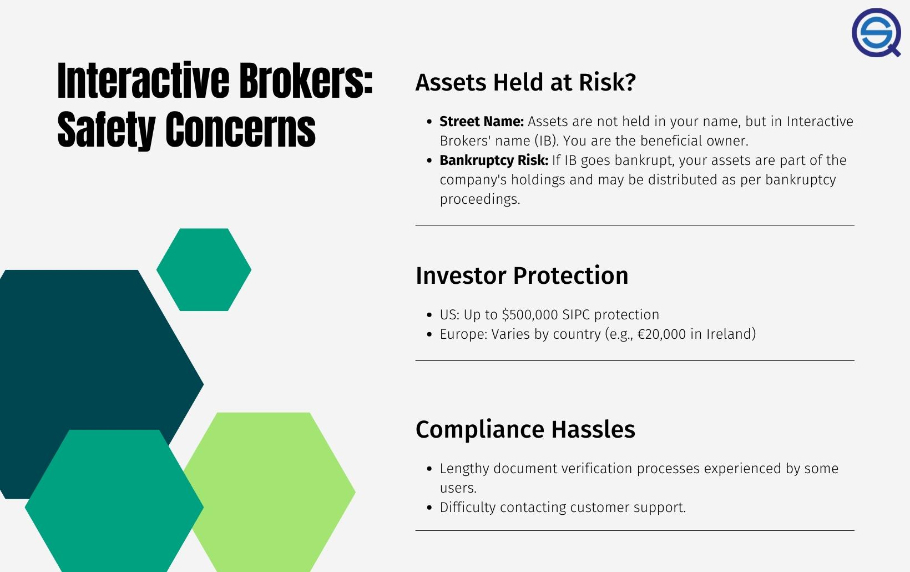

Algorithmic trading, the use of computer algorithms to automate trading decisions and execute orders, has gained significant traction over recent years. With advancements in technology and the growing availability of financial data, traders can now leverage sophisticated algorithms to analyze markets and implement strategies at speeds far exceeding human capabilities. This form of trading is prevalent in various financial markets, such as equities, forex, and commodities, due to its ability to process vast amounts of data quickly and reduce transaction costs.

Interactive Brokers (IB) has emerged as a preferred platform for algorithmic traders. Established in 1978, IB is a well-regarded brokerage providing a wide array of services suited for both retail and institutional clients. Its reputation is underpinned by its emphasis on offering low-cost trading, extensive market access, and advanced technology infrastructure. These attributes make Interactive Brokers particularly attractive for those engaged in algorithmic trading, who require robust and reliable platforms to deploy their automated systems.



The purpose of this article is to evaluate the safety of Interactive Brokers as a platform for algorithmic trading. As traders increasingly rely on technology to manage their investment portfolios, understanding the security and stability offered by a broker becomes paramount. This assessment will explore Interactive Brokers' asset protection mechanisms, regulatory compliance, and customer support, providing traders with a comprehensive view of the potential risks and benefits associated with using their services for algorithmic trading.

## Table of Contents

## Understanding Interactive Brokers

Interactive Brokers, founded in 1978 by Thomas Peterffy, is a prominent player in the brokerage industry, known for its comprehensive platforms tailored for various investment strategies, including algorithmic trading. As a significant entity in this space, Interactive Brokers (IB) stands out due to its robust infrastructure, diverse market access, and competitive pricing, making it a preferred choice for both individual and institutional traders globally.

### History and Profile

Thomas Peterffy, a pioneer in digital trading, established Interactive Brokers as a subsidiary of his financial technology company, which initially focused on market-making activities. Over the years, IB evolved to become one of the largest brokerage firms, leveraging its technological edge to offer various trading and investment services. The firm is headquartered in Greenwich, Connecticut, and offers clients a wide-ranging suite of products, including stocks, options, futures, forex, bonds, and mutual funds across more than 135 markets worldwide.

### Key Features for Algorithmic Trading

[Interactive Brokers](/wiki/interactive-brokers-api) has carved a niche among algorithmic traders due to its advanced trading tools and APIs, which facilitate the design and execution of complex trading algorithms. One of the critical offerings is the Interactive Brokers API, which supports multiple programming languages such as Python, Java, and C++, allowing seamless integration with custom trading systems. This API provides direct access to IB's extensive market data and trading functionalities, enabling traders to implement, test, and refine their algorithms efficiently.

Moreover, the Trader Workstation (TWS), IB’s flagship trading platform, is equipped with features that are vital for [algorithmic trading](/wiki/algorithmic-trading), such as customizable charts, advanced order types, and real-time data analytics. Additionally, the firm's support for FIX protocol and third-party software integrations bolsters its capability to cater to the needs of sophisticated traders employing automated strategies.

### Competitive Commission Rates and Market Access

One of the distinguishing attributes of Interactive Brokers is its cost-effective commission structure. IB offers some of the lowest commission rates in the industry, which is a significant advantage for high-frequency and algorithmic traders where transaction costs can substantially impact overall profitability. Depending on the market and asset class, IB provides tiered or fixed pricing models that help traders manage costs effectively.

Interactive Brokers also offers unparalleled market access, providing clients with the ability to trade on over 135 exchanges worldwide. This extensive market connectivity affords traders the flexibility to diversify their portfolios and implement global trading strategies. Moreover, the firm provides linked daily portfolios, which allow for convenient management of multiple trading accounts under a unified interface—an attractive feature for fund managers and institutional clients.

In summary, Interactive Brokers’ combination of advanced trading technology, competitive pricing, and expansive market access makes it a compelling choice for algorithmic traders seeking a reliable and efficient trading partner.

## Safety of Interactive Brokers: Asset Protection

Assets held "in street name" refer to a brokerage practice where securities are registered in the name of the brokerage firm rather than in the client's name. This approach facilitates the rapid transfer and trading of securities, streamlines account management, and reduces paperwork. However, while it provides efficiency benefits, it also raises specific concerns regarding asset protection, especially in scenarios where the brokerage may face financial instability or bankruptcy.

In the unfortunate event of broker bankruptcy, client assets held "in street name" may be at risk of being temporarily "frozen." This occurs because the securities, technically registered under the broker's name, might be subject to legal proceedings as part of the broker's asset pool. Nevertheless, clients at Interactive Brokers (IB) can find reassurance in the regulatory safeguards designed to protect traders and their investments.

Interactive Brokers is registered with the Securities Investor Protection Corporation (SIPC), which provides limited protection to traders. Specifically, the SIPC can offer coverage of up to $500,000, including a maximum of $250,000 for cash claims, per client in cases where a brokerage fails. Although SIPC does not protect against the loss of market value, it plays a crucial role in ensuring the recovery of client securities and cash.

Beyond SIPC coverage, IB implements additional asset protections through its membership with the International Financial Services Commission (IFSC) and adherence to strict financial practices and reporting requirements. These affiliations and practices include maintaining segregated client accounts, which ensures that client funds and securities are kept separate from the broker's own assets.

Moreover, IB's compliance with rigorous financial regulations, such as those imposed by the U.S. Securities and Exchange Commission (SEC) and the Commodity Futures Trading Commission (CFTC), further fortifies the stance of asset protection. These regulations require brokers to submit regular financial disclosures and adhere to stringent capital requirements, providing additional layers of oversight and security for traders.

In summary, while the practice of holding assets "in street name" can pose certain risks in the event of a broker's financial distress, Interactive Brokers implements comprehensive regulatory frameworks and safeguards to protect traders' assets. SIPC coverage, along with strict adherence to financial regulations and the maintenance of segregated accounts, provides robust security measures, making Interactive Brokers a safe option for algorithmic traders seeking asset protection.

## Compliance and Support Concerns

Interactive Brokers (IB) is recognized for its robust trading platform, yet it faces considerable scrutiny concerning its compliance and support services. Traders frequently encounter challenges with its compliance practices due to stringent regulatory requirements that IB must adhere to. This strict compliance environment can occasionally translate into a slow and cumbersome process for clients who need rapid action to capitalize on volatile markets. As a result, the necessary checks and balances that are part of IB's compliance processes can frustrate traders dependent on quick turnaround times for approval and verification of trading activities.

Customer support and back-office efficiency at Interactive Brokers have also been pointed out as needing improvement. Users report difficulties in obtaining timely assistance from IB's support team, an issue that becomes critical when time-sensitive problems arise during trading hours. This can be attributed to the extensive protocols and red tape involved in IB's compliance structure, which, while designed to protect investor interests and the firm's integrity, sometimes slows resolution of trader concerns.

The impact of these compliance and support challenges on trading operations is significant. Delays in addressing issues can lead to missed trading opportunities and potential financial losses. Furthermore, the complexities involved in resolving compliance matters often require traders to spend additional time coordinating with back-office staff, which can divert attention from actual trading activities.

To mitigate these impacts, traders operating with Interactive Brokers should consider strategies to streamline their interactions with the platform's support and compliance teams. This might include maintaining thorough documentation of all trading activities and promptly addressing any notifications from IB to avoid potential compliance issues. Additionally, using the extensive resources and support materials available can help traders better navigate IB's platform, potentially limiting the necessity for engaging with formal support channels.

In summary, while IB's compliance and support frameworks are designed to ensure adherence to regulatory standards, the resulting slow processes can hinder trading efficiency. Traders looking to leverage IB's advanced trading capabilities must be prepared to navigate these intricacies to maintain optimal trading performance.

## Interactive Brokers in Algo Trading

Interactive Brokers (IB) provides a robust suite of tools and services for algorithmic trading, making it an attractive choice for traders looking to automate their strategies. One of the primary advantages is the Interactive Brokers API, which enables seamless integration with various programming environments, allowing for the development and execution of complex trading strategies.

**Benefits of Using IB API**

The IB API supports multiple programming languages, including Python, Java, C++, and others, thus providing flexibility to traders familiar with different coding environments. This adaptability is crucial for traders designing bespoke trading algorithms tailored to specific market conditions. The API grants access to real-time market data, historical data, and supports trading operations such as placing orders and managing portfolios programmatically, eliminating human errors and enabling faster decision-making processes.

For example, a simple Python script utilizing the IB API might include:

```python
from ibapi.client import EClient
from ibapi.wrapper import EWrapper

class IBapi(EWrapper, EClient):
    def __init__(self):
        EClient.__init__(self, self)

ib = IBapi()
ib.connect('127.0.0.1', 7496, 123)
ib.run()
```

This script establishes a connection to the IB TWS (Trader WorkStation), allowing further commands to automate trading processes.

**Compatibility with Algorithmic Strategies**

Interactive Brokers' platform is compatible with a wide array of algorithmic trading strategies. Whether traders employ high-frequency trading ([HFT](/wiki/high-frequency-trading-strategies)), statistical [arbitrage](/wiki/arbitrage), or [machine learning](/wiki/machine-learning) models, IB provides the necessary infrastructure. Its vast market access across different asset classes, such as equities, options, futures, [forex](/wiki/forex-system), and bonds, allows traders to deploy diversified strategies globally.

**Limitations and Challenges**

Despite its advantages, some limitations and challenges are associated with using IB for algorithmic trading. One significant hurdle is the steep learning curve for newcomers to algorithmic trading or the IB platform. Although documentation is comprehensive, integrating sophisticated strategies can be complex, demanding both programming expertise and an understanding of the financial markets.

Moreover, the IB API, while powerful, has rate limits and throttling constraints, which can impact high-frequency trading strategies requiring rapid order placements and cancellations. Finally, as with any technology-driven trading approach, connectivity issues or technical glitches can pose risks, potentially leading to unexpected trading outcomes or execution errors.

In conclusion, while Interactive Brokers offers extensive benefits for algorithmic traders through its flexible API and broad market access, traders must be aware of the inherent limitations and challenges to effectively leverage the platform for automated trading.

## Comparative Analysis

Interactive Brokers (IB) is often compared to other algorithmic trading platforms due to its robust offerings and global presence. This section provides a comparative analysis, focusing on how Interactive Brokers stacks up against competitors like Saxo Bank, by evaluating their pros and cons based on functionality, cost-effectiveness, user experience, and market perspectives.

Interactive Brokers is a popular choice for algorithmic trading, primarily because of its comprehensive API, which supports multiple programming languages such as Python, Java, and C++. The Interactive Brokers API facilitates the integration of automated trading systems, offering access to a broad range of financial instruments globally and providing real-time market data [1]. The broker's competitive commission structure, which includes tiered pricing with lower costs for high-[volume](/wiki/volume-trading-strategy) traders, is another attractive feature. Moreover, Interactive Brokers offers a highly advanced trading platform, Trader Workstation (TWS), which supports algorithmic trading strategies through features like basket trading, market scanners, and advanced charting tools.

In contrast, Saxo Bank is also noted for its strong algo trading capabilities but targets a different segment of the trading community. Known for a sophisticated trading platform, SaxoTraderGO, and SaxoTraderPRO, Saxo Bank provides an extensive range of instruments, notably excelling in forex and Contract for Difference (CFD) trading [2]. However, Saxo Bank's commission rates can be higher than IB, although they offer tiered pricing that can be more favorable for certain trade sizes or volumes. Saxo Bank's platform is particularly noted for its user-friendly interface and advanced analytics tools, which make it appealing to professional traders who appreciate detailed market insights and strategy management.

When analyzing customer experiences, Interactive Brokers receives praise for its wide market access and sophisticated technology infrastructure, which are key for serious algo traders. Nevertheless, it faces criticism regarding its customer support and the complexity of its platform, which may pose a learning curve for new users. Existing traders often highlight the necessity for thorough platform training and self-research to effectively navigate its systems [3].

On the other hand, Saxo Bank's user reviews frequently laud its customer service and educational resources, making it advantageous for traders who might require more support or are still building their trading skills. However, higher fees and the bank's focus on larger clients may deter some smaller or cost-sensitive traders.

Overall, while Interactive Brokers presents a cost-effective and technically advanced environment for algorithmic trading, it requires users to be proficient with its complex interfaces. Saxo Bank, conversely, delivers ease of use and excellent service, albeit at a potentially higher cost, which could be a limiting [factor](/wiki/factor-investing) depending on the trader's profile and needs.

References:
1. [Interactive Brokers API Documentation](https://www.interactivebrokers.com/en/index.php?f=5041)
2. [Saxo Bank Platforms Overview](https://www.home.saxo/en/platforms)
3. [Trading Community Reviews of Interactive Brokers](https://www.trustpilot.com/review/interactivebrokers.com)

## Conclusion

Interactive Brokers (IB) presents itself as a robust choice for algorithmic trading due mainly to its comprehensive suite of trading tools, competitive commission structure, and extensive range of markets. Despite these advantages, safety is a multifaceted consideration that algorithmic traders must evaluate before committing to a platform.

Interactive Brokers offers multiple layers of asset protection. Assets held "in street name" limit traders' direct ownership but allow ease of transaction and are safeguarded through regulatory bodies like the Securities Investor Protection Corporation (SIPC) in the United States. This reduces the risk of asset loss due to broker bankruptcy, although the threat of asset 'freezing' in adverse financial scenarios remains.

Moreover, IB's adherence to stringent regulatory requirements provides an added layer of assurance. However, it is crucial to recognize that while regulations offer frameworks and protections, they do not eliminate all risks associated with algorithmic trading. Traders must remain vigilant regarding operational risks, market changes, and compliance updates.

A noted drawback with IB is its customer support and back-office efficiency. Inconsistent responses and slow compliance times can hinder trading operations, especially when time-sensitive decisions are necessary. This aspect is often highlighted in customer reviews, indicating room for improvement.

From a personal perspective, Interactive Brokers is a compelling choice for many algo traders, given its wide market access, reliable API for automated systems, and competitive cost structure. However, traders should weigh these benefits against the potential challenges associated with customer support and compliance delays. Employing risk mitigation strategies, such as diversifying assets and maintaining effective communication channels with IB, can help in managing these challenges.

In conclusion, Interactive Brokers stands as a safe and viable platform for algorithmic trading but is not without its complications. Traders are advised to conduct thorough research, consider the platform's inherent risks, and explore protective strategies to optimize their trading outcomes. Balancing these considerations can significantly enhance the safety and efficacy of algorithmic trading with Interactive Brokers.

## FAQs

Is Interactive Brokers a safe platform for algo trading?

Interactive Brokers (IB) is widely regarded as a reliable and safe platform for algorithmic trading. It offers extensive features suitable for automated strategies, such as a robust API that facilitates seamless integration with various trading systems. Regulators like the Financial Industry Regulatory Authority (FINRA) and the Securities and Exchange Commission (SEC) in the United States provide oversight to uphold the integrity and security of IB's services. Despite its reputation for safety, potential users should conduct their assessments in line with legal and personal considerations.

What are the main risks of using Interactive Brokers?

While Interactive Brokers is equipped with high-level security measures, certain risks persist. One primary concern is the risk associated with assets being held "in street name," which means that securities purchased by investors are registered in IB's name rather than the customer's name. This could become a risk if the broker faces financial difficulties, potentially leading to asset freezing. Additionally, occasional criticisms of IB's customer support and compliance processes indicate the possibility of delays during urgent situations. These delays could hinder trading operations if swift action is needed.

How can traders mitigate these risks when using IB?

Traders can undertake several strategies to mitigate the risks associated with using Interactive Brokers. Firstly, conducting regular vigilance by monitoring both account activities and market positions can help detect any anomalies early on. Moreover, diversifying assets across different brokers or financial institutions can minimize exposure to a single point of failure. Engagement with interactive tools and forums offered by IB can provide insights into utilizing the platform effectively. Additionally, ensuring a comprehensive understanding of the market conditions and maintaining an updated knowledge base can enhance decision-making. Lastly, maintaining a direct line of communication with IB's support staff can facilitate quicker responses and resolution of potential issues.

## References & Further Reading

[1]: Bergstra, J., Bardenet, R., Bengio, Y., & Kégl, B. (2011). ["Algorithms for Hyper-Parameter Optimization."](https://papers.nips.cc/paper/4443-algorithms-for-hyper-parameter-optimization) Advances in Neural Information Processing Systems 24.

[2]: ["Advances in Financial Machine Learning"](https://www.amazon.com/Advances-Financial-Machine-Learning-Marcos/dp/1119482089) by Marcos Lopez de Prado

[3]: ["Evidence-Based Technical Analysis: Applying the Scientific Method and Statistical Inference to Trading Signals"](https://www.amazon.com/Evidence-Based-Technical-Analysis-Scientific-Statistical/dp/0470008741) by David Aronson

[4]: ["Machine Learning for Algorithmic Trading"](https://github.com/stefan-jansen/machine-learning-for-trading) by Stefan Jansen

[5]: ["Quantitative Trading: How to Build Your Own Algorithmic Trading Business"](https://books.google.com/books/about/Quantitative_Trading.html?id=j70yEAAAQBAJ) by Ernest P. Chan