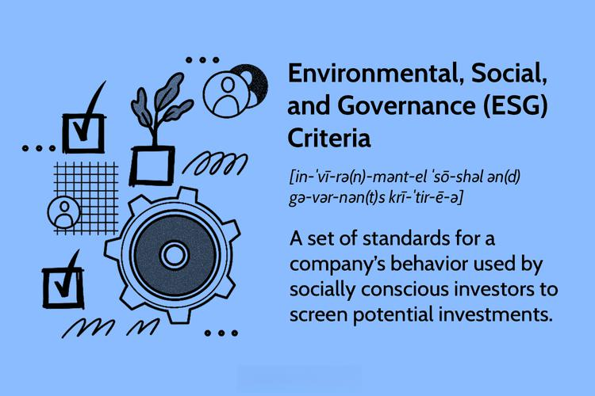

The dichotomy between 'good' and 'bad' investing strategies presents a fascinating area of study for investors and financial analysts. ESG (Environmental, Social, and Governance) investing represents 'good' strategies, emphasizing responsible and ethical practices in finance. ESG investments prioritize firms with sustainable environmental practices, social responsibility, and fair governance policies. On the opposite spectrum lies 'sin' investing, which involves redirecting funds towards industries often perceived as immoral. This includes sectors like tobacco, alcohol, and gambling.

This article seeks to unravel the allure of these contrasting strategies, particularly in the age of algorithmic trading. By evaluating both ESG and sin investments, we can shed light on which strategy might yield superior financial returns. The examination includes assessing whether industry labels such as 'good' or 'bad' significantly sway financial performance and how these strategies align with contemporary ethical considerations in investing.

Furthermore, the integration of algorithmic trading systems raises intriguing questions about how these systems align or conflict with ethical investment strategies. Algorithms are transforming financial markets, and their ability to incorporate ESG or sin metrics could significantly influence the investment landscape. By analyzing how these automated systems evaluate different investing strategies, we can gain insights into their potential impact on global finance. The challenge remains to understand whether algorithmically driven investments can maintain or refine the values that ESG and sin strategies represent, ultimately influencing investor decision-making in the burgeoning field of ethical finance.

## Table of Contents

## Understanding ESG Investing

[ESG](/wiki/esg-investing) investing, which stands for Environmental, Social, and Governance investing, prioritizes companies that adhere to high standards in these three areas. This investment strategy emphasizes sustainability, ethical business practices, and accountable corporate governance. As the concept of conscious capitalism gains traction, an increasing number of investors are looking to ESG investments as not only financially viable long-term strategies but also as ones that align with personal values and societal progress.

ESG companies often showcase several relative strengths. They tend to be forward-thinking, with operations that are geared toward sustainability and resilience. This forward-looking approach can create more future-proof business models. Additionally, ESG companies frequently attract top talent, particularly from Millennial and Gen Z demographics, who are known for prioritizing value-driven and ethical career choices.

Despite the positive perception of ESG investing, the approach is not without its challenges. One significant issue is the lack of standardized scoring systems. The absence of uniform criteria for what constitutes an ESG-compliant investment leads to ambiguity and inconsistency. This gap can complicate the evaluation process for investors seeking to identify genuinely compliant companies.

Moreover, the potential for 'greenwashing'—a deceptive practice where companies falsely claim adherence to ESG principles to enhance public perception—poses another challenge. Greenwashing can undermine the integrity of ESG investments and lead to skepticism among stakeholders, potentially diluting the trust in ESG assessments.

In conclusion, while ESG investing presents a framework for aligning financial pursuits with broader ethical considerations, it is imperative to recognize its complexities and the need for standardized measures to ensure authenticity and accountability in this evolving investment landscape.

## Exploring Sin Investing

Sin investing refers to investing in companies within industries traditionally viewed as socially or morally dubious, such as those related to alcohol, tobacco, and gambling. Despite the negative perceptions that often accompany these industries, stocks associated with such companies frequently offer robust financial returns. One primary reason is their recession-proof nature; the demand for what are considered "sinful" products tends to remain consistent even in economic downturns. This consistent demand translates into stable revenues and dividends for investors, making these stocks attractive during times of financial uncertainty. 

Sin stocks also possess a track record of outperforming traditional stock indices, a testament to their resilience against economic and regulatory challenges. This performance can be attributed to several factors, including the inelasticity of demand for their products. Consumers tend to purchase these goods regardless of price changes or economic conditions, ensuring steady sales and profits. Furthermore, these industries often benefit from high barriers to entry. Government regulations impose strict controls that limit the number of competitors in the market, protecting established firms and contributing to their sustained profitability.

Despite the financial allure, investing in sin stocks does not come without its dilemmas. There are significant moral implications to consider, as these investments often conflict with the ethical criteria important to many investors. The controversial nature of such investments raises questions about the social responsibility of profiting from industries linked to addiction and negative health outcomes. This ethical dimension deters a segment of socially conscious investors who prioritize alignment with socially responsible and sustainable practices. 

For investors who focus on ethical considerations, the appeal of sin stocks poses a challenge. Balancing financial returns with personal values requires careful consideration. Although sin stocks may deliver compelling financial performance, they often clash with broader ethical commitments to promote societal well-being and sustainability. Consequently, potential investors should weigh these factors comprehensively when deciding whether to engage in sin investing. 

Overall, while the financial incentives of sin investing can be substantial, its ethical implications and potential regulatory hurdles necessitate a nuanced evaluation by investors aiming to balance financial performance with ethical sensibilities.

## Algorithmic Trading and Ethical Considerations

Algorithmic trading has revolutionized the way investments are made, seamlessly incorporating ethical dimensions such as Environmental, Social, and Governance (ESG) scores and 'sin' metrics into its computational frameworks. These sophisticated models allow for the alignment of trades with an investor's ethical considerations while maintaining financial performance as a key objective.

Algorithms set to evaluate ESG scores analyze various datasets to assess a company's commitment to sustainable practices. This involves studying environmental indicators, like carbon emissions; social factors, such as employee relations; and governance aspects, which include corporate transparency. The scoring process often leverages [machine learning](/wiki/machine-learning) techniques to predict future performance, enabling algorithms to recommend trades based on projected ESG compliance and risks associated with a company's ethical practices.

Conversely, algorithms focused on sin stock investments consider metrics unique to industries like tobacco, alcohol, and gambling. These models dissect historical data to highlight consistent demand trends and potential regulatory impacts, using them to forecast price movements and trading opportunities. This automated analysis can scrutinize the resilience of these stocks in challenging economic landscapes, offering a counterpoint to the ESG approach.

Algorithmic trading systems also work to neutralize human bias prevalent in ethical investment decisions. By relying on data rather than personal judgment, these systems ensure a rigorous and impartial approach to investment strategy. This is invaluable in ethical investing, where emotions and subjective ethics can otherwise skew financial judgment. For instance, at the portfolio optimization level, algorithms use advanced mathematical models such as the Markowitz Mean-Variance model:

$$
\text{Minimize} \quad \frac{1}{2} w^T \Sigma w - \lambda \mu^T w
$$

where $w$ is the vector of asset weights, $\Sigma$ represents the covariance matrix of asset returns, and $\mu$ is the expected return vector. This ensures that an investment portfolio maintains a balance between risk and return while incorporating ethical considerations by penalizing or rewarding ESG or sin factors.

Artificial intelligence (AI) continues to evolve within [algorithmic trading](/wiki/algorithmic-trading). AI systems provide investors with advanced analytics and predictive modeling tools that facilitate balancing financial objectives with personal values. By learning from vast amounts of data, AI systems refine their methodologies over time, improving their ability to [factor](/wiki/factor-investing) in ethical considerations while making profitable investment choices.

As AI integrates deeper into algorithmic trading, it constantly adapts to new ethical challenges and investment paradigms, offering a more nuanced understanding of how market sentiment and ethical cues influence stock performance. This ongoing evolution ensures that investment strategies remain both ethically and financially grounded, catering to the dual demands of modern investors looking to fulfill their moral and monetary aspirations.

## Performance Analysis: ESG vs. Sin Stocks

Numerous studies highlight that both ESG (Environmental, Social, and Governance) stocks and sin stocks tend to outperform traditional investments, though their mechanisms for success diverge significantly.

ESG stocks are characterized by their commitment to sustainable practices and corporate responsibility, which are increasingly valued by investors. Companies with strong ESG metrics often experience future growth facilitated by sustainable operations, which not only mitigate environmental and social risks but also respond to regulatory demands and consumer preferences for ethical practices. ESG investments are often supported by a growing consumer base that prioritizes sustainability, thus fostering long-term profitability.

In contrast, sin stocks—such as those in the alcohol, tobacco, and gambling industries—often generate profits through consistent demand. This continued demand persists even during economic downturns, as these products are perceived as 'recession-proof'. Additionally, regulatory barriers limit new competitors, which allows existing players to maintain strong market positions and profitability. This limited competition can lead to higher margins and reliable returns over time, despite the ethical controversy surrounding these industries.

When analyzing the historical performance data of ESG versus sin stocks, it is apparent that each type of investment thrives under distinct market conditions. ESG stocks tend to perform well during periods of economic stability and growth, when there is a heightened awareness of sustainability issues. Sin stocks, however, may not only withstand but prosper during economic contractions, due to their inelastic demand.

Understanding the influence of market sentiment and economic cycles is crucial in predicting future performance for both ESG and sin stocks. ESG investments may benefit from stronger sentiment linked to environmental and social awareness. Conversely, sin stocks might gain appeal in contexts where economic stability threatens discretionary spending but steadfast demand persists.

A balanced investment portfolio that incorporates both ESG and sin strategies may optimize returns, while also catering to diverse ethical considerations. By strategically blending these contrasting approaches, investors can potentially hedge against varying market conditions and align with broad personal and societal values. Diversification across these investment categories can enable a robust risk management strategy that both exploits the strengths of each type and reconciles their ethical impacts.

## Conclusion: Strategic Implications and Future Trends

In the converging fields of ethical considerations and financial objectives, investors face complex decisions. Traditional investment strategies are increasingly juxtaposed with modern ethical paradigms within the rapidly transforming domain of algorithmic trading. The intricacies of ESG (Environmental, Social, and Governance) and sin investing prompt a nuanced analysis that informs the selection of an optimal investment approach.

Understanding both ESG and sin investments is crucial for aligning investments with one's values and for capitalizing on their financial benefits. ESG investments emphasize sustainability and social responsibility, appealing to investors focused on societal impact. However, these strategies can face challenges such as inconsistent ESG scoring standards and the risk of 'greenwashing' by firms aiming to enhance their public image without real commitment to ethical practices. Conversely, sin stocks often display resilience due to steady consumer demand and limited industry competition, although they may conflict with investor ethics due to their association with morally questionable sectors like tobacco and gambling.

The growing integration of ethical dimensions into algorithmic trading systems is indicative of broader shifts in investment paradigms. These systems deploy advanced data analytics to assess ESG scores and sin stock performance, reducing human biases and offering automated alignment of investments with ethical stances. This trend towards the incorporation of ethical considerations in technology-driven trading reflects increasing accountability and transparency in financial markets.

Investors are therefore encouraged to make informed choices, guided by both rigorous financial analysis and personal ethical convictions. The effectiveness of ESG and sin strategies varies based on market conditions; hence, a tailored investment mix could potentially leverage both approaches. Such balanced portfolios might achieve optimal returns while respecting diverse ethical principles.

As markets evolve, staying abreast of performance trends and ongoing ethical debates is vital. This vigilance ensures that investors can navigate emerging opportunities and risks, fostering informed decision-making that harmonizes ethical imperatives with financial goals. The strategic integration of ethics into investing not only offers a path to sustainable returns but also advances the broader goal of aligning financial activities with societal betterment.

## References & Further Reading

[1]: Hale, J. (2004). ["Sin Stocks: Realistic Vice Or Virtue-Driven Profit?"](https://papers.ssrn.com/sol3/papers.cfm?abstract_id=3773971) Morningstar.

[2]: Eccles, R. G., Ioannou, I., & Serafeim, G. (2014). ["The Impact of Corporate Sustainability on Organizational Processes and Performance."](https://www.jstor.org/stable/24550546) Management Science, 60(11), 2835-2857.

[3]: Statman, M., & Glushkov, D. (2009). ["The Wages of Social Responsibility."](https://www.jstor.org/stable/40390194) Financial Analysts Journal, 65(4), 33-46.

[4]: Fabozzi, F. J., Ma, K. C., & Oliphant, B. J. (2008). ["Sin Stock Returns."](https://www.pm-research.com/content/iijpormgmt/35/1/82) The Journal of Portfolio Management, 35(1), 82-94.

[5]: Pedersen, L. H., Fitzgibbons, S., & Pomorski, L. (2021). ["Responsible Investing: The ESG Efficient Frontier."](https://www.sciencedirect.com/science/article/pii/S0304405X20302853) The Review of Financial Studies, 34(5), 2125–2168.