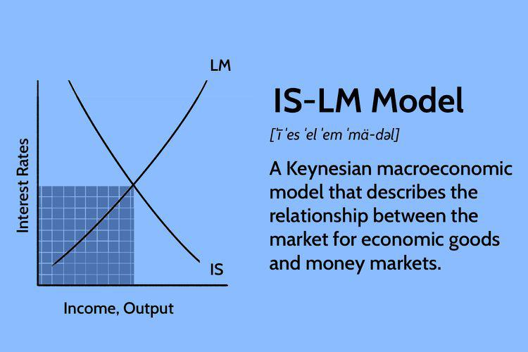

## Table of Contents

## What is the IS-LM model and why is it important in economics?

The IS-LM model is a tool used in economics to understand how interest rates and output in an economy are determined. It combines two curves: the IS curve, which shows the relationship between interest rates and the level of output that makes the goods market in equilibrium, and the LM curve, which shows the combinations of interest rates and output that balance the money market. When these two curves are plotted on a graph, their intersection point shows the equilibrium level of interest rates and output for the economy.

This model is important because it helps economists and policymakers understand how changes in fiscal policy (like government spending and taxes) and monetary policy (like the money supply and interest rates) affect the economy. For example, if the government increases spending, the IS curve shifts, which can lead to higher output and possibly higher interest rates. Similarly, if the central bank changes the money supply, the LM curve shifts, affecting both interest rates and output. By using the IS-LM model, policymakers can predict and manage the impacts of their decisions on the economy, helping to stabilize economic conditions and promote growth.

## How does the IS curve represent the goods market?

The IS curve shows how the goods market works. It tells us what level of output makes the total spending in the economy equal to the total production. This happens when what people, businesses, and the government want to buy matches what is being made. If interest rates go down, borrowing money becomes cheaper, so people and businesses might want to spend more. This can lead to more total spending and higher output. On the other hand, if interest rates go up, borrowing becomes more expensive, so spending might go down, leading to less output.

The IS curve is drawn as a downward sloping line on a graph. The horizontal axis shows the level of output, and the vertical axis shows the interest rate. Each point on the IS curve represents a combination of interest rate and output where the goods market is in balance. If you move along the curve, you can see how changes in the interest rate affect the level of output needed to keep the goods market in equilibrium. This helps economists understand how changes in interest rates can influence the overall economy.

## What does the LM curve signify in terms of the money market?

The LM curve shows how the money market works. It tells us what level of output makes people happy with the amount of money they have. This happens when the demand for money equals the supply of money. If interest rates go up, people might want to hold less money because they can earn more by putting it in the bank. If interest rates go down, people might want to hold more money because keeping it in the bank earns less.

The LM curve is drawn as an upward sloping line on a graph. The horizontal axis shows the level of output, and the vertical axis shows the interest rate. Each point on the LM curve represents a combination of interest rate and output where the money market is in balance. If you move along the curve, you can see how changes in the level of output affect the interest rate needed to keep the money market in equilibrium. This helps economists understand how changes in the economy can influence what happens with money.

## How are the IS and LM curves derived?

The IS curve is derived by looking at the goods market. It starts with the idea that total spending in the economy should equal total production. We look at how much people, businesses, and the government want to spend. This spending depends on the interest rate. When interest rates are low, borrowing is cheaper, so people and businesses spend more, which can lead to higher output. When interest rates are high, borrowing is more expensive, so spending goes down, leading to lower output. By figuring out different combinations of interest rates and output levels where spending equals production, we can draw the IS curve. It slopes downward because lower interest rates lead to higher output.

The LM curve is derived by looking at the money market. It starts with the idea that the demand for money should equal the supply of money. People want to hold money for everyday spending, and this demand depends on the interest rate and the level of output. When interest rates are high, people want to hold less money because they can earn more by putting it in the bank. When interest rates are low, they want to hold more money because keeping it in the bank earns less. Also, when output is high, people need more money for transactions, so demand for money goes up. By figuring out different combinations of interest rates and output levels where the demand for money equals the supply, we can draw the LM curve. It slopes upward because higher output leads to higher interest rates to keep the money market in balance.

## What are the equilibrium conditions in the IS-LM model?

The IS-LM model finds the equilibrium where the goods market and the money market are both happy at the same time. This happens where the IS curve and the LM curve meet on a graph. At this point, the interest rate and the level of output are just right so that what people, businesses, and the government want to spend matches what is being made, and the amount of money people want to hold equals the amount of money available.

When the economy is at this equilibrium, everything is balanced. If something changes, like the government spends more money or the central bank changes the money supply, the curves might shift, and the equilibrium will move to a new spot. This new spot shows the new interest rate and output level where both markets are happy again. Understanding this helps economists predict how the economy might react to different policies and events.

## How do shifts in the IS and LM curves affect the economy?

When the IS curve shifts, it means something has changed in the goods market. If the government decides to spend more money or cut taxes, people and businesses might spend more, so the IS curve moves to the right. This can lead to higher output and possibly higher interest rates because more spending means more demand for money. On the other hand, if the government spends less or raises taxes, the IS curve moves to the left, which can lead to lower output and lower interest rates. These shifts show how changes in government policy can affect the whole economy by changing what people and businesses want to spend.

Shifts in the LM curve happen when something changes in the money market. If the central bank decides to increase the money supply, people might need less interest to be happy with the money they have, so the LM curve moves to the right. This can lead to lower interest rates and higher output because more money means more spending. If the central bank decreases the money supply, the LM curve moves to the left, which can lead to higher interest rates and lower output. These shifts show how changes in the money supply can affect the economy by changing how much money people want to hold and spend.

## What are the key assumptions underlying the IS-LM model?

The IS-LM model is based on a few important ideas that help make it work. One big idea is that the economy is always trying to find a balance between what people want to spend and what is being made. This means that if something changes, like the government spending more money, the economy will adjust until spending and production match up again. Another key idea is that people's demand for money depends on the interest rate and how much they want to spend. If interest rates are high, people might want to hold less money because they can earn more by putting it in the bank. If interest rates are low, they might want to hold more money because keeping it in the bank earns less.

Another important assumption is that prices don't change quickly. This means that when we look at how changes affect the economy, we don't worry about prices going up or down right away. This helps keep the model simple and focused on how interest rates and output change. The model also assumes that the economy is closed, meaning it doesn't think about what happens with trade with other countries. By keeping things simple like this, the IS-LM model can help us understand how the economy works and how changes in government spending or the money supply can make a big difference.

## Can you explain the role of fiscal and monetary policy within the IS-LM framework?

In the IS-LM model, fiscal policy is all about how the government uses spending and taxes to affect the economy. When the government decides to spend more money or cut taxes, it can make people and businesses want to spend more. This shifts the IS curve to the right, which can lead to higher output and possibly higher interest rates. More spending means more demand for money, so the economy might need higher interest rates to keep everything balanced. On the other hand, if the government spends less or raises taxes, it can make people and businesses spend less. This shifts the IS curve to the left, leading to lower output and lower interest rates. So, by changing how much it spends or taxes, the government can help control how much is being made and spent in the economy.

Monetary policy, on the other hand, is about how the central bank changes the money supply to affect the economy. When the central bank decides to increase the money supply, it can make interest rates go down because there's more money for people to use. This shifts the LM curve to the right, which can lead to lower interest rates and higher output. More money means people might want to spend more, so the economy can grow. If the central bank decreases the money supply, it can make interest rates go up because there's less money to go around. This shifts the LM curve to the left, leading to higher interest rates and lower output. By controlling the money supply, the central bank can help manage how much people want to spend and how fast the economy grows.

## How does the IS-LM model handle interest rate and income determination?

The IS-LM model helps us understand how interest rates and income are decided in an economy. It does this by looking at two important parts of the economy: the goods market and the money market. The IS curve shows what's happening in the goods market. It tells us that when interest rates are low, people and businesses might want to borrow more money and spend more, which can lead to higher income or output. When interest rates are high, borrowing becomes more expensive, so spending might go down, leading to lower income. The IS curve slopes downward because lower interest rates lead to higher income.

The LM curve shows what's happening in the money market. It tells us that when interest rates are high, people might want to hold less money because they can earn more by putting it in the bank. When interest rates are low, people might want to hold more money because keeping it in the bank earns less. Also, when income or output is high, people need more money for everyday spending, so the demand for money goes up. The LM curve slopes upward because higher income leads to higher interest rates to keep the money market balanced. When we put the IS and LM curves together on a graph, the point where they cross shows the interest rate and income level where both the goods market and the money market are happy at the same time.

## What are the criticisms of the IS-LM model from a theoretical perspective?

Some people think the IS-LM model is too simple and doesn't show the whole picture of how the economy works. One big problem is that it assumes prices don't change quickly. In real life, prices can go up or down fast, and this can change how much people want to spend and how much businesses want to make. The model also doesn't think about what happens with trade with other countries, which can be really important for understanding the economy. Another issue is that it assumes people always want to spend the same amount of money no matter what, but in real life, people might change how much they want to spend based on what they think will happen in the future.

Another criticism is that the IS-LM model doesn't show how people's expectations can change things. If people think the economy will get better or worse, they might spend more or less money, and this can affect interest rates and income in ways the model doesn't show. Also, the model doesn't think about how businesses might change what they make based on what they think will happen with prices and interest rates. Some economists think the IS-LM model is too focused on the short term and doesn't help us understand what happens over a longer time. Even though it's a useful tool for understanding some things about the economy, it has limits that we need to remember.

## How does the IS-LM model adapt to open economy settings?

The IS-LM model can be changed to work in an open economy where countries trade with each other. In an open economy, we need to think about how money and goods move between countries. We add a new curve called the BP (Balance of Payments) curve to the model. The BP curve shows the combinations of interest rates and income where the money coming into the country equals the money going out. If a country has more money coming in than going out, it might need to change its interest rates or income to balance things out. The BP curve can shift if things like trade policies or exchange rates change.

When we put the IS, LM, and BP curves together, we can see how changes in one part of the economy affect the others. For example, if the government spends more money, the IS curve might shift, leading to higher income and possibly higher interest rates. But in an open economy, this might also affect the balance of payments. If the interest rates go up, more money might come into the country, which can change the BP curve. By looking at all three curves together, we can understand how changes in government spending, the money supply, and trade can all affect the economy at the same time.

## What are the limitations of the IS-LM model in explaining real-world economic phenomena?

The IS-LM model is a useful tool for understanding how interest rates and income work together in an economy, but it has some big limits when it comes to explaining what happens in the real world. One big problem is that the model assumes prices don't change quickly. In real life, prices can go up or down fast, and this can change how much people want to spend and how much businesses want to make. The model also doesn't think about what happens with trade with other countries, which can be really important for understanding the economy. It assumes people always want to spend the same amount of money no matter what, but in real life, people might change how much they want to spend based on what they think will happen in the future.

Another issue with the IS-LM model is that it doesn't show how people's expectations can change things. If people think the economy will get better or worse, they might spend more or less money, and this can affect interest rates and income in ways the model doesn't show. The model also doesn't think about how businesses might change what they make based on what they think will happen with prices and interest rates. Some economists think the IS-LM model is too focused on the short term and doesn't help us understand what happens over a longer time. Even though it's a useful tool for understanding some things about the economy, it has limits that we need to remember when we use it to explain real-world economic phenomena.

## What is the IS-LM Model and how can it be understood?

The IS-LM model, short for Investment-Saving (IS) and Liquidity Preference-Money Supply (LM), offers a crucial framework for examining the interplay between the real goods market and the money market within a short-run macroeconomic context. This model articulates how real GDP and interest rates achieve equilibrium.

1. **IS Curve**: The Investment-Saving curve represents combinations of GDP (Y) and interest rates (i) where the goods market is in equilibrium.* It illustrates the conditions under which total investment (I) equals total savings (S), highlighting the relationship:
$$
   I = S

$$
   The IS curve slopes downwards on a graph with Y on the horizontal axis and i on the vertical axis. A downward slope implies that lower interest rates encourage higher levels of investment, leading to increased economic output.

2. **LM Curve**: The Liquidity Preference-Money Supply curve portrays equilibrium in the money market. It identifies combinations of GDP and interest rates where the demand for money (L) equals the supply of money (M). The relationship is captured by the equation:
$$
   L = M

$$
   The LM curve is upward sloping, indicating that an increase in income results in higher demand for money, thus necessitating higher interest rates to maintain equilibrium between money supply and demand.

3. **Equilibrium Intersection**: In the IS-LM framework, the intersection of the IS and LM curves signifies simultaneous equilibrium in both the goods and money markets. This intersection point determines the unique combination of interest rates and GDP where both markets are balanced in the short run. The equilibrium suggests no inherent pressure for changes in interest rates or economic output.

In essence, the IS-LM model simplifies the complex interactions between goods and financial markets into a tractable analytical tool, providing insights into how fiscal and monetary policy adjustments can affect economic conditions in the short run. Despite its assumptions and limitations, it remains a foundational concept in Keynesian economics, useful for analyzing policy impacts and economic fluctuations.

## References & Further Reading

[1]: Hicks, John R. (1937). "Mr. Keynes and the 'Classics'; A Suggested Interpretation." Econometrica, 5(2), 147-159. [JSTOR](https://www.nber.org/system/files/working_papers/w29158/w29158.pdf)

[2]: Blanchard, Olivier, & Johnson, David (2012). "Macroeconomics." Pearson Education. 

[3]: Mankiw, N. Gregory (2016). "Principles of Macroeconomics." Cengage Learning.

[4]: Mishkin, Frederic S. (2015). "The Economics of Money, Banking, and Financial Markets." Pearson.

[5]: [“IS-LM Model as a Tool for the Analysis of Economic Policy”](https://www.investopedia.com/terms/i/islmmodel.asp) by Prelovšek, Matej (Procedia Economics and Finance, 2015)

[6]: Dornbusch, R., Fischer, S., & Startz, R. (2011). "Macroeconomics." McGraw-Hill Education.

[7]: Samuelson, Paul A. & Nordhaus, William D. (2010). "Economics." McGraw-Hill Education.