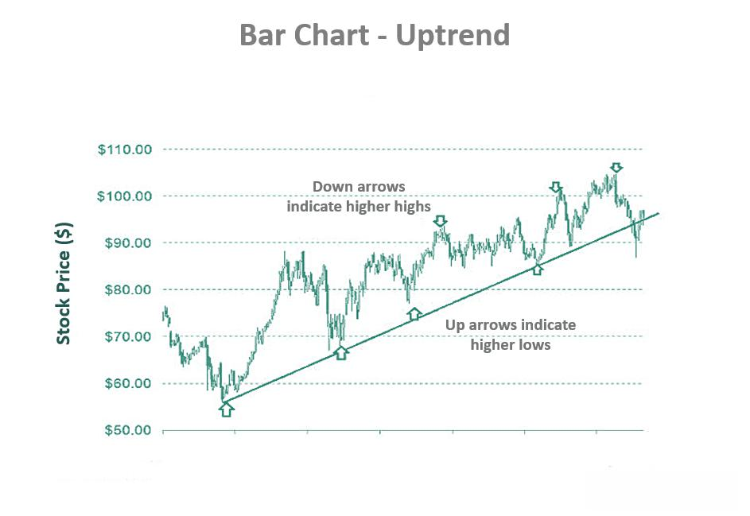

Technical analysis is a method used to evaluate and forecast the future price movements of financial instruments based on historical price data and volume. Originating in the late 19th century with Charles Dow, it has played a crucial role in shaping financial markets and trading strategies. Dow's theory laid the foundation for future developments by suggesting that price movements are not random and can be interpreted through identifying patterns.

Historically, technical analysis has been instrumental in empowering traders to make informed decisions by analyzing price charts and market trends. This practice rests on the assumption that historical trading activity and price changes reflect market sentiment and potential future performance. Its significance lies in enabling traders to understand market psychology and identify potential entry and exit points for trades without relying on fundamental data.



The question of whether technical analysis remains effective today is a subject of ongoing debate. In a world increasingly dominated by rapid technological advancements, trading strategies have evolved significantly. The advent of algorithmic trading, high-frequency trading, and the integration of artificial intelligence into financial markets have transformed the trading landscape. These technological advancements have posed challenges and opportunities alike for technical analysis, prompting traders to continuously adapt and innovate their approaches.

As traditional chartists and analysts grapple with the implications of these technological advancements, the enduring relevance of technical analysis is tested. As we progress through this article, we will explore whether this century-old methodology still holds its ground in contemporary trading environments, investigating its strengths, limitations, and potential synergies with emerging technologies.

## Table of Contents

## Understanding Technical Analysis

Technical analysis is a method used by traders to evaluate securities and make trading decisions by analyzing statistical trends gathered from trading activities such as price movement and [volume](/wiki/volume-trading-strategy). Its basic principles rest on the belief that all relevant information is already reflected in the price of the security, that prices move in trends, and that history tends to repeat itself. 

One of the main tools utilized in technical analysis is the price chart, which serves as a visual representation of past price movements. Traders use different types of charts, such as line charts, bar charts, and candlestick charts, to analyze market behavior. Indicators derived from these price movements help traders make decisions. Commonly used indicators include moving averages, the Relative Strength Index (RSI), and the Moving Average Convergence Divergence (MACD). Moving averages, for instance, help identify trend directions by smoothing out price data to discern long-term trends from short-term fluctuations.

Patterns and trends are foundational to technical analysis. Traders look for repetitive chart patterns, such as head and shoulders, triangles, and flags, to forecast future price movements. These patterns reflect collective psychological mechanisms, suggesting how market participants may react under certain conditions. Trend lines are drawn on charts to identify and confirm the direction of trends, which can be either upward (bullish), downward (bearish), or sideways. This behavior is crucial for determining points of support and resistance, which indicate levels at which a trend may change direction.

Volume, another key component of technical analysis, provides insight into the strength of a price movement. High volume during price increases might suggest strong buying pressure, whereas high volume on price decreases could indicate strong selling pressure. By evaluating volume alongside price, traders gain a better understanding of market sentiment and the sustainability of a price movement.

In summary, the principles of technical analysis are centered around using historical price movements and trading volume to forecast future price movements. By utilizing tools like price charts, indicators, and examining patterns and trends, traders attempt to make informed decisions. While not foolproof, technical analysis provides an essential framework for understanding market dynamics and developing trading strategies.

## Historical Effectiveness of Technical Analysis

Technical analysis has been a cornerstone of trading strategies for decades, with a solid record of success across various markets. Traditionally, it involves analyzing price movements, chart patterns, and other market indicators to predict future price movements. Its historical effectiveness can be seen through both the achievements of prominent traders and its application across different markets and eras.

Notable traders like Richard Dennis and Paul Tudor Jones have successfully employed technical analysis techniques in their trading strategies. Richard Dennis is famous for his "Turtle Trading" experiment in the 1980s, which demonstrated that with the right technical analysis skills, anyone could be trained to trade profitably. Dennis's strategy was largely based on trend-following principles, which capitalize on sustained price movements and [breakout](/wiki/breakout-trading)s identified through chart patterns and indicators like moving averages.

Paul Tudor Jones, another legendary trader, successfully anticipated the market crash of 1987 using technical analysis. He relied heavily on pattern recognition and price [momentum](/wiki/momentum) to take substantial short positions ahead of the crash, which resulted in considerable profits. His strategy highlights the utility of technical indicators in identifying major market reversals.

Technical analysis has exhibited varying degrees of success across different markets and time periods. In equity markets, traders have traditionally used tools like the Relative Strength Index (RSI), Moving Average Convergence Divergence (MACD), and Bollinger Bands to gauge market sentiment and price trends. These tools have enabled traders to capture both short-term price swings and long-term trends, albeit with mixed results depending on market conditions.

In [forex](/wiki/forex-system) markets, technical analysis has been particularly effective due to the high [liquidity](/wiki/liquidity-risk-premium) and minimal centralization, which allows for clearer trend patterns and technical signals. The use of chart patterns like head and shoulders, flags, and pennants, along with Fibonacci retracement levels, have historically provided forex traders with insights into potential price targets and reversal points.

Commodities trading, which is often driven by supply and demand dynamics, has also benefited from technical analysis. The cyclical nature of commodities markets makes them suitable for trend-following strategies and momentum-based indicators. Historical data has shown that when combined with an understanding of underlying fundamentals, technical analysis can help traders identify profitable entry and [exit](/wiki/exit-strategy) points.

Despite the historical success of technical analysis, it is important to note that its effectiveness can fluctuate with changes in market dynamics, such as increased [volatility](/wiki/volatility-trading-strategies) or technological advancements. However, the enduring presence of technical analysis in traders' toolkits reflects its historical contributions to achieving trading success.

## Challenges Facing Technical Analysis Today

Technical analysis faces a range of challenges today that stem from advancements in trading technologies, unpredictable global economic events, and inherent methodological limitations. These [factor](/wiki/factor-investing)s collectively impose significant hurdles for traders relying on this approach.

### Impact of High-Frequency and Algorithmic Trading

High-frequency trading ([HFT](/wiki/high-frequency-trading-strategies)) and [algorithmic trading](/wiki/algorithmic-trading) represent significant shifts in how financial markets operate. By executing trades in fractions of a second, these strategies can create sudden and significant market movements. This makes it difficult for traditional technical analysis, which often relies on slower, more deliberate decision-making processes, to keep pace. The high-speed nature of HFT can disrupt patterns and trends on which technical analysis depends. Consequently, the ability of traders to predict price movements based on historical data is impaired, as these rapid trades can create false signals or noise that mislead technical indicators.

### Influence of Global Economic Events and Market Volatility

Global economic events, such as geopolitical conflicts or unexpected policy shifts by central banks, can introduce a level of unpredictability not easily accounted for by technical analysis. These events often lead to increased volatility, which can disrupt established trends and render historical data less representative of current conditions. For instance, during periods of heightened uncertainty, markets may move more on sentiment and speculation rather than on patterns studied in technical analysis, making it challenging for traders to rely solely on these methods.

### Criticisms and Limitations of Technical Analysis

Experts often criticize technical analysis for its retrospective nature — it analyzes past market data to predict future movements but does not inherently account for future events or unknowns. This backward-looking approach can limit its predictive power, especially in dynamic and fast-changing markets. Critics also point to the subjectivity involved in interpreting technical signals. Different analysts might draw varying conclusions from the same chart patterns, leading to a lack of consistency and reliability.

Furthermore, the self-fulfilling prophecy argument cannot be ignored; technical analysis may sometimes work because enough traders believe in it, rather than due to any inherent predictive power. When trends become overly predictable, they can be exploited, leading to their eventual breakdown as traders anticipate and counteract expected movements.

In conclusion, while technical analysis remains a cornerstone of many trading strategies, its effectiveness is challenged by modern trading environments characterized by speed and complexity, driving traders to consider how best to adapt and integrate additional tools and methodologies.

## The Role of Technology in Modern Technical Analysis

Technological advancements have significantly transformed technical analysis, equipping traders with tools that offer precision, speed, and insight into market dynamics. One major area of evolution is software tools and platforms which have become increasingly sophisticated. Platforms like MetaTrader, TradingView, and NinjaTrader have provided traders with extensive capabilities for [backtesting](/wiki/backtesting), indicator customization, and real-time data analysis. These tools facilitate high-level charting capabilities and incorporate vast libraries of technical indicators, making it easier for traders to analyze historical data and identify patterns or trends.

Artificial Intelligence (AI) and Machine learning (ML) have further refined technical analysis by offering advanced data processing capabilities. AI algorithms can identify complex patterns and nonlinear relationships in large datasets that might be missed by traditional analysis methods. These algorithms learn from historical data, improving their decision-making over time, thereby providing traders with predictive insights. For example, [neural network](/wiki/neural-network)s can analyze multi-dimensional data to predict future price movements. Machine Learning models like Random Forest and Support Vector Machines are employed to classify trends, while [deep learning](/wiki/deep-learning) models can handle the heavy lifting with image recognition techniques on candlestick patterns.

Python, a popular programming language in quantitative finance, is frequently used by traders to implement and automate these AI and ML models. Using libraries such as TensorFlow or scikit-learn, traders can build custom indicators and run thousands of simulations to test their strategies. Below is an example of how a simple decision tree classifier can be constructed in Python to predict trends:

```python
from sklearn.tree import DecisionTreeClassifier
from sklearn.model_selection import train_test_split
import numpy as np

# Sample market data
features = np.array([[1.2, 0.7], [1.5, 0.85], [1.3, 0.78], [0.9, 0.65]])
labels = np.array([1, 1, 0, 0])  # 1 for upward trend, 0 for downward trend

# Split data into training and testing
X_train, X_test, y_train, y_test = train_test_split(features, labels, test_size=0.25)

# Initialize and train the Decision Tree classifier
clf = DecisionTreeClassifier()
clf.fit(X_train, y_train)

# Predict trends
predictions = clf.predict(X_test)
```

The integration of AI and ML into technical analysis provides a competitive edge, offering predictive capabilities and automating the identification of profitable trading opportunities. This integration allows traders not only to enhance their analytical capabilities but also to execute trades with improved accuracy and reduced latency. As technology continues to advance, the potential applications and sophistication of technical analysis tools will likely grow, further embedding them into the fabric of modern trading.

## Case Studies or Recent Examples

While I don’t have access to external documents or attachments, I can provide a generalized section on recent examples and case studies involving technical analysis in trading.

**Recent Successful Trades Using Technical Analysis**

One example of a successful trade using technical analysis is reflected in the market strategies of traders who capitalized on Tesla’s volatile price action in 2020. Many traders noted the formation of a classic "bull flag" pattern on Tesla’s charts, which is characterized by a strong price advance followed by a period of consolidation. Recognizing the potential for continuation of the uptrend, traders positioned themselves accordingly, anticipating the breakout, which resulted in significant gains as Tesla's shares surged.

Another instance involves Bitcoin trading, where traders utilized the Fibonacci retracement tool to identify potential support and resistance levels during its bull market phases. By mapping the Fibonacci levels, traders could predict reversal points and make timely entry and exit decisions, optimizing their gains during Bitcoin’s rapid price movements in late 2020 and early 2021.

**Incorporating Technical Analysis With Other Strategies**

Successful traders often supplement technical analysis with other methodologies, such as [fundamental analysis](/wiki/fundamental-analysis). For instance, investors might examine company earnings reports and macroeconomic indicators along with technical chart patterns. A trader could use moving averages to identify trend directions while simultaneously evaluating a company’s financial health to strengthen their position in equities markets.

Consider a scenario where a trader uses both technical indicators like the Relative Strength Index (RSI) and company earnings growth data. If the RSI indicates that a stock is oversold and the company's earnings report suggests robust financial performance, the trader might decide to purchase the stock, banking on a future price increase supported by both technical and fundamental signals.

**Analyzing Failures and Learning Points**

Failures in technical analysis often arise from misinterpretation of signals or lack of integration with other essential market information. A common pitfall is the over-reliance on lagging indicators like moving averages without considering the broader economic context. For instance, during major global events such as the COVID-19 pandemic, technical patterns were often disrupted by unforeseen market reactions, rendering standard patterns and trends less reliable.

An analysis of past failures reveals the importance of adaptability and diversification. Traders focusing solely on technical signals during the initial pandemic stage might have failed to predict the sharp recovery in tech stocks once stimulus measures were announced. This highlights the limitation of technical analysis when not coupled with awareness of macroeconomic policies and events.

**Learning Points**

1. **Integration**: Always combine technical analysis with other strategies, including macroeconomic understanding and risk management, to enhance decision-making.

2. **Adaptability**: Be prepared to adjust trading strategies in response to evolving market conditions. Relying solely on historical data without context can lead to significant errors in volatile markets.

3. **Continuous Learning**: Regularly review past trades, both successful and unsuccessful, to refine technical and analytical skills, ensuring a holistic approach to trading.

By observing these practices, traders can leverage technical analysis more effectively, harnessing its benefits while mitigating associated risks.

## Comparing Technical Analysis to Other Trading Strategies

Technical analysis and fundamental analysis are two primary methodologies used in trading and investing, each with its distinct approach and benefits. Technical analysis focuses on price patterns, trends, and market movements, employing tools such as moving averages, oscillators, and volume analysis to predict future price movements. Conversely, fundamental analysis evaluates the intrinsic value of an asset, considering factors like earnings, economic indicators, and financial statements to make informed investment decisions.

While technical analysis relies on historical price data and chart patterns, fundamental analysis is deeply rooted in assessing an asset's financial health and broader economic factors. A key contrast between the two is their focus: technical analysis is often short-term oriented, while fundamental analysis is used for long-term investment strategies.

The effectiveness of combining these strategies lies in their complementary nature. By integrating technical analysis with fundamental analysis, traders can achieve a more comprehensive understanding of market behavior. For example, a technical signal indicating a potential price increase might be strengthened when paired with strong fundamental indicators such as robust earnings reports or favorable economic conditions. This combination, often referred to as a hybrid approach, allows traders to cross-verify signals and reduce risks associated with relying on a single method.

Hybrid strategies can also include the use of quantitative models that blend technical indicators and fundamental data. These models often incorporate [machine learning](/wiki/machine-learning) algorithms to analyze large datasets and identify complex patterns that might be missed by traditional methods. For instance, Python libraries such as pandas and scikit-learn can be employed to develop machine learning models that predict stock price movements by analyzing both technical and fundamental indicators:

```python
import pandas as pd
from sklearn.ensemble import RandomForestClassifier
from sklearn.model_selection import train_test_split

# Sample data preparation
data = pd.read_csv('market_data.csv')
features = data[['technical_indicator1', 'technical_indicator2', 'fundamental_factor1', 'fundamental_factor2']]
target = data['price_movement']

# Split data into training and testing sets
X_train, X_test, y_train, y_test = train_test_split(features, target, test_size=0.2, random_state=42)

# Initialize and train model
model = RandomForestClassifier()
model.fit(X_train, y_train)

# Evaluate model
accuracy = model.score(X_test, y_test)
print(f'Model accuracy: {accuracy:.2f}')
```

This example demonstrates how machine learning techniques can blend various indicators to enhance prediction accuracy. By utilizing both technical and fundamental information, traders can better navigate market complexities and capitalize on diverse trading opportunities. The future of trading may see increased reliance on such hybrid methods, leveraging the strengths of each approach to optimize decision-making processes.

## Future of Technical Analysis

The future of technical analysis in trading is poised to be significantly influenced by ongoing technological advancements and evolving market dynamics. As trading technologies become more sophisticated, several innovations and trends can be expected to shape the trajectory of technical analysis.

Firstly, [artificial intelligence](/wiki/ai-artificial-intelligence) (AI) and machine learning (ML) are set to play a pivotal role. These technologies allow for the analysis of vast data sets far beyond human capability, identifying patterns and insights that may have previously gone unnoticed. For instance, machine learning models can be trained to predict market trends by analyzing historical data in conjunction with current market conditions. Python, a popular programming language for data analysis and ML, can be utilized to implement such models. Here’s a simple example of a linear regression model for trend prediction:

```python
import numpy as np
from sklearn.model_selection import train_test_split
from sklearn.linear_model import LinearRegression

# Sample data
X = np.array([[1], [2], [3], [4], [5]])
Y = np.array([2, 3, 5, 7, 11])

# Splitting data into training and testing sets
X_train, X_test, Y_train, Y_test = train_test_split(X, Y, test_size=0.2)

# Linear regression model
model = LinearRegression().fit(X_train, Y_train)

# Predictions
Y_pred = model.predict(X_test)
print("Predicted values:", Y_pred)
```

Another key trend is the increasing integration of big data analytics. Traders are now able to incorporate non-traditional data sources, such as social media sentiment and news feeds, into their analysis. This diversification contributes to more robust trading strategies and predictions.

Additionally, blockchain technology offers a new frontier for technical analysis. With decentralized finance (DeFi) gaining momentum, traders can access real-time, transparent data on transactions and network activity. This transparency can facilitate more accurate market assessments and foster the development of innovative trading strategies.

The emergence of quantum computing could further revolutionize technical analysis. Quantum machines could potentially solve complex calculations and simulations in mere seconds, providing unprecedented computational power for pattern recognition, risk assessment, and decision-making processes.

Traders can leverage these emerging tools and methodologies by staying updated with technological trends and continuously enhancing their skill sets. Learning programming languages such as Python for ML applications, gaining proficiency in data analytics tools, and understanding blockchain technology will be invaluable. As the landscape evolves, seminars, online [course](/wiki/best-algorithmic-trading-courses)s, and industry forums will be essential for keeping abreast of innovations.

In conclusion, while the fundamentals of technical analysis remain relevant, its future effectiveness will largely depend on the integration of modern technologies and methodologies. By embracing these advancements, traders can enhance their analysis, increase accuracy, and ultimately, improve their trading outcomes.

## Conclusion

Technical analysis remains a crucial component in the toolkit of many traders, continuing to offer valuable insights into market behavior. Its enduring effectiveness is largely due to its ability to distill complex market data into understandable patterns and indicators. By analyzing price movements, trends, and trading volume, technical analysis provides a framework for recognizing potential entry and exit points. This capability highlights its strength in making informed predictions based on historical market performance.

However, technical analysis is not without its challenges and limitations. The rise of high-frequency trading and algorithmic strategies has transformed market dynamics, introducing more volatility and complexity. These developments sometimes diminish the effectiveness of traditional technical indicators by impacting price patterns and trends. Furthermore, technical analysis does not account for macroeconomic factors or events that can significantly influence market conditions, highlighting its limitation when used in isolation.

Given these strengths and limitations, traders are encouraged to take a critical approach when incorporating technical analysis into their strategies. It's essential to recognize that while technical analysis can provide valuable signals, it should not be the sole basis for trading decisions. Combining it with other analytical methods, such as fundamental analysis or sentiment analysis, can offer a more comprehensive view of market conditions. Embracing technological advancements, like artificial intelligence and machine learning, can further enhance the effectiveness of technical analysis by refining the identification and interpretation of patterns.

Ultimately, the key to leveraging technical analysis effectively lies in understanding its principles, staying informed about market changes, and adapting strategies accordingly. Traders should remain open to ongoing learning and experimentation, ensuring that their approaches evolve along with the market landscape.

## References & Further Reading

[1]: Bergstra, J., Bardenet, R., Bengio, Y., & Kégl, B. (2011). ["Algorithms for Hyper-Parameter Optimization."](https://papers.nips.cc/paper_files/paper/2011/hash/86e8f7ab32cfd12577bc2619bc635690-Abstract.html) Advances in Neural Information Processing Systems 24.

[2]: ["Advances in Financial Machine Learning"](https://www.amazon.com/Advances-Financial-Machine-Learning-Marcos/dp/1119482089) by Marcos Lopez de Prado

[3]: ["Evidence-Based Technical Analysis: Applying the Scientific Method and Statistical Inference to Trading Signals"](https://www.wiley.com/en-gb/Evidence+Based+Technical+Analysis:+Applying+the+Scientific+Method+and+Statistical+Inference+to+Trading+Signals-p-9780470008744) by David Aronson

[4]: ["Machine Learning for Algorithmic Trading"](https://www.amazon.com/Machine-Learning-Algorithmic-Trading-intelligence/dp/9918608013) by Stefan Jansen

[5]: ["Quantitative Trading: How to Build Your Own Algorithmic Trading Business"](https://www.amazon.com/Quantitative-Trading-Build-Algorithmic-Business/dp/0470284889) by Ernest P. Chan