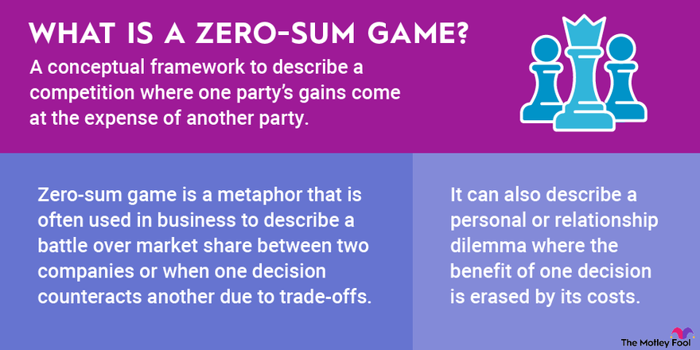

## Table of Contents

## What is a zero-sum game?

A zero-sum game is a situation where one person's gains come only from another's losses. Imagine you and your friend are sharing a pizza. If you take a bigger slice, your friend gets a smaller one. In games or competitions, if one player wins, the other must lose an equal amount. It's like a balance scale: when one side goes up, the other goes down.

In real life, zero-sum games can be seen in sports, where one team's victory means the other team's defeat. In business, if one company takes more market share, another loses it. However, not all situations are zero-sum. Many times, both sides can benefit, like in trade where both parties gain from the exchange. Understanding whether a situation is zero-sum can help in making better decisions and strategies.

## How does the stock market work?

The stock market is like a big store where people can buy and sell pieces of companies called stocks. When a company wants to grow, it can sell some of its ownership to the public. These pieces of ownership are called shares. People buy shares hoping that the company will do well and the value of the shares will go up. If the company does well, the price of the shares goes up, and people can sell them for more money than they paid. But if the company does poorly, the price of the shares can go down, and people might lose money.

The stock market works through something called a stock exchange, which is like a big meeting place where buyers and sellers come together. The price of a stock goes up when more people want to buy it than sell it, and it goes down when more people want to sell it than buy it. Stock prices can change a lot from day to day because they are affected by news about the company, the economy, and what people think will happen in the future. People can make money in the stock market by buying low and selling high, but it can also be risky because no one can predict the future for sure.

## What are the basic principles of investing in stocks?

Investing in stocks means buying small pieces of companies. The main idea is to buy these pieces when they are cheap and sell them when they are more expensive. This can make you money if the company does well and its stock price goes up. But it's important to know that the stock market can go up and down, and you might lose money if the stock price goes down. That's why it's good to think about how much risk you're okay with before you start investing.

Another important thing is to spread your money around. This is called diversification. Instead of putting all your money into one company, you can buy pieces of many different companies. This way, if one company does badly, you won't lose all your money. It's like not putting all your eggs in one basket. Also, it's smart to do your homework and learn about the companies you want to invest in. Look at how they've done in the past and what people think they'll do in the future. This can help you make better choices about which stocks to buy.

## Can you explain the difference between a zero-sum game and a non-zero-sum game?

A zero-sum game is like a tug-of-war where one side's gain is exactly the other side's loss. Imagine you and a friend are sharing a pie. If you take a bigger slice, your friend gets a smaller one. In games or competitions, if one player wins, the other must lose an equal amount. It's like a balance scale: when one side goes up, the other goes down. The total stays the same, so it's called zero-sum because the sum of the gains and losses is zero.

A non-zero-sum game is different because both players can win or both can lose, or one can win more than the other loses. It's like trading toys with a friend. If you trade a toy you don't like for one you do, you both can be happy with the trade. In business, companies can work together to make more money than they would alone. The total can change, so it's not zero-sum. Understanding whether a situation is zero-sum or non-zero-sum can help in making better decisions and strategies.

## How do stock market gains and losses affect the concept of a zero-sum game?

The stock market isn't usually a zero-sum game. When you buy a stock and it goes up in value, you make money, but the person who sold it to you doesn't lose the same amount of money. This is because the stock's value can keep going up, making money for more people. If you sell the stock later at a higher price, the new buyer might make money too if the price keeps rising. So, in the stock market, one person's gain doesn't have to mean another person's loss.

But sometimes, the stock market can act like a zero-sum game in certain situations. For example, if you buy a stock and it goes down, you lose money, and the person who bought it from you at a lower price later might make money if they sell it at a higher price. In this case, your loss is someone else's gain. However, this isn't always true because the overall value of the market can go up or down, affecting everyone's investments. So, while parts of the stock market can feel like a zero-sum game, the whole market usually isn't.

## What role do market makers and brokers play in the stock market?

Market makers and brokers are important people in the stock market. Market makers are like middlemen who help make sure there are always buyers and sellers for stocks. They do this by always being ready to buy or sell stocks at certain prices. This helps keep the market running smoothly because it's easier for people to trade stocks when there's always someone ready to take the other side of the deal. Market makers make money from the difference between the price they buy stocks for and the price they sell them for.

Brokers are like helpers who do the buying and selling for people who want to invest in the stock market. When you want to buy or sell a stock, you tell your broker what you want to do, and they do it for you. Brokers can work for big companies or be independent, and they might charge you a fee for their services. They help make the stock market easier to use because not everyone knows how to buy and sell stocks on their own. Both market makers and brokers play key roles in making sure the stock market works well for everyone.

## How does the creation and destruction of wealth in the stock market relate to zero-sum dynamics?

The stock market isn't usually a zero-sum game because it can create and destroy wealth in ways that don't always balance out. When a company does well and its stock price goes up, people who own the stock can make money without someone else losing the same amount. This is because the total value of the market can grow, creating new wealth. For example, if a company invents a new product that everyone wants, its stock price might go up, making money for its shareholders. This new wealth comes from the company's success and isn't just taken from someone else.

However, there are times when the stock market can act like a zero-sum game. If you buy a stock and it goes down in value, you lose money, and the person who buys it from you at a lower price might make money if they sell it later at a higher price. In this case, your loss is someone else's gain. But even in these situations, the overall market can still change in value, so it's not always a perfect zero-sum game. The stock market is more about creating and destroying wealth than just moving it around from one person to another.

## What are the arguments for the stock market being a zero-sum game?

Some people think the stock market is like a zero-sum game because they see it as a place where one person's gain is another person's loss. For example, if you buy a stock and it goes down, you lose money, and the person who buys it from you at a lower price might make money if they sell it later at a higher price. In this way, your loss is someone else's gain. Also, when people trade stocks back and forth, the money they make or lose can seem like it's just moving from one person to another, without any new wealth being created.

However, this view doesn't tell the whole story. The stock market can create new wealth when companies do well and their stock prices go up. If a company invents a new product that everyone wants, its stock price might go up, making money for its shareholders. This new wealth comes from the company's success and isn't just taken from someone else. So, while parts of the stock market can feel like a zero-sum game, the whole market usually isn't because it can create and destroy wealth in ways that don't always balance out.

## What are the arguments against the stock market being a zero-sum game?

The stock market isn't usually a zero-sum game because it can create new wealth. When a company does well and its stock price goes up, people who own the stock can make money without someone else losing the same amount. This is because the total value of the market can grow. For example, if a company invents a new product that everyone wants, its stock price might go up, making money for its shareholders. This new wealth comes from the company's success and isn't just taken from someone else.

Also, the stock market can destroy wealth in ways that don't balance out either. If a company does badly and its stock price goes down, people who own the stock can lose money, but this doesn't mean someone else is gaining the same amount. The overall value of the market can shrink, affecting everyone's investments. So, while parts of the stock market can feel like a zero-sum game, the whole market usually isn't because it can create and destroy wealth in ways that don't always balance out.

## How do derivatives and other financial instruments impact the zero-sum nature of the stock market?

Derivatives and other financial instruments can make parts of the stock market feel more like a zero-sum game. Derivatives are like bets on what will happen to stocks, bonds, or other things. For example, if you buy an option that lets you buy a stock at a certain price, you're betting the stock will go up. If it does, you make money, but the person who sold you the option loses money. In this way, your gain is their loss, making it zero-sum. Other financial instruments, like futures and swaps, work in similar ways, where one person's gain is often another's loss.

But, the overall stock market is still not a zero-sum game because it can create and destroy wealth in ways that don't always balance out. Even though derivatives can make certain trades zero-sum, the companies behind the stocks can still do well or badly, affecting the total value of the market. If a company invents something new and its stock price goes up, it creates new wealth for its shareholders. So, while derivatives can make some parts of the market zero-sum, the whole market isn't because it can grow or shrink in value, creating or destroying wealth in ways that don't always cancel each other out.

## Can you discuss any empirical studies that have analyzed the stock market as a zero-sum game?

Some researchers have looked at the stock market to see if it works like a zero-sum game. They found that in some ways, it can feel like one. For example, when people trade stocks back and forth, one person's gain can be another's loss. A study by researchers at the University of Chicago looked at high-frequency trading and found that it can act like a zero-sum game because the fast traders make money at the expense of slower traders. But this doesn't mean the whole stock market is zero-sum because the total value of the market can change.

Other studies show that the stock market isn't a zero-sum game overall. A paper from the Federal Reserve Bank of New York looked at how the stock market creates wealth. It found that when companies do well and their stock prices go up, it creates new wealth for shareholders. This new wealth comes from the company's success, not just from taking money from someone else. So, while some parts of the stock market can feel like a zero-sum game, the whole market usually isn't because it can create and destroy wealth in ways that don't always balance out.

## What are the implications for investors if the stock market were to be considered a zero-sum game?

If the stock market were seen as a zero-sum game, it would mean that for investors, making money would always come at the cost of someone else losing money. This could make investing feel more like a competition where you have to be smarter or faster than other people to win. Investors might focus more on beating others rather than looking for good companies to invest in. They might also be more worried about losing money, because if one person gains, another must lose.

But thinking of the stock market as a zero-sum game isn't completely right. The stock market can create new wealth when companies do well. If a company invents something new and its stock price goes up, it makes money for its shareholders without taking it from someone else. So, investors should focus on finding good companies and not just on beating other people. Understanding that the stock market can grow and create wealth can help investors make better choices and feel less worried about losing to others.

## References & Further Reading

[1]: Bergstra, J., Bardenet, R., Bengio, Y., & Kégl, B. (2011). ["Algorithms for Hyper-Parameter Optimization."](https://papers.nips.cc/paper/4443-algorithms-for-hyper-parameter-optimization) Advances in Neural Information Processing Systems 24.

[2]: ["Advances in Financial Machine Learning"](https://www.amazon.com/Advances-Financial-Machine-Learning-Marcos/dp/1119482089) by Marcos Lopez de Prado

[3]: ["Evidence-Based Technical Analysis: Applying the Scientific Method and Statistical Inference to Trading Signals"](https://www.amazon.com/Evidence-Based-Technical-Analysis-Scientific-Statistical/dp/0470008741) by David Aronson

[4]: ["Machine Learning for Algorithmic Trading"](https://github.com/stefan-jansen/machine-learning-for-trading) by Stefan Jansen

[5]: ["Quantitative Trading: How to Build Your Own Algorithmic Trading Business"](https://books.google.com/books/about/Quantitative_Trading.html?id=j70yEAAAQBAJ) by Ernest P. Chan