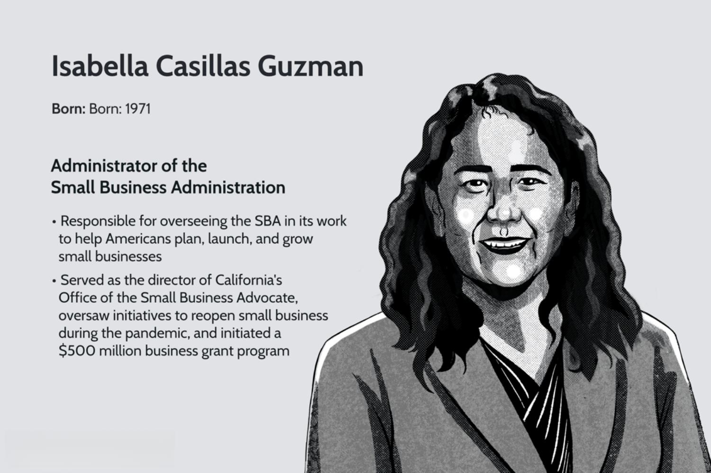

Isabella Casillas Guzman is a notable figure in business and government, especially known for her leadership as the Administrator of the U.S. Small Business Administration (SBA). Appointed by President Joe Biden, she took office in March 2021 and has since played a crucial role in shaping policies that have substantial impacts on entrepreneurship, business development, and economic growth in the United States. Guzman's initiatives have been particularly focused on aiding small businesses, which are considered the backbone of the American economy.

Under Guzman’s leadership, the SBA has revitalized its efforts to support small enterprises by providing financial assistance, promoting diversity and inclusion, and encouraging innovation. Her policies aim to facilitate easier access to capital, offer guidance on business strategies, and stimulate community-based economic activities. These initiatives ensure that small businesses can compete and thrive alongside larger corporations, thereby fostering a dynamic and competitive economic environment.



In recent years, the rise of financial technologies like algorithmic trading has significantly transformed modern finance. Algorithmic trading, which involves the use of computer algorithms to automate trading decisions, has become a dominant force in financial markets. It enhances trading efficiency by reducing human error and exploiting market patterns that may be invisible to human traders. Python, for example, with its robust libraries such as NumPy and pandas, is extensively used in developing trading algorithms. A simple Python code snippet for a moving average crossover strategy might look like this:

```python
import pandas as pd

# Load market data
data = pd.read_csv('market_data.csv')

# Calculate short-term and long-term moving averages
data['Short_MA'] = data['Close'].rolling(window=50).mean()
data['Long_MA'] = data['Close'].rolling(window=200).mean()

# Generate buy/sell signals
data['Signal'] = 0
data['Signal'][50:] = np.where(data['Short_MA'][50:] > data['Long_MA'][50:], 1, 0)
data['Position'] = data['Signal'].diff()
```

Isabella Casillas Guzman's work intersects with such innovative sectors by championing technological advancements within small businesses. She advocates for the adoption of cutting-edge technologies, including those used in financial services, to enhance competitiveness and operational efficiency. Her efforts align with the growing trend of leveraging technology to drive economic growth and ensure that small businesses are not left behind in the rapidly evolving digital landscape. Her leadership not only supports traditional business models but also encourages small enterprises to embrace new technologies like [algorithmic trading](/wiki/algorithmic-trading) to achieve sustained growth and to partake in the increasingly digital future economy.

## Table of Contents

## Early Life and Education

Isabella Casillas Guzman was born into a vibrant and diverse family environment that significantly shaped her worldview and future endeavors. Her upbringing in a multicultural household exposed her to a rich tapestry of cultures and perspectives, which later influenced her inclusive approach to leadership and business. Her family, reputed for being actively engaged in community service, instilled in her the values of public service and advocacy from a young age, laying a foundation for her future career in government and business sectors.

Guzman pursued her higher education at the prestigious Wharton School of the University of Pennsylvania, where she earned a Bachelor of Science degree in Economics. The rigorous academic environment at Wharton equipped her with a strong foundation in economic principles and business acumen, skills that would later prove invaluable in her professional journey. Her education allowed her to develop a keen understanding of both microeconomic and macroeconomic concepts, fostering her analytical abilities and strategic thinking.

Beyond her formal education, Isabella Casillas Guzman benefitted from various early experiences that shaped her career trajectory. During her time at Wharton, she participated in several extracurricular activities that honed her leadership skills, including student-led business initiatives and community outreach programs. These engagements not only provided her with practical experience in leadership and team dynamics but also reinforced her commitment to community-oriented development.

Guzman's early exposure to the intersections of business strategy and community impact can be seen as pivotal influences in her decision to pursue a path that marries public service with economic empowerment. Her early professional experiences further cemented this trajectory, as she embarked on roles that bridged the governmental and entrepreneurial sectors, marking the beginning of her influential career dedicated to supporting small businesses and fostering economic growth.

## Career Milestones

Isabella Casillas Guzman's career trajectory is marked by diverse and impactful roles that have established her as a significant figure in both the public and private sectors. Before assuming her current position as Administrator of the U.S. Small Business Administration (SBA), Guzman amassed a wealth of experience that shaped her adept leadership and strategic vision.

Guzman's early career was grounded in the private sector, where she held several critical positions that honed her skills in business management and development. Notably, she served as a director at ProAmerica Bank, a commercial bank in Los Angeles that focused on serving small and medium-sized businesses. This role provided her with firsthand experience in understanding the intricacies of small business operations and the challenges they face, particularly in accessing financial resources.

From the private sector, Guzman transitioned to governmental roles, bringing her expertise to bear on public administration. She served as the Deputy Chief of Staff and Senior Advisor at the SBA during the Obama Administration. In this capacity, Guzman was instrumental in formulating policies that supported small businesses and startups, emphasizing innovation and inclusivity. Her work at this time involved the development of community-based strategies to bolster small business growth, which included measures aimed at expanding access to capital and reducing bureaucratic hurdles.

Guzman's leadership style is characterized by inclusivity and pragmatism. She is known for her collaborative approach, fostering partnerships between government entities, private enterprises, and community organizations. This approach is reflective of her belief in the symbiotic relationship between policy-making and economic development. Her strategy often involves leveraging data-driven insights to inform policy decisions, ensuring that outcomes are aligned with the dynamic needs of businesses at various stages of their growth.

In summary, Isabella Casillas Guzman's career milestones are defined by her strategic roles in both the private banking sector and government administration. Her trajectory showcases a commitment to enhancing the support structures for small businesses, underpinned by a leadership approach that values collaboration and data-informed decision-making. Her contributions have laid a foundational framework that continues to benefit the entrepreneurial landscape across the United States.

## Accomplishments as SBA Administrator

Isabella Casillas Guzman assumed the position of Administrator of the U.S. Small Business Administration (SBA) with a focus on revitalizing small businesses that were heavily impacted by economic challenges, particularly in the wake of the COVID-19 pandemic. Her tenure has been marked by several significant initiatives aimed at promoting small business recovery, resilience, and growth.

One of the pivotal actions under her administration was overseeing the execution of the Paycheck Protection Program (PPP). This program aimed to alleviate the financial strain on small businesses by providing forgivable loans, helping them retain employees and cover essential expenses during the pandemic. Under Guzman's guidance, the SBA streamlined processes and expanded access to PPP loans, especially targeting underserved communities that historically faced barriers in obtaining financial support.

Another significant initiative has been the launch of the Community Navigator Pilot Program. This endeavor was designed to offer targeted assistance to small businesses, with a focus on those owned by socially and economically disadvantaged individuals. By establishing a network of community organizations, the program provides businesses with advisory services, technical assistance, and resources to navigate the complexities of starting and running a business.

Guzman also placed a strong emphasis on modernizing the SBA’s systems to enhance efficiency and service delivery. The SBA expanded its online resources and tools, supporting entrepreneurs through digital platforms that provide easier access to information and funding opportunities. 

Her administration has also been instrumental in advocating for policies that foster an equitable business environment. By addressing systemic disparities, Guzman has prioritized reforms aimed at leveling the playing field for minority-owned and women-owned businesses, ensuring they have equitable access to SBA programs and services.

The impact of these policies under Guzman's leadership can be seen in the stabilization of employment rates in small-sized businesses, greater financial security for countless small enterprises, and a marked increase in the diversity and inclusion within the entrepreneurial ecosystem. Her strategic initiatives have not only aimed to recover the economy but also to build a more robust and agile small business sector that plays a crucial role in the nation’s economic landscape.

## Intersection with Algo Trading

Algorithmic trading, often referred to as algo trading, involves the use of computer algorithms to automate trading decisions in the financial markets. This approach allows for the execution of trades at speeds and frequencies beyond the capability of human traders. Algo trading is an essential component of modern finance, enhancing market efficiency and providing [liquidity](/wiki/liquidity-risk-premium). By leveraging complex mathematical models and statistical analyses, algorithmic traders can identify and exploit patterns within large datasets, optimizing the timing of buying or selling stocks, commodities, or other financial assets. Common strategies used in algorithmic trading include [trend following](/wiki/trend-following), [arbitrage](/wiki/arbitrage), and [market making](/wiki/market-making).

Isabella Casillas Guzman, in her role as the Administrator of the U.S. Small Business Administration (SBA), recognizes the significance of such technological advancements in driving economic growth and business development. Although her primary focus is on supporting small businesses, her initiatives often emphasize the importance of adopting new technologies, including those relevant to the financial sector.

Under Guzman's leadership, the SBA has been active in promoting innovation within the small business community. Her policies encourage small businesses to embrace digital transformations and integrate cutting-edge technologies to increase their competitiveness. While specific policies towards algorithmic trading have not been her primary focus, the broader push for technological adoption indirectly supports small enterprises venturing into innovative trading methodologies. By fostering a conducive environment for startups and small businesses that deal with fintech solutions, Guzman indirectly contributes to the evolution of algorithmic trading.

One of the initiatives championed by Guzman is providing educational resources and training opportunities for small business owners to understand and implement advanced technologies. By partnering with private sectors and technology providers, the SBA aims to equip entrepreneurs with the knowledge and tools necessary to leverage innovations like algorithmic trading. Although not explicitly targeting the financial markets, these efforts reflect her commitment to integrating state-of-the-art technologies within businesses of all scales.

In summary, Isabella Casillas Guzman's tenure at the SBA underscores an overarching theme of embracing technology and innovation. Her focus on progressive policies creates a favorable ecosystem for technological advancements, including algorithmic trading, consequently aiding small businesses in becoming more agile and competitive in a technology-driven economy.

## Recognitions and Awards

Isabella Casillas Guzman has received several awards and recognitions that underscore her impactful contributions to business growth and economic development. Her leadership and vision in managing the U.S. Small Business Administration (SBA) have earned her accolades that reflect both her commitment to innovation and her success in enhancing small business ecosystems.

One significant recognition is her inclusion in lists that highlight influential leaders in government and business. These acknowledgments serve to underline her vital role in fostering entrepreneurship and navigating economic challenges, especially during critical periods such as the COVID-19 pandemic recovery.

Her recognition often centers around the successful implementation of initiatives designed to support and uplift small businesses, enhancing their access to resources and capital. Additionally, her efforts have positioned her as a forward-thinking leader, effectively bridging traditional business practices with emerging technologies, including financial innovations like algorithmic trading.

Such honors not only celebrate her achievements but also amplify her influence, enabling her to further impact policy-making and inspire future generations of leaders in business and government. As she continues to contribute to economic development and innovation, her recognitions reinforce the importance of dynamic and adaptive leadership in shaping resilient and prosperous business environments.

## Future Endeavors and Vision

Isabella Casillas Guzman has articulated a clear vision for the future of small businesses, emphasizing the integration of cutting-edge technologies such as algorithmic trading to enhance competitiveness and growth. This vision aligns with the broader trends in commerce and trade where digital transformation is pivotal. Guzman envisages small businesses harnessing these advanced technologies not only to optimize their operations but also to expand their market access and efficiency.

Her initiatives suggest a proactive approach to equip small enterprises with the necessary tools to thrive in a tech-driven economy. By fostering collaborations between fintech companies and small businesses, she aims to democratize access to sophisticated trading platforms traditionally reserved for larger entities. This involves encouraging partnerships, providing educational resources, and advocating for policy frameworks that support innovation in financial technologies.

A cornerstone of her vision involves a robust support system for entrepreneurs, enabling them to leverage technologies like algorithmic trading to make data-driven decisions and engage in markets dynamically. This could potentially transform the landscape by allowing small businesses to participate in global markets with the same agility as their larger counterparts.

Isabella Guzman’s potential influence on the next generation of business leaders is profound. By championing these technologies and integrating them into the small business ecosystem, she not only paves the way for current entrepreneurs but also inspires future leaders to be technologically savvy and innovative. Her efforts could cultivate a new cohort of business leaders who are well-versed in digital tools and strategies, ensuring that small businesses remain resilient and competitive in a rapidly evolving economy.

In conclusion, Guzman’s forward-thinking vision underscores her commitment to ensuring that small businesses are at the forefront of technological innovation. Her endeavors are likely to have a lasting impact, fostering a business environment where technological adaptation and leadership are central to success.

## Conclusion

Isabella Casillas Guzman's journey is marked by a seamless blend of public service and a commitment to empowering small businesses, demonstrating her influential role as a catalytic force in the United States economy. Her tenure as the Administrator of the U.S. Small Business Administration (SBA) signifies a period of transformative impact where she has orchestrated significant changes that have bolstered entrepreneurship and created resilient economic growth. Through her strategic initiatives, Guzman has not only supported the recovery and expansion of small enterprises but has also prepared the business ecosystem for a future where technology and innovation play central roles.

Under her leadership, the SBA has launched various initiatives aimed at providing financial support, resources, and guidance to small businesses, particularly in the wake of economic challenges. Her policies have facilitated access to capital and opened avenues for minority and women-owned businesses, ensuring a more inclusive economic landscape. Through these actions, Guzman has reinforced the SBA’s pivotal position in nurturing a robust small business sector that is a backbone of the U.S. economy.

Reflecting on the changing economic environment, Guzman's work has extended into fostering technology-driven sectors, exemplified by her interest in areas like algorithmic trading. This intersection of traditional business acumen and cutting-edge technology underscores her visionary leadership. It sets a precedent for integrating small businesses with high-tech innovation, heralding a new era of economic development.

Her achievements have earned wide recognition, underscoring her role as a key architect of modern economic policy and a champion for small business advancement. As technology reshapes industries, her foresight in encouraging the embracement of innovative practices will play a critical role in defining the future of entrepreneurship.

As Isabella Casillas Guzman continues her work, her focus on leveraging technology to drive economic success positions her as a leader worth following closely. Her ongoing contributions promise to shape not only current economic dynamics but also inspire future generations of business leaders to build a more dynamic and inclusive economy.

## References & Further Reading

[1]: ["Advances in Financial Machine Learning"](https://www.amazon.com/Advances-Financial-Machine-Learning-Marcos/dp/1119482089) by Marcos Lopez de Prado

[2]: ["Evidence-Based Technical Analysis: Applying the Scientific Method and Statistical Inference to Trading Signals"](https://www.amazon.com/Evidence-Based-Technical-Analysis-Scientific-Statistical/dp/0470008741) by David Aronson

[3]: ["Machine Learning for Algorithmic Trading"](https://github.com/stefan-jansen/machine-learning-for-trading) by Stefan Jansen

[4]: ["Quantitative Trading: How to Build Your Own Algorithmic Trading Business"](https://www.amazon.com/Quantitative-Trading-Build-Algorithmic-Business/dp/1119800064) by Ernest P. Chan

[5]: Bergstra, J., Bardenet, R., Bengio, Y., & Kégl, B. (2011). ["Algorithms for Hyper-Parameter Optimization."](https://dl.acm.org/doi/10.5555/2986459.2986743) Advances in Neural Information Processing Systems 24.