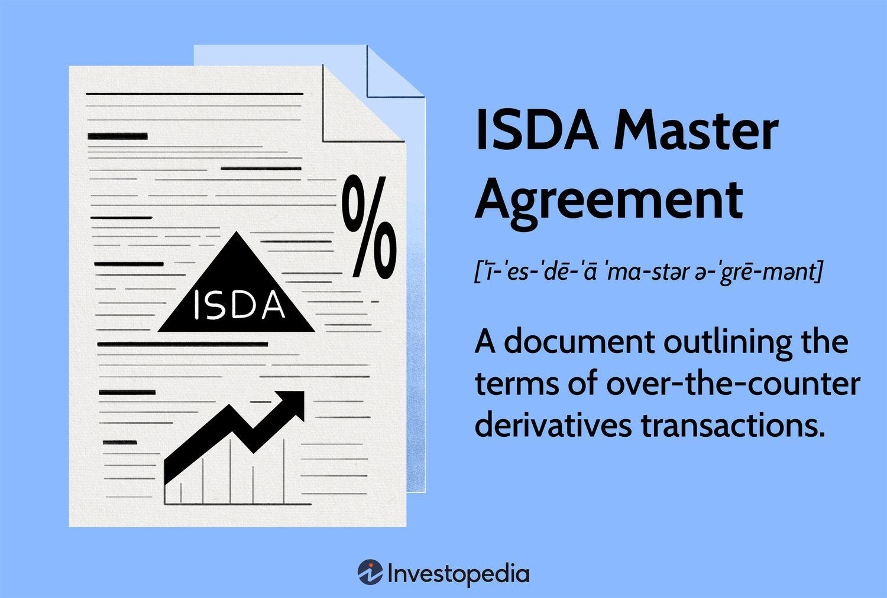

## Table of Contents

## What is the ISDA Master Agreement?

The ISDA Master Agreement is a standard contract used in the financial world to help businesses trade derivatives safely and smoothly. Derivatives are financial products whose value depends on something else, like interest rates or stock prices. The agreement is made by the International Swaps and Derivatives Association (ISDA), which is a group that helps make these kinds of deals easier and safer. The main goal of the ISDA Master Agreement is to make sure that both sides of the deal understand their rights and duties clearly, and it helps prevent disagreements and legal issues.

The agreement covers many important points, like how payments should be made, what happens if one side can't pay, and how to end the agreement if needed. It's designed to be used many times, so businesses don't have to start from scratch every time they want to trade derivatives. This makes the process quicker and more efficient. The ISDA Master Agreement is very important in the world of finance because it helps keep the market stable and trustworthy.

## What are the main functions of the ISDA Master Agreement?

The ISDA Master Agreement helps businesses trade derivatives safely and smoothly. It sets clear rules for how these trades should happen, making sure everyone knows what they need to do. This agreement is used over and over again, so companies don't have to make a new contract every time they want to trade. This saves time and makes trading easier.

The agreement also helps prevent disagreements and legal problems. It explains how payments should be made, what to do if someone can't pay, and how to end the agreement if needed. By having these rules in place, the ISDA Master Agreement keeps the financial market stable and trustworthy. It's a key tool that helps businesses feel confident when they trade derivatives.

## Who typically uses the ISDA Master Agreement?

The ISDA Master Agreement is mainly used by financial institutions like banks, investment firms, and hedge funds. These organizations use it when they want to trade derivatives, which are financial products that depend on the value of something else, like stocks or interest rates. The agreement helps them set clear rules for their trades, making sure everyone knows what they need to do.

Companies that are not in the finance industry also use the ISDA Master Agreement sometimes. For example, big corporations that want to manage their financial risks might use it. This agreement helps them trade derivatives in a safe and organized way, which can protect them from unexpected changes in the market.

Overall, anyone involved in trading derivatives can use the ISDA Master Agreement. It's a helpful tool that makes trading easier and safer for all kinds of businesses, whether they are in finance or not.

## What are the key components of the ISDA Master Agreement?

The ISDA Master Agreement has several important parts that help make trading derivatives safe and clear. One key part is the payment rules, which explain how and when money should be paid. Another important part is the section on what happens if someone can't pay, known as default. This section tells everyone what steps to take if a problem comes up. The agreement also includes rules for ending the contract if needed, making sure both sides know how to stop the deal properly.

Another important part of the ISDA Master Agreement is the section on netting, which helps simplify payments by adding up all the trades between the two parties. This can make things easier and reduce the risk of big losses. The agreement also has a part about how to handle disagreements, giving clear steps to solve problems without going to court. All these parts work together to make sure that trading derivatives is done in a safe and organized way, helping to keep the financial market stable and trustworthy.

## How does the ISDA Master Agreement help in managing counterparty risk?

The ISDA Master Agreement helps manage counterparty risk by setting clear rules for what happens if one party can't pay, known as default. If a company can't make its payments, the agreement explains the steps to take, like ending the contract or figuring out how much money is owed. This helps both parties know exactly what to do in a bad situation, reducing the chance of big losses and legal fights.

Another way the agreement manages risk is through netting. Netting means adding up all the trades between the two parties and settling the difference. This makes payments simpler and lowers the total amount of money at risk. By having these rules in place, the ISDA Master Agreement helps businesses feel more secure when they trade derivatives, knowing there's a plan to handle problems if they come up.

## What are the standard terms and conditions included in the ISDA Master Agreement?

The ISDA Master Agreement includes standard terms and conditions that help make trading derivatives safe and clear. It covers how payments should be made, explaining when and how money needs to be paid. It also includes rules for what happens if one party can't pay, known as default. This section tells everyone what steps to take if a problem comes up, like ending the contract or figuring out how much money is owed. The agreement also has rules for ending the contract if needed, making sure both sides know how to stop the deal properly.

Another important part of the agreement is netting, which simplifies payments by adding up all the trades between the two parties and settling the difference. This makes things easier and reduces the risk of big losses. The agreement also includes a section on how to handle disagreements, giving clear steps to solve problems without going to court. All these terms and conditions work together to make sure that trading derivatives is done in a safe and organized way, helping to keep the financial market stable and trustworthy.

## How can the ISDA Master Agreement be customized for specific transactions?

The ISDA Master Agreement can be customized to fit the needs of specific transactions by using what are called "Schedules" and "Confirmations." Schedules are added to the main agreement and let the two parties change some of the standard terms to better match their deal. For example, they might want to change how long the agreement lasts or how payments are made. This way, the agreement can be more flexible and meet the specific needs of the people using it.

Confirmations are used for each individual trade and give the details of that specific transaction. They include things like the type of derivative being traded, the amount, the price, and the date when the trade will happen. By using Confirmations, the parties can make sure that every trade is clearly documented and follows the rules set in the main agreement. This helps keep everything organized and makes sure both parties know exactly what they're agreeing to for each trade.

## What is the role of the Schedule in the ISDA Master Agreement?

The Schedule in the ISDA Master Agreement is like a special part that lets the two parties change some of the standard rules to fit their specific deal. It's added to the main agreement and helps make the agreement more flexible. For example, the Schedule can change how long the agreement lasts, how payments are made, or what happens if someone can't pay. This way, the agreement can be customized to meet the needs of the people using it, making sure everyone is happy with the terms.

By using the Schedule, the parties can make sure their agreement works well for their unique situation. It's an important tool that helps avoid disagreements by clearly setting out any changes to the standard terms. This makes the whole process of trading derivatives smoother and more tailored to what each party wants and needs.

## How does the ISDA Master Agreement handle events of default and termination?

The ISDA Master Agreement has clear rules for what happens if one party can't pay, which is called an event of default. If a company can't make its payments, the agreement tells everyone what steps to take. This might mean ending the contract or figuring out how much money is owed. The agreement lists different reasons for default, like not paying on time, going bankrupt, or breaking other important rules. By having these rules, both parties know what to do if a problem comes up, which helps prevent big losses and legal fights.

When it comes to ending the agreement, the ISDA Master Agreement also has a section that explains how to do it properly. If one party wants to end the deal, they need to follow the steps laid out in the agreement. This might involve giving notice to the other party and calculating any money that needs to be paid. The agreement makes sure both sides know how to stop the deal in a fair way. This helps keep things organized and makes sure everyone understands their rights and duties, even when the agreement is being ended.

## What are the differences between the 1992 and 2002 versions of the ISDA Master Agreement?

The 1992 and 2002 versions of the ISDA Master Agreement have some important differences, mainly because the 2002 version was updated to better handle problems that came up in the financial world. One big change is how they deal with what happens if someone can't pay, called default. The 2002 version has clearer rules about what counts as a default and what to do if it happens. It also added new reasons for default, like if a company's credit rating drops a lot. This makes the agreement more useful for keeping the market safe and stable.

Another difference is how the two versions handle ending the agreement. The 2002 version has better rules for figuring out how much money is owed when the agreement ends. It also makes it easier to end the agreement if there's a big change in the law that makes it hard to keep trading. These changes help make sure the agreement works well even when things change a lot in the financial world. Both versions help businesses trade derivatives safely, but the 2002 version is more up-to-date and better at handling new problems that might come up.

## How does the ISDA Master Agreement address cross-border legal and regulatory issues?

The ISDA Master Agreement helps businesses deal with legal and regulatory issues when they trade derivatives across different countries. It does this by setting clear rules that both parties agree to follow, no matter where they are located. This makes it easier for companies from different countries to trade with each other because they know what to expect. The agreement also includes a section called the "Schedule" where the parties can add special rules to fit the laws of their countries. This way, they can make sure the agreement works well in both places.

Another way the ISDA Master Agreement handles cross-border issues is by having rules for what happens if there's a problem with the law in one country. For example, if a new law makes it hard to keep trading, the agreement explains what to do. This helps prevent disagreements and legal fights that could come up because of different laws. By having these rules in place, the agreement makes it safer and easier for businesses to trade derivatives across borders, helping to keep the financial market stable and trustworthy.

## What are the best practices for negotiating and implementing the ISDA Master Agreement?

When negotiating the ISDA Master Agreement, it's important to start by understanding what each party needs and wants. Both sides should talk openly about their goals and any special rules they want to add to the agreement. This helps make sure the agreement fits well with their business. It's also a good idea to work with lawyers who know a lot about derivatives and the ISDA Master Agreement. They can help explain the agreement and make sure it's fair for everyone. During the talks, both parties should be ready to make some changes to the standard terms to reach a deal that works for both.

Once the agreement is negotiated, implementing it properly is key. This means making sure all the details are written down clearly in the Schedule and Confirmations. The Schedule lets the parties add special rules to fit their deal, while Confirmations give the details of each trade. It's important to keep good records of all the trades and make sure everyone follows the rules in the agreement. Regular check-ins and updates can help make sure the agreement keeps working well as things change in the financial world. By following these best practices, businesses can use the ISDA Master Agreement to trade derivatives safely and smoothly.

## References & Further Reading

[1]: Hull, J. C. (2017). ["Options, Futures, and Other Derivatives."](https://www.semanticscholar.org/paper/Options%2C-Futures%2C-and-Other-Derivatives-Hull/89bdee500c8623864fc9eb7a471546aa713acc44) Pearson Education.

[2]: International Swaps and Derivatives Association, Inc. (2003). ["ISDA Master Agreement."](https://www.sec.gov/Archives/edgar/data/1065696/000119312511118050/dex101.htm)

[3]: Hasbrouck, J. (2007). ["Empirical Market Microstructure: The Institutions, Economics, and Econometrics of Securities Trading."](https://academic.oup.com/book/52241) Oxford University Press.

[4]: Cartea, Á., Jaimungal, S., & Penalva, J. (2015). ["Algorithmic and High-Frequency Trading."](https://assets.cambridge.org/97811070/91146/frontmatter/9781107091146_frontmatter.pdf) Cambridge University Press.

[5]: Pirrong, C. (2011). ["The Economics of Central Clearing: Theory and Practice."](https://www.isda.org/attachment/MzE0NA==/ISDAdiscussion_CCP_Pirrong.pdf) ISDA.