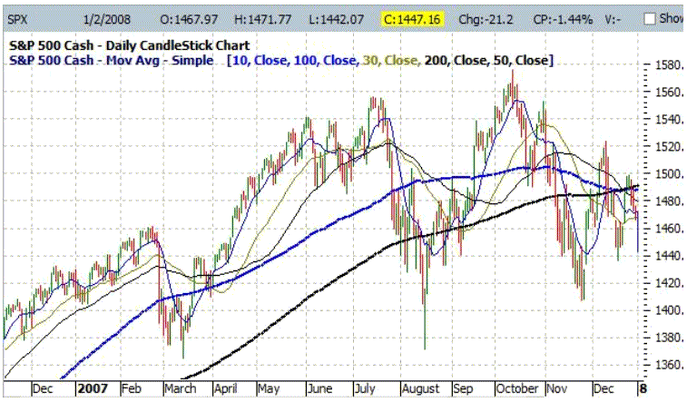

Financial market indicators are vital tools for traders and investors, providing essential insights and guidance in decision-making processes. These indicators, derived from historical data and current market conditions, help market participants assess the potential future movement of assets and manage risk. Among these indicators, sentiment indicators are particularly significant as they offer a view into the psychological and emotional state of market participants. Understanding market sentiment is crucial as it often drives price movements beyond fundamentals, reflecting aspects like fear, greed, optimism, and pessimism among traders.

The ISEE sentiment indicator, a particularly valuable tool in this context, offers a unique perspective on market trends by focusing specifically on investor sentiment. The ISEE, or the International Securities Exchange Sentiment Index, measures sentiment by analyzing the ratio of call options to put options purchased by retail investors. Unlike many other sentiment indicators, the ISEE excludes market makers and institutional trades, thereby presenting a clearer picture of retail investor behavior. This exclusion is significant because retail investor actions can often reveal underlying market trends that are not immediately evident in institutional activities, offering a purer reflection of market sentiment.



Sentiment analysis, as applied to trading strategies, involves quantifying this market sentiment to predict future market movements. By understanding whether the market is in a state of fear or confidence, traders can make informed decisions about entering or exiting positions. For example, an excessively bullish sentiment may suggest an overbought market ripe for a potential correction, whereas extreme bearish sentiment might indicate an oversold market poised for a rebound. Using techniques from fields like natural language processing and data analytics, sentiment analysis transforms qualitative data into actionable trading insights.

Algorithmic trading, which utilizes computer algorithms to execute trades based on pre-defined criteria, leverages sentiment indicators such as the ISEE to automate decision-making processes. The integration of sentiment analysis in algorithmic trading systems allows for consistent and speedy execution of trades, which is essential in the fast-paced environment of the financial markets. These algorithms can quickly process large volumes of data, capturing sentiment-driven opportunities that might be missed by manual trading approaches.

This article will explore the significant intersection of sentiment analysis, the ISEE sentiment indicator, and algorithmic trading. It will discuss how these elements combine to enhance trading strategies and uncover market insights that are pivotal for navigating today's financial markets successfully. Additionally, it will delve into practical applications, challenges, and future trends, providing a comprehensive understanding of how sentiment indicators and algorithmic trading shape modern trading practices.

## Table of Contents

## Understanding the ISEE Sentiment Indicator

The ISEE sentiment indicator, or the International Securities Exchange Sentiment Index, serves as a valuable tool for gauging investor sentiment in financial markets. It is designed to provide a measure of market sentiment by examining the activity in call and put options, focusing specifically on retail investor transactions. The core purpose of the ISEE indicator is to supply traders and analysts with insights into the behavior and outlook of non-institutional investors, who often represent the broader market sentiment.

### Definition and Purpose

The ISEE sentiment indicator is calculated as a ratio of the [volume](/wiki/volume-trading-strategy) of call options to put options traded on the International Securities Exchange, adjusted to exclude trades executed by market makers and institutional investors. This exclusion is significant because it targets the sentiment of retail investors, believed to act based on sentiment and trends more freely than institutional players.

### Methodology

The formula for calculating the ISEE sentiment indicator is given by:

$$
ISEE = \left( \frac{\text{Call Volume}}{\text{Put Volume}} \right) \times 100
$$

Here, the "Call Volume" refers to the number of call options purchased, and the "Put Volume" refers to the number of put options purchased. Calls are often bought when investors expect a stock or market index to rise, whereas puts are purchased when a decline is anticipated. By focusing specifically on retail trades, the ISEE aims to capture the sentiment with less influence from hedging activities typically performed by institutions.

### Significance of Focusing on Retail Transactions

The ISEE's exclusion of market makers and institutional trades is purposeful to distill a purer measure of sentiment from retail investors. Retail traders are generally more sentiment-driven, reacting to news, trends, and emotional cues, whereas institutional trades can be more strategic and hedging-oriented. This focus thus provides a unique perspective on market dynamics as derived from the 'average investor's lens.

### Limitations and Interpretation

The limitations of the ISEE sentiment indicator are mainly tied to its focus and scope. As the indicator is based solely on options traded on the ISE, it might not fully encapsulate sentiment on broader scales or on other exchanges. Furthermore, factors like low volumes in certain securities can skew the indicator's readings. While interpreting the ISEE, understanding that a higher ratio may suggest bullish sentiment among retail investors, and a lower ratio may indicate bearish sentiment is crucial. However, extremes in either direction can signal potential turning points—high complacency could lead to downtrends, and extreme fear could denote buying opportunities.

In conclusion, the ISEE sentiment indicator offers a valuable insight by filtering out noise from major institutional players, leaving a distilled view of how retail investors perceive the market's direction. Despite its limitations, its focused design makes it a powerful tool when combined with other market indicators within a comprehensive trading strategy.

## Sentiment Analysis in Financial Markets

Market sentiment reflects the overall attitude of investors towards financial markets and can significantly influence trading decisions. This collective mood is driven by various factors including economic indicators, geopolitical events, media coverage, and individual investor psychology. When sentiment is bullish, investors expect prices to rise, leading to buying pressures that can enhance upward trends. Conversely, bearish sentiment arises when investors anticipate falling prices, prompting selling pressures that can drive markets downward. Understanding and gauging market sentiment is crucial as it offers insights that extend beyond traditional financial metrics.

Various tools and techniques have been developed to measure and analyze market sentiment. Textual analysis of financial news and social media, sentiment surveys, and options market data are commonly used methodologies. Advanced natural language processing (NLP) algorithms permit the extraction of sentiment from vast textual datasets, making it feasible to identify prevailing market emotions quickly. Quantitative sentiment indicators, which aggregate data from different sources, offer straightforward metrics to incorporate sentiment into trading strategies.

The ISEE sentiment indicator is one such tool used for sentiment analysis. Developed by the International Securities Exchange (ISE), the ISEE Index measures investor sentiment by analyzing the ratio of call to put options purchased by retail investors. Unlike traditional put/call ratios, the ISEE Index focuses solely on customer options, excluding transactions by market makers and institutional traders. This exclusive focus on retail flow aims to provide a purer gauge of sentiment from individual investors. Typically, an ISEE reading above 100 signals a bullish sentiment, as calls outnumber puts, while a reading below 100 indicates bearish sentiment.

Sentiment-driven market movements occur when changes in market sentiment precede or accompany shifts in price trends. For instance, a sudden increase in bullish sentiment could lead to a rapid rise in asset prices as traders initiate buy orders in anticipation of further price increases. Conversely, a spike in bearish sentiment might trigger a sell-off, leading to falling prices. For instance, during earnings announcements or unexpected geopolitical events, sentiment analysis can uncover shifts in investor mood that may not yet be reflected in price data, providing opportunities for strategic trading decisions.

Integrating sentiment indicators like the ISEE into trading strategies allows for enhanced decision-making. By providing real-time insights into investor emotions, traders can better time entry and [exit](/wiki/exit-strategy) points, optimize risk management, and mitigate potential losses. Moreover, by understanding sentiment trends, traders can adjust their strategies proactively, aligning with the dominant market mood to exploit emerging opportunities. As sentiment analysis continues to evolve, blending these insights with technical and [fundamental analysis](/wiki/fundamental-analysis) presents a holistic approach to experiencing market dynamics in financial markets.

## Algorithmic Trading and Its Benefits

Algorithmic trading, often referred to as algo trading, is a method of executing trades using automated and pre-programmed instructions accounting for variables such as timing, price, and volume. It employs complex mathematical models and formulas to make high-speed decisions in modern financial markets. This method is pivotal due to its efficiency and ability to handle a large number of stocks and instruments simultaneously with precision and speed, attributes not achievable by human traders.

The efficiency and speed of [algorithmic trading](/wiki/algorithmic-trading) lie in its capacity to process vast volumes of information and execute trades in fractions of a second, benefiting from [arbitrage](/wiki/arbitrage) opportunities that are invisible to manual traders. Algorithms can analyze multiple markets and large datasets simultaneously, enabling traders to take advantage of even the smallest discrepancies in prices. This capability is particularly useful in high-frequency trading ([HFT](/wiki/high-frequency-trading-strategies)), where firms capitalize on small price differences on thousands of trades per second.

Algorithmic trading also incorporates sentiment analysis to refine trading strategies further. Sentiment analysis involves evaluating public sentiment from various data sources, including news articles, social media, and other online content, to predict market movements. An example of integrating sentiment analysis into algorithmic trading is the use of the ISEE sentiment indicator. This indicator focuses on retail investor sentiment and adjusts trading strategies based on the collective behavior of non-professional investors. Algorithms can incorporate the ISEE indicator as a parameter, analyzing shifts in investor sentiment to anticipate potential market trends and adjust trading positions accordingly.

A primary advantage of utilizing algorithmic trading to harness market sentiments is consistency. Algorithms operate without emotional influence, a common hindrance in manual trading. They adhere to predefined rules irrespective of market conditions, ensuring disciplined trading. This approach mitigates the risk of impulsive decisions driven by fear or greed.

Here's a simplified Python example of how sentiment analysis could be integrated into an algorithmic trading strategy:

```python
def calculate_isee_indicator(call_volume, put_volume):
    return (call_volume / put_volume) * 100

def trading_decision(isee_value, threshold=120):
    if isee_value > threshold:
        return "Buy"
    elif isee_value < 100:
        return "Sell"
    else:
        return "Hold"

call_volume = 15000
put_volume = 5000

isee_value = calculate_isee_indicator(call_volume, put_volume)
decision = trading_decision(isee_value)

print(f"ISEE Value: {isee_value}")
print(f"Trading Decision: {decision}")
```

In this example, the `calculate_isee_indicator` function computes the ISEE sentiment indicator value, while the `trading_decision` function uses this value to determine an appropriate market action. Such algorithms can be expanded to include real-time data feeds, adjusting automatically to market changes without the need for human intervention.

In conclusion, algorithmic trading provides an efficient and swift approach to exploiting market sentiments, offering traders the ability to consistently apply complex strategies across numerous markets. Integrating sentiment analysis through tools like the ISEE indicator allows traders to incorporate human behavioral predictions into automated systems, enhancing the decision-making process in trading.

## Integrating ISEE Indicator into Trading Algorithms

Integrating the ISEE sentiment indicator into trading algorithms involves several methodical steps, leveraging its insights to inform strategic trading decisions. The ISEE (International Securities Exchange Sentiment) Indicator measures retail investor sentiment by comparing call and put options, providing data that can be effectively harnessed within algorithmic trading systems.

### Steps to Incorporate the ISEE Sentiment Indicator

1. **Data Collection and Processing:**
   To begin, gather historical data on call and put options from relevant exchanges, focusing on retail transactions. This data should exclude trades from market makers and institutional investors, aligning with the ISEE's methodology.

2. **Data Analysis and Normalization:**
   Analyze and normalize the data to maintain consistency and accuracy. This step involves calculating the ISEE ratio by dividing the number of call options by the number of put options:
$$
   \text{ISEE} = \frac{\text{Number of Call Options}}{\text{Number of Put Options}}

$$

   A ratio greater than 100 indicates bullish sentiment, while a ratio below 100 suggests bearish sentiment.

3. **Algorithm Development:**
   Develop an algorithm to integrate the ISEE indicator into your trading strategy. The algorithm should use the ISEE ratio as a signal to initiate buy or sell orders based on predefined thresholds.

4. **Backtesting:**
   Conduct rigorous [backtesting](/wiki/backtesting) using historical data to refine the algorithm and ensure its robustness. Adjust the thresholds and strategy parameters to optimize performance based on historical trends.

5. **Implementation:**
   Implement the algorithm within a live trading environment. Utilize platforms capable of real-time data processing to receive updates on the ISEE indicator and execute trades accordingly.

### Examples of Trading Strategies

One effective strategy is the "Contrarian Leveraging Strategy." When the ISEE indicates extreme bullish sentiment with a high ratio, this strategy might involve selling or shorting the overvalued securities, and conversely buying into undervalued securities when the ratio suggests bearish sentiment.

**Python Example:**
```python
def calculate_isee_ratio(calls, puts):
    return (calls / puts) * 100

def trade_decision(isee_ratio, bullish_threshold=120, bearish_threshold=80):
    if isee_ratio > bullish_threshold:
        return "sell"
    elif isee_ratio < bearish_threshold:
        return "buy"
    else:
        return "hold"
```

### Benefits of Real-Time Updates

Incorporating the ISEE sentiment indicator within an algorithmic trading platform allows for immediate processing of live market data. This capability enables traders to capitalize swiftly on rapid market sentiment shifts, enhancing the potential for profit while minimizing lag.

### Caveats and Considerations

While integrating the ISEE indicator into trading algorithms offers numerous advantages, there are notable caveats. The market sentiment can be volatile, and relying solely on sentiment analysis could result in misguided trades. Additionally, the exclusion of large institutional trades in the ISEE’s calculation means algorithms may not fully capture the market dynamics.

Furthermore, algorithmic systems require continuous monitoring and adaptation to evolving market conditions to prevent unforeseen losses due to unexpected data anomalies or technical failures.

In summary, using the ISEE sentiment indicator within algorithmic trading requires a mix of careful calculation, strategy development, and real-time adaptability, juxtaposed with an understanding of its limitations and external market factors.

## Case Studies and Practical Applications

The ISEE sentiment indicator has been leveraged by numerous trading strategies to ascertain market trends through the lens of investor sentiment. Traders monitor the ISEE ratio, which evaluates the volume of call options to put options purchased by retail investors, excluding institutional trades, to glean insights into prevailing market conditions. When the ISEE index is above 100, it indicates that more calls are being purchased than puts, suggesting a bullish sentiment among individual investors. Conversely, a value below 100 indicates a bearish sentiment. 

**Real-World Example of ISEE Integration**

One illustrative case involved a trading firm that implemented the ISEE sentiment indicator into a market-neutral strategy. This approach entailed taking long positions on assets when the ISEE indicator demonstrated extreme bearish sentiment (indicative of a contrarian opportunity) and short positions when it showed extreme bullish sentiment. The integration process involved continuous monitoring of the ISEE values and using pre-set algorithmic triggers to execute trades when the sentiment index reached specified thresholds.

During the observed period, the strategy managed to outperform standard market indices by adhering to a disciplined contrarian philosophy, capitalizing on the sentiment-driven mispricing detected by the ISEE. 

**Performance Analysis**

When integrating the ISEE indicator with trading algorithms, the firm noted several key performance metrics. The use of the indicator helped increase the accuracy of forecasting short-term price movements, allowing early entry and exit points relative to other market participants. Specifically, backtesting showed a significant increase in Sharpe ratio—a measure of risk-adjusted return—compared to simple market-following strategies. The success is attributed to the indicator's ability to detect exaggerated market movements prompted by retail sentiment cycles.

**Lessons Learned**

Numerous lessons emerged from the implementation of the ISEE sentiment indicator in trading algorithms. Firstly, sentiment indicators like the ISEE are invaluable in developing contrarian strategies. The focus on retail investor activity – excluding institutional movements – often provides unique perspectives on market sentiment shifts, as retail investors tend to display more herd-like behavior during times of market [volatility](/wiki/volatility-trading-strategies).

Furthermore, the case study reinforced the importance of risk management in sentiment-trading strategies. While the ISEE provided predictive insights, the necessity for stop-loss mechanisms was paramount. The firm employed an adaptive stop-loss system based on volatility measures, ensuring protection against unforeseen adverse market movements.

In conclusion, real-world applications of the ISEE sentiment indicator underscore its utility in identifying temporary market inefficiencies driven by retail sentiment. The lessons from these cases emphasize the need for robust risk management practices and exemplify how the integration of sentiment indicators into trading algorithms can lead to enhanced trading performance.

## Challenges and Future Trends

Using sentiment indicators, like the ISEE, in trading presents several challenges. One primary challenge is the inherent volatility and unpredictability of market sentiments. Sentiment indicators are often reactive rather than predictive, which means they can sometimes reflect market emotions that have already been priced into stocks, limiting their effectiveness as a standalone signal for investment decisions.

Moreover, sentiment indicators can be heavily influenced by short-term market noise rather than significant underlying trends. This variability can lead to false signals and increase the risk of making erroneous trading decisions. Furthermore, the ISEE indicator specifically focuses on retail investor transactions, excluding market makers and institutional trades. While this exclusion highlights retail behavior more distinctly, it may also overlook substantial market influence traditionally exerted by institutional investors, potentially resulting in an incomplete picture of overall market sentiment.

Despite these challenges, advancements in technology are reshaping the landscape of sentiment analysis and algorithmic trading. The integration of [machine learning](/wiki/machine-learning) and [artificial intelligence](/wiki/ai-artificial-intelligence) (AI) into trading algorithms offers new opportunities for refining the use of sentiment indicators. Machine learning models can process vast amounts of data and identify patterns that human analysis might overlook. This capability is particularly useful for filtering out noise from sentiment data, allowing for more precise and actionable trading signals.

In terms of potential future developments, the synergy between sentiment analysis and machine learning is likely to become more pronounced. Machine learning algorithms can be trained to optimize the interpretation of sentiment indicators like the ISEE by analyzing historical data and identifying factors that correlate with price movements. For example, using natural language processing (NLP) techniques to analyze news articles, social media, and financial reports can help contextualize sentiment indicators, offering a more comprehensive understanding of market trends.

Here's a basic Python example illustrating how machine learning might assist in interpreting sentiment data:

```python
from sklearn.ensemble import RandomForestClassifier
from sklearn.model_selection import train_test_split
from sklearn.metrics import accuracy_score

# Hypothetical dataset containing sentiment scores and respective market movements
# sentiment_data = {'ISEE_score': [...], 'market_movement': [...]}

# Splitting data into features and target variable
X = sentiment_data[['ISEE_score']]
y = sentiment_data['market_movement']

# Splitting data into training and testing sets
X_train, X_test, y_train, y_test = train_test_split(X, y, test_size=0.2, random_state=42)

# Initializing and training a random forest classifier
model = RandomForestClassifier()
model.fit(X_train, y_train)

# Making predictions and evaluating the model
predictions = model.predict(X_test)
accuracy = accuracy_score(y_test, predictions)

print(f"Model Accuracy: {accuracy:.2f}")
```

This script exemplifies using a RandomForestClassifier to predict market movements based on ISEE sentiment scores. Future models could be more complex, incorporating various sentiment and non-sentiment-derived factors to improve predictive accuracy.

The ongoing evolution of technology promises enhanced capabilities for dealing with the challenges of sentiment-based trading. As machine learning models become more sophisticated, they are likely to offer more comprehensive analyses, reducing the limitations of current sentiment indicators. This progress heralds a future where sentiment analysis is even more deeply integrated into automated trading strategies, potentially revolutionizing how traders utilize sentiment data for decision-making.

## Conclusion

The ISEE sentiment indicator plays a pivotal role in financial market analysis by providing insights into retail investor behavior through the analysis of call and put options. Unlike other sentiment metrics that include market makers and institutional activities, the ISEE focuses exclusively on retail trades, offering a unique perspective on market sentiment shifts. This specificity makes it a useful tool for traders aiming to identify retail-driven market trends and adjust their strategies accordingly.

Sentiment analysis, enhanced by algorithmic trading, forms a cornerstone of contemporary trading strategies. It allows traders to interpret large volumes of data and make informed decisions swiftly. As the market grows increasingly complex and data-rich, the ability to harness sentiment indicators like the ISEE for algorithmic trading offers a competitive edge. The integration of these tools enables real-time analysis and execution, optimizing trading outcomes and minimizing manual intervention.

The future of sentiment analysis and algorithmic trading appears promising with continuous advancements expected in data analytics and machine learning. These technologies may lead to more accurate predictions and refined trading models that are capable of adapting to dynamically evolving market conditions. Traders are encouraged to deepen their understanding of sentiment analysis tools and integrate them into algorithmic frameworks, potentially enhancing their strategies and achieving superior trading results. As the experts continue innovating and refining these technologies, those willing to explore and implement them within their trading workflows will likely find themselves well-positioned to capitalize on emerging opportunities and trends in the financial markets.

## References & Further Reading

[1]: Bergstra, J., Bardenet, R., Bengio, Y., & Kégl, B. (2011). ["Algorithms for Hyper-Parameter Optimization."](https://dl.acm.org/doi/10.5555/2986459.2986743) Advances in Neural Information Processing Systems 24.

[2]: ["Advances in Financial Machine Learning"](https://www.amazon.com/Advances-Financial-Machine-Learning-Marcos/dp/1119482089) by Marcos Lopez de Prado

[3]: ["Evidence-Based Technical Analysis: Applying the Scientific Method and Statistical Inference to Trading Signals"](https://www.amazon.com/Evidence-Based-Technical-Analysis-Scientific-Statistical/dp/0470008741) by David Aronson

[4]: ["Machine Learning for Algorithmic Trading"](https://github.com/stefan-jansen/machine-learning-for-trading) by Stefan Jansen

[5]: ["Quantitative Trading: How to Build Your Own Algorithmic Trading Business"](https://www.amazon.com/Quantitative-Trading-Build-Algorithmic-Business/dp/1119800064) by Ernest P. Chan