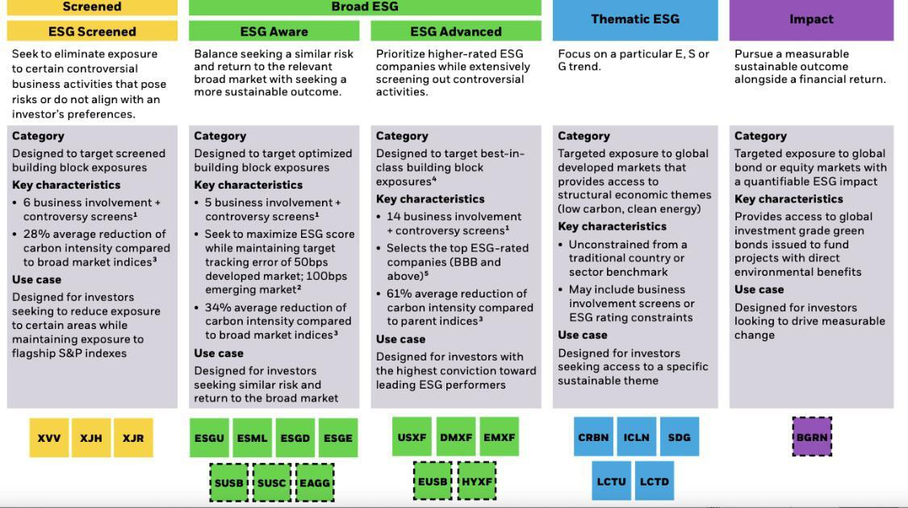

The financial world is vast and diverse, offering countless opportunities and tools for investors. From traditional equities and bonds to innovative financial products, the range of investments available today is broader than ever before. Understanding different investment vehicles and strategies is crucial for anyone looking to grow their wealth. This understanding allows investors to make informed decisions about how to allocate their resources effectively to meet their financial goals.

Investors today are not just focused on traditional asset classes; there is a growing interest in more sophisticated instruments and strategies. This article aims to explore various investment options, specifically focusing on iShares funds, which represent a significant portion of the modern investing landscape, and algorithmic trading strategies, which are revolutionizing how trades are executed. iShares, managed by BlackRock, offers a wide array of exchange-traded funds (ETFs) that allow investors access to diverse markets and sectors, making them an attractive option for portfolio diversification and cost-effective investing.



Additionally, the integration of technology in the financial sector has given rise to algorithmic trading. This approach uses complex mathematical models and algorithms to make trading decisions, often at speeds and accuracies that surpass human capabilities. By discussing these two components—iShares funds and algorithmic trading—this article will highlight how they can be effectively utilized to optimize investment strategies. We'll analyze the types of iShares ETFs available, provide examples of these funds, and discuss how algorithmic trading is shaping the investment landscape, providing both opportunities and challenges to contemporary investors.

## Table of Contents

## iShares: A Global Leader in ETFs

iShares, managed by BlackRock, stands as a preeminent provider of exchange-traded funds (ETFs). ETFs are innovative financial instruments that allow investors to gain exposure to a diverse array of markets by holding a single security. Unlike traditional mutual funds, ETFs trade on stock exchanges, which provides investors with the flexibility to buy and sell throughout the trading day at market prices.

The primary mechanism of an ETF is to track the performance of a specific index, such as the S&P 500 or the MSCI Emerging Markets Index. This is achieved through a passive investment approach, which aims to replicate the performance of the benchmark index by emulating its composition. Consequently, ETFs often entail lower operating costs compared to actively managed funds, as they require less intensive management.

iShares distinguishes itself by furnishing investors with a cost-effective means of accessing diversified portfolios. With over 800 ETF offerings globally, iShares enables investors to tailor their exposure across a spectrum of asset classes, including equities, fixed income, and commodities, as well as geographical regions and market sectors. This extensive variety allows investors to construct portfolios that align with their specific investment objectives and risk tolerance.

The benefits of investing in ETFs like iShares are manifold. Firstly, they provide a level of diversification that can mitigate risk—by holding a basket of securities, ETFs reduce the impact of any single security's poor performance on the overall portfolio. Secondly, ETFs are generally more tax-efficient than mutual funds due to their unique in-kind creation and redemption process, which helps limit capital gains distributions.

In summary, iShares has established itself as a leader in the [ETF](/wiki/etf-trading-strategies) market, offering a robust suite of products that cater to the diverse needs of investors. Whether seeking exposure to large-cap U.S. equities or emerging market stocks, iShares provides the tools necessary for investors to efficiently navigate global markets.

## Types of iShares Funds

iShares, a pioneer in exchange-traded funds (ETFs), offers a broad spectrum of investment options catering to various investor needs. Among the most prominent offerings are the iShares Core S&P 500 ETF, iShares MSCI Emerging Markets ETF, iShares Core US Aggregate Bond ETF, and specific thematic funds targeting niche sectors.

iShares Core S&P 500 ETF stands as a cornerstone for many investors, as it mirrors the S&P 500 Index. This index comprises 500 of the largest publicly traded companies in the United States, providing investors with a diversified exposure to large-cap U.S. equities. The primary advantage of this ETF is that it allows investors to achieve broad market exposure to leading companies across different sectors with relatively low management fees.

The iShares MSCI Emerging Markets ETF offers access to emerging market stocks. This ETF is designed to track the performance of the MSCI Emerging Markets Index, which includes companies from 26 countries such as China, India, Brazil, and South Africa. Emerging markets often present growth opportunities that are far greater compared to developed markets due to their expanding economies and increasing consumer bases. However, with these opportunities come higher [volatility](/wiki/volatility-trading-strategies) and associated risks.

When it comes to fixed-income investments, the iShares Core US Aggregate Bond ETF provides exposure to a wide range of U.S. investment-grade bonds. This fund aims to replicate the performance of the Bloomberg Barclays U.S. Aggregate Bond Index, encompassing government bonds, corporate bonds, mortgage-backed securities, and other asset classes. This ETF is often used by investors looking for income generation and capital preservation, making it a staple in many diversified portfolios.

Additionally, iShares also offers a suite of thematic funds that focus on specific investment trends or sectors. These funds encompass areas like Environmental, Social, and Governance ([ESG](/wiki/esg-investing)) criteria, technological advancements, health innovation, and more. By investing in thematic funds, investors can align their portfolios with certain values or capitalize on long-term growth trends, such as the global shift towards sustainable energy or technological disruption.

Each type of iShares fund provides distinct advantages and caters to different investment strategies and risk appetites. Properly understanding these options can aid investors in constructing a well-rounded, diversified portfolio tailored to their financial objectives.

## Benefits and Risks of Investing in iShares

iShares funds, facilitated by BlackRock, offer several advantages to investors. Diversification is a key benefit, enabling investors to spread their risk across a wide array of assets. This mitigates the potential negative impact of any single asset's poor performance. iShares ETFs cover various sectors, asset classes, and geographic regions, providing a broad range of investment opportunities. This diversification can be particularly beneficial for individual investors who may not have the resources to achieve the same level of diversity independently.

Another significant advantage is tax efficiency. iShares ETFs are generally more tax-efficient compared to traditional mutual funds. This stems from their unique structure and the "in-kind" creation and redemption process, which helps minimize taxable capital gains distributions. As a result, investors may experience lower tax liabilities over the long term [1].

iShares funds also typically have lower expense ratios than mutual funds, which can erode investor returns over time. Lower fees mean that a greater proportion of the investment's returns remain in the investor's pocket. The passive nature of ETF management, designed to track indices rather than actively manage assets, contributes to these cost savings.

However, investing in iShares ETFs involves specific risks that need careful consideration. Market risk is a fundamental concern, as ETF values fluctuate with market conditions. A downturn in the market index an ETF tracks can lead to significant losses. Moreover, [liquidity](/wiki/liquidity-risk-premium) risk, the risk that an investor might not be able to buy or sell ETF shares quickly enough at a fair price, can be a limiting [factor](/wiki/factor-investing), particularly in less liquid or niche ETFs.

Currency risk is another aspect, especially in ETFs tracking international indices. Fluctuations in currency exchange rates can impact returns adversely if the investor's base currency strengthens against the foreign currencies of the investment. Investors need to weigh these risks against the potential benefits to make informed decisions.

Understanding these associated risks is crucial. Investors should assess their risk tolerance and investment horizon to determine if iShares ETFs align with their financial goals and strategies. By doing so, they can optimize the potential benefits while managing the inherent risks.

[1] BlackRock. (n.d.). iShares Funds. Retrieved from [https://www.blackrock.com](https://www.blackrock.com)

## Algorithmic Trading: Revolutionizing Investments

Algorithmic trading represents a significant transformation in the financial markets, driven by the use of advanced mathematical models and sophisticated computer programs to conduct trading activities at high speed. This approach is pivotal for executing trades with precision and efficiency, particularly advantageous in today’s fast-paced and highly competitive financial environment. 

The cornerstone of [algorithmic trading](/wiki/algorithmic-trading) is its reliance on quantitative analysis to inform decision-making processes. Sophisticated algorithms are designed to detect market trends, fluctuations, and opportunities that might be invisible to the human eye. These algorithms can process vast amounts of market data in real-time, analyzing and acting on it almost instantaneously. For example, a simple algorithm for making trading decisions based on moving averages could be written in Python as follows:

```python
def moving_average_strategy(prices, short_window, long_window):
    signals = []
    short_ma = prices.rolling(window=short_window).mean()
    long_ma = prices.rolling(window=long_window).mean()

    for i in range(len(prices)):
        if short_ma[i] > long_ma[i]:
            signals.append('Buy')
        elif short_ma[i] < long_ma[i]:
            signals.append('Sell')
        else:
            signals.append('Hold')
    return signals
```

The main strategies employed by algorithmic traders include index fund rebalancing, [arbitrage](/wiki/arbitrage), mean reversion, and market timing. Each of these strategies serves specific market needs and exploits different types of inefficiencies or patterns. 

1. **Index Fund Rebalancing**: This strategy involves adjusting the holdings of an index fund to maintain its alignment with the underlying benchmark index. Algorithms facilitate these adjustments by calculating the necessary trades with minimal disruption and cost.

2. **Arbitrage**: This involves exploiting price differences of the same asset in different markets to earn profit without market risk. Algorithms quickly detect and act on these discrepancies, ensuring swift execution before the arbitrage opportunity disappears.

3. **Mean Reversion**: Based on the assumption that asset prices will revert to their long-term average, mean reversion algorithms identify deviations from the historical mean and predict market corrections. This strategy relies heavily on statistical analysis.

4. **Market Timing**: Timing the market to buy low and sell high is a classic strategy enhanced by algorithms which predict optimal entry and exit points based on market trends and historical data patterns.

A key advantage of algorithmic trading is its ability to remove emotional biases from trading decisions, a common pitfall for human traders. By relying on data and analytics instead of intuition and emotion, algorithms ensure more disciplined and consistent execution. Moreover, these algorithms can execute trades with extraordinary speed and precision, often completing actions in fractions of a second, which is crucial in markets where conditions can change rapidly. 

In summary, algorithmic trading harnesses the power of computation to offer enhanced trade execution, reduced transaction costs, and improved portfolio management, thus revolutionizing investment strategies and outcomes in the modern financial landscape.

## Examples of Algorithmic Trading Strategies

Algorithmic trading strategies have become integral to modern investing, offering precision and efficiency that traditional methods may lack. Here are some of the most prevalent strategies:

1. **Rebalancing Algorithms**: These algorithms are designed to maintain the target allocation of assets within a portfolio. As market conditions change, so do the values of the assets, potentially leading to deviated asset proportions. Rebalancing algorithms automatically adjust by buying or selling assets to return to the desired allocation. For example, if a portfolio's target allocation is 60% in equities and 40% in bonds, and due to market movements the equity portion rises to 70%, the algorithm will sell some equities and buy bonds to return the allocation to its target. 

   In Python, a simple rebalancing logic could be implemented as follows:

   ```python
   def rebalance_portfolio(portfolio, target_allocation):
       current_value = sum(portfolio.values())
       for asset, target_percentage in target_allocation.items():
           target_value = current_value * target_percentage
           portfolio[asset] = target_value
       return portfolio

   portfolio = {'stocks': 7000, 'bonds': 3000}
   target_allocation = {'stocks': 0.6, 'bonds': 0.4}
   rebalance_portfolio(portfolio, target_allocation)
   ```

2. **Arbitrage Algorithms**: These strategies are designed to exploit price discrepancies between markets. In efficient markets, identical or very similar financial instruments should have the same price. Arbitrage algorithms seek to profit by identifying and executing trades on these discrepancies across different platforms or markets. For instance, if a stock is trading at $100 on one exchange and $101 on another, the algorithm would simultaneously buy on the cheaper exchange and sell on the more expensive one, locking in a risk-free profit.

3. **Mean Reversion Algorithms**: This strategy is based on the statistical hypothesis that prices will tend to move back to their mean or average over time. Mean reversion algorithms monitor assets that deviate significantly from their historical average prices and make trades anticipating their return to the mean. This approach involves analyzing time series data to determine the mean price and setting thresholds for buy and sell triggers.

   A simple mean reversion strategy can be implemented using statistical tools in Python, such as:

   ```python
   import numpy as np

   def calculate_moving_average(prices, window):
       return np.convolve(prices, np.ones(window), 'valid') / window

   def mean_reversion_strategy(prices, window, threshold):
       moving_average = calculate_moving_average(prices, window)
       signals = []
       for i in range(len(moving_average)):
           if prices[i + window - 1] < moving_average[i] - threshold:
               signals.append('Buy')
           elif prices[i + window - 1] > moving_average[i] + threshold:
               signals.append('Sell')
           else:
               signals.append('Hold')
       return signals

   prices = [104, 102, 101, 105, 110, 108, 107, 109]
   mean_reversion_strategy(prices, window=3, threshold=2)
   ```

These algorithmic trading strategies wield powerful techniques for optimizing trades and capturing market efficiencies, enabling sophisticated investment approaches. As technology advances, the application and sophistication of these strategies continue to evolve, potentially offering even greater opportunities for investors.

## Combining iShares Funds and Algorithmic Trading

Combining iShares funds with algorithmic trading strategies presents a compelling approach for investors seeking to maximize their portfolio's potential. Algorithmic trading involves using computational algorithms to make quick and informed trading decisions, which can be particularly effective when applied to the diverse range of ETFs offered by iShares. iShares ETFs provide a broad spectrum of asset classes and markets, making them suitable targets for strategies that require liquidity and diversification.

Investors utilizing algorithmic trading with iShares ETFs can significantly enhance portfolio performance. High-frequency trading algorithms, for example, can exploit time-sensitive opportunities by detecting patterns and executing trades faster than humanly possible. These algorithms can also automatically adjust portfolio allocations, maintaining balance according to predefined rules or market conditions, effectively optimizing the risk-return profile of the investment.

Risk management is another crucial aspect where algorithmic trading can aid investors using iShares ETFs. Algorithms can be programmed to continuously monitor market data and historical trends, enabling real-time risk assessment and mitigation. For instance, they can incorporate stop-loss strategies to limit potential losses or dynamically hedge against currency and market risks using derivatives alongside iShares ETFs.

Here's a simplified example of how an investor might construct a basic algorithm to rebalance an iShares portfolio:

```python
import pandas as pd

def calculate_portfolio_value(prices, holdings):
    return sum(prices * holdings)

# Sample data
prices = pd.Series([100, 200, 50])  # Price of iShares ETFs
holdings = pd.Series([10, 5, 20])  # Corresponding holdings

target_allocation = [0.4, 0.3, 0.3]  # Target portfolio allocation percentages

# Calculate total portfolio value
total_value = calculate_portfolio_value(prices, holdings)

# Desired portfolio values based on target allocation
desired_values = total_value * pd.Series(target_allocation)

# Calculate rebalancing actions
rebalancing_actions = desired_values / prices - holdings
print("Rebalancing actions:", rebalancing_actions)
```

This Python snippet demonstrates a basic rebalancing strategy that realigns an iShares ETF portfolio with a specified target allocation. Such algorithmic rebalancing ensures that the portfolio efficiently adapts to market changes while sticking to the investor's strategic goals.

The combination of diversified iShares ETFs and sophisticated algorithmic trading not only enhances potential returns but also strengthens an investor's ability to navigate volatile markets. By marrying the wide-ranging options available in iShares' ETF lineup with dynamic trading algorithms, investors can construct robust portfolios tailored to meet specific financial objectives with precision and agility.

## Conclusion

iShares funds present a diverse range of opportunities for investors looking for broad exposure across various asset classes and global markets. With over 800 ETFs, iShares allows investors to tailor their portfolios to meet specific financial objectives, whether aiming for high-growth equities or seeking stability through bonds.

The advancements in algorithmic trading have significantly reshaped investment strategies, offering robust tools to enhance portfolio performance and manage risks. By incorporating sophisticated algorithms, traders and investors can execute precise and rapid trades, thus reducing human error and emotional bias. This approach allows for a strategic advantage in balancing investment allocations, arbitrage opportunities, and predicting market [momentum](/wiki/momentum) through data-driven decisions.

Integrating the benefits of iShares funds with algorithmic trading strategies can significantly optimize investment outcomes. This synergy enables investors to create a more dynamic and responsive investment strategy, aligning closely with their individual financial goals and risk tolerance. Employing algorithmic strategies in conjunction with a diversified ETF portfolio like iShares not only enhances potential returns but also provides a sophisticated framework for managing market volatility and investment uncertainties effectively. Thus, understanding and applying these modern investment tools can be instrumental in achieving long-term financial success.

## References & Further Reading

[1]: BlackRock. (n.d.). iShares Funds. Retrieved from [https://www.blackrock.com](https://www.blackrock.com/us/financial-professionals/investments/products/ishares-etfs)

[2]: Lopez de Prado, M. (2018). ["Advances in Financial Machine Learning."](https://www.amazon.com/Advances-Financial-Machine-Learning-Marcos/dp/1119482089) John Wiley & Sons.

[3]: Aronson, D. R. (2006). ["Evidence-Based Technical Analysis: Applying the Scientific Method and Statistical Inference to Trading Signals."](https://www.amazon.com/Evidence-Based-Technical-Analysis-Scientific-Statistical/dp/0470008741) John Wiley & Sons.

[4]: Jansen, S. (2018). ["Machine Learning for Algorithmic Trading."](https://github.com/stefan-jansen/machine-learning-for-trading) Packt Publishing.

[5]: Chan, E. P. (2009). ["Quantitative Trading: How to Build Your Own Algorithmic Trading Business."](https://github.com/ftvision/quant_trading_echan_book) John Wiley & Sons.