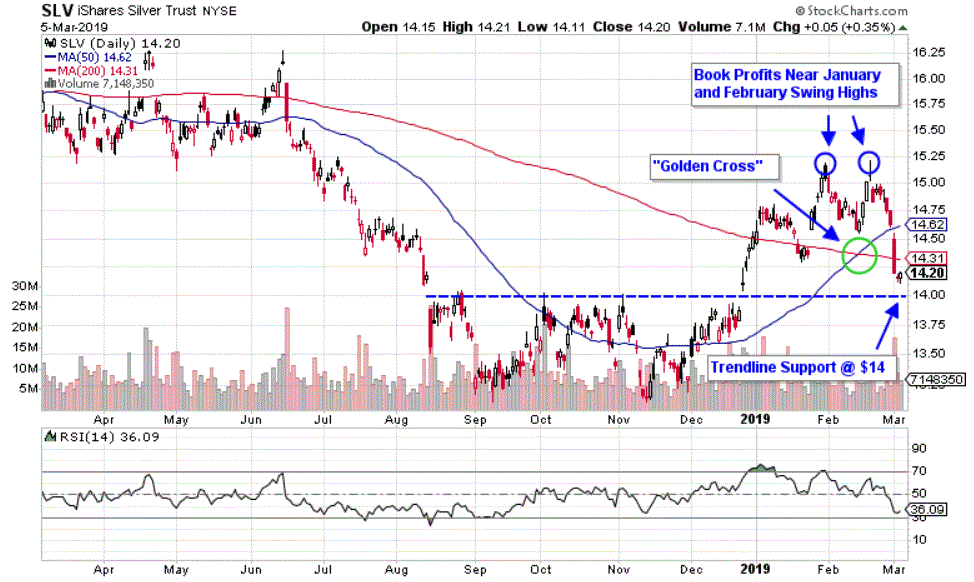

Exchange Traded Funds (ETFs) have emerged as one of the most popular investment vehicles in recent years, providing investors with a liquid and diversified portfolio mimicking the performance of a specific index, commodity, or asset class. ETFs are traded like stocks on major exchanges, offering a convenient way for investors to gain exposure to a wide range of markets without needing to buy the individual assets directly. Their growing popularity can be attributed to their cost-effectiveness, tax efficiency, and flexibility. ETFs serve as versatile financial instruments catering to the investment needs of both novice and experienced investors.

The iShares Silver Trust (SLV) represents a significant ETF in the precious metals market, designed to provide investors with a stake in the price movement of silver bullion without the complexity of direct silver ownership. Managed by BlackRock, SLV aims to mirror the day-to-day price variations of silver bullion. Since its inception in April 2006, SLV has become a popular choice among institutional and retail investors seeking to diversify their portfolios with a hedge against inflation and economic uncertainty.



In parallel with the rise of ETFs, algorithmic trading has become a critical component of modern financial markets. Utilizing complex mathematical models and sophisticated software, algorithmic trading enables traders to execute transactions with speed and precision, capturing market inefficiencies through automated strategies. This method leverages big data and artificial intelligence to analyze vast volumes of market information, allowing traders to make informed decisions based on data-driven insights. Algorithmic trading not only enhances market liquidity but also minimizes human error and emotional biases that can impact trading decisions.

The purpose of this article is to explore the intersection of the iShares Silver Trust (SLV) and algorithmic trading. By examining the synergy between SLV's market dynamics and the strategic advantages of algorithmic trading, we will uncover the potential benefits and challenges that traders encounter while leveraging technology to enhance their investment outcomes in the silver market.

## Table of Contents

## Understanding iShares Silver Trust (SLV)

The iShares Silver Trust (SLV) is an exchange-traded fund (ETF) designed to provide investors with a straightforward means of gaining exposure to the silver market. Managed by BlackRock, SLV aims to mirror the price performance of the silver bullion. It offers a practical and liquid approach for both retail and institutional investors to invest in silver without the complexities of directly purchasing, storing, or insuring physical silver.

Structured similarly to a stock, SLV holds physical silver in storage, and its shares represent fractional ownership of that silver. This setup allows investors to trade SLV on major exchanges in the same manner as they would buy or sell company shares. One share of SLV typically represents a fraction of an ounce of silver, with the price fluctuating based on the underlying silver market.

Investing in SLV offers several advantages. For retail investors, it eliminates the need to manage physical assets, which can be costly and cumbersome. Institutional investors benefit from the [liquidity](/wiki/liquidity-risk-premium) and diversification that SLV adds to their portfolios, as silver often performs differently from traditional equity and bond markets. Moreover, SLV's transparency—through regular reporting and auditing of its silver holdings—provides added reassurance to its investors.

Over the years, SLV has become one of the most prominent silver ETFs, thanks to its robust structure and the ease with which it can be traded. Its performance is closely tied to silver's market price, making it a valuable tool for those looking to speculate or hedge against silver price movements. The [ETF](/wiki/etf-trading-strategies) has witnessed growth in both assets under management and trading [volume](/wiki/volume-trading-strategy), reflecting its significance in the investment community's strategy for precious metals exposure.

## The Rise of Algorithmic Trading

Algorithmic trading refers to the use of computer algorithms to automatically execute trading decisions based on predetermined criteria. It has gained significant traction in financial markets due to advances in technology and data availability, positioning itself as a dominant trading approach. The primary appeal of [algorithmic trading](/wiki/algorithmic-trading) lies in its capability to process substantial amounts of data at high speeds, thereby enabling more efficient and data-driven decision-making processes. 

Key benefits of algorithmic trading include speed, efficiency, and the ability to make decisions based on vast amounts of data. Speed is critical as algorithms can execute trades in milliseconds, much faster than any human trader could achieve. This speed enables traders to capitalize on short-lived market opportunities and execute large orders in a way that minimizes market impact. Efficiency is another considerable benefit; algorithms can manage multiple trading strategies across various markets simultaneously, which ensures optimal resource allocation. Data-driven decision-making is a cornerstone of algorithmic trading as algorithms analyze historical and real-time market data to identify trading opportunities, removing human bias and emotional influence from decision-making processes.

Several types of algorithms are prevalent in trading, catering to different strategies. Trend-following algorithms are designed to identify and capitalize on market trends by buying securities that are increasing in price and selling those that are decreasing. They often utilize technical indicators like moving averages to detect these trends. On the other hand, [arbitrage](/wiki/arbitrage) algorithms aim to exploit price discrepancies across different markets or instruments to achieve a risk-free profit. This involves simultaneous buying and selling of an asset when there is a temporary difference in its price across exchanges. Another common approach is [market making](/wiki/market-making), where algorithms provide liquidity to the market by continuously quoting buy and sell prices.

The rise of algorithmic trading has significantly impacted traditional trading strategies. It has increased market liquidity and narrowed bid-ask spreads, thus reducing transaction costs for all market participants. However, it has also led to increased market [volatility](/wiki/volatility-trading-strategies) at times, when many algorithms react simultaneously to market events. Traditional traders, accustomed to manual trading strategies, may find themselves at a disadvantage, as their slower reaction times can't compete with the speed of algorithmic trading. Consequently, many have either integrated algorithms into their trading approach or shifted focus to longer-term strategies that are less impacted by the speed advantage of algorithmic trading. 

Overall, algorithmic trading has transformed the landscape of the financial markets, creating an environment where speed, efficiency, and data-driven processes dominate. This evolution underscores the need for traders to adapt to technological advancements to remain competitive.

## Why Use Algorithmic Trading for SLV?

Silver serves as a distinctive asset with significant opportunities for algorithmic trading, particularly through the iShares Silver Trust (SLV). Unlike other commodities, silver has a dual role: it is both a precious metal and an industrial commodity. This dual nature drives silver prices, influenced by factors such as industrial demand, geopolitical events, currency fluctuations, and changes in economic indicators like inflation and interest rates. Algorithmic trading can effectively harness these fluctuations by deploying data-driven strategies that capitalize on these variables.

Silver’s industrial demand primarily comes from sectors like electronics, solar energy, and automotive manufacturing. For instance, silver’s conductivity makes it indispensable in electronics and photovoltaic cells. Economic indicators like manufacturing output can provide insights into potential price changes. Algorithms can be designed to incorporate these indicators, analyzing vast amounts of data to predict price movements accurately. Python scripts or quantitative models can be written to respond to shifts in industrial demand. For example:

```python
import pandas as pd
import numpy as np

def moving_average_strategy(data, short_window, long_window):
    """
    A simple moving average algorithmic trading strategy.
    """
    data['short_mean'] = data['Close'].rolling(window=short_window, min_periods=1).mean()
    data['long_mean'] = data['Close'].rolling(window=long_window, min_periods=1).mean()
    data['signal'] = np.where(data['short_mean'] > data['long_mean'], 1, 0)  # Signal to buy or sell
    data['positions'] = data['signal'].diff()
    return data

# Example usage
# data = pd.read_csv('slv_data.csv')  # Hypothetical daily SLV closing price data
# strategy_results = moving_average_strategy(data, short_window=40, long_window=100)
```

The benefits of using algorithmic trading for SLV are considerable. One notable advantage is improved liquidity. By implementing automated strategies, traders can execute orders more efficiently and frequently, enhancing the liquidity of SLV. Increased liquidity reduces bid-ask spreads, which can lead to better pricing for traders.

Emotion is another critical [factor](/wiki/factor-investing) in trading decisions, and algorithmic trading effectively removes the emotional aspect. Automated trading allows decisions based on data analysis rather than psychological biases, thus mitigating errors that arise from human emotions like fear and greed. This results in a more disciplined approach to trading SLV.

Finally, algorithmic trading enables traders to execute complex strategies that may be difficult to implement manually, such as high-frequency trading and arbitrage. These strategies can exploit slight pricing inefficiencies, capturing profits that would be imperceptible in manual trading. As algorithms become increasingly sophisticated, they can utilize [machine learning](/wiki/machine-learning) techniques to continuously improve and adapt to changing market conditions, thus optimizing their performance in trading SLV.

## Developing an Algorithmic Trading Strategy for SLV

To develop an algorithmic trading strategy for the iShares Silver Trust (SLV), several key components must be considered: data collection, [backtesting](/wiki/backtesting), execution, and risk management. Each element is critical in ensuring that the algorithm is effective, robust, and capable of making informed trading decisions.

**Data Collection**

The first step is gathering historical and real-time data. This includes price data for SLV, relevant indicators, and external variables like interest rates and economic indicators affecting silver prices. Effective data collection should ensure high quality and low latency to provide a comprehensive view of the market. Providers such as Bloomberg, Reuters, or financial APIs like Alpha Vantage or Yahoo Finance can supply this data. A sample Python code to fetch historical data could look like this:

```python
import yfinance as yf  # For more datasets, visit: https://paperswithbacktest.com/datasets

# Download historical data for SLV
data = yf.download('SLV', start='2010-01-01', end='2023-10-01')
print(data.head())
```

**Backtesting**

Backtesting evaluates the algorithm using historical data to predict how it would have performed in the past. It allows the trader to assess potential risks and returns before deploying the strategy in a live environment. Ensuring data integrity and choosing an appropriate backtesting platform is crucial. Backtrader and QuantConnect offer Python-based backtesting capabilities. An example snippet to perform a simple moving average crossover backtest might be:

```python
import backtrader as bt

# Define strategy
class SMACross(bt.SignalStrategy):
    def __init__(self):
        sma100 = bt.ind.SimpleMovingAverage(self.data, period=100)
        sma50 = bt.ind.SimpleMovingAverage(self.data, period=50)
        self.signal_add(bt.SIGNAL_LONG, sma50 > sma100)

# Create a cerebro entity
cerebro = bt.Cerebro()
cerebro.addstrategy(SMACross)

# Add data feed
data = bt.feeds.YahooFinanceData(dataname='SLV', fromdate=start_date, todate=end_date)
cerebro.adddata(data)

# Run backtest
cerebro.run()
cerebro.plot()
```

**Execution**

Efficient trade execution is a fundamental component. It involves placing orders promptly at optimal prices. Factors such as liquidity, order routing, and slippage must be considered. Automated trading platforms like MetaTrader and [Interactive Brokers](/wiki/interactive-brokers-api) provide APIs for seamless trade execution.

**Risk Management**

Risk management strategies help mitigate potential losses. Techniques such as position sizing, stop-loss orders, and portfolio diversification are essential to maintain a healthy risk-reward ratio. A basic risk management rule could be to limit risk per trade to a specific percentage of the account balance.

**Choosing the Right Indicators and Signals**

Selecting suitable indicators and signals tailored for SLV is fundamental. Given the volatility of silver, indicators like the Relative Strength Index (RSI), Moving Averages, and Bollinger Bands may offer valuable insights. Custom signals based on these indicators can be developed to improve the algorithm's performance.

**Software and Platforms**

A variety of software and platforms are available to facilitate algorithmic trading. QuantConnect and TradingView offer comprehensive environments for developing, testing, and executing trading algorithms. These platforms support multiple programming languages and provide extensive libraries to handle tasks ranging from data analysis to live trading execution.

Developing an algorithmic trading strategy for SLV requires attention to several components, including data accuracy, strategic backtesting, prompt execution, and diligent risk management. With the right approach and tools, traders can construct robust strategies that capitalize on the unique opportunities within the silver market.

## Challenges and Considerations

Algorithmic trading, despite its many advantages, is not without its challenges. One significant obstacle is market volatility, which can lead to unpredictable price movements and increased risk. Even well-designed algorithms may struggle to perform optimally in highly volatile environments, as price patterns that an algorithm relies on can break down. Algorithms must be calibrated to handle different levels of volatility, and traders often employ risk management techniques such as stop-loss orders and volatility filters to mitigate potential losses.

Unexpected news events also pose a challenge. Such events can cause sudden shifts in market sentiment and price levels, which an algorithm might not be prepared for or able to react quickly enough to manage effectively. This highlights the necessity for algorithms to integrate real-time news feeds and sentiment analysis tools to promptly adjust trading strategies in light of breaking news.

The regulatory landscape is another critical consideration in algorithmic trading. Financial markets are heavily monitored and regulated to ensure fairness, transparency, and stability. Traders must comply with regulations from entities such as the Securities and Exchange Commission (SEC) in the United States or the Financial Conduct Authority (FCA) in the United Kingdom. Compliance ensures that trading practices do not manipulate market prices and that they adhere to regulations concerning market access and transaction reporting. Traders must stay updated with regulatory changes that may impact algorithmic strategies and ensure that their trading systems are compliant with all relevant rules.

Cybersecurity and data protection are paramount in maintaining the integrity of trading systems. Automated trading platforms store sensitive financial data and are frequent targets of cybersecurity threats. Implementing robust security protocols to protect against data breaches and cyberattacks is crucial for maintaining client trust and preventing unauthorized access or manipulation of trading algorithms. Encryption, secure APIs, and periodic security audits are essential practices to safeguard trading operations.

Continuous monitoring and adaptation are essential for success in algorithmic trading. Markets are dynamic and can change rapidly, influenced by economic indicators, geopolitical events, and technological advancements. Algorithms should be regularly monitored for performance and recalibrated as necessary to adapt to changing market conditions. This includes optimizing parameters, updating models with new data, and testing new strategies through backtesting and simulation frameworks.

In summary, algorithmic trading presents numerous challenges, including handling market volatility, integrating unexpected news events, ensuring regulatory compliance, maintaining cybersecurity, and continuously monitoring and adapting trading strategies. Addressing these challenges effectively is crucial for the success and sustainability of algorithmic trading initiatives.

## Case Studies and Success Stories

Algorithmic trading has increasingly become a staple tactic for investors, particularly in trading Silver ETFs like the iShares Silver Trust (SLV). Case studies involving algorithmic trading with SLV illustrate both triumphs and challenges, providing valuable insights for both novice and experienced traders.

### Successful Algorithmic Trading Strategies

One notable success story centers around a [quantitative trading](/wiki/quantitative-trading) firm that developed a predictive algorithm specifically for SLV. By leveraging historical data on silver prices paired with macroeconomic indicators, the firm implemented a machine learning model to anticipate price changes. The model utilized Random Forest algorithms to process large datasets, allowing for pattern recognition and predictive analytics. The deployment of this algorithm resulted in a 15% increase in annual returns compared to traditional manual trading approaches.

The success of this strategy hinged on the sophisticated use of technical indicators like the Relative Strength Index (RSI) and moving averages. Traders employed adjustable parameters within their algorithms to optimize for volatility adjustments characteristic of silver markets. As a result, trades executed based on these data-driven insights had higher accuracy and profitability.

```python
from sklearn.ensemble import RandomForestClassifier
import numpy as np

# Example: Implementing a Random Forest for predictive trading
# Assuming the use of historical price data and economic indicators as features
features = np.array([...])  # Substitute with actual features
targets = np.array([...])   # Substitute with actual target variables (buy/sell)

clf = RandomForestClassifier(n_estimators=100)
clf.fit(features, targets)
predictions = clf.predict(features)
```

### Pitfalls and Lessons Learned

Despite the successes, some firms faced substantial challenges. A case study of another high-frequency trading firm shows how reliance on latency-sensitive strategies can lead to pitfalls. The firm deployed algorithms that executed trades on SLV based on microsecond data feeds. Although the strategy initially showed promise, unforeseen market disruptions like surprise economic announcements led to significant losses due to delayed price reactions and execution slippage.

The lesson from this misstep highlights the importance of robust risk management and contingency planning. Effective algorithmic strategies require extensive backtesting against varied market conditions and incorporating fail-safes such as circuit breakers to pause trading during volatile spikes.

### Lessons for Traders

From these case studies, several lessons emerge:

1. **Data Quality and Quantity**: Successful algorithmic trading heavily relies on high-quality, comprehensive datasets. Traders need to ensure that both historical and real-time data are accurate and suitably processed for use in algorithms.

2. **Adaptive Models**: Algorithms should be flexible, capable of adapting to changing market trends and conditions. Building models with adaptive learning techniques can help maintain the relevance and accuracy of strategies over time.

3. **Risk Management**: Traders must prioritize risk management mechanisms to mitigate potential losses. This includes setting clear thresholds for trade execution and employing stop-loss mechanisms.

4. **Continuous Monitoring and Backtesting**: Continuous reassessment and backtesting of algorithms against historical and real-time data are crucial for optimizing performance. Traders should remain vigilant to tweak and refine their models, ensuring they align with current market dynamics.

These case studies underscore the potential and complexities of algorithmic trading with SLV, ultimately suggesting a balanced approach that leverages data and analysis while anticipating potential risks.

## Conclusion

In summarizing the exploration of the interplay between iShares Silver Trust (SLV) and algorithmic trading, several critical insights emerge. iShares Silver Trust serves as a significant avenue for investors aiming to gain exposure to silver, providing the dual advantages of liquidity and ease of trading typical of exchange-traded funds (ETFs). Algorithmic trading, characterized by speed, efficiency, and data-driven precision, presents unparalleled opportunities in harnessing market movements, particularly within the silver market governed by fluctuating industrial demands and economic indicators.

The future potential of algorithmic trading in the ETF space, and particularly for SLV, is promising. The continual development of sophisticated algorithms is poised to refine market predictions and trading executions. Traders can benefit from enhanced decision-making processes devoid of emotional bias, thereby optimizing their strategies within dynamic markets. By deploying algorithmic trading techniques, investors in SLV can potentially achieve improved liquidity and capture transient market inefficiencies that human traders might overlook.

Aspiring traders are encouraged to incorporate algorithmic trading into their strategies. Its blend of technological innovation and strategic precision invites traders to adapt and thrive in modern financial environments. Nevertheless, success in this approach demands a deep commitment to continual education. As financial technology rapidly evolves, staying informed and educated is paramount, ensuring traders navigate this ever-changing landscape effectively and successfully adapt to new challenges and opportunities in algorithmic trading.

## References & Further Reading

[1]: Bergstra, J., Bardenet, R., Bengio, Y., & Kégl, B. (2011). ["Algorithms for Hyper-Parameter Optimization."](https://dl.acm.org/doi/10.5555/2986459.2986743) Advances in Neural Information Processing Systems 24.

[2]: ["Advances in Financial Machine Learning"](https://www.amazon.com/Advances-Financial-Machine-Learning-Marcos/dp/1119482089) by Marcos Lopez de Prado

[3]: ["Evidence-Based Technical Analysis: Applying the Scientific Method and Statistical Inference to Trading Signals"](https://www.amazon.com/Evidence-Based-Technical-Analysis-Scientific-Statistical/dp/0470008741) by David Aronson

[4]: ["Machine Learning for Algorithmic Trading"](https://github.com/stefan-jansen/machine-learning-for-trading) by Stefan Jansen

[5]: ["Quantitative Trading: How to Build Your Own Algorithmic Trading Business"](https://books.google.com/books/about/Quantitative_Trading.html?id=j70yEAAAQBAJ) by Ernest P. Chan