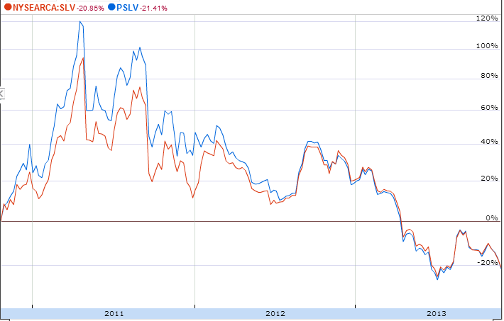

## Table of Contents

## What is the iShares Silver Trust ETF?

The iShares Silver Trust ETF, known as SLV, is a type of investment fund that focuses on silver. It's like a big basket where investors can put their money, and this basket holds silver instead of stocks or bonds. When you buy shares of SLV, you're essentially buying a piece of the silver that the fund holds. This makes it easier for people to invest in silver without having to buy and store physical silver themselves.

The main goal of the iShares Silver Trust ETF is to match the price movements of silver. If the price of silver goes up, the value of SLV shares should go up too, and if the price of silver goes down, the value of SLV shares should go down as well. This makes SLV a popular choice for investors who want to add silver to their investment portfolio without the hassle of dealing with physical metal.

## How does the iShares Silver Trust ETF work?

The iShares Silver Trust ETF, or SLV, is a way for people to invest in silver without having to buy and keep the actual metal. When you buy shares of SLV, you're buying a small part of the silver that the fund owns. The fund keeps the silver in safe places, like vaults, and makes sure it's all accounted for. This makes it easy for anyone to invest in silver, even if they don't want to deal with storing it themselves.

The value of SLV shares goes up and down with the price of silver. If the price of silver goes up, the value of your SLV shares will go up too. If the price of silver goes down, the value of your shares will go down as well. This means that SLV is a good way to add silver to your investment mix, but it also means that your investment can be risky because the price of silver can change a lot.

## What are the benefits of investing in the iShares Silver Trust ETF?

Investing in the iShares Silver Trust [ETF](/wiki/etf-trading-strategies), or SLV, has some nice benefits. One big plus is that it's easy to buy and sell. You don't have to worry about finding a place to keep silver bars or coins, because the fund takes care of that for you. All you have to do is buy and sell shares like you would with any other stock. This makes it simple for anyone to add silver to their investment mix without the hassle of dealing with the physical metal.

Another benefit is that SLV gives you a way to spread out your investments. Silver can be a good thing to have in your portfolio because it can act differently than stocks or bonds. When the stock market goes down, sometimes silver goes up, which can help balance out your losses. Plus, because SLV tracks the price of silver closely, you can be pretty sure that your investment will move with the silver market, making it a straightforward way to bet on silver's future.

## What are the risks associated with the iShares Silver Trust ETF?

Investing in the iShares Silver Trust ETF, or SLV, comes with some risks. One big risk is that the price of silver can change a lot. Silver can go up and down quickly, which means the value of your SLV shares can also go up and down a lot. If you need to sell your shares when the price of silver is low, you could lose money. This kind of risk is called market risk, and it's something to think about before you invest in SLV.

Another risk is called [liquidity](/wiki/liquidity-risk-premium) risk. Sometimes, it can be hard to buy or sell SLV shares quickly without changing the price a lot. If a lot of people want to sell their shares at the same time, the price might go down more than you expect. Also, there's a small fee for owning SLV shares, called an expense ratio. Over time, these fees can add up and eat into your returns, so it's important to keep an eye on them.

## How does the iShares Silver Trust ETF compare to other silver ETFs?

The iShares Silver Trust ETF, or SLV, is one of the biggest and most popular silver ETFs out there. It's known for being easy to buy and sell, and it tracks the price of silver closely. This means if the price of silver goes up, the value of SLV shares should go up too. Compared to other silver ETFs, SLV has a lot of shares traded every day, which makes it easier to buy and sell without changing the price too much. But, SLV has a small fee, called an expense ratio, that you have to pay for owning the shares.

Other silver ETFs, like the Aberdeen Standard Physical Silver Shares ETF (SIVR) and the abrdn Silver ETF (SILS), also let you invest in silver without having to keep the physical metal. SIVR and SILS are similar to SLV because they track the price of silver too, but they might have different fees and ways of buying and selling shares. For example, SIVR might have a lower expense ratio than SLV, which could save you money over time. But, these other ETFs might not be as easy to buy and sell as SLV because they might not have as many shares traded each day. So, when choosing between SLV and other silver ETFs, you have to think about things like fees, how easy it is to buy and sell, and how closely they track the price of silver.

## What is the expense ratio of the iShares Silver Trust ETF?

The expense ratio of the iShares Silver Trust ETF, or SLV, is 0.50%. This means that for every $100 you invest in SLV, you'll pay 50 cents each year to cover the costs of running the fund. It's a small fee, but over time it can add up, so it's something to keep in mind when you're thinking about investing in SLV.

Compared to other silver ETFs, SLV's expense ratio is pretty typical. Some ETFs might have a lower expense ratio, which could save you money in the long run. But, SLV is very popular and easy to buy and sell, so many people think the 0.50% fee is worth it for the convenience and liquidity it offers.

## How has the iShares Silver Trust ETF performed historically?

The iShares Silver Trust ETF, or SLV, has had its ups and downs over the years, just like the price of silver. From when it started in 2006, SLV has seen times when it did really well and other times when it didn't do so great. For example, during the financial crisis in 2008 and 2009, the price of silver and SLV went down a lot. But then, from 2009 to 2011, silver and SLV went up a lot, reaching high points. After 2011, the price of silver and SLV went down again and stayed lower for a few years.

More recently, SLV has seen some big moves. In 2020, when the world was dealing with the start of the COVID-19 pandemic, silver and SLV went up a lot as people looked for safe places to put their money. But then, like any investment, it had its ups and downs. Overall, if you look at the long-term performance of SLV, you'll see that it can be a good way to invest in silver, but it can also be risky because the price of silver can change a lot.

## What factors influence the price of the iShares Silver Trust ETF?

The price of the iShares Silver Trust ETF, or SLV, goes up and down mostly because of what's happening with the price of silver. If the price of silver goes up, the price of SLV shares will go up too. If the price of silver goes down, the price of SLV shares will go down as well. Things like how much silver is being produced, how much people want to buy silver, and what's going on in the world economy can all change the price of silver. For example, if there's a lot of silver being made but not many people want to buy it, the price might go down. But if there's not much silver being made and a lot of people want to buy it, the price might go up.

Other things can also affect the price of SLV. Sometimes, if a lot of people want to buy or sell SLV shares at the same time, it can change the price a bit. This is called liquidity, and it's important because it can make the price go up or down more than you might expect just from the price of silver. Also, the overall mood of the stock market can play a part. If people are feeling good about the economy, they might not want to buy as much silver, which could make the price go down. But if they're worried about the economy, they might buy more silver, which could make the price go up. So, the price of SLV is really tied to what's happening with silver, but other things can make a difference too.

## How can one invest in the iShares Silver Trust ETF?

To invest in the iShares Silver Trust ETF, or SLV, you need to have a brokerage account. This is like a special bank account where you can buy and sell stocks and ETFs. Once you have a brokerage account, you can search for SLV and place an order to buy shares. You can decide how many shares you want to buy and what price you're willing to pay. After you place your order, the brokerage will buy the shares for you, and they will show up in your account.

When you want to sell your SLV shares, you can do it the same way. Just go into your brokerage account, find your SLV shares, and place an order to sell them. You can choose how many shares you want to sell and at what price. Once your order is filled, the money from selling the shares will go into your brokerage account, and you can use it to buy other investments or take it out if you want.

## What are the tax implications of investing in the iShares Silver Trust ETF?

When you invest in the iShares Silver Trust ETF, or SLV, you need to know about the taxes you might have to pay. If you make money from selling your SLV shares for more than what you paid for them, you'll have to pay capital gains tax. How much you pay depends on how long you held the shares. If you held them for a year or less, it's called a short-term capital gain, and you'll pay your normal income tax rate on it. If you held them for more than a year, it's a long-term capital gain, and you'll pay a lower tax rate, usually between 0% and 20%, depending on your income.

There's another tax to think about if you get dividends from SLV. Dividends are like little payments the fund might give you from time to time. These dividends are usually taxed as ordinary income, so you'll pay your regular income tax rate on them. It's a good idea to talk to a tax advisor to understand all the tax rules and how they might affect your investment in SLV, because tax laws can change and everyone's situation is different.

## How does the iShares Silver Trust ETF fit into a diversified investment portfolio?

The iShares Silver Trust ETF, or SLV, can be a good way to add some variety to your investment portfolio. Silver is different from stocks and bonds, so when you add SLV to your investments, it can help balance things out. If the stock market goes down, sometimes silver goes up, which can help protect your money. This is called diversification, and it's like not putting all your eggs in one basket. By having some of your money in SLV, you're spreading out your risk and giving yourself a chance to make money even if other parts of your portfolio aren't doing well.

But remember, SLV can be a bit risky because the price of silver can change a lot. It's not something you should put all your money into, but it can be a nice part of a bigger plan. If you decide to add SLV to your portfolio, think about how much you want to put in based on how much risk you're okay with. A good rule is to not put too much of your money into one thing, so maybe you'll want to keep SLV as a smaller part of your overall investments. This way, you can enjoy the benefits of having silver in your portfolio without taking on too much risk.

## What advanced strategies can be used with the iShares Silver Trust ETF for experienced investors?

Experienced investors can use different advanced strategies with the iShares Silver Trust ETF, or SLV, to try to make more money or manage their risk better. One strategy is called hedging. This means you buy SLV to protect other parts of your portfolio. If you think the stock market might go down, you can buy some SLV because silver often goes up when stocks go down. This can help you lose less money overall. Another strategy is called options trading. With options, you can buy the right to buy or sell SLV at a certain price in the future. This can help you make money if you think the price of silver will go up or down a lot, but it's also riskier because you can lose money if you guess wrong.

Another advanced strategy is called dollar-cost averaging. Instead of buying a lot of SLV all at once, you buy a little bit every month or every few months. This way, you're not putting all your money in when the price is high, and you can buy more shares when the price is low. It helps smooth out the ups and downs of the silver market. Lastly, some investors use leverage, which means borrowing money to buy more SLV than they could with just their own money. This can make your gains bigger if the price of silver goes up, but it also makes your losses bigger if the price goes down. So, it's important to be careful and know what you're doing when you use these advanced strategies with SLV.

## References & Further Reading

[1]: Bergstra, J., Bardenet, R., Bengio, Y., & Kégl, B. (2011). ["Algorithms for Hyper-Parameter Optimization."](https://dl.acm.org/doi/10.5555/2986459.2986743) Advances in Neural Information Processing Systems 24.

[2]: ["Advances in Financial Machine Learning"](https://www.amazon.com/Advances-Financial-Machine-Learning-Marcos/dp/1119482089) by Marcos Lopez de Prado

[3]: ["Evidence-Based Technical Analysis: Applying the Scientific Method and Statistical Inference to Trading Signals"](https://www.amazon.com/Evidence-Based-Technical-Analysis-Scientific-Statistical/dp/0470008741) by David Aronson

[4]: ["Machine Learning for Algorithmic Trading"](https://github.com/stefan-jansen/machine-learning-for-trading) by Stefan Jansen

[5]: ["Quantitative Trading: How to Build Your Own Algorithmic Trading Business"](https://books.google.com/books/about/Quantitative_Trading.html?id=j70yEAAAQBAJ) by Ernest P. Chan