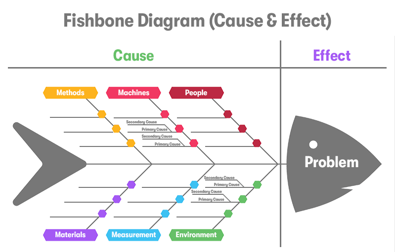

In today's fast-paced and competitive markets, understanding the root causes of problems can be key to gaining a competitive edge. Algorithmic trading, or algo trading, is a domain where such an understanding is crucial, as it involves automating trade execution using complex algorithms. These algorithms are designed to capitalize on small price deviations and must operate efficiently in the ever-volatile financial markets, where unforeseen anomalies can lead to significant financial gains or losses.

One of the most effective tools for diagnosing and analyzing issues within such complex systems is the Fishbone Diagram, also known as the Ishikawa Diagram. This visual tool is traditionally used in quality control processes to systematically identify root causes of problems, offering a structured method to dissect contributing factors in a clear, visual format. In the context of algo trading, leveraging this diagram can provide valuable insights into the underlying causes of trading anomalies, such as unexpected losses or system failures.

This article will explore how the Fishbone Diagram can be applied in the world of algo trading. Understanding the causes and effects that drive trading anomalies allows traders to develop more focused strategies for troubleshooting and improvement. By mapping out potential factors that could affect trading outcomes, traders can enhance their algorithms, making them more robust and capable of weathering the dynamic nature of financial markets. This integration of quality control tools with financial trading not only bridges gaps in identifying complex problems but also fosters a systematic approach to continuous improvement.

## Table of Contents

## What is a Fishbone Diagram?

The Fishbone Diagram, also referred to as the Ishikawa Diagram or Cause-and-Effect Diagram, is a visual tool designed to systematically identify and analyze the root causes of problems. It was developed by Kaoru Ishikawa in the 1960s as part of quality control processes. The diagram is named for its resemblance to a fish's skeleton, with the problem stated at the head and potential causes extending out like bones.

Each rib of the fish represents a major category of potential causes, typically including manpower, machinery, methods, materials, measurement, and mother nature. These categories help organize and further examine specific factors contributing to a particular issue.

For example, under the "manpower" category, potential causes might involve skill levels, training quality, or staffing shortages. "Machinery" could cover equipment malfunctions or maintenance issues, while "methods" may encompass procedural inefficiencies or errors in execution. "Materials" might focus on the quality or availability of inputs, and "measurement" could involve inaccuracies in data collection or analysis. Lastly, "mother nature" covers environmental conditions such as weather or external market forces.

By systematically exploring these categories, teams can pinpoint root causes of a problem, allowing for targeted interventions to resolve the issue effectively. The structured approach provided by the Fishbone Diagram is beneficial across various domains, facilitating organized and thorough problem-solving.

## Understanding the Role of Fishbone Diagram in Algo Trading

Algorithmic trading involves using computer algorithms to automate trading decisions, and it relies on a complex interplay of factors that define market behavior. A Fishbone Diagram serves as a valuable tool for identifying and analyzing the multitude of potential causes behind trading issues such as price slippage and execution delays. By systematically dissecting these causes, traders can better understand the various elements that influence their trading algorithms.

In [algorithmic trading](/wiki/algorithmic-trading), many variables contribute to the performance of a trading strategy, and the Fishbone Diagram helps in organizing these variables into structured categories. For example, price slippage can be caused by factors such as high market [volatility](/wiki/volatility-trading-strategies), insufficient [liquidity](/wiki/liquidity-risk-premium), or suboptimal order execution algorithms. Execution delays might stem from technological infrastructure issues, such as inadequate server capacity or inefficient network latency handling.

With the Fishbone Diagram, an algo trader can categorize potential causes into segments such as:

1. **Market Factors**: This includes volatility, liquidity, and relevant economic indicators that can influence market conditions.
2. **Technological Infrastructure**: This pertains to hardware and network efficiency, including server performance and data transmission speeds.
3. **Data Integrity**: The accuracy and timeliness of data feeds play a critical role in decision-making processes.
4. **Regulatory Environment**: Compliance with existing regulations and adapting to changes can impact trading performance.
5. **Trading Strategies**: This includes algorithm logic, asset allocation, and risk management techniques.

By mapping these factors, traders can utilize the Fishbone Diagram to visualize the interdependencies and causal relationships affecting their algorithms. This process enables traders to pinpoint where adjustments might be needed, whether it's fine-tuning the algorithm parameters, upgrading the technological components, or improving data management practices.

Furthermore, the systematic approach facilitated by the Fishbone Diagram can enhance the decision-making process. For instance, by aligning the identified causes with corresponding corrective actions, traders can effectively eliminate inefficiencies and optimize their trading strategies. The visual structure of the Fishbone Diagram aids in this process, as it allows for a clear overview of potential issues and simplifies the task of tracking improvements over time.

In conclusion, the Fishbone Diagram is a powerful tool in algorithmic trading for understanding the myriad of variables affecting trading performance. Its application enables traders to achieve a more granular insight into the root causes of trading anomalies and design more robust trading strategies.

## How to Create a Fishbone Diagram for Algo Trading

To create a Fishbone Diagram for algo trading, the first crucial step involves identifying a precise problem statement. This could be something like unexpected trading losses or system glitches. Defining the problem with clarity aids in maintaining focus and guides the subsequent analysis process.

Next, outline the main categories of potential causes that could contribute to the problem. In the context of algo trading, these categories often include:

1. **Data Integrity**: Inaccuracies in data can lead to flawed trading decisions. Consider factors such as data latency, missing data points, or errors in data feeds.

2. **Market Volatility**: High volatility can affect the predictability of trading algorithms. Evaluating historical volatility and current market conditions is essential.

3. **Technological Infrastructure**: Hardware failures, software bugs, or slow network connectivity can hinder trading performance. Assess the robustness of the trading system's architecture.

4. **Regulatory Changes**: Shifts in financial regulations can impact strategy legality and execution. Stay informed of any new legal requirements affecting trading activities.

5. **Trading Strategies**: The algorithms themselves may have inherent weaknesses or inefficiencies. Critique the algorithm's logic, risk management practices, and adaptability to market changes.

For each category, brainstorm specific causes that might contribute to the identified problem. This involves a detailed examination of each primary category to pinpoint underlying issues. For example, under "Technological Infrastructure", you might explore inadequate server capacity or outdated software as contributing factors.

Utilize sub-branches in the Fishbone Diagram to further detail and analyze these causes. This hierarchical breakdown allows for a more granular understanding of each [factor](/wiki/factor-investing) and illustrates the complex interplay between different elements of algo trading. By systematically dissecting each branch, traders can map the relationships between various causes, potentially revealing areas for improvement.

This methodical process not only uncovers the root causes of trading issues but also facilitates informed decision-making to enhance trading strategies and infrastructure.

## Case Studies: Fishbone Diagram in Action

Fishbone Diagrams have proven effective in various domains, including trading, where they assist in identifying the underlying causes of issues such as latency and execution delays. One illustrative case involved an algorithmic trading firm that was dealing with unexpected trading latencies, which led to significant execution delays.

Initially, the firm used the Fishbone Diagram to systematically map out potential causes of the latency issue. They started by defining the problem statement: latency in executing trades that affected profitability. The main categories identified were technological infrastructure, data integrity, market conditions, regulatory changes, and trading strategies. 

**Technological Infrastructure:** The firm discovered that outdated network hardware was causing bottlenecks. Through the Fishbone Diagram, they pinpointed specific routers and switches that needed upgrading. They also identified the need for better load balancing and more efficient routing protocols to reduce the data transfer time between servers.

**Data Integrity:** The analysis showed delays in data processing due to discrepancies in time stamps and data packet loss. The firm then implemented more robust data validation checks and redundancy systems to maintain data integrity.

**Market Conditions:** Market volatility was examined as a potential cause of latency. By observing market trends, the firm noted that certain high-volatility periods corresponded with increased latency. This encouraged the adoption of dynamic algorithmic adjustments to anticipate and mitigate such delays.

**Regulatory Changes:** The firm examined potential regulatory impacts on speed and efficiency, ensuring their systems stayed compliant while optimizing for speed.

**Trading Strategies:** Finally, the company's trading algorithms were scrutinized. The Fishbone Diagram helped identify inefficiencies within certain algorithmic logic paths. Developers optimized these paths, resulting in faster execution times.

After isolating these root causes through the Fishbone Diagram, the firm implemented targeted corrective measures. They upgraded their network infrastructure, enhanced their data processing capabilities, adjusted their trading algorithms during high market volatility, and ensured compliance with an eye on performance.

Post-implementation, the firm saw a tangible increase in trading efficiency and profitability. Execution delays were reduced by 30%, which correlated with a 15% increase in trade execution success rate. This improvement was directly attributable to the systematic and structured approach facilitated by the Fishbone Diagram, confirming its value in addressing complex technical issues in trading. This case demonstrated that by isolating and resolving root causes, firms could significantly refine their performance and gain a competitive edge in trading markets.

## Advantages and Challenges

The Fishbone Diagram offers significant advantages in diagnosing issues within algorithmic trading environments. Its intuitive structure provides a clear visual representation of complex problems, which is particularly beneficial in understanding the multifaceted nature of trading algorithms. By visually mapping out potential causes and effects, traders can systematically approach problem-solving, distinguishing between various factors such as data quality, market conditions, and technology infrastructure.

A key advantage of this method is its capacity to promote a systematic analysis of issues, lending itself to a structured examination of the intricate interactions within trading operations. For instance, when tackling issues like price slippage or hardware malfunctions, the Fishbone Diagram helps in structuring an organized investigation, allowing traders to isolate specific contributing factors.

Nevertheless, the Fishbone Diagram is not without its challenges. One primary limitation is its potential to oversimplify complex issues. Given that it does not inherently prioritize problems by importance, traders might need auxiliary methods to weigh the significance of identified causes. For example, while the diagram might list multiple factors leading to execution delays, it may not highlight which factor exerts the most influence on the problem at hand.

Despite these challenges, the application of Fishbone Diagrams within algorithmic trading fosters a more organized and systematic thinking process. It encourages traders to dissect issues into manageable parts, leading to more informed decisions and potentially enhancing overall trading strategy performance. Employing this tool, traders can cultivate an environment focused on continuous improvement, aiming to refine and optimize their trading systems for better outcomes.

## Conclusion

Incorporating Fishbone Diagrams into algorithmic trading strategies can significantly enhance problem-solving capabilities by providing a structured approach to dissect and analyze the myriad factors that impact trading performance. This visual tool aids in bridging the gaps in understanding complex causal relationships that influence trading outcomes. As traders face a dynamic and high-stakes environment, recognizing these relationships is crucial to optimizing performance and minimizing risks.

Traders committed to continuous improvement can utilize the principles of the Fishbone Diagram to refine their strategies and systems. By systematically identifying potential root causes of trading inefficiencies, traders can pinpoint areas of concern and implement targeted improvements. This process not only fosters a deeper understanding of the trading environment but also encourages the adoption of best practices that can enhance decision-making and execution efficiency.

Ultimately, aligning traditional quality control tools like the Fishbone Diagram with the sophisticated world of algorithmic trading can lead to more consistent and profitable outcomes. By harnessing the power of this analytical method, traders can cultivate a proactive approach to identifying and resolving issues, thus paving the way for more robust and adaptive trading strategies. This integration promotes a culture of systematic inquiry and continuous learning, which are essential elements for success in the fast-evolving financial markets.

## References & Further Reading

[1]: Bergstra, J., Bardenet, R., Bengio, Y., & Kégl, B. (2011). ["Algorithms for Hyper-Parameter Optimization."](https://papers.nips.cc/paper/4443-algorithms-for-hyper-parameter-optimization) Advances in Neural Information Processing Systems 24.

[2]: ["Advances in Financial Machine Learning"](https://www.amazon.com/Advances-Financial-Machine-Learning-Marcos/dp/1119482089) by Marcos Lopez de Prado

[3]: ["Evidence-Based Technical Analysis: Applying the Scientific Method and Statistical Inference to Trading Signals"](https://www.amazon.com/Evidence-Based-Technical-Analysis-Scientific-Statistical/dp/0470008741) by David Aronson

[4]: ["Machine Learning for Algorithmic Trading"](https://github.com/stefan-jansen/machine-learning-for-trading) by Stefan Jansen

[5]: ["Quantitative Trading: How to Build Your Own Algorithmic Trading Business"](https://www.amazon.com/Quantitative-Trading-Build-Algorithmic-Business/dp/1119800064) by Ernest P. Chan