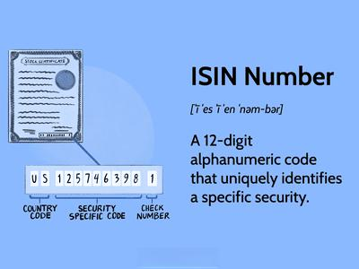

The world of finance is vast and complex, characterized by an array of tools and identifiers that are essential for navigating the investment landscape. Among these, the International Securities Identification Number (ISIN) stands as a critical component for the identification and management of securities on a global scale. The ISIN serves as a unique identifier for financial instruments, facilitating efficient and accurate tracking and trading across international borders. This universal standard ensures that securities are clearly distinguished, reducing errors and enhancing communication among global market participants.

In recent years, the advent of algorithmic trading has brought about significant shifts in the financial markets. This form of trading employs computer algorithms to automate the process of executing trades, enabling faster and more efficient transactions. Algorithmic trading presents new opportunities for minimizing transaction costs and optimizing trade execution. However, it also introduces challenges, such as increased market volatility and the need for sophisticated risk management systems.



This article will explore the intersection of financial instruments like ISINs and algorithmic trading, underscoring their significance in modern finance. These elements contribute to the operation of financial markets by ensuring efficiency, transparency, and security. Through a comprehensive analysis, we will examine how the interplay between these components supports the functionality and resilience of the global financial infrastructure.

## Table of Contents

## Understanding Financial Instruments

Financial instruments serve as the backbone of financial markets, representing a spectrum of contracts that result in a financial asset for one entity and a corresponding financial liability or equity for another. These instruments are pivotal in capital allocation, risk management, and income generation, forming the basis of investment strategies and economic growth.

The diversity of financial instruments is broad, encompassing various categories like stocks, bonds, options, and futures. Stocks represent ownership in a corporation and are a claim on part of the company’s assets and earnings. They are typically classified into common and preferred stocks, each offering different levels of dividends and claim on assets. 

Bonds are debt securities that enable issuers to raise capital by borrowing from investors who receive interest payments in return. These can range from government and municipal bonds to corporate bonds, each differing in terms of risk and return profiles. The yield on a bond is an essential consideration and is influenced by factors such as credit quality, interest rate environment, and maturity of the bond.

Options and futures are derivatives that derive their value from underlying assets such as stocks, indexes, or commodities. Options grant the holder the right, but not the obligation, to buy or sell an underlying asset at a predetermined price and date. Futures, on the other hand, obligate the parties to transact in the asset at a set price and date in the future. Both options and futures are instrumental in hedging risk and speculating on price movements.

Understanding these financial instruments is crucial for investors and traders as each type exhibits distinct characteristics in terms of return, risk, [liquidity](/wiki/liquidity-risk-premium), and time horizon. Stocks may offer higher returns but come with greater [volatility](/wiki/volatility-trading-strategies) and risk compared to bonds, which usually provide stable income with lower risk. Derivatives like options and futures offer flexibility but require a substantial understanding of market mechanics and risk management.

Investors leverage these instruments to fulfill various financial objectives, ranging from achieving capital growth with equities to generating income through interest on bonds. They also use derivatives to hedge against price volatility or to leverage positions to enhance returns.

The selection of financial instruments by an investor depends significantly on their risk tolerance, investment horizon, and financial goals. A well-diversified portfolio often includes a mix of instruments to balance risk and return, facilitating effective management of financial resources in an ever-evolving market environment.

## What is ISIN?

The International Securities Identification Number (ISIN) is a standardized code consisting of 12 alphanumeric characters. This identifier is crucial for the precise recognition of securities on a global scale. Developed by the International Organization for Standardization (ISO), the ISIN system provides a unique identifier that transcends geographical and regulatory borders, ensuring the universal identification of securities.

ISINs facilitate the seamless execution of transactions across different countries, acting as a vital tool for clearing and settlement processes. By providing a consistent identifier, ISINs enhance communication among market participants, thereby streamlining cross-border transactions and reducing the potential for miscommunication and error.

Data reporting and trade reconciliation benefit immensely from the use of ISINs. They allow for efficient aggregation and verification of data, which is pivotal in maintaining the integrity and smooth operation of financial markets. By mitigating errors associated with human input and system discrepancies, ISINs contribute to the accuracy of data handling processes.

In the context of increasing globalization in trading, the role of ISIN remains fundamental. It supports the accuracy and efficiency required for trade processing, ensuring that transactions are executed without impediments related to misidentification of securities. The ISIN system is integral for financial institutions aiming for efficient portfolio management and compliance with international regulatory standards.

## The Rise of Algorithmic Trading

Algorithmic trading, or algo trading, utilizes computer algorithms to automate trading strategies, efficiently executing trades to optimize pricing. The primary advantage of [algorithmic trading](/wiki/algorithmic-trading) lies in its ability to analyze vast volumes of market data swiftly and identify profitable trading opportunities. This technology allows for executing orders at speeds and precisions unattainable by human traders, thus minimizing the impact of market fluctuations and reducing transaction costs through improved timing.

The integration of big data analytics and Artificial Intelligence (AI) has further transformed algo trading. By processing complex datasets and applying [machine learning](/wiki/machine-learning) models, these systems can predict market trends with greater accuracy. For instance, [deep learning](/wiki/deep-learning) models can be trained to recognize patterns in time-series data, enabling the anticipation of price movements. Python, a popular choice among quants and data scientists, offers libraries such as pandas for data manipulation and TensorFlow for building robust AI models, facilitating the development of these sophisticated trading algorithms.

Despite its many advantages, algorithmic trading is not without risks. Market volatility can be exacerbated by poorly designed algorithms that react to market conditions unexpectedly. Errors in algorithm design, whether from flawed logic or inadequate data, can lead to substantial financial losses. These risks necessitate the implementation of comprehensive risk management systems and rigorous testing of algorithms under simulated market conditions.

A simple example of an algorithmic trading strategy in Python could involve the use of a moving average to dictate buy or sell decisions. Here is a basic implementation:

```python
import pandas as pd

def moving_average_strategy(prices, short_window=40, long_window=100):
    signals = pd.DataFrame(index=prices.index)
    signals['signal'] = 0.0

    # Short moving average
    signals['short_mavg'] = prices.rolling(window=short_window, min_periods=1, center=False).mean()

    # Long moving average
    signals['long_mavg'] = prices.rolling(window=long_window, min_periods=1, center=False).mean()

    # Generate signals
    signals['signal'][short_window:] = \
        np.where(signals['short_mavg'][short_window:] > signals['long_mavg'][short_window:], 1.0, 0.0)

    # Generate trading orders
    signals['positions'] = signals['signal'].diff()

    return signals
```

This simple moving average crossover strategy generates a buy signal when the short-term moving average rises above the long-term moving average, and a sell signal when it drops below. Such strategies are foundational in algorithmic trading but highlight the need for ongoing testing and refinement to mitigate risks associated with their use.

The continuous evolution in technology and market dynamics necessitates that financial institutions regularly update and refine their algorithms, ensuring they are equipped to handle new forms of market data and trading scenarios effectively.

## The Role of ISIN in Algo Trading

In algorithmic trading, International Securities Identification Numbers (ISINs) play a crucial role by providing a standardized means of identifying and tracking securities across various platforms and jurisdictions. This ensures precision in the execution and settlement of orders, crucial in high-frequency trading environments where speed and accuracy are paramount. By using ISINs, traders can significantly reduce the risk of misidentification of securities, which can otherwise lead to transactional errors and financial losses.

Algorithmic trading relies heavily on the aggregation of market data to develop trading algorithms and backtest strategies effectively. ISINs aid this process by providing a uniform reference that simplifies the collection and consolidation of data across different markets and exchanges. This assists in the creation of robust, data-driven trading models that can predict market movements and inform trading decisions.

With the expansion of cross-border trading, ISINs have become even more vital. They serve to align the varied coding systems employed by different exchanges around the world, facilitating a seamless integration of data across borders. This global applicability of ISINs helps in maintaining consistency in how securities are identified and tracked, supporting the growing trend of international, algorithm-driven trading strategies.

It is the utilization of standardized identifiers like ISINs that underscores the essential relationship between algorithmic trading systems and efficient market operations. By ensuring accuracy in the identification and processing of securities, ISINs contribute to the integrity and efficiency of automated trading, enabling systems to operate at optimal levels without the confusion of mismatched or erroneous data.

## Challenges and Future Trends

As financial markets continue to evolve, so do the challenges associated with the International Securities Identification Number (ISIN) usage and algorithmic trading. One of the primary challenges facing ISIN is the rapid pace of technological advancement. As trading platforms and financial instruments become more sophisticated, there is a pressing need for continuous updates and adaptations in ISIN regulations and standards. This ensures that ISINs remain effective in uniquely identifying securities across different jurisdictions. The dynamic nature of financial products requires a flexible and responsive approach to maintaining ISIN accuracy and relevance.

Regarding algorithmic trading, transparency and regulatory oversight are paramount concerns. The high-speed and automated nature of algo trading can introduce significant risks, necessitating robust compliance frameworks to prevent manipulative practices and ensure market stability. Regulatory bodies around the world are continually assessing the socio-economic impact of algorithmic trading to formulate policies that balance innovation with investor protection.

Emerging technologies like blockchain present a promising avenue for revolutionizing how ISINs are generated and managed. Blockchain’s decentralized and immutable characteristics can significantly enhance the security and real-time validation of ISINs, potentially reducing errors in trade settlement processes and enhancing transparency. By adopting blockchain, financial institutions can streamline processes and improve efficiency in cross-border transactions.

The integration of machine learning into algorithmic trading is an exciting development with the potential for generating smarter algorithms and more nuanced market analyses. Machine learning models can analyze vast datasets to identify patterns and predict market movements, thus enabling more informed decision-making. However, this also requires robust risk management and validation protocols to mitigate the risks associated with model inaccuracies and overfitting.

As technology continues to advance, stakeholders must remain adaptive, carefully monitoring these changes and embracing innovations that align with regulatory standards and market needs. The challenges and future trends associated with ISIN and algorithmic trading underscore the importance of continual evolution to ensure the reliability and robustness of financial markets.

## Conclusion

Financial instruments, ISINs, and algorithmic trading are pillars of the contemporary financial world, each intricately contributing to the seamless operation and security of financial markets. Financial instruments, by providing various avenues for investment and risk management, form the foundation of financial transactions. On a parallel track, the International Securities Identification Number (ISIN) serves as a crucial standard for identifying securities globally, ensuring efficient communication and trade execution across different markets.

The relevance of ISIN will continue to grow as financial systems evolve under the twin forces of technology and globalization. With the rise of algorithmic trading, which leverages vast datasets and advanced computational methods to execute trades, the need for precise and universally accepted security identifiers is paramount. ISINs reduce confusion and errors in high-frequency trading environments by providing consistent identification across all platforms.

Technology's rapid advancements necessitate vigilance and adaptability among stakeholders. Embracing innovations while mitigating their associated risks remains crucial. For instance, advancements in [artificial intelligence](/wiki/ai-artificial-intelligence) and machine learning can enhance trading strategies, but they also require robust risk management frameworks to prevent and address potential errors or market disturbances. Similarly, the potential role of blockchain technology in ISIN management could improve the efficiency and security of these identifiers, facilitating real-time validation and reducing administrative burdens.

In summary, the integration of financial instruments, ISINs, and algorithmic trading is essential for the creation of more dynamic and resilient financial markets. Stakeholders, including regulators, financial institutions, and traders, must work synergistically to harness the benefits of technological advancements while safeguarding the stability and integrity of financial systems. The careful orchestration of these elements will pave the way for continued innovation and stability in the ever-evolving landscape of global finance.

## References & Further Reading

[1]: ["International Securities Identification Number (ISIN) Fact Sheet"](https://www.isin.org/isin/) by the International Organization for Standardization

[2]: Chlistalla, M. (2011). ["The Future of Trading: Algorithms, Multi-Asset Platforms and Other Forces Reshaping the Industry."](https://c.mql5.com/forextsd/forum/168/high-frequency_trading_-_better_than_its_reputation.pdf) Deutsche Bank Research.

[3]: Gomber, P., Arndt, B., Lutat, M., & Uhle, T. (2011). ["High-Frequency Trading."](https://papers.ssrn.com/sol3/papers.cfm?abstract_id=1858626) In Computer-Based Trading in Financial Markets (pp. 51-64). Springer.

[4]: Aldridge, I. (2010). ["High-Frequency Trading: A Practical Guide to Algorithmic Strategies and Trading Systems"](https://www.ahmetbeyefendi.com/wp-content/uploads/2020/07/High-Frequency-Trading-Irene-Aldridge.pdf) by Wiley Finance.

[5]: Narang, R. K. (2009). ["Inside the Black Box: The Simple Truth About Quantitative Trading"](https://onlinelibrary.wiley.com/doi/book/10.1002/9781118267738) by John Wiley & Sons.