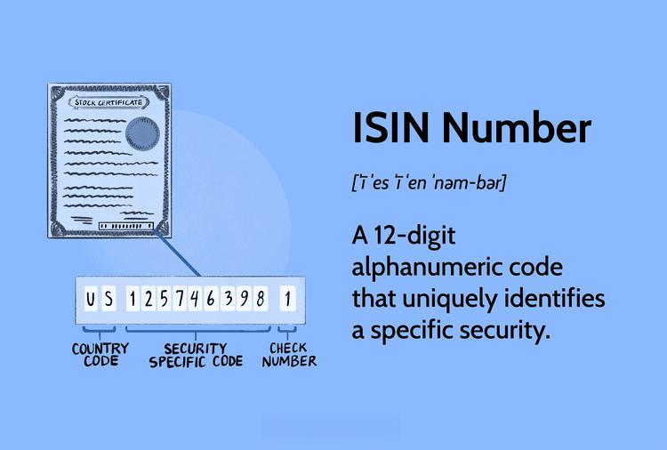

In the ever-evolving world of finance, the accurate identification of securities is paramount for ensuring efficient trading and settlement processes. With global markets becoming increasingly interconnected, there is a critical need for a standardized system that can universally identify securities. The International Securities Identification Number (ISIN) meets this need by providing a unique 12-digit alphanumeric code to identify securities across different countries and trading platforms.

The ISIN serves as a bridging tool in the financial industry, enabling clear and consistent communication about securities across diverse markets. By offering a standardized identification method, ISIN facilitates trade and settlement, thereby enhancing the reliability and efficiency of financial transactions. Unlike ticker symbols, which can vary based on individual exchanges, the ISIN remains constant across global platforms, further supporting its role in unifying international financial systems.



This article examines the significance, structure, and implementation of ISINs in the context of algorithmic trading and financial identification. We will explain what an ISIN is, how it functions, and why it is indispensable for international securities trading. By understanding the intricacies of ISINs, financial professionals can better navigate the complexities of global finance, ensuring accurate security identification and promoting seamless cross-border transactions.

## Table of Contents

## What is an ISIN?

The International Securities Identification Number (ISIN) serves as a fundamental identifier in financial markets worldwide. This 12-digit alphanumeric code provides a unique identity to each security, enabling streamlined trading and settlement across different platforms and national borders. The structure of an ISIN enhances its utility and effectiveness in the global financial ecosystem.

ISINs are assigned and managed by designated national numbering agencies within each country. This decentralized yet standardized approach ensures that securities can be identified consistently and without ambiguity, reducing the potential for confusion in international markets. Unlike ticker symbols, which differ among various exchanges and may vary in representation for the same security, the ISIN remains unaltered irrespective of where the security is traded. This permanence grants ISINs an advantage in facilitating cross-listing and trading of securities on multiple platforms.

The utility of ISIN extends beyond mere identification. In international transactions, where securities are traded across borders, the ISIN plays a crucial role in enabling precise and uniform recognition of assets. This ensures that parties involved in transactions—such as investors, brokers, custodians, and settlement agents—have a common framework for referencing securities, thereby enhancing transactional accuracy and reliability.

Understanding and effectively utilizing ISINs is vital for participants in the financial market ecosystem. By providing a consistent and clear method of security identification, ISINs help mitigate risk, minimize errors, and improve the overall efficiency of financial markets globally.

## Understanding ISINs

ISINs, or International Securities Identification Numbers, are composed of a structured format that aids in the universal identification of securities. Each ISIN is a 12-character alphanumeric code, which is systematically divided into three distinct parts to ensure precise and standardized security identification.

The initial component of an ISIN is a two-letter country code. This code follows the ISO 3166-1 alpha-2 standard, which identifies the country where the issuing organization is located, rather than the country where the security is traded. For example, "US" denotes the United States, "FR" stands for France, and so on. This coding facilitates the clear designation of the country of issuance.

The second part of the ISIN is a nine-character alphanumeric national security identifier. This sequence is unique within each country and is allocated by national numbering agencies, which are responsible for ensuring that no two securities within their jurisdiction share the same identifier. This identifier serves as the core element in distinguishing each specific security, whether it be a stock, bond, or any other financial instrument.

Completing the ISIN, the final part is a single check digit. The purpose of this digit is to assure the validity of the ISIN through the application of the Luhn algorithm, a modulus 10 or "mod 10" algorithm. This algorithm is a common method used for error detection, particularly in identification numbers.

Here's a Python snippet that demonstrates the calculation of the check digit using the Luhn algorithm:

```python
def calculate_check_digit(isin):
    def luhn_double(c):
        c = int(c) * 2
        return c if c < 10 else c - 9

    inverse = [char for char in isin[-2::-1]]
    total = sum(int(char) if idx % 2 else luhn_double(char) for idx, char in enumerate(inverse))
    return str((10 - (total % 10)) % 10)

isin_without_check_digit = "US037833100"
check_digit = calculate_check_digit(isin_without_check_digit)
isin = isin_without_check_digit + check_digit
print("ISIN with check digit:", isin)
```

This structure of the ISIN allows it to be seamlessly integrated into global financial systems, thereby supporting the various processes involved in trading, clearing, and settlement. The ISIN enhances operational efficiency and accuracy across different markets and platforms, making it a vital tool in the international finance landscape.

## Role of ISIN in Algorithmic Trading

Algorithmic trading, which involves the use of algorithms to automate trading decisions, places a strong emphasis on data precision and consistency. Within this context, the International Securities Identification Number (ISIN) serves as an essential tool for the accurate identification of securities, thereby reducing errors in the trading process. The unique, 12-digit alphanumeric code assigned to each security ensures that algorithms can operate with a high level of confidence, minimizing the chance of misidentification and enhancing execution efficiency.

High-frequency trading ([HFT](/wiki/high-frequency-trading-strategies)) environments, which execute a large [volume](/wiki/volume-trading-strategy) of trades in extremely short time frames, benefit greatly from the universal applicability of ISINs. The ability to quickly identify and process securities is crucial in these rapid trading scenarios. ISINs offer a consistent and reliable method to match the correct security across different trading platforms and exchanges, preventing potential discrepancies that could arise from using exchange-specific identifiers like ticker symbols.

The integration of ISINs into trading algorithms is not only beneficial for operational streamlining but also for improving market [liquidity](/wiki/liquidity-risk-premium). By providing a standardized system for security identification, ISINs facilitate the swift execution of trades, as algorithms can be more effectively designed to recognize and respond to market opportunities without the friction of cross-referencing multiple identifiers. This uniformity in identification is crucial for maintaining the speed and efficiency demanded by modern financial markets.

Furthermore, ISINs contribute to a more transparent trading environment. By ensuring that securities are unequivocally identified, they enhance the reliability of transaction reporting and the traceability of trades from execution to settlement. This transparency helps maintain the integrity of market data, which is vital for the development of robust [algorithmic trading](/wiki/algorithmic-trading) strategies that rely on accurate and timely information.

In summary, ISINs play a pivotal role in algorithmic trading by providing a clear and standardized identifier for securities. This fosters a more efficient trading process, enhances market liquidity, and ensures the reliability of trading data—key factors that support the effectiveness and sustainability of algorithmic trading systems in global financial markets.

## Global Recognition of ISIN

ISINs, or International Securities Identification Numbers, are globally recognized as the standard for identifying securities. This recognition facilitates efficient cross-border trading and investment strategies by providing a consistent identification method across different countries and exchanges. ISINs eliminate the discrepancies that can arise from using varying ticker symbols in different markets, thereby streamlining international transactions.

Financial institutions, including banks, custodians, and brokers, depend heavily on ISINs to uniformly track and manage investor holdings. This universal identification system ensures that all parties involved in a transaction are referring to the same security, thus minimizing errors and improving the accuracy of financial records. The global acceptance of ISINs also contributes significantly to enhancing transparency in the financial markets. By using a standardized identification system, discrepancies in security identification are greatly reduced, which is crucial for maintaining the integrity and reliability of market transactions.

Furthermore, regulators and financial authorities worldwide recognize ISINs, which adds a layer of trust and reliability to the securities identified by these numbers. This recognition not only supports regulatory compliance but also bolsters investor confidence in cross-border investments. As a result, the widespread use of ISINs plays a vital role in the seamless operation of global financial markets, ensuring that investments are managed and tracked accurately across borders.

## The Evolution of ISINs

The International Securities Identification Number (ISIN) system was first implemented in 1981. However, its widespread adoption came after a recommendation from the Group of Thirty (G30) countries in 1989, which highlighted the necessity for a universal standard in the identification of securities to streamline global trade. This recommendation underscored the need to standardize financial transactions across borders in an increasingly globalized economy.

Further solidification of ISIN usage occurred in 1990 when the International Organization for Standardization (ISO) formally endorsed its implementation. The endorsement by ISO, a global standard-setting body, was pivotal in establishing ISINs as the foundational tool for accurate and efficient securities identification. This endorsement ensured that ISINs would be uniformly adopted across diverse financial systems, providing a common language for securities trading and settlement.

As financial markets have grown more interconnected, the ISIN system has evolved to accommodate the complexities of modern securities. Initially designed to identify basic equities and bonds, ISINs have been adapted to support a wider array of financial instruments, including derivatives and structured products. This adaptability illustrates the ISIN's integral role in the infrastructure of financial markets.

Today, ISINs are indispensable in the functioning of global financial markets. Their role extends beyond mere identification, facilitating both trade and regulatory reporting. By providing a standardized reference for each security, ISINs enhance transparency and efficiency, allowing for accurate tracking and management of securities across international boundaries. They are crucial in simplifying cross-border transactions, ensuring uniformity in reporting, and supporting the intricate mechanisms of financial systems worldwide.

## Conclusion

The International Securities Identification Number (ISIN) is crucial in the global financial markets, providing a standardized framework for identifying and trading securities. This standardization ensures accuracy and consistency across different platforms and jurisdictions, reducing the risk of errors and enhancing the efficiency of the overall trading and settlement process.

In algorithmic trading, the need for precision is paramount. ISINs serve as a universal identifier, allowing algorithms to accurately recognize and process securities. This capability is vital in high-frequency trading environments, where speed and accuracy directly impact execution success and market liquidity. By incorporating ISINs into trading algorithms, financial institutions can streamline their operations, reduce the likelihood of trade errors, and improve transaction speed and efficiency.

As financial markets continue to integrate and expand globally, ISINs remain essential in facilitating cross-border transactions and investment strategies. The universal recognition of ISINs simplifies international trading, ensuring that securities are consistently tracked and managed across different jurisdictions. This recognition is crucial for financial institutions, brokers, and custodians who rely on ISINs to maintain accurate records and support seamless investment operations.

For investors, traders, and financial professionals, understanding ISINs is necessary to navigate the complexities of international finance. This knowledge enables stakeholders to engage in global markets more confidently and effectively, minimizing potential disparities in security identification and maximizing trading opportunities. As the financial ecosystem evolves, ISINs will continue to serve as a foundational element, bridging markets and supporting the infrastructure of modern finance.

## References & Further Reading

[1]: ["The Global Identification of Securities: The Use of ISINs and Other Standardized Codes"](https://www.investopedia.com/terms/i/isin.asp) by Georgia Kavassalis and Brian Yuen, ResearchGate.

[2]: ["ISIN - International Securities Identification Number"](https://www.isin.org/) by International Organization for Standardization (ISO).

[3]: ["Algorithmic Trading and DMA: An introduction to direct access trading strategies"](https://www.amazon.com/Algorithmic-Trading-DMA-introduction-strategies/dp/0956399207) by Barry Johnson.

[4]: ["The Role of International Securities Identification Number (ISIN) in Cross-Border Securities Trading"](https://www.investopedia.com/terms/i/isin.asp) by Marc H.P. Wouters, International Monetary Fund Working Paper.

[5]: ["Financial Risk Manager Handbook"](https://www.wiley.com/en-us/Financial+Risk+Manager+Handbook%2C+5th+Edition-p-9780470521991) by Philippe Jorion.