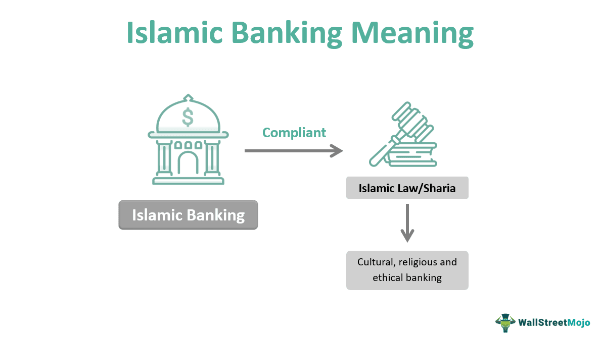

In an ever-evolving financial landscape, Islamic finance stands out as a unique approach that aligns with Sharia law. Islamic finance, rooted in the ethical framework of Islam, offers a distinct set of financial practices that differ markedly from conventional banking. This article provides an exploration into the foundational principles of Sharia-compliant banking and the broader scope of Islamic finance. 

The world of finance is currently witnessing a rapid transformation, heavily influenced by advancements in technology such as algorithmic trading. There exists a significant opportunity for blending these technological innovations with Islamic financial practices, particularly in ensuring that such advancements comply with Sharia principles. Understanding these ethical and legal guardrails is crucial for applying Islamic financial practices effectively and sustainably.



The Islamic financial system operates under a set of principles that are based on Islamic jurisprudence (fiqh al-muamalat). It is guided by key tenets such as the prohibition of interest (riba), engaging in ethical economic activities, and ensuring risk-sharing in financial transactions. The prohibition of riba necessitates innovative financial structures that foster equity-based investments rather than debt-based systems prevalent in conventional finance.

This exploration begins with an examination of how Islamic finance operates within the boundaries set by religious guidelines, ensuring that financial dealings are not only profitable but also equitable and ethical. As we traverse through this topic, there will be a focus on how these ancient principles are not only relevant but also particularly applicable in today's financially interconnected world, with a view to integrating modern technology to broaden the reach and impact of Islamic finance.

## Table of Contents

## Understanding Sharia-Compliant Banking

Sharia-compliant banking is a financial system that operates in accordance with Islamic law, which prohibits the charging or paying of interest, known as riba. Instead, this form of banking places a strong emphasis on risk-sharing and moral investing to ensure that activities align with Islamic ethical standards.

One of the core instruments characteristic of Sharia-compliant banking is Mudarabah, a partnership where one party provides capital while the other offers expertise and management. Profits are shared according to pre-agreed ratios, while losses are borne solely by the capital provider, unless negligence is proven by the managing partner. Mudarabah is commonly used in investment funds and macro financing projects, offering a bridge between capital markets and those requiring funding.

Another prevalent instrument is Murabaha, a contract where a bank purchases an asset on behalf of a client and sells it to them at a marked-up price. This sale is concluded once the initial purchase price and profit margin are agreed upon, with repayments typically structured over time. Murabaha allows for the facilitation of trade while complying with Sharia, as it avoids unjust enrichment and speculation.

Without the typical interest-bearing loans found in conventional banking, Sharia-compliant models prioritize profit and loss sharing systems. This promotes a collaborative approach to banking, fostering equal distribution of wealth and mitigating financial risk. By engaging in equity-based financing and investment portfolios, Islamic financial institutions contribute to economic stability.

Sharia-compliant banking also stresses the importance of community welfare and collective benefit. Investments under this financial regime are directed toward ventures that contribute positively to society, avoiding industries such as alcohol, gambling, and pork production, which are deemed haram, or forbidden.

In essence, Sharia-compliant banking offers a framework that encourages ethical and socially responsible investment while fostering socioeconomic development through principled financial interactions. As the global financial landscape continues to evolve, Islamic banking stands out as a model that aligns financial practices with broader ethical and moral considerations.

## Core Islamic Finance Principles

Islamic finance principles revolve around three key tenets: fairness, ethical behavior, and social justice. These principles shape various financial practices and ensure that they align with Islamic law, known as Sharia. 

A fundamental aspect of Islamic finance is the prohibition of 'gharar,' which refers to excessive uncertainty and ambiguity in transactions. This concept ensures that all financial dealings are transparent and that both parties possess clear, comprehensive information regarding their engagement. For instance, Sharia-compliant contracts typically include detailed terms and conditions, minimizing the risk of disputes.

Moreover, Islamic finance strictly prohibits investments in businesses associated with activities deemed haram, or forbidden. These activities encompass industries such as alcohol, gambling, and pork production. This restriction ensures that investments align with the moral and ethical values prescribed by Islam.

Equity financing, which involves sharing profits and losses, is encouraged in Islamic finance, as long as the companies involved adhere to Sharia guidelines. This approach aligns with the principle of risk-sharing and collective welfare. Instruments like Mudarabah (profit-sharing partnerships) and Musharakah (joint ventures) exemplify this method, highlighting a commitment to ethical and equitable collaboration.

These principles manifest in a niche but growing financial market. By adhering to ethical and religious guidelines, Islamic finance distinguishes itself from conventional financial systems. The emphasis on social responsibility and moral investment attracts a diverse range of investors, including both Muslims and non-Muslims, interested in ethical and community-focused financial solutions. As Islamic finance continues to expand, it offers a unique, sustainable business model committed to socio-economic well-being.

## Integration with Modern Financial Technologies

The expansion of financial technology (FinTech) is offering significant prospects for the advancement and enhancement of Islamic finance. As the sector evolves, Islamic financial institutions are increasingly looking to integrate cutting-edge technologies to better meet the religious and ethical guidelines dictated by Sharia law.

Algorithmic trading, a rapidly growing facet of modern finance, presents a unique opportunity for adaptation within Islamic finance. This technology can be tailored to ensure compliance with Islamic financial standards, which prohibit speculation (gharar) and investment in prohibited sectors. By embedding Sharia-compliant criteria into the trading algorithms, financial products can be selected that align with ethical principles and investment guidelines. These automated systems offer the advantage of swiftly and efficiently evaluating Sharia-compliant investment avenues, thereby increasing the overall efficiency and scope of Islamic financial operations.

Blockchain technology is another pivotal platform that can be utilized within Islamic finance for enhanced transparency and trust. A blockchain's decentralized nature ensures a transparent, immutable ledger of all transactions, meeting the Islamic finance requirement for clear and honest dealings. The traceability and permanence offered by blockchain align with Sharia principles and can foster greater confidence among investors seeking ethical financial products.

Innovations such as Peer-to-Peer (P2P) lending and mobile banking are also naturally compatible with the aims of Islamic finance. P2P lending platforms can operate on Islamic finance principles by connecting borrowers and lenders in a risk-sharing framework, thus circumventing interest-based transactions. Similarly, mobile banking extends the reach of Islamic financial services to a broader audience, accommodating the financial needs of the increasingly digital-savvy population while adhering to Sharia law.

The integration of these technologies into Islamic finance is not merely about maintaining compliance with religious law but also about enhancing the appeal and accessibility of financial products worldwide. By embracing FinTech developments, Islamic financial institutions can better compete in the global financial market, offering products that are not only ethically sound but also technologically advanced and user-friendly. As more Islamic financial services leverage these tools, the potential to attract both Muslim and non-Muslim investors seeking ethical investment choices expands, promoting the growth and innovation of Islamic finance on a global scale.

## The Role of Algorithmic Trading

Algorithmic trading, a modern financial innovation, offers significant potential when applied to Islamic finance, provided it adheres to Sharia regulations. Sharia law requires that all financial activities align with specific ethical and moral guidelines, which poses unique challenges and opportunities for [algorithmic trading](/wiki/algorithmic-trading) within this framework.

One of the primary advantages of algorithmic trading is its capacity to rapidly analyze and act on Sharia-compliant investment opportunities. Automated systems can efficiently sift through large datasets to identify investments that meet religious requirements, such as avoiding any form of interest (riba) and ensuring involvement in permissible industries only. Incorporating Sharia principles, these systems must exclude businesses associated with alcohol, gambling, and other non-compliant activities.

To avoid excessive uncertainty or deceit, known as gharar, risk parameters are critical in algorithmic trading algorithms. Transactions need to provide an equitable exchange of value, ensuring that both parties willingly share the risk and reward. This requires a sophisticated understanding and modeling of risk, where algorithms incorporate conditions that flag excessive uncertainty and desist from such trades.

For example, consider an algorithm seeking Sharia-compliant stocks with low [volatility](/wiki/volatility-trading-strategies). A Python implementation analyzing stock data might look like this:

```python
import pandas as pd
from stock_data import get_data  # hypothetical function to fetch stock data

# Fetch Sharia-compliant stock data
stocks = get_data("sharia_compliant_stocks.csv")

# Filter for low volatility stocks
filtered_stocks = stocks[stocks['volatility'] < 0.15]

# Output potential investment opportunities
print(filtered_stocks)
```
By setting a threshold for allowable volatility, this code snippet helps ensure trades are made within acceptable risk levels, minimizing gharar.

Successful implementation of algorithmic trading can enhance market efficiencies significantly within Islamic finance. By ensuring trades meet ethical standards and are executed swiftly and accurately, algorithmic trading broadens the reach and appeal of Sharia-compliant financial products. In markets traditionally cautious in approaching non-conventional financial tools, this technological edge can catalyze broader adoption and integration of Islamic finance principles.

However, to maintain alignment with Islamic ethical standards, continuous oversight is paramount. Compliance officers and Sharia scholars must work together to monitor algorithmic trading systems, ensuring they adhere to Sharia law. This involves regular audits and updates to the algorithms as market conditions and interpretations of Sharia principles evolve.

In conclusion, with the right frameworks and compliance measures in place, algorithmic trading offers substantial promise for the expansion and efficiency of Islamic finance. It ushers in a new era where modern technology and ancient ethical principles converge, promising increased inclusivity and integrity in financial markets worldwide.

## Challenges and Opportunities

Ensuring compliance of financial technologies with Sharia law presents significant challenges, primarily due to the rapid evolution of modern financial tools and the specific requirements of Islamic jurisprudence. Sharia law prohibits interest (riba) and excessive uncertainty (gharar), necessitating careful design and regulation of financial products. This presents a challenge as many traditional and emerging financial instruments inherently involve these prohibited elements. Consequently, ensuring that all financial technologies comply with Sharia principles requires thorough oversight, which can be resource-intensive.

There is a rapidly growing need for qualified Sharia scholars who are well-versed in both Islamic finance principles and advanced financial technologies. Such experts play a crucial role in guiding the development of Sharia-compliant financial products and services. Their insights are vital for interpreting Sharia laws in the context of modern innovations, which can be complex and unprecedented. The scarcity of such professionals is a bottleneck, impacting the pace of integrating contemporary financial technologies with Islamic finance.

The potential for innovation in serving the unbanked Muslim population is vast. Many Muslims remain unbanked due to the lack of financial services that align with their religious beliefs. Islamic financial technology can create products tailored to this demographic, potentially boosting financial inclusion. For instance, mobile banking and peer-to-peer lending platforms can be adapted to follow Sharia principles, providing ethical financial access to underserved populations. This not only aids financial inclusion but also promotes economic development in regions with significant unbanked Muslim communities.

Islamic finance offers a sustainable and ethical alternative to conventional finance, attracting both Muslim and non-Muslim investors interested in ethical investing. The emphasis on risk-sharing and ethical investments aligns with the growing global demand for sustainable finance solutions. As awareness and understanding of Sharia-compliant finance grow, more investors are drawn to its promise of ethical and socially responsible financial management.

Balancing tradition with technology will be essential for the future growth of Islamic finance. While maintaining adherence to Islamic principles, the industry must innovate to remain competitive and relevant in the modern financial landscape. This balance can be achieved by leveraging technologies such as blockchain for enhanced transparency and trust, as well as developing algorithmic trading models that prevent prohibited activities. The successful integration of tradition and technology would not only safeguard the ethical foundations of Islamic finance but also expand its market appeal and operational efficacy.

In conclusion, addressing these challenges and opportunities requires a collaborative effort involving financial technologists, Sharia scholars, and policymakers. Ensuring compliance with Islamic principles while embracing technological advancements will be a defining [factor](/wiki/factor-investing) in the sustainable growth of Islamic finance.

## Conclusion

Islamic finance offers a unique approach to financial management, distinctively characterized by its adherence to ethical principles as outlined in Sharia law. This system emphasizes fairness, social justice, and ethical behavior, setting it apart from conventional financial practices that often prioritize profit maximization. The integration of modern technological advancements such as algorithmic trading and financial technologies (FinTech) holds the potential to transform Islamic banking. By leveraging these innovations, Islamic finance can achieve greater efficiency, scalability, and accessibility, reaching a broader audience while preserving its core principles.

The incorporation of algorithmic trading presents an opportunity for more precise and efficient Sharia-compliant investment processes. By utilizing advanced algorithms, financial institutions can quickly analyze investment opportunities that adhere to Islamic laws, such as the prohibition of interest (riba) and excessive uncertainty (gharar). However, the evolution of Islamic banking through these technologies necessitates careful alignment with Sharia to safeguard its ethical foundation. This ongoing alignment requires the expertise of qualified Sharia scholars who can ensure that technological advancements are compatible with Islamic guidelines.

As the market for Sharia-compliant financial products continues to grow, there is a rising demand for innovative solutions that cater to both the expanding Muslim population and ethical investors worldwide. Islamic finance presents sustainable and socially responsible alternatives, which are increasingly appealing to a diverse range of investors seeking ethical investment opportunities. This demand drives the development of new financial products and services that align with moral and Islamic principles, fostering financial inclusivity and contributing to economic development.

The future of Islamic finance promises significant growth and innovation, particularly as financial technologies evolve and offer new opportunities for integration. This potential expansion emphasizes the importance of balancing traditional values with modern technological advancements to maintain the integrity and appeal of Islamic finance. In doing so, Islamic finance not only contributes to a more inclusive and equitable financial system but also reinforces its role as a viable and ethical alternative in the global financial landscape.

## References & Further Reading

[1]: Iqbal, M., & Mirakhor, A. (2011). ["An Introduction to Islamic Finance: Theory and Practice."](https://archive.org/details/introductiontois0000iqba) Wiley.

[2]: El-Gamal, M. A. (2006). ["Islamic Finance: Law, Economics, and Practice."](https://archive.org/details/islamicfinancela0000elga) Cambridge University Press.

[3]: Kamali, M. H. (2008). ["Shari'ah Law: An Introduction."](https://archive.org/details/shariahlawintrod0000kama) Oneworld Publications.

[4]: Sundararajan, V., & Errico, L. (2002). ["Islamic Financial Institutions and Products in the Global Financial System: Key Issues in Risk Management and Challenges Ahead."](https://www.imf.org/external/pubs/ft/wp/2002/wp02192.pdf) International Monetary Fund.

[5]: Rosly, S. A. (2010). ["Critical Issues on Islamic Banking and Financial Markets: Islamic Economics, Banking and Finance, Investments, Takaful and Financial Planning."](https://www.researchgate.net/publication/277057761_Critical_issues_on_Islamic_banking_and_financial_markets_Islamic_economics_banking_and_finance_investments_Takaful_and_financial_planning) AuthorHouse.

[6]: Smith, A. (2017). ["Islamic Banking and Finance in the European Union: A Challenge."](https://www.researchgate.net/publication/298452349_Islamic_banking_and_finance_in_the_European_union_A_challenge) Palgrave Macmillan.

[7]: Khan, T. & Bhatti, M. I. (2008). ["Developments in Islamic Banking: The Case of Pakistan."](https://link.springer.com/book/10.1057/9780230582309) Palgrave Macmillan.

[8]: Wilson, R. (2006). ["Islamic Finance in Europe."](https://ibtra.com/pdf/journal/v3_n2_article2.pdf) Cambridge University Press.

[9]: Mohammed, J. A., & Sagagi, M. S. (2014). ["Fintech Aspects of Islamic Finance and Sustainable Development."](https://www.cambridge.org/core/books/corporate-social-responsibility-in-developing-and-emerging-markets/islamic-finance-sustainable-development-and-developing-countries-linkages-and-potential/66138EF385C981551DB032341B097295) Social Science Research Network.