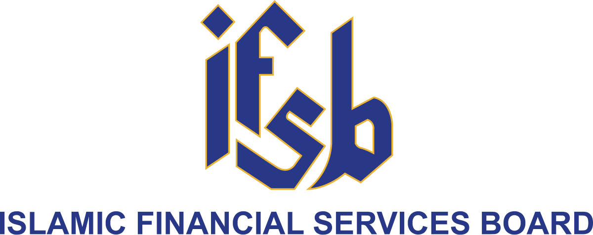

## Table of Contents

## What is the Islamic Financial Services Board (IFSB)?

The Islamic Financial Services Board (IFSB) is an international organization that helps make rules and standards for Islamic finance. It was started in 2002 and is based in Kuala Lumpur, Malaysia. The IFSB works to make sure that Islamic financial services are safe and sound. It does this by creating guidelines that countries can follow to manage their Islamic banks and other financial institutions.

The IFSB's main job is to make sure that Islamic finance follows Shariah, which are the rules of Islamic law. They also want to make sure that Islamic finance is stable and can grow. The IFSB works with other international groups and helps countries set up their own rules for Islamic finance. This helps the Islamic finance industry grow around the world in a safe way.

## When was the IFSB established and why?

The Islamic Financial Services Board (IFSB) was established in 2002. It was set up to help make rules for Islamic finance. The IFSB is based in Kuala Lumpur, Malaysia.

The main reason for starting the IFSB was to make sure that Islamic financial services are safe and follow the rules of Islamic law, called Shariah. The IFSB creates guidelines that countries can use to manage their Islamic banks and other financial institutions. This helps the Islamic finance industry grow in a stable way around the world.

## What are the main objectives of the IFSB?

The main goal of the Islamic Financial Services Board (IFSB) is to make sure that Islamic financial services are safe and follow the rules of Islamic law, called Shariah. They do this by creating guidelines that countries can use to manage their Islamic banks and other financial institutions. This helps make sure that the Islamic finance industry is stable and can grow in a healthy way.

Another important objective of the IFSB is to help the Islamic finance industry grow around the world. They work with other international groups and help countries set up their own rules for Islamic finance. This cooperation helps make the Islamic finance industry stronger and more widespread.

Overall, the IFSB wants to make sure that Islamic finance is both safe and follows Shariah rules. By setting standards and working with others, they help the Islamic finance industry grow and stay stable.

## How does the IFSB contribute to the stability of the Islamic financial services industry?

The Islamic Financial Services Board (IFSB) helps keep the Islamic financial services industry stable by making rules and guidelines that countries can follow. These rules are made to make sure that Islamic banks and other financial institutions are safe and follow the rules of Islamic law, called Shariah. By having clear rules, the IFSB helps prevent problems and makes sure that everyone in the industry knows what they need to do to keep things stable.

The IFSB also works with other international groups to help the Islamic finance industry grow in a healthy way. They share ideas and help countries set up their own rules for Islamic finance. This cooperation makes the industry stronger and helps it spread to more places around the world. By working together, the IFSB helps make sure that the Islamic finance industry can grow without becoming unstable.

## What are the key functions of the IFSB?

The Islamic Financial Services Board (IFSB) helps make rules for Islamic finance. They create guidelines that countries can follow to manage their Islamic banks and other financial institutions. These guidelines make sure that Islamic finance follows the rules of Islamic law, called Shariah. By having clear rules, the IFSB helps prevent problems and makes sure that everyone in the industry knows what they need to do to keep things safe and stable.

The IFSB also works with other international groups to help the Islamic finance industry grow in a healthy way. They share ideas and help countries set up their own rules for Islamic finance. This cooperation makes the industry stronger and helps it spread to more places around the world. By working together, the IFSB helps make sure that the Islamic finance industry can grow without becoming unstable.

## How does the IFSB develop and issue standards and guidelines?

The Islamic Financial Services Board (IFSB) develops and issues standards and guidelines by working with experts from around the world. They start by looking at what the Islamic finance industry needs. Then, they create a group of experts who know a lot about Islamic finance. This group works together to make new rules and guidelines. They talk about what should be in the rules and make sure they follow the rules of Islamic law, called Shariah. After the group agrees on the rules, they are sent out to the public for comments. People can read the rules and give their ideas on how to make them better. The IFSB listens to these comments and makes changes if needed.

Once the rules are ready, the IFSB's Council, which is made up of representatives from different countries, votes on them. If the Council agrees, the rules become official standards and guidelines. The IFSB then shares these rules with countries and other groups in the Islamic finance industry. They help countries use these rules to manage their Islamic banks and other financial institutions. By doing this, the IFSB makes sure that Islamic finance is safe and follows Shariah rules. This helps the Islamic finance industry grow in a stable way around the world.

## What role does the IFSB play in the global financial system?

The Islamic Financial Services Board (IFSB) helps make the global financial system better by setting rules for Islamic finance. They create guidelines that countries can use to manage their Islamic banks and other financial institutions. These rules make sure that Islamic finance follows the rules of Islamic law, called Shariah. By having clear rules, the IFSB helps prevent problems and makes sure that everyone in the industry knows what they need to do to keep things safe and stable.

The IFSB also works with other international groups to help the Islamic finance industry grow in a healthy way. They share ideas and help countries set up their own rules for Islamic finance. This cooperation makes the industry stronger and helps it spread to more places around the world. By working together, the IFSB helps make sure that the Islamic finance industry can grow without becoming unstable. This helps the global financial system be more inclusive and stable.

## How does the IFSB ensure the implementation of its standards across different countries?

The Islamic Financial Services Board (IFSB) helps make sure its standards are used in different countries by working closely with them. They share their rules and guidelines with countries and help them understand how to use them. The IFSB also offers training and workshops to teach people about the standards. This helps countries learn how to manage their Islamic banks and other financial institutions in a safe and Shariah-compliant way.

The IFSB also works with other international groups to make sure their standards are followed. They talk with these groups and share ideas on how to make the Islamic finance industry better. By working together, the IFSB helps countries see the importance of using their standards. This cooperation makes it easier for countries to use the IFSB's rules and helps the Islamic finance industry grow in a stable way around the world.

## What are some of the major publications and research outputs of the IFSB?

The Islamic Financial Services Board (IFSB) has put out many important publications and research papers. They have made standards and guidelines that help countries manage their Islamic banks and other financial institutions. Some of their key publications include the IFSB Standards, which cover topics like risk management, capital adequacy, and governance in Islamic finance. They also publish the IFSB Guiding Principles, which give advice on how to make Islamic finance work well and follow Shariah rules.

The IFSB also does a lot of research to help the Islamic finance industry grow. They write reports and papers on different topics, like how to make Islamic finance more stable and how it can help the economy. One important research output is the IFSB's annual report, which talks about what they have done each year and what they plan to do next. They also have a journal called the "Islamic Financial Stability Report," which looks at how stable the Islamic finance industry is around the world. These publications and research help countries and financial institutions understand and use Islamic finance better.

## How does the IFSB collaborate with other international financial institutions?

The Islamic Financial Services Board (IFSB) works with other big financial groups to help the Islamic finance industry grow and stay stable. They talk with groups like the International Monetary Fund (IMF), the World Bank, and the Bank for International Settlements (BIS). By working together, they share ideas and learn from each other. This helps make sure that Islamic finance follows the rules of Islamic law, called Shariah, and is safe and sound.

The IFSB also joins forces with other organizations that focus on Islamic finance, like the Accounting and Auditing Organization for Islamic Financial Institutions (AAOIFI) and the Islamic Development Bank (IsDB). They work on projects together and help each other make rules and guidelines. This teamwork makes the Islamic finance industry stronger and helps it spread to more places around the world. By working with others, the IFSB helps make sure that Islamic finance can grow in a healthy way.

## What challenges does the IFSB face in promoting Islamic financial services?

The Islamic Financial Services Board (IFSB) faces some challenges in promoting Islamic financial services. One big challenge is making sure that different countries follow their rules and guidelines. Each country has its own laws and ways of doing things, so it can be hard to get everyone to use the same standards. The IFSB has to work hard to help countries understand and use their rules. They do this by offering training and working closely with countries, but it still takes a lot of effort.

Another challenge is keeping up with changes in the global financial system. The world of finance is always changing, with new rules and technologies coming out all the time. The IFSB has to keep learning and updating their standards to make sure they are still useful and follow Shariah rules. This means they need to do a lot of research and work with other groups to stay up to date. It can be tough, but it's important for helping the Islamic finance industry grow in a safe and stable way.

## How does the IFSB adapt its strategies to meet the evolving needs of the Islamic finance industry?

The Islamic Financial Services Board (IFSB) works hard to keep up with the changes in the Islamic finance industry. They do this by always learning and updating their rules to make sure they are still helpful and follow Shariah law. The IFSB talks with experts from around the world to understand new trends and problems in the industry. They also do a lot of research to find out what the industry needs. By staying informed, the IFSB can change their standards and guidelines to match what's happening in the world of finance.

The IFSB also works with other groups to make sure their strategies meet the needs of the Islamic finance industry. They share ideas with big financial organizations like the International Monetary Fund and the World Bank. This helps them learn from others and make better rules. The IFSB also helps countries set up their own rules for Islamic finance. By working together with countries and other groups, the IFSB can make sure that their strategies help the Islamic finance industry grow in a healthy way.

## References & Further Reading

[1]: Hassan, M. K., & Lewis, M. K. (Eds.). (2007). ["Handbook of Islamic Banking"](https://archive.org/details/handbook-of-islamic-banking). Edward Elgar Publishing.

[2]: Iqbal, Z., & Mirakhor, A. (2011). ["An Introduction to Islamic Finance: Theory and Practice"](https://archive.org/details/introductiontois0000iqba). Wiley Finance.

[3]: Naughton, S., & Naughton, T. (2000). ["Religion, ethics and stock trading: The case of an Islamic equities market."](https://link.springer.com/article/10.1023/A:1006161616855) Journal of Business Ethics, 23(2), 145-159.

[4]: Obaidullah, M. (2005). ["Islamic Financial Services"](https://www.researchgate.net/publication/266149378_Islamic_Financial_Services). Islamic Economics Research Center, King Abdulaziz University.

[5]: Securities Commission Malaysia. (2009). ["Shariah and the Stock Market"](https://www.sc.com.my/development/icm/shariah-compliant-securities/list-of-shariah-compliant-securities).