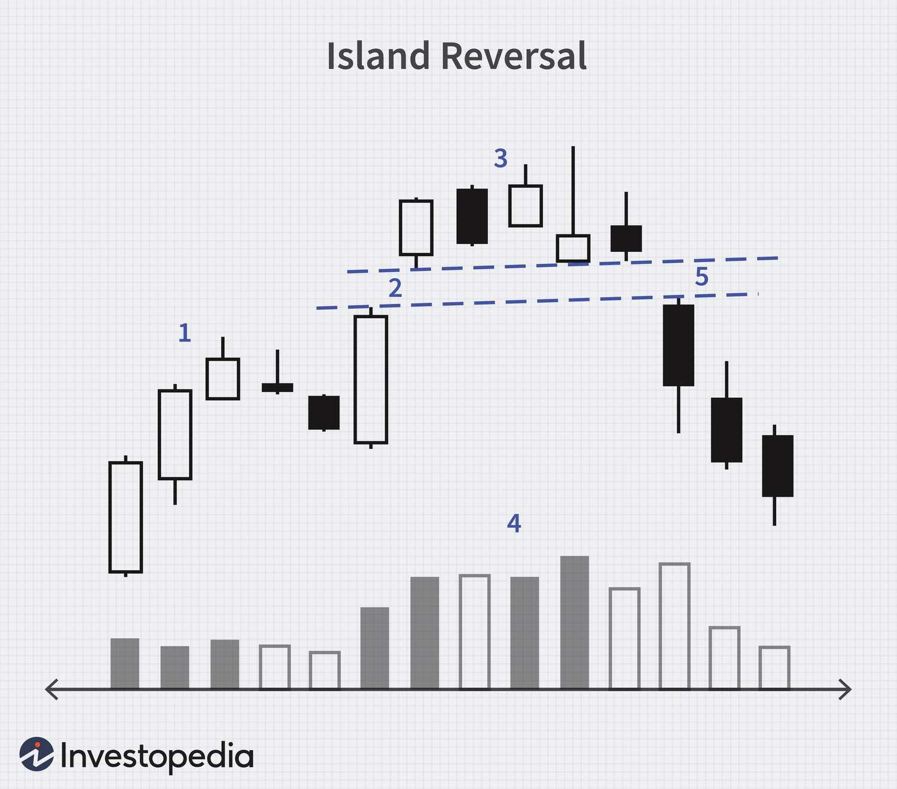

## Table of Contents

## What is an Island Reversal in trading?

An Island Reversal is a pattern in trading that shows up on a price chart. It happens when there is a gap in the price, followed by another gap in the opposite direction. This creates an "island" of prices that are separate from the rest of the chart. Traders watch for this pattern because it can signal that the current trend might be about to change.

For example, if the price of a stock has been going up, and then suddenly there's a gap down, followed by another gap up, this forms an island at the top. This could mean that the upward trend is over and the price might start going down. On the other hand, if the price has been going down and then there's a gap up, followed by a gap down, it forms an island at the bottom. This could signal that the downward trend is ending and the price might start going up.

## What are the key characteristics of an Island Reversal?

An Island Reversal is easy to spot on a price chart because it looks like a small island of prices that are separate from the rest of the chart. It happens when there is a gap in the price, then some trading happens, and then another gap in the opposite direction. The first gap separates the island from the previous prices, and the second gap separates it from the prices that come after. This pattern can be seen at the top of an uptrend or at the bottom of a downtrend.

When you see an Island Reversal, it might mean that the trend is about to change. For example, if the price has been going up and then you see an Island Reversal at the top, it could mean that the price is about to start going down. On the other hand, if the price has been going down and you see an Island Reversal at the bottom, it could mean that the price is about to start going up. Traders pay attention to this pattern because it can help them decide when to buy or sell.

## How does an Island Reversal form on a price chart?

An Island Reversal forms on a price chart when there's a gap in the price, followed by some trading, and then another gap in the opposite direction. Imagine the price of a stock has been going up. Suddenly, the price jumps down, leaving a gap on the chart. This is the first gap. After this gap, the price might move around a bit, but then it jumps back up, leaving another gap. This second gap is in the opposite direction of the first one. The price action between these two gaps looks like an island, separated from the rest of the chart.

This pattern can also happen when the price has been going down. The price might suddenly jump up, creating the first gap. After some trading, the price then jumps back down, creating the second gap. Again, the price action between these two gaps forms an island. Traders watch for these Island Reversals because they can signal that the current trend might be about to change. If you see an island at the top of an uptrend, it might mean the price will start going down. If you see an island at the bottom of a downtrend, it might mean the price will start going up.

## What is the significance of gaps in an Island Reversal?

Gaps are really important in an Island Reversal because they help create the island shape on the price chart. When the price jumps and leaves a gap, it means there's a big difference between the closing price of one day and the opening price of the next day. This gap separates the island from the prices before it. Then, when the price jumps again in the opposite direction, it creates another gap. This second gap separates the island from the prices that come after it. These gaps make the island stand out and show that something big might be happening.

The gaps in an Island Reversal can tell traders that the trend might be changing. If the price has been going up and then there's a gap down followed by a gap up, it forms an island at the top. This could mean the price is about to start going down. On the other hand, if the price has been going down and then there's a gap up followed by a gap down, it forms an island at the bottom. This could mean the price is about to start going up. Traders look for these gaps because they can help them decide when to buy or sell.

## Can you explain the difference between an Island Top and an Island Bottom?

An Island Top happens when the price of a stock has been going up and then suddenly there's a gap down, followed by some trading, and then another gap up. This creates an island at the top of the chart. It looks like the price has been pushed up, but then it gets separated from the rest of the chart by these gaps. When traders see an Island Top, it can mean that the price might start going down soon. It's like a warning sign that the upward trend could be over.

An Island Bottom is the opposite. It happens when the price of a stock has been going down and then suddenly there's a gap up, followed by some trading, and then another gap down. This creates an island at the bottom of the chart. It looks like the price has been pushed down, but then it gets separated from the rest of the chart by these gaps. When traders see an Island Bottom, it can mean that the price might start going up soon. It's like a signal that the downward trend could be ending.

Both Island Tops and Island Bottoms are important because they show that something big might be happening with the price. The gaps that form these islands help traders see that the trend might be changing. Whether it's an Island Top or an Island Bottom, traders pay attention to these patterns to decide when to buy or sell.

## What are the psychological factors behind an Island Reversal?

An Island Reversal happens because of what people think and feel about the stock. When the price goes up a lot, people start to feel happy and excited. They keep buying the stock because they think it will keep going up. But then, something happens that makes them worried or scared. Maybe there's bad news about the company, or the stock just seems too expensive. Suddenly, everyone wants to sell, and the price drops with a big gap. This is the first gap in the Island Reversal. After the gap, some people might still think the price will go back up, so they buy a little, but not enough to fill the gap. Then, something else happens that makes people even more scared, and the price jumps back up with another gap. This second gap leaves the price action in the middle like an island, showing that people's feelings have changed a lot.

In the case of an Island Bottom, it's the opposite. The price has been going down, and people are feeling sad and worried. They keep selling the stock because they think it will keep going down. But then, something happens that makes them feel hopeful or less scared. Maybe there's good news about the company, or the stock just seems too cheap. Suddenly, everyone wants to buy, and the price jumps up with a big gap. This is the first gap in the Island Reversal. After the gap, some people might still think the price will go back down, so they sell a little, but not enough to fill the gap. Then, something else happens that makes people even more hopeful, and the price jumps back down with another gap. This second gap leaves the price action in the middle like an island, showing that people's feelings have changed a lot.

## How reliable is an Island Reversal as a trading signal?

An Island Reversal can be a helpful signal for traders, but it's not always perfect. It's like a sign that tells you the price might change direction. When you see an Island Reversal, it means a lot of people changed their minds about the stock quickly, which can be a big clue. But sometimes, the price might not change as much as you expect, or it might take a while to happen. So, it's good to use Island Reversals with other signs and information to make better trading choices.

Not all Island Reversals work the same way. Sometimes, they can be very strong signals, especially if they happen with other signs like a lot of trading or big news about the company. But other times, they might not mean much, especially if the market is moving a lot or if there's not a clear reason for the gaps. That's why it's important to look at the whole picture and not just rely on one signal. Using Island Reversals along with other tools can help traders make smarter decisions.

## What are some common mistakes traders make when identifying Island Reversals?

One common mistake traders make when identifying Island Reversals is not waiting for the pattern to complete. They might see the first gap and think it's an Island Reversal right away, but they need to wait for the second gap to be sure. If they jump in too early, they might end up making the wrong trading decision. It's important to be patient and make sure the whole pattern is there before acting on it.

Another mistake is not considering the overall market context. An Island Reversal might look clear on a chart, but if the market is moving a lot or if there's no clear reason for the gaps, it might not be a strong signal. Traders should look at other signs and information, like the [volume](/wiki/volume-trading-strategy) of trading or news about the company, to see if the Island Reversal makes sense. Ignoring the bigger picture can lead to mistakes.

Sometimes, traders also forget to use other tools and indicators along with the Island Reversal. Relying on just one signal can be risky. Using other tools, like moving averages or trend lines, can help confirm if the Island Reversal is a good sign to trade on. It's always better to use multiple pieces of information to make a more informed decision.

## How can traders confirm an Island Reversal pattern?

To confirm an Island Reversal pattern, traders should wait for the whole pattern to finish. This means they need to see both gaps: the first gap that separates the island from the previous prices, and the second gap that separates it from the prices that come after. If traders jump in too early and only see the first gap, they might make a wrong decision. It's important to be patient and make sure the second gap happens before acting on the pattern.

Traders should also look at the bigger picture and not just focus on the Island Reversal. They need to check if the pattern makes sense with what's happening in the market. For example, if there's a lot of trading or big news about the company, it can make the Island Reversal a stronger signal. Using other tools like moving averages or trend lines can also help confirm the pattern. By looking at all these things together, traders can make better decisions and avoid mistakes.

## What are the best practices for trading based on an Island Reversal?

When trading based on an Island Reversal, it's important to wait for the whole pattern to finish before making a move. This means you should see both gaps: the first one that separates the island from the previous prices, and the second one that separates it from the prices that come after. If you jump in too early and only see the first gap, you might make a wrong decision. Being patient and waiting for the second gap to happen can help you make a better choice.

It's also a good idea to look at the bigger picture and not just focus on the Island Reversal. Check if the pattern makes sense with what's happening in the market. For example, if there's a lot of trading or big news about the company, it can make the Island Reversal a stronger signal. Using other tools like moving averages or trend lines can help confirm the pattern. By looking at all these things together, you can make smarter trading decisions and avoid mistakes.

## Can you provide a real-world example of an Island Reversal in the stock market?

A real-world example of an Island Reversal happened with the stock of Tesla, Inc. (TSLA) in early 2021. Tesla's stock had been on a strong upward trend, reaching highs around $900 in January. Suddenly, on January 27, the stock gapped down to open at around $800, creating the first gap of an Island Reversal. Over the next few days, the stock traded sideways between $800 and $850, forming the "island" part of the pattern. Then, on February 1, the stock gapped back up to open at around $880, completing the Island Reversal with the second gap.

This Island Reversal at the top of Tesla's chart signaled that the upward trend might be over. After the pattern completed, Tesla's stock started to decline, eventually falling to around $550 by the end of March. The Island Reversal helped traders see that the sentiment around Tesla had shifted, with many investors deciding to take profits and sell their shares. This example shows how an Island Reversal can be a useful signal for traders to watch for potential trend changes in the stock market.

## How do Island Reversals fit into broader technical analysis strategies?

Island Reversals are a special pattern in technical analysis that traders use to guess when a stock's price might change direction. They look like an island on the price chart because there are gaps on both sides. When traders see an Island Reversal, they think it might mean the price will start going the other way soon. But they don't just look at this one pattern. They use it with other tools like moving averages, trend lines, and volume to make sure their guess is right. By looking at everything together, traders can make better decisions about when to buy or sell.

For example, if a trader sees an Island Reversal at the top of an upward trend, they might think the price will go down. But before they decide to sell, they'll check other things too. They might look at the moving averages to see if they're also pointing down, or check the trading volume to see if it's high, which could mean a lot of people are selling. If all these signs agree with the Island Reversal, the trader feels more sure about their decision. Using Island Reversals as part of a bigger plan helps traders be more careful and smart with their trades.

## What is Understanding Technical Analysis?

Technical analysis is a methodology employed to analyze and evaluate securities based on [statistics](/wiki/bayesian-statistics) generated by market activity, primarily focusing on historical prices and trading volumes. Unlike [fundamental analysis](/wiki/fundamental-analysis), which examines a company's financials to determine its intrinsic value, technical analysis relies on the belief that past trading activity and price changes can be valuable indicators of future market behavior.

Central to technical analysis are charts that visually represent the price movements of securities over a specific period. These charts allow analysts to identify patterns and trends that may predict future price actions. Among the most commonly used charts are line charts, bar charts, and candlestick charts, each providing varying levels of detail about price movements.

### Technical Indicators

Several technical indicators aid analysts in understanding potential future movements in security prices. Each indicator serves a unique purpose and offers various insights into market trends.

#### Moving Averages

A moving average (MA) is a widely used indicator that smooths price data to create a single flowing line, making it easier to identify the direction of the trend. It is calculated by taking the average of a security's price over a set number of periods. The formula for a simple moving average (SMA) is given by:

$$
\text{SMA}_n = \frac{P_1 + P_2 + \cdots + P_n}{n}
$$

where $P$ denotes the price for each period, and $n$ is the number of periods.

Two common types of moving averages are Simple Moving Averages (SMA) and Exponential Moving Averages (EMA). While SMA gives equal weight to all data points, EMA gives more weight to recent prices, thus reacting more quickly to price changes.

#### Relative Strength Index (RSI)

The Relative Strength Index (RSI) is a [momentum](/wiki/momentum) oscillator that measures the speed and change of price movements. RSI oscillates between 0 and 100 and is typically used to identify overbought or oversold conditions in the market. It is calculated using the following formula:

$$
\text{RSI} = 100 - \left( \frac{100}{1 + \frac{\text{Average Gain}}{\text{Average Loss}}} \right)
$$

Generally, an RSI above 70 indicates that a security is overbought, while an RSI below 30 points to oversold conditions.

#### Candlestick Patterns

Candlestick patterns are a key component of technical analysis, offering visual insights into the market's sentiment over a trading period. Each candlestick represents the open, high, low, and close prices within a specific timeframe. Patterns such as 'Doji', 'Hammer', and 'Engulfing' provide signals of potential market reversals or continuations.

For example, a 'Hammer' pattern suggests a potential bullish reversal, while an 'Engulfing' pattern indicates a strong momentum in the direction of the engulfing candle.

Technical analysis tools and indicators, like moving averages, RSI, and candlestick patterns, equip analysts to scrutinize securities' price movements and identify emerging trends. Although technical analysis involves looking into past data, its strategic application allows traders and investors to make informed predictions about future price movements, enhancing decision-making in trading strategies.

## References & Further Reading

[1]: Bergstra, J., Bardenet, R., Bengio, Y., & Kégl, B. (2011). ["Algorithms for Hyper-Parameter Optimization."](https://papers.nips.cc/paper/4443-algorithms-for-hyper-parameter-optimization) Advances in Neural Information Processing Systems 24.

[2]: ["Advances in Financial Machine Learning"](https://www.amazon.com/Advances-Financial-Machine-Learning-Marcos/dp/1119482089) by Marcos Lopez de Prado

[3]: ["Evidence-Based Technical Analysis: Applying the Scientific Method and Statistical Inference to Trading Signals"](https://www.amazon.com/Evidence-Based-Technical-Analysis-Scientific-Statistical/dp/0470008741) by David Aronson

[4]: ["Machine Learning for Algorithmic Trading"](https://github.com/stefan-jansen/machine-learning-for-trading) by Stefan Jansen

[5]: ["Quantitative Trading: How to Build Your Own Algorithmic Trading Business"](https://www.amazon.com/Quantitative-Trading-Build-Algorithmic-Business/dp/1119800064) by Ernest P. Chan