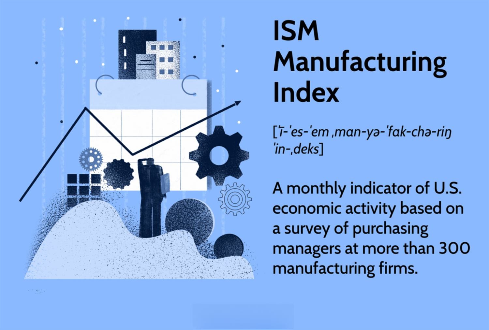

## Table of Contents

## What is the ISM Manufacturing Index (PMI)?

The ISM Manufacturing Index, also known as the Purchasing Managers' Index (PMI), is a report that measures the level of activity in the manufacturing sector of the U.S. economy. It is released by the Institute for Supply Management (ISM) on the first business day of each month and is based on a survey of purchasing managers at around 300 manufacturing companies. The PMI is a key economic indicator that provides insights into the health of the manufacturing industry, which is a significant part of the overall economy.

The PMI is calculated using five major components: new orders, production, employment, supplier deliveries, and inventories. Each of these components is weighted equally in the final PMI calculation. A PMI reading above 50 indicates that the manufacturing sector is expanding, while a reading below 50 suggests contraction. The PMI is closely watched by economists, investors, and policymakers because changes in the manufacturing sector can signal broader economic trends and influence decisions related to business investments and monetary policy.

## Who publishes the ISM Manufacturing Index?

The ISM Manufacturing Index is published by the Institute for Supply Management (ISM). The ISM is a group that helps people who buy things for businesses. They release the index on the first business day of every month.

The index tells us how the manufacturing part of the U.S. economy is doing. It is based on a survey of about 300 people who manage buying for manufacturing companies. This report is important because it helps us understand if the economy is growing or shrinking.

## How often is the ISM Manufacturing Index released?

The ISM Manufacturing Index comes out every month. It is released on the first business day of the month. This schedule helps people know when to expect the new numbers.

The index is important because it shows how well the manufacturing part of the U.S. economy is doing. It is based on a survey of about 300 people who buy things for manufacturing companies. By looking at this index, people can tell if the economy is getting bigger or smaller.

## What does a PMI above 50 indicate?

A PMI above 50 means that the manufacturing part of the economy is growing. It shows that more people are buying new things, making more products, hiring more workers, and getting supplies faster.

This number is important because it helps people understand if the economy is doing well. When the PMI is over 50, it's a good sign that businesses are doing better and the economy might be getting stronger.

## What does a PMI below 50 indicate?

A PMI below 50 means that the manufacturing part of the economy is shrinking. It shows that fewer people are buying new things, making fewer products, hiring fewer workers, and getting supplies slower.

This number is important because it helps people understand if the economy is doing poorly. When the PMI is under 50, it's a sign that businesses might be struggling and the economy could be getting weaker.

## What are the key components of the PMI?

The PMI is made up of five main parts: new orders, production, employment, supplier deliveries, and inventories. Each part is equally important when figuring out the final PMI number. New orders show how many new things people want to buy. Production tells us how much stuff is being made. Employment shows if companies are hiring more people or letting people go. Supplier deliveries tell us how fast companies are getting the things they need. Inventories show how much stuff companies have stored up.

All these parts together help us understand if the manufacturing part of the economy is doing well or not. If the PMI number is over 50, it means the economy is growing because more people are buying things, making stuff, hiring workers, and getting supplies quickly. If the PMI number is under 50, it means the economy might be shrinking because fewer people are buying things, making stuff, hiring workers, and getting supplies slowly.

## How is the PMI calculated?

The PMI is calculated by looking at five main parts: new orders, production, employment, supplier deliveries, and inventories. Each part is equally important, so they all count the same when figuring out the final PMI number. To get the PMI, people at the Institute for Supply Management (ISM) ask around 300 people who buy things for manufacturing companies about these five things. They use the answers to see how well the manufacturing part of the economy is doing.

First, they turn each of the five parts into a number between 0 and 100. If the number is over 50, it means that part is growing. If it's under 50, it means that part is shrinking. Then, they add up all five numbers and divide by five to get the final PMI. This final number tells us if the whole manufacturing part of the economy is growing or shrinking. If the PMI is over 50, the economy is growing. If it's under 50, the economy is shrinking.

## What is the significance of the PMI for the economy?

The PMI is a really important number that tells us how the manufacturing part of the U.S. economy is doing. It helps people understand if businesses are making more things, hiring more workers, and getting supplies faster. If the PMI is over 50, it means the economy is growing, and that's good news. But if it's under 50, it means the economy might be shrinking, which can be a sign that businesses are struggling.

Economists, investors, and people who make decisions about money watch the PMI closely. They use it to make choices about where to put their money or how to help the economy. For example, if the PMI is low, the government might decide to do things to help businesses grow. On the other hand, if the PMI is high, it might mean the economy is doing well enough that they don't need to do anything special.

## How does the PMI influence financial markets?

The PMI can have a big effect on financial markets because it shows how well the manufacturing part of the economy is doing. When the PMI number is high, it means more people are buying things and making stuff, which is good news for the economy. This good news can make people feel more confident about the future, so they might buy more stocks and other investments. This can push stock prices up and make the whole market feel more positive.

On the other hand, if the PMI number is low, it can make people worry that the economy might be getting weaker. When people are worried, they might sell their stocks and other investments to be safe. This can cause stock prices to go down and make the market feel more negative. Because the PMI is released every month, it gives people new information that can change how they feel about the economy and what they do with their money.

## What are some limitations of the PMI as an economic indicator?

The PMI is a useful tool, but it has some limits. It only looks at the manufacturing part of the economy, which is just one piece of the whole picture. Other parts, like services or construction, might be doing something different. So, if you only look at the PMI, you might miss what's happening in other important areas. Also, the PMI is based on a survey, and surveys can sometimes be wrong. The people answering the survey might guess wrong about what's going to happen, or they might not want to share bad news.

Another thing to think about is that the PMI can change a lot from month to month. Sometimes, these changes might not mean much in the long run. For example, a big jump or drop in the PMI might just be because of something that happened that month, like a holiday or a big order. It's important to look at the PMI over a longer time to see the real trends. Also, the PMI doesn't tell us why things are happening, just that they are. So, it's good to use the PMI along with other information to get a better understanding of the economy.

## How can the PMI be used in conjunction with other economic indicators?

The PMI is a useful piece of information, but it's even better when you use it with other economic indicators. For example, you can look at the PMI along with the Gross Domestic Product (GDP) numbers to get a fuller picture of how the whole economy is doing. GDP tells you about the total value of all goods and services made in a country, so it covers more than just manufacturing. If the PMI is going up and the GDP is also going up, it's a good sign that the economy is getting stronger. But if the PMI is going down and the GDP is staying the same or going down too, it might mean the economy is getting weaker.

Another important indicator to use with the PMI is the Non-Farm Payroll report, which tells you about the number of jobs being created or lost in the economy, not counting farm jobs. If the PMI is high and the Non-Farm Payroll numbers are also high, it shows that businesses are making more things and hiring more people. But if the PMI is low and the Non-Farm Payroll numbers are low too, it could mean that businesses are struggling and not hiring as much. By looking at the PMI together with these other indicators, you can get a better idea of what's really going on in the economy and make smarter decisions.

## What historical trends can be observed in the PMI data?

Over the years, the PMI has shown some clear patterns that help us understand the ups and downs of the U.S. economy. When the economy is doing well, like during periods of growth and expansion, the PMI usually stays above 50 for a long time. For example, during the late 1990s and early 2000s, the PMI was often above 50, showing that manufacturing was growing. This was a time when the economy was strong, and people were buying a lot of things. But when the economy goes through tough times, like during a recession, the PMI can drop below 50 and stay there for a while. This happened during the 2008 financial crisis when the PMI fell sharply, showing that manufacturing was shrinking as businesses struggled.

Another trend we can see in the PMI data is how it can bounce back after a downturn. After the 2008 crisis, the PMI slowly started to climb back above 50, showing that the manufacturing sector was recovering. This recovery can take time, but it's a good sign that the economy is getting better. The PMI also shows how sensitive manufacturing can be to big events. For example, during the early months of the COVID-19 pandemic in 2020, the PMI dropped a lot because factories had to close and people weren't buying as much. But as things got better and factories reopened, the PMI started to go up again, showing that manufacturing was coming back to life.

## References & Further Reading

[1]: Institute for Supply Management. ["ISM Report On Business."](https://www.ismworld.org/supply-management-news-and-reports/reports/ism-report-on-business/) 

[2]: IHS Markit. ["PMI by IHS Markit."](https://cdn.ihsmarkit.com/www/pdf/3980572_3980563_0.1.pdf)

[3]: Lopez de Prado, M. (2018). ["Advances in Financial Machine Learning."](https://www.amazon.com/Advances-Financial-Machine-Learning-Marcos/dp/1119482089) Wiley.

[4]: Jansen, S. (2020). ["Machine Learning for Algorithmic Trading."](https://github.com/stefan-jansen/machine-learning-for-trading) Packt Publishing.

[5]: Chan, E.P. (2009). ["Quantitative Trading: How to Build Your Own Algorithmic Trading Business."](https://github.com/ftvision/quant_trading_echan_book) Wiley.