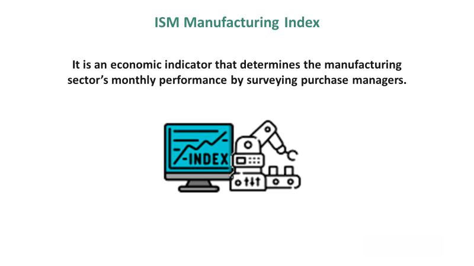

## Table of Contents

## What is the ISM Manufacturing Index?

The ISM Manufacturing Index, also known as the Purchasing Managers' Index (PMI), is a monthly report that shows how well the manufacturing sector in the United States is doing. It is put out by the Institute for Supply Management (ISM). The index is based on a survey of purchasing managers from different manufacturing companies. They answer questions about things like new orders, production levels, employment, and deliveries from suppliers. A number over 50 means the manufacturing sector is growing, while a number below 50 means it is shrinking.

This index is important because it gives us an early sign of how the economy might be doing. When the manufacturing sector is doing well, it often means the overall economy is strong. Many businesses and investors watch the ISM Manufacturing Index closely to help them make decisions. For example, if the index is going up, it might be a good time to invest in manufacturing stocks. On the other hand, if the index is going down, it might be a sign to be more careful with investments.

## Who publishes the ISM Manufacturing Index?

The ISM Manufacturing Index is published by the Institute for Supply Management (ISM). ISM is a group that helps businesses that buy things they need to make their products. They do this by giving them information and helping them work together.

The index comes out every month. It tells us how the manufacturing part of the economy is doing. They ask people who buy things for manufacturing companies about their orders, how much they are making, if they are hiring more people, and how fast they are getting things they need. This helps everyone understand if manufacturing is growing or shrinking.

## How often is the ISM Manufacturing Index released?

The ISM Manufacturing Index comes out every month. It is like a report card for the manufacturing part of the economy. The Institute for Supply Management (ISM) is the group that makes this report. They ask people who buy things for manufacturing companies about their business.

This monthly report helps everyone know if manufacturing is doing well or not. If the number is over 50, it means manufacturing is growing. If it is under 50, it means it is shrinking. People who invest money or run businesses look at this report to help them make decisions.

## What does the ISM Manufacturing Index measure?

The ISM Manufacturing Index measures how well the manufacturing part of the economy is doing in the United States. It is made by the Institute for Supply Management (ISM). They ask people who buy things for manufacturing companies about their business. This includes asking about new orders, how much they are making, if they are hiring more people, and how fast they are getting the things they need.

The index is a number that comes out every month. If the number is over 50, it means manufacturing is growing. If it is under 50, it means manufacturing is shrinking. This report is important because it helps people understand if the economy is doing well or not. Businesses and people who invest money look at this report to help them make decisions.

## How is the ISM Manufacturing Index calculated?

The ISM Manufacturing Index is calculated by the Institute for Supply Management (ISM) using a survey of purchasing managers from different manufacturing companies. They ask these managers about five main things: new orders, production levels, employment, deliveries from suppliers, and inventories. Each of these five things is given a score based on how it is doing compared to the last month. If it is doing better, it gets a score above 50. If it is doing worse, it gets a score below 50. The scores for all five things are then averaged together to get the final ISM Manufacturing Index number.

This final number is important because it tells us if manufacturing is growing or shrinking. If the number is over 50, it means manufacturing is growing. If it is under 50, it means manufacturing is shrinking. The index comes out every month, and many people, like business owners and investors, look at it to understand how the economy is doing. It helps them make decisions about where to put their money or how to plan their business.

## What is considered a 'healthy' reading for the ISM Manufacturing Index?

A 'healthy' reading for the ISM Manufacturing Index is usually considered to be around 50 to 60. When the index is above 50, it means that the manufacturing sector is growing. If it is around 50 to 60, it shows that the growth is strong but not too fast, which is good for the economy. This range is seen as a sign that things are going well and that businesses are doing okay.

If the index stays in this range for a while, it can mean that the economy is stable and growing at a good pace. People who invest money or run businesses like to see the index in this range because it gives them confidence that things are going well. If the number goes much higher than 60, it might mean the economy is growing too fast, which can lead to problems like inflation. But if it stays between 50 and 60, it's usually a good sign.

## How does the ISM Manufacturing Index impact financial markets?

The ISM Manufacturing Index can have a big effect on financial markets. When the index number is high, it means the manufacturing part of the economy is doing well. This can make investors feel good about the economy. They might buy more stocks, especially stocks of companies that make things. This can make stock prices go up. Also, if the index is high, it might make people think that the economy will keep growing. This can lead to more spending and investing, which is good for the markets.

On the other hand, if the ISM Manufacturing Index is low, it can make investors worried. A low number means that manufacturing is not doing well, which can be a sign that the whole economy is slowing down. This might make investors sell their stocks, which can make stock prices go down. Also, if the index is low for a long time, it might make people think that the economy will not get better soon. This can lead to less spending and investing, which can be bad for the financial markets.

## What are the key components of the ISM Manufacturing Index?

The ISM Manufacturing Index is made up of five important parts: new orders, production levels, employment, deliveries from suppliers, and inventories. Each part is asked about in a survey sent to people who buy things for manufacturing companies. These people answer questions about how each part is doing compared to the last month. If something is doing better, it gets a score above 50. If it's doing worse, it gets a score below 50. All these scores are then averaged together to get the final ISM Manufacturing Index number.

This final number is important because it tells us if manufacturing is growing or shrinking. If the number is over 50, it means manufacturing is growing. If it's under 50, it means manufacturing is shrinking. The index comes out every month, and many people, like business owners and investors, look at it to understand how the economy is doing. It helps them make decisions about where to put their money or how to plan their business.

## How can the ISM Manufacturing Index be used to predict economic trends?

The ISM Manufacturing Index can help us guess what might happen with the economy. When the index number is high, it means that manufacturing is doing well. This often means the whole economy is doing well too. If the index keeps going up, it might mean that more people will start spending money and businesses will grow. This can make the stock market go up and make people feel good about the economy. On the other hand, if the index number is low, it might mean that manufacturing is not doing well. This can be a sign that the economy might slow down. If the index stays low, people might start spending less and businesses might not grow as much. This can make the stock market go down and make people worried about the economy.

The index is also useful because it comes out every month. This means we can see changes in the economy quickly. If the index goes up for a few months in a row, it might mean that the economy will keep growing. But if it goes down for a few months, it might mean that the economy will get worse. By watching the index, people who invest money or run businesses can make better choices. For example, if the index is going up, they might decide to invest more in manufacturing stocks. If it's going down, they might decide to be more careful with their money. This helps them plan for the future and make smart decisions based on what the index is telling them about the economy.

## What are the limitations of the ISM Manufacturing Index?

The ISM Manufacturing Index is a helpful tool, but it has some limits. One big limit is that it only looks at the manufacturing part of the economy. Manufacturing is important, but it's not the whole economy. There are other parts, like services, that the index doesn't cover. So, if the index says manufacturing is doing well, the whole economy might not be doing well if other parts are not doing as good.

Another limit is that the index can change a lot from month to month. This can make it hard to see the big picture. Sometimes, the index might go up or down because of things that won't last, like a big order one month or a delay in supplies. These changes can make it hard to know if the economy is really growing or shrinking. People need to look at the index over time to get a better idea of what's happening.

Also, the ISM Manufacturing Index is based on a survey. Surveys can be good, but they also have their problems. The people answering the survey might not always give the same answers, and their guesses about the future might not be right. This means the index might not always show what will really happen in the economy. It's important to use the index along with other information to get a full picture of the economy.

## How does the ISM Manufacturing Index compare to other economic indicators?

The ISM Manufacturing Index is just one of many tools that help us understand the economy. It focuses on the manufacturing part of the economy, which is important but doesn't tell us everything. Other indicators, like the Gross Domestic Product (GDP), look at the whole economy, including services, which the ISM Index doesn't cover. The Consumer Price Index (CPI) tells us about inflation, which is how much prices are going up, while the ISM Index doesn't give us that information. Also, the Unemployment Rate shows how many people are out of work, which can be different from what the ISM Index says about manufacturing jobs.

Another difference is that the ISM Manufacturing Index comes out every month, which can make it more up-to-date than some other indicators like GDP, which is reported every three months. This means the ISM Index can show changes in the economy faster. But, because it changes a lot from month to month, it can be hard to see the big picture. Other indicators, like the Conference Board's Leading Economic Index, combine several different pieces of information to give a more complete view of where the economy might be heading. So, while the ISM Manufacturing Index is useful, it's best to look at it along with other indicators to get a full understanding of the economy.

## What historical events have significantly influenced the ISM Manufacturing Index?

Many big events in history have changed the ISM Manufacturing Index. One of these events was the 2008 financial crisis. During this time, the index dropped a lot because many factories stopped making things and people stopped buying. This made the index go below 50, which meant manufacturing was shrinking. Another event was the COVID-19 pandemic in 2020. When the virus started spreading, many factories had to close, and the index fell sharply. But later, when things started to open up again, the index went up because people wanted to buy things they couldn't get during the lockdown.

Another event that affected the ISM Manufacturing Index was the oil price shock in the 1970s. When oil prices went up a lot, it made it more expensive for factories to make things. This caused the index to go down because manufacturing slowed down. Also, the dot-com bubble burst in the early 2000s had an impact. When many internet companies failed, it made people spend less money, and this affected manufacturing. The index showed this by going down during that time. These events show how the ISM Manufacturing Index can change a lot because of what's happening in the world.

## How is the ISM Manufacturing Index Calculated?

The ISM Manufacturing Index is determined through a systematic survey of purchasing and supply executives across diverse manufacturing sectors in the United States. This process involves several key steps to ensure that the index accurately reflects the current state of the manufacturing sector.

Each executive participating in the survey is asked to report whether specific activities, such as new orders, production, employment, supplier deliveries, and inventories, are higher, the same, or lower than the previous month. These responses are quantified into a format conducive to statistical analysis, typically by assigning scores based on the reported direction of change: an upward movement, no change, or a downward movement.

The results from the survey are then compiled into a diffusion index. A diffusion index measures the degree to which these surveyed activities are diffusing or spreading throughout the industry. The formula for a diffusion index is:

$$
\text{Diffusion Index} = \text{(Percentage of positive responses)} + 0.5 \times \text{(Percentage of neutral responses)}
$$

This calculation provides a snapshot of the health of the manufacturing sector, with an index value above 50 indicating expansion, and below 50 indicating contraction.

The ISM Manufacturing Index specifically tracks five primary indicators: New Orders, Production, Employment, Supplier Deliveries, and Inventories. These indicators are given different weights based on their perceived impact on the manufacturing sector. The weighted indices are then aggregated to produce a composite index. The weighting ensures that changes in more critical components have a more significant impact on the overall index.

For example, the index might allocate New Orders a weight of 30%, Production 25%, Employment 20%, Supplier Deliveries 15%, and Inventories 10%. The composite ISM Manufacturing Index can be expressed as a weighted sum:

$$
\text{ISM Index} = w_1 \times \text{New Orders} + w_2 \times \text{Production} + w_3 \times \text{Employment} + w_4 \times \text{Supplier Deliveries} + w_5 \times \text{Inventories}
$$

where $w_1, w_2, ..., w_5$ are the weights assigned to each component. This composite index provides a comprehensive view of the manufacturing sector, summarizing multiple facets of manufacturing activity into a single, actionable metric.

## References & Further Reading

[1]: ["ISM Report On Business"](https://www.ismworld.org/supply-management-news-and-reports/reports/ism-report-on-business/) - Institute for Supply Management

[2]: ["Advances in Financial Machine Learning"](https://www.amazon.com/Advances-Financial-Machine-Learning-Marcos/dp/1119482089) by Marcos Lopez de Prado

[3]: ["Quantitative Trading: How to Build Your Own Algorithmic Trading Business"](https://www.amazon.com/Quantitative-Trading-Build-Algorithmic-Business/dp/1119800064) by Ernest P. Chan

[4]: ["Machine Learning for Algorithmic Trading"](https://github.com/PacktPublishing/Machine-Learning-for-Algorithmic-Trading-Second-Edition) by Stefan Jansen

[5]: ["Evidence-Based Technical Analysis: Applying the Scientific Method and Statistical Inference to Trading Signals"](https://www.amazon.com/Evidence-Based-Technical-Analysis-Scientific-Statistical/dp/0470008741) by David Aronson