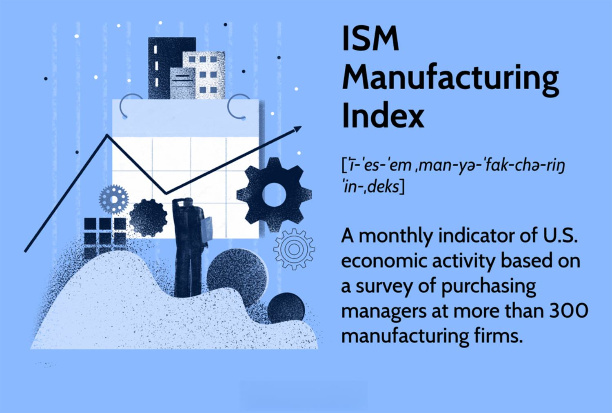

The ISM Non-Manufacturing Index, also known as the ISM Services PMI, is a pivotal economic indicator that provides insights into the economic health of the service sector, encompassing various industries such as finance, healthcare, and retail. This index is crucial for understanding macroeconomic trends, as the service sector is a significant contributor to GDP and employment in modern economies.

Economic indicators like the ISM Non-Manufacturing Index play an essential role in comprehensive economic analysis and informed investment decisions. These indicators offer critical insights into macroeconomic performance, helping investors, policymakers, and analysts predict economic trends and adjust their strategies accordingly. For businesses, understanding such metrics aids in strategic planning and risk management, making them indispensable for both public and private sectors.

In recent years, algorithmic trading has increasingly integrated economic indicators, including the ISM Non-Manufacturing Index, into its data-driven strategies. By utilizing key economic data points, algo trading systems can automate decision-making processes, enabling traders to execute trades at optimal prices and adjust strategies quickly to capitalize on market trends. With the advancements in artificial intelligence and machine learning, the incorporation of economic indicators into algorithmic models has become progressively sophisticated.

This article explores the impact of the ISM Non-Manufacturing Index on the service sector and its significance in algorithmic trading. By providing a detailed understanding of the index and its implications, we aim to equip traders and economists with the knowledge necessary to gain a competitive edge. As financial markets and economic landscapes evolve, the importance of staying informed about key economic metrics continues to grow, significantly influencing investment and policy decisions.

## Table of Contents

## What is the ISM Non-Manufacturing Index?

The ISM Non-Manufacturing Index, often referred to as the ISM Services PMI, serves as a crucial economic indicator that reflects the overall health of the service sector. This monthly report is published by the Institute for Supply Management (ISM), a reputable organization that has been providing critical insights into economic patterns for decades. The index is constructed based on comprehensive surveys involving more than 400 non-manufacturing firms. These firms are spread across different sectors, and their purchasing and supply executives provide valuable information that feeds into the index.

The ISM Non-Manufacturing Index encompasses a broad array of industries, including but not limited to retail, finance, and social services. These sectors collectively offer a robust view of economic activities that are not related to manufacturing, thereby providing a comprehensive snapshot of the non-manufacturing segment of the economy. A reading above 50 in the index indicates that the service sector is expanding, while a value below 50 signals contraction. This mechanism makes the index a vital tool for predicting economic trends and assessing the vibrancy of the service sector.

Key components of the ISM Non-Manufacturing Index include business activity, new orders, employment, and supplier deliveries. Each of these components offers unique insights into different facets of the service sector. Business activity measures the overall level of activity or production within services, while new orders provide information on the demand side, signaling future activity levels. Employment data is crucial for understanding labor market conditions within the sector, and supplier deliveries indicate potential supply chain constraints or efficiencies. Together, these components not only highlight current economic conditions but also offer predictive insights that are vital for strategic economic planning and decision-making.

## Importance of Economic Indicators

Economic indicators such as the ISM Non-Manufacturing Index are vital tools for tracking macroeconomic trends. These metrics allow investors, policymakers, and analysts to gauge economic performance, thereby facilitating informed decision-making. The ISM Non-Manufacturing Index, for example, provides insights into the health of the service sector, which is a substantial component of many economies.

By analyzing these indicators, stakeholders can predict economic trends and adjust their strategies accordingly. This is particularly useful in volatile market environments where timely and accurate data analysis can offer a competitive edge. For instance, when the ISM Non-Manufacturing Index indicates expansion with a reading above 50, investors might anticipate increased market activity and adjust their portfolios accordingly.

Businesses also benefit significantly from these economic indicators. They aid in strategic planning by offering a clearer picture of the economic environment. Companies can use this information to manage risks effectively, optimize operations, and plan for future growth. A consistent rise in the ISM Non-Manufacturing Index might prompt a business to expand its services, while a decline could lead to more conservative strategies.

Furthermore, the understanding of these metrics is crucial in both public and private sectors. In the public sector, policymakers utilize these indicators to craft monetary and fiscal policies. For example, a consistently high ISM Non-Manufacturing Index may indicate economic overheating, prompting policymakers to consider [interest rate](/wiki/interest-rate-trading-strategies) adjustments. Conversely, a low index value might lead to stimulus measures.

In conclusion, economic indicators like the ISM Non-Manufacturing Index not only provide essential insights into economic trends but also enable more strategic planning and risk management practices across various sectors. As such, they are indispensable tools for maintaining a competitive advantage in today's fast-paced economic landscape.

## Service Sector and Its Economic Impact

The service sector plays a pivotal role in contemporary economies, serving as a primary driver of Gross Domestic Product (GDP) and employment. It encompasses a diverse array of industries, including finance, healthcare, education, retail, and hospitality. This sector's broad scope reflects its substantial contribution to economic stability and growth. According to World Bank data, services contribute over 60% of global GDP, underscoring their integral status within the economic landscape.

The performance of the service sector is often seen as a bellwether for overall economic health. This is because the demand for services frequently aligns with consumer confidence and disposable income levels. For instance, an increase in service consumption typically signals an uptick in economic activity, as consumers and businesses are more willing to spend when they anticipate stable or improving economic conditions.

Monitoring changes within the service sector is crucial as it often precedes broader economic shifts. An example of this can be observed during economic expansions or contractions, where fluctuations in service demand tend to manifest earlier compared to other sectors. These variations can provide early warnings of potential economic downturns or recoveries, offering valuable insights for policymakers and investors.

The integration of service sector data in economic modeling and forecasting enhances the accuracy of economic analyses. By incorporating indicators from critical service industries, analysts can develop comprehensive models that better predict GDP changes, inflation rates, and employment trends. For instance, econometric models might include variables such as service employment growth, consumer spending on services, and service export data to forecast economic outcomes.

In summary, the service sector's extensive impact on GDP and employment, coupled with its predictive abilities regarding economic movements, highlights its crucial role in economic assessments. The continuous evaluation and incorporation of service sector data into economic planning and forecasting remain vital for capturing the complete picture of economic dynamics.

## Algorithmic Trading and Economic Indicators

Algorithmic trading, often referred to as algo trading, utilizes sophisticated computational techniques to make trading decisions based on mathematical models and data analytics. At the core of these strategies is the reliance on data-driven insights to execute trades efficiently and achieve optimal pricing. Economic indicators, such as the ISM Non-Manufacturing Index, serve as critical inputs in these algorithms. They offer a snapshot of macroeconomic conditions, allowing traders to forecast potential market movements and adjust their portfolios accordingly.

By automating decision-making processes, algorithms can quickly respond to changes in economic indicators. For instance, a significant shift in the ISM Non-Manufacturing Index values can signal changes in market trends, enabling algorithms to execute trades instantaneously. This automation reduces human error, enhances execution speed, and ensures that trades are executed at the most favorable times, thereby optimizing returns.

Moreover, advancements in [artificial intelligence](/wiki/ai-artificial-intelligence) (AI) and [machine learning](/wiki/machine-learning) have considerably enhanced the sophistication of [algorithmic trading](/wiki/algorithmic-trading) strategies. These technologies analyze vast quantities of data to identify patterns and predict future market behaviors. Algorithms employing machine learning can continuously learn and adapt in real-time, refining their strategies based on new data inputs, including those from economic indicators. As a result, traders who leverage these cutting-edge tools gain a significant edge, as they can swiftly interpret and act on complex data metrics.

In summary, the role of economic indicators in algorithmic trading is pivotal. They offer actionable insights that prompt timely trading decisions. As technologies evolve, the integration of these indicators into trading algorithms is expected to become even more nuanced, further influencing market dynamics and trader strategies.

## The Role of ISM Non-Manufacturing Index in Algo Trading

The ISM Non-Manufacturing Index plays a pivotal role in algorithmic trading, particularly for algorithms that target the U.S. economy. Trading systems leverage this index to anticipate shifts in the market and realign strategies in response to economic changes. These systems analyze historical and current data to predict future movements, enabling traders to make informed decisions.

A critical aspect of algorithmic trading is the detection of significant deviations from expected ISM index values. Such anomalies in the index can serve as triggers for executing trades or modifying portfolio allocations. For instance, an unexpected increase in the index might indicate a stronger than anticipated service sector performance, prompting a reallocation of assets into sectors poised to benefit from economic growth.

The success of using the ISM Non-Manufacturing Index in trading algorithms heavily depends on the consistency and reliability of the data. Accurate and timely data ensure that algorithms can respond swiftly to changes, reducing the latency between market events and trading actions. This precision in timing can improve the profitability of trading strategies.

Moreover, a thorough understanding of the components of the ISM Non-Manufacturing Index allows for more refined algorithmic strategies. For example, knowing that the index consists of components such as business activity, new orders, employment, and supplier deliveries can provide deeper insights into specific economic conditions influencing the service sector. Algorithms can be designed to weigh these components differently based on historical impact and predictive validity.

In summary, the integration of the ISM Non-Manufacturing Index in algorithmic trading enhances the ability to adapt strategies in real-time, optimize trade execution, and manage portfolio risks effectively. The reliability and depth of understanding of the index data are vital for refining these algorithmic strategies.

## Conclusion

The ISM Non-Manufacturing Index is an indispensable tool for understanding the economic performance of the service sector, which comprises a significant portion of modern economies. This index goes beyond traditional economic analysis by being actively integrated into the realm of algorithmic trading, where it helps traders identify and capitalize on market shifts. By utilizing such economic indicators, traders and economists can gain critical insights that help maintain a competitive advantage in the financial marketplace.

The continuous evolution of financial markets enhances the significance of economic indicators like the ISM Non-Manufacturing Index. As algorithmic trading strategies become more sophisticated, the demand for reliable and timely economic data is likely to increase, further emphasizing the importance of such indices. In a world where economic conditions can shift rapidly, staying informed about key economic metrics not only aids investment decisions but also influences policy-making processes, driving more effective economic strategies and business practices.

## Further Reading and Resources

For more information on economic indicators, explore resources provided by the Institute for Supply Management (ISM). This institution offers extensive materials, including detailed reports and analyses of various economic indices, which are invaluable for understanding the ISM Non-Manufacturing Index and its applications.

Investopedia is another valuable resource, offering comprehensive guides on economic indicators and their implications. It provides educational content that helps users understand complex financial concepts through accessible explanations and examples.

Traders seeking real-time data and analysis can benefit from platforms like Bloomberg and Reuters. These platforms offer up-to-the-minute news and insights into market trends, which are crucial for making informed trading decisions, especially in algorithmic trading where timing and accuracy are paramount.

Educational courses on algorithmic trading are available through online learning platforms such as Coursera and Udacity. These courses cover a wide range of topics, from the basics of algorithmic trading to advanced techniques, including the integration of economic indicators into trading strategies.

Lastly, following financial news from reputable sources such as The Wall Street Journal and Financial Times is essential for staying updated on market developments. These publications offer in-depth reporting and expert analysis on economic trends and policy changes that can impact global markets.

## References & Further Reading

[1]: Institute for Supply Management. ["ISM Non-Manufacturing Index."](https://www.ismworld.org/supply-management-news-and-reports/reports/ism-report-on-business/) Accessed 2023.

[2]: Investopedia. ["ISM Non-Manufacturing Index Definition."](https://www.investopedia.com/terms/i/ism-nonmfg.asp) Accessed 2023.

[3]: Lopez de Prado, M. (2018). ["Advances in Financial Machine Learning."](https://www.amazon.com/Advances-Financial-Machine-Learning-Marcos/dp/1119482089) Wiley.

[4]: Jansen, S. (2020). ["Machine Learning for Algorithmic Trading."](https://github.com/stefan-jansen/machine-learning-for-trading) Packt Publishing.

[5]: Chan, E. P. (2008). ["Quantitative Trading: How to Build Your Own Algorithmic Trading Business."](https://github.com/ftvision/quant_trading_echan_book) Wiley. 

[6]: Bloomberg. ["Market Data and Financial Tools."](https://www.bloomberg.com/professional/products/data/enterprise-catalog/market/) Accessed 2023.

[7]: Reuters. ["Financial News and Analysis."](https://www.reuters.com/business/finance/) Accessed 2023.

[8]: Hotvedt, H. T., Langeland, K. L. F., & Loken, E. T. (2021). ["Algorithmic Trading and Machine Learning: Best Practices."](https://psycnet.apa.org/record/2017-45077-001) arXiv preprint.

[9]: Coursera. ["Algorithmic Trading in Python."](https://www.coursera.org/courses?query=algorithmic%20trading) Accessed 2023.