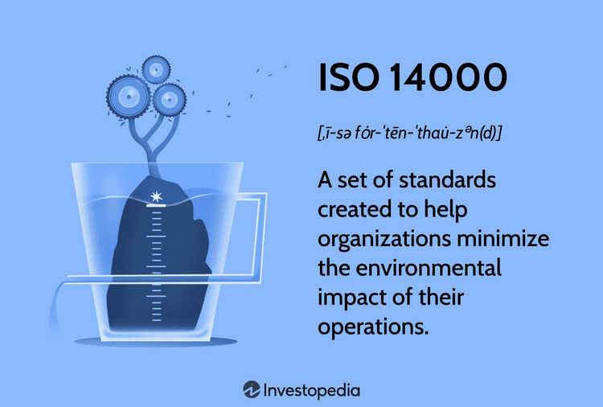

In the era of increasing environmental awareness, businesses are increasingly focused on minimizing their ecological footprint to align with global sustainability goals. ISO 14000 certification provides a comprehensive and pivotal framework to manage and mitigate environmental impacts. Developed by the International Organization for Standardization, these standards help organizations establish an effective Environmental Management System (EMS) that can integrate seamlessly into their business operations, enhancing their capacity to operate sustainably.

Simultaneously, algorithmic trading has emerged as a transformative force in financial markets, leveraging advanced algorithms to execute trades at unprecedented speeds and volumes. This technological advancement, however, poses significant environmental challenges due to the substantial computational power it demands. Therefore, aligning algorithmic trading practices with eco-friendly principles is becoming essential. This approach not only reduces the carbon footprint associated with high-frequency trading activities but also advances the broader agenda of sustainable financial practices.

This article aims to explore how ISO 14000 standards can be strategically integrated into the algorithmic trading domain to foster sustainability. We will examine the relevance of these environmental standards in the context of algorithmic operations, the steps necessary to achieve certification, and the multifaceted benefits that such alignment offers. By adapting to these frameworks, algorithmic trading firms can significantly enhance both their operational sustainability and market competitiveness.

## Table of Contents

## Understanding ISO 14000 Certification

ISO 14000 is a series of international standards developed by the International Organization for Standardization (ISO) with the objective of guiding organizations in managing their environmental impact. These standards were introduced in 1996 and have since become a cornerstone for organizations looking to integrate sustainable practices into their operations. The ISO 14000 family is particularly focused on environmental management systems (EMS), which provide a framework for organizations to systematically reduce their environmental footprint.

At the heart of the ISO 14000 series is ISO 14001, the most recognized and widely implemented standard. ISO 14001 specifies the criteria for an EMS and maps out a framework for setting up an effective system for any organization, regardless of its size, sector, or geographical location. The standard does not dictate specific environmental performance criteria; instead, it provides a framework for setting and achieving consistent environmental objectives.

The ISO 14001 standard encourages organizations to consider the environmental impact of their activities, products, and services. By implementing ISO 14001, companies can develop policies and objectives that consider legal requirements and information about significant environmental aspects. The EMS is designed to be integrated with existing business processes, fostering a culture of continuous improvement in environmental performance.

ISO 14001 follows the Plan-Do-Check-Act (PDCA) cycle, which is a four-step management method used for the control and continuous improvement of processes and products. The cycle can be described as follows:

1. **Plan**: Establish objectives and processes necessary to deliver results in accordance with the organization's environmental policy.
2. **Do**: Implement the processes as planned.
3. **Check**: Monitor and measure processes against the environmental policy, objectives, targets, legal and other requirements, and report the results.
4. **Act**: Take actions to continually improve performance of the environmental management system.

Organizations pursuing ISO 14001 certification are required to maintain documented information to support the operation of processes and to have confidence that these processes are being carried out as planned. Such an approach allows businesses to identify areas where they can improve efficiencies and reduce waste, ultimately leading to both environmental and economic benefits.

Overall, ISO 14000 standards, particularly ISO 14001, provide a comprehensive and flexible approach that aids organizations in achieving better environmental management and demonstrating their commitment to sustainability.

## The Relevance of ISO 14000 in Algorithmic Trading

Algorithmic trading has transformed financial markets through its efficiency and speed. However, the computational power required to support these trading systems consumes substantial energy, resulting in a significant environmental impact. Implementing ISO 14000 standards presents a strategic opportunity for trading firms to address this issue by focusing on resource optimization, energy efficiency, and waste reduction. 

ISO 14000, primarily through its guideline ISO 14001, provides a framework for establishing an Environmental Management System (EMS), which can be tailored to the needs of [algorithmic trading](/wiki/algorithmic-trading) operations. By adopting these standards, firms can systematically evaluate and manage the environmental aspects of their trading processes. This includes optimizing server loads, utilizing energy-efficient hardware, and implementing software solutions that reduce unnecessary computational tasks.

For instance, trading firms can employ strategies such as dynamic load balancing and adaptive throttling to ensure that computational resources are used only when necessary. This minimizes idle time and reduces overall power consumption. Python libraries like NumPy and Pandas, known for efficient data manipulation and analysis, can be optimized further using parallel computing techniques or GPU acceleration, thereby improving processing efficiency while conserving energy.

Furthermore, by reducing electronic waste through recycling initiatives and extending the lifecycle of existing hardware, firms align their operations with the waste minimization principles of ISO 14000. This not only embodies sustainable practices but also mitigates costs associated with the disposal and acquisition of new computing resources.

Adhering to ISO 14000 principles offers trading firms a competitive edge. As stakeholders increasingly value sustainability, certification signals a commitment to environmental responsibility, likely enhancing brand reputation and fostering customer loyalty. Moreover, firms that champion environmental stewardship may enjoy preferential treatment from eco-conscious investors and partners, further solidifying their market position.

In summary, integrating ISO 14000 standards into algorithmic trading is crucial for reducing environmental impact while maintaining industry competitiveness. Through resource optimization, energy-efficient operations, and waste reduction, trading firms can achieve sustainable growth in an increasingly eco-conscious marketplace.

## Steps to Achieve ISO 14000 Certification

Achieving ISO 14000 certification is a systematic process that begins with securing upper management support and effective planning. This foundational step ensures that environmental management initiatives are aligned with the organization's strategic objectives. It's crucial for top management to be actively involved in defining the environmental policy, objectives, and targets necessary for a successful implementation of an Environmental Management System (EMS).

Organizations need to perform a comprehensive internal audit to assess their current practices against ISO 14000 standards. This involves evaluating existing processes, procedures, and practices to identify areas that require improvement or complete restructuring. The internal audit serves as a diagnostic tool that highlights discrepancies and provides a basis for developing action plans directed towards achieving compliance. Regular internal audits also facilitate continuous improvement within the environmental management framework.

Selecting an accredited certification body for formal evaluation and approval of the EMS is pivotal to achieving ISO 14000 certification. A certification body, recognized by an independent accreditation body, conducts an external audit to verify that the organization's EMS meets the prescribed requirements of the ISO 14001 standard. This independent verification provides credibility and assurance to stakeholders regarding the organization's commitment to environmental sustainability.

By following these steps, organizations can systematically work towards achieving ISO 14000 certification, demonstrating their commitment to minimizing environmental impact and fostering sustainable business practices.

## Benefits of ISO 14000 Certification

ISO 14000 certification serves as a testament to a company's dedication to environmental stewardship and sustainable operational practices. This certification can be a significant differentiator for businesses, as it enhances brand reputation and fosters greater customer loyalty. By achieving this status, companies demonstrate a clear commitment to managing their environmental impact, which is increasingly valued by consumers and business partners alike.

Certified companies often gain a competitive edge by showcasing their adherence to internationally recognized environmental management standards. This distinction not only attracts environmentally conscious consumers but also positions these companies favorably in tenders and partnerships where sustainability criteria are pivotal.

Moreover, ISO 14000 certification can lead to cost reductions through more efficient resource management. By minimizing energy consumption and materials waste, companies can significantly lower operating costs. Implementing recycling initiatives further contributes to reducing environmental impact and cutting costs associated with waste disposal. These efficiencies can be quantified and monitored using basic accounting and managerial practices or by leveraging more advanced analytics tools.

For example, if a company identifies an annual waste reduction of 10 tons and the cost savings per ton is $100, the total savings would be calculated as follows:

$$
\text{Total Savings} = \text{Waste Reduction} \times \text{Savings per Ton} = 10 \, \text{tons} \times 100 \, \text{USD/ton} = 1000 \, \text{USD}
$$

The implementation of ISO 14000 standards encourages continuous improvement and compliance, ensuring that companies not only achieve initial cost reductions but also maintain and potentially increase these savings over time. Furthermore, as regulatory environments tighten and carbon footprint reduction becomes a global priority, companies with ISO 14000 certification will likely face fewer hurdles in adapting to new environmental regulations. This proactive stance can save businesses from future compliance costs and potential penalties, thus safeguarding their profitability and market position.

## Challenges and Considerations

Implementing ISO 14000 standards within the context of algorithmic trading presents several challenges and considerations. Firstly, the resource-intensive nature of these implementations can demand substantial alterations to existing workflows. This typically involves not only financial costs but also significant time commitments as organizations adapt their processes to align with new environmental objectives. Such transformations often require the integration of environmental management principles into core business operations, which can disrupt traditional trading activities and necessitate a realignment of priorities.

Balancing compliance with regulatory requirements poses additional complexities, especially in the fast-paced environment of algorithmic trading. Regulatory standards, both environmental and financial, are subject to change, and maintaining compliance requires adaptability. Algorithmic trading firms must therefore develop systems capable of modifying their operations swiftly in response to new regulations without compromising on efficiency or environmental goals. This balancing act demands a nuanced approach to merging regulatory compliance with innovative trading solutions and environmental responsibility.

Another critical consideration is the need for ongoing education and training to ensure all employees are equipped to contribute to sustainability goals. As organizations transition towards sustainability, employees must develop a comprehensive understanding of both the ISO 14000 standards and the principles of sustainable trading. This can involve workshops, training sessions, and continuous professional development initiatives to foster an environment of environmental consciousness within the organization. Education efforts ensure that sustainability becomes an integral part of the organizational culture, enabling employees to make informed decisions that support the company's environmental objectives.

In summary, the integration of ISO 14000 standards in algorithmic trading involves considerable challenges related to resource allocation, compliance balancing, and workforce education. Addressing these challenges is crucial for organizations aiming to successfully merge environmental responsibilities with cutting-edge trading technologies.

## Conclusion

Integrating ISO 14000 standards into algorithmic trading illustrates a forward-thinking approach, positioning firms not only as compliant entities but as leaders in sustainable innovation. By embracing these standards, businesses in the financial markets demonstrate their commitment to reducing their environmental impact while maintaining, or even enhancing, their operational efficiency. As global scrutiny on ecological issues intensifies, organizations cannot afford to remain static. Adapting to these changes ensures they remain relevant in an increasingly eco-conscious global economy.

ISO 14000 standards offer a robust framework that aligns economic success with ecological responsibility. This alignment is critical, as it enables trading firms to optimize their energy consumption and resource management, ultimately leading to a reduction in greenhouse gas emissions and other environmental harms. Moreover, organizations that adopt ISO 14000 not only contribute positively to environmental health but also gain a competitive advantage by differentiating themselves as environmentally responsible businesses.

The integration of these standards benefits firms through improved brand reputation, customer trust, and operational cost savings. By setting a precedent for sustainability in the financial sector, iso 14000-compliant firms play a crucial role in paving the way for a greener future. As environmental issues become more paramount, the adoption of ISO 14000 standards will be an important step in ensuring that the financial markets contribute positively to a sustainable global economy.

## References & Further Reading

[1]: American National Standards Institute (ANSI). ["ISO 14000 - Environmental Management."](https://quizlet.com/934014551/chapter-8-flash-cards/)

[2]: International Organization for Standardization (ISO). ["ISO 14000 family – Environmental management."](https://www.iso.org/standards/popular/iso-14000-family)

[3]: King, A. A., & Lenox, M. J. (2001). ["Does It Really Pay to Be Green? An Empirical Study of Firm Environmental and Financial Performance."](https://onlinelibrary.wiley.com/doi/abs/10.1162/108819801753358526) Journal of Industrial Ecology.

[4]: Pichler, P. P., Jaccard, I. Y., Weisz, U., & Weisz, H. (2021). ["International comparison of system-wide energy efficiencies in electricity supply and end-use sectors."](https://iopscience.iop.org/article/10.1088/1748-9326/ab19e1) Energy Policy.

[5]: Coleman, T. S. (2012). ["A Practical Guide to Risk Management."](https://www.amazon.com/Practical-Guide-Risk-Management/dp/1934667412) CFA Institute Research Foundation.