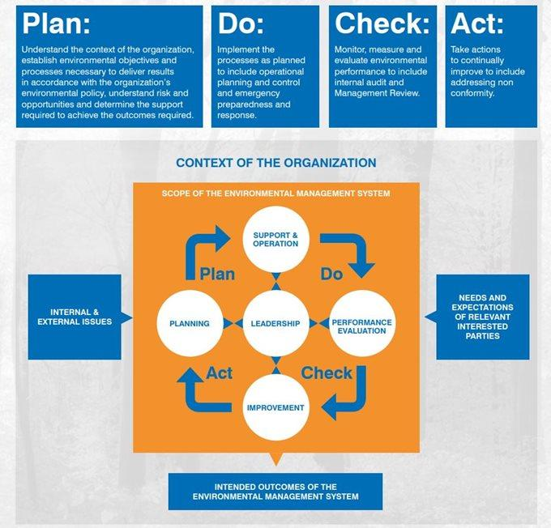

## Table of Contents

## What is ISO 14001 and what does it aim to achieve?

ISO 14001 is an international standard that helps organizations manage their environmental responsibilities. It provides a framework for companies to follow so they can reduce their impact on the environment. This standard is part of a series of standards created by the International Organization for Standardization (ISO).

The main goal of ISO 14001 is to help organizations improve their environmental performance. It does this by encouraging them to use resources more efficiently, reduce waste, and prevent pollution. By following the standard, companies can also meet legal requirements and show their customers and stakeholders that they care about the environment.

## Who can benefit from implementing ISO 14001?

Any organization, big or small, can benefit from using ISO 14001. This standard helps businesses of all types, like factories, offices, and even schools, to take better care of the environment. By following ISO 14001, companies can save money by using resources more wisely and reducing waste. This can also make their work processes more efficient.

Customers and the community can also benefit from ISO 14001. When a company follows this standard, it shows that they are serious about protecting the environment. This can make customers feel good about buying from them and can improve the company's reputation. It also helps the company meet legal requirements, which can prevent fines and other problems.

In the long run, implementing ISO 14001 can lead to better relationships with stakeholders, like investors and local communities. These groups often care about how a company affects the environment. By showing they are responsible, companies can build trust and support, which is good for business and the planet.

## What are the key components of an ISO 14001 Environmental Management System (EMS)?

The key components of an ISO 14001 Environmental Management System (EMS) include setting up an environmental policy, planning, and implementing actions to meet the policy's goals. The environmental policy is a statement that shows the company's commitment to protecting the environment. It guides the company in making decisions about how to use resources and manage waste. Planning involves figuring out what the company's environmental impacts are and setting goals to reduce those impacts. This can include things like reducing energy use, cutting down on waste, and preventing pollution. Once the plan is in place, the company takes action to meet its goals, like training employees and using new technology.

Another important part of an ISO 14001 EMS is checking and correcting the system. This means the company regularly checks to see if it is meeting its environmental goals. They do this by monitoring their progress, keeping records, and doing audits. If they find any problems, they fix them to make sure the system keeps working well. The last key component is reviewing and improving the system. The company's leaders look at the whole EMS to see if it is working and if there are ways to make it better. They might change the environmental policy, set new goals, or find new ways to reduce their impact on the environment. This helps the company keep improving and stay committed to protecting the environment.

## How does ISO 14001 integrate with other management systems like ISO 9001?

ISO 14001 and ISO 9001 can work together easily because they both follow a similar structure called the High-Level Structure (HLS). This means they use the same basic parts and terms, making it easier for a company to use both standards at the same time. For example, both standards need the company to plan what they want to achieve, do the work to meet those goals, check if they are doing well, and keep improving. By using the same steps, a company can manage their quality and environmental goals together without having to do everything twice.

When a company decides to use both ISO 14001 and ISO 9001, they can share resources and information between the two systems. This can save time and money because the company can use the same people, documents, and meetings for both standards. For example, the team that checks the quality of products can also look at how the company is doing with its environmental goals. This helps the company work better and make sure they are taking care of both quality and the environment at the same time.

## What are the steps to implement ISO 14001 in an organization?

To implement ISO 14001 in an organization, the first step is to get everyone on board. This means the company's leaders need to show that they care about the environment and want to make a plan to protect it. They should write an environmental policy that says what the company wants to achieve. After that, the company needs to look at all the ways it affects the environment, like using energy, making waste, and causing pollution. They should set goals to make these impacts smaller and come up with a plan to reach those goals. This plan might include training employees, using new technology, and changing how things are done.

Once the plan is in place, the company needs to start doing the things they said they would do. They should keep track of their progress and make sure they are meeting their environmental goals. This can be done by keeping records, doing regular checks, and having audits to see if everything is working well. If they find any problems, they should fix them quickly. Finally, the company's leaders should look at the whole environmental management system to see if it is working and if there are ways to make it better. They might need to change the environmental policy, set new goals, or find new ways to reduce their impact on the environment. This helps the company keep improving and stay committed to protecting the environment.

## What resources are needed to successfully implement ISO 14001?

To successfully implement ISO 14001, an organization needs a few key resources. First, it needs people who are committed to making the environmental management system work. This includes leaders who support the plan and employees who are trained to follow it. The company also needs time to do all the steps, like writing the environmental policy, setting goals, and checking progress. Money is another important resource because the company might need to buy new technology or hire experts to help with the plan.

In addition to people, time, and money, the organization needs good information and tools. This means they need to keep records of what they are doing and use these records to see if they are meeting their goals. They might also need software or other tools to help them track their progress and make sure they are following the plan. By having all these resources, the company can make sure their environmental management system works well and helps them take better care of the environment.

## How can an organization measure the effectiveness of its ISO 14001 EMS?

An organization can measure the effectiveness of its ISO 14001 Environmental Management System (EMS) by regularly checking if they are meeting their environmental goals. This means looking at the records they keep to see if they are using less energy, making less waste, and preventing pollution like they planned. They can also do audits, which are like check-ups, to see if everything in the EMS is working well. If they find any problems, they can fix them to make sure the system keeps improving.

Another way to measure the effectiveness of the EMS is by getting feedback from employees, customers, and other people who care about the environment. If employees are following the plan and feel like they are making a difference, that's a good sign. If customers and the community see that the company is taking care of the environment, it can also show that the EMS is working. By looking at all these things together, the organization can see if their ISO 14001 EMS is helping them reach their environmental goals.

## What are common challenges faced during ISO 14001 implementation and how can they be overcome?

One common challenge during ISO 14001 implementation is getting everyone in the organization on board. Sometimes, employees might not see the importance of the environmental management system or might not want to change how they do things. To overcome this, it's important for leaders to clearly explain why the EMS matters and how it can help the company and the environment. Training and regular communication can also help employees understand their role and feel more involved in the process.

Another challenge is having enough resources, like time and money, to set up and maintain the EMS. It can be hard to find the budget for new technology or to hire experts. To solve this, the organization can start small and focus on the most important environmental goals first. They can also look for ways to save money, like using energy more efficiently, which can help pay for the EMS over time. By planning carefully and using resources wisely, the company can make the implementation process smoother.

Lastly, keeping the EMS effective over time can be tough. It's easy for the system to become just a set of rules that people follow without really thinking about them. To prevent this, the organization should regularly check how well the EMS is working and make changes as needed. Getting feedback from employees and stakeholders can also help keep the system fresh and focused on real environmental improvements. By staying committed and flexible, the company can keep its ISO 14001 EMS strong and effective.

## What is the process for certification to ISO 14001 and what are the ongoing requirements?

To get certified to ISO 14001, a company first needs to set up an environmental management system (EMS) that follows the standard. They should write an environmental policy, figure out how their work affects the environment, set goals to reduce those effects, and make a plan to reach those goals. Once the EMS is in place, the company needs to check if it is working well by keeping records, doing audits, and fixing any problems they find. After that, they can ask a certification body to come and check their EMS. If the certification body sees that the company is following ISO 14001, they will give the company a certificate.

Once a company gets certified to ISO 14001, they need to keep the EMS working well. This means they should keep checking their progress, doing regular audits, and making changes to improve the system. The company also needs to have a review every year to make sure they are still following the standard. Every three years, they need to get recertified, which means another visit from the certification body to check the EMS again. By keeping up with these ongoing requirements, the company can stay certified and keep improving their environmental performance.

## How does ISO 14001 evolve with changes in environmental regulations and standards?

ISO 14001 is designed to help companies keep up with changes in environmental laws and standards. It does this by making sure companies always check their environmental impact and follow the latest rules. When laws change, companies using ISO 14001 need to update their environmental management system (EMS) to match the new rules. This means they might have to change their goals or how they do things to make sure they are still following the law.

The standard itself also gets updated sometimes to reflect new ideas about protecting the environment. For example, if there are new ways to save energy or reduce waste, the standard might change to include these new methods. When ISO 14001 is updated, companies need to look at their EMS and make any changes needed to meet the new version of the standard. This helps companies stay ahead of environmental changes and keep their EMS working well.

## What are advanced strategies for optimizing an ISO 14001 EMS?

One advanced strategy for optimizing an ISO 14001 Environmental Management System (EMS) is to use technology to make things easier. Companies can use software to keep track of how they are doing with their environmental goals. This can help them see where they are doing well and where they need to improve. They can also use tools like sensors to watch how much energy they are using or how much waste they are making. By using technology, companies can make their EMS work better and find new ways to save resources and protect the environment.

Another strategy is to work with other companies and groups that care about the environment. By sharing ideas and learning from each other, companies can find new ways to make their EMS better. They might join groups that focus on environmental issues or work with suppliers and customers to set common goals. This can help them do more to protect the environment than they could do alone. By working together, companies can keep improving their EMS and make a bigger difference for the planet.

## How can ISO 14001 contribute to broader sustainability and corporate social responsibility goals?

ISO 14001 can help companies reach bigger goals for sustainability and being good to society. By following the standard, companies can use resources better, make less waste, and stop pollution. This helps them take care of the environment, which is a big part of being sustainable. When a company shows it cares about the environment, it can also make people trust them more. This can help the company do well in the long run and be seen as a good member of the community.

ISO 14001 also helps companies meet their corporate social responsibility goals. This means they can show they are doing the right thing for the environment, which is important to many people, like customers, employees, and the community. By having a good environmental management system, companies can also follow the law and avoid problems. This makes it easier for them to focus on other ways to be responsible, like treating employees well and helping the community. In the end, ISO 14001 helps companies be good to the planet and to people, which is what sustainability and corporate social responsibility are all about.

## References & Further Reading

[1]: Staples, D. N., Dalrymple, J. F., & Greenfield, P. F. (2003). ["Sustainability in the Finance Sector: The Case for Environmental Management Systems."](https://www.academia.edu/27428592/Assessing_call_centre_quality_using_the_SERVQUAL_model) International Journal of Environmental Technology and Management.

[2]: International Organization for Standardization (ISO). ["ISO 14001: Environmental Management Systems."](https://www.iso.org/standard/60857.html) 

[3]: Houghton, A., & Hussain, S. (2016). ["Energy Efficiency Improvements in Financial Services."](https://link.springer.com/article/10.1007/s11356-021-16560-0) Energy Policy, 96, 124-133.

[4]: Deloitte. (2018). ["Sustainable Banking: The Banker's Guide to ISO 14001."](https://www2.deloitte.com/content/dam/Deloitte/global/Documents/Financial-Services/gx-fsi-dcfs-2018-banking-outlook.pdf) 

[5]: Epstein, M. J., & Buhovac, A. R. (2014). ["Making Sustainability Work: Best Practices in Managing and Measuring Corporate Social, Environmental, and Economic Impacts."](https://www.taylorfrancis.com/books/mono/10.4324/9781351276443/making-sustainability-work-marc-epstein-adriana-rejc-buhovac-john-elkington-herman-dutch-leonard) Berrett-Koehler Publishers.

[6]: PricewaterhouseCoopers (PwC). ["Sustainability and Climate Change: ISO 14001 and Green Assurance."](https://www.pwc.com/us/en/about-us/corporate-responsibility/environment.html) 

[7]: Brorson, T., & Larsson, G. (2006). ["Environmental Management: How to Implement an Environmental Management System within a Company or other Organisation."](https://en.wikipedia.org/wiki/ISO_14000_family) 

[8]: Goyal, A., & Muthukumar, S. (2012). ["High-frequency Trading with Efficient Order Placement."](https://www.sciencedirect.com/science/article/pii/S1386418113000268) IEEE.

[9]: Kingsman, B., & Cannarsa, P. (2013). ["Green Investing: Aligning Sustainability and Profitability."](https://www.sciencedirect.com/science/article/pii/S2950524024000039) Springer Science & Business Media.