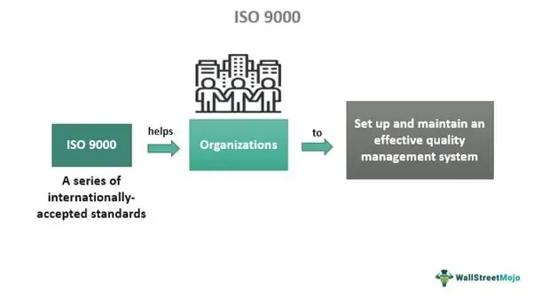

The intersection of environmental management and algorithmic trading has become increasingly significant with the growing imperative for sustainable business practices. Algorithmic trading, which relies heavily on computational capability and efficient data processing, often demands substantial energy resources. As global awareness regarding environmental sustainability intensifies, even industries driven by advanced technology, such as algorithmic trading, must consider their environmental impact.

ISO 14001 is positioned as a strategic asset, offering a structured framework that not only guides organizations towards greater environmental responsibility but also aligns with the efficiency demands intrinsic to algorithmic trading. As a globally recognized standard for environmental management systems (EMS), ISO 14001 aids organizations in enhancing their environmental performance through best practices aimed at preventing detrimental environmental impacts.

This article examines the implications of ISO 14001 certification on firms within the algorithmic trading domain, elucidating the reasons it is a prudent and advantageous pursuit. By embracing ISO 14001, trading firms can achieve a dual objective: maintaining operational efficiency while ensuring environmental sustainability.

## Table of Contents

## Understanding ISO 14001

ISO 14001 is an internationally acclaimed standard that provides a framework for the development and implementation of an Environmental Management System (EMS). Its primary objective is to support organizations in enhancing their environmental performance through more efficient use of resources and reduction of waste. The standard is rooted in the Plan-Do-Check-Act (PDCA) model that promotes continuous improvement, an approach widely adopted across various sectors for operational efficiency and effectiveness.

The standard requires organizations to establish an EMS that addresses their unique environmental impacts. This involves identifying potential areas of impact, setting objectives and targets for improvement, and implementing policies and procedures to achieve these goals. For instance, businesses are encouraged to adopt strategies such as pollution prevention, waste minimization, energy conservation, and the reduction of carbon emissions. ISO 14001 emphasizes the importance of compliance with applicable environmental laws and regulations, which can vary significantly across different jurisdictions.

One of the key strengths of ISO 14001 is its flexibility. It is designed to be applicable to organizations of all sizes and sectors, allowing customization to cater to specific environmental challenges and business contexts. This adaptability has led to its widespread adoption, with thousands of certifications issued globally, signifying its acceptance across diverse industries from manufacturing and services to high-tech sectors.

Furthermore, ISO 14001 enhances an organization's reputation by demonstrating a commitment to sustainability. In an era where corporate responsibility is increasingly scrutinized, having an ISO 14001 certification signifies that a company is actively managing its environmental impact. This aligns with the expectations of stakeholders, including customers, investors, and regulatory bodies, who are progressively valuing sustainable practices.

By providing a structured approach to environmental management, ISO 14001 fosters accountability within organizations, driving teams to reflect on their environmental responsibilities and innovate for sustainability. This comprehensive system not only aids in mitigating environmental risks but also unlocks opportunities for cost savings and efficiency gains, thereby supporting a sustainable business model.

## The Role of ISO 14001 in Algorithmic Trading Firms

Algorithmic trading firms rely heavily on sophisticated algorithms and high-frequency data analysis, necessitating substantial computational resources. This dependency translates to significant energy consumption and resource utilization within their operational frameworks. Integrating ISO 14001, an internationally recognized standard for environmental management systems, offers a strategic pathway to address and potentially reduce this environmental footprint.

Implementing ISO 14001 within these firms facilitates the identification and application of energy optimization practices. For instance, server efficiency can be improved by employing techniques such as dynamic voltage scaling and load balancing. These strategies help in reducing the energy consumption of data centers, which are crucial components of [algorithmic trading](/wiki/algorithmic-trading) operations. Moreover, ISO 14001's emphasis on continuous improvement encourages regular audits and assessments that can uncover further opportunities to minimize waste and enhance resource efficiency, thus contributing to significant operational sustainability.

Furthermore, achieving ISO 14001 certification holds substantial reputational benefits for algorithmic trading firms. In the fast-evolving landscape of high-tech finance, a demonstrated commitment to sustainability differentiates firms as socially responsible entities. This is crucial in attracting environmentally conscious investors and partners who prioritize environmental, social, and governance ([ESG](/wiki/esg-investing)) criteria in their decisions.

The certification serves as a testament to a firm’s commitment to integrating environmental responsibility into its business strategy. In a sector often scrutinized for its intensive resource utilization, ISO 14001-certified firms signal their proactive steps towards reducing environmental impacts, thus enhancing their credibility and market positioning. Additionally, aligning environmental goals with operational strategies positions these firms favorably amidst increasing regulatory demands and societal pressure for sustainability across industries.

## Benefits of ISO 14001 Certification for Algo Trading

ISO 14001 certification presents several advantages for algorithmic trading firms beyond mere regulatory compliance, promoting a blend of economic and environmental benefits.

Firstly, ISO 14001 can significantly reduce operational costs through enhanced efficiency and waste minimization efforts. Algorithmic trading operations rely heavily on computational resources, leading to substantial energy consumption. By implementing ISO 14001, firms can optimize energy usage, resulting in cost savings. This could be achieved through more efficient server configurations or energy-efficient cooling systems. For example, reducing energy consumption by just 10% in large-scale trading operations could translate to significant reductions in operational expenses.

Moreover, ISO 14001 certification can provide algorithmic trading firms with a competitive advantage. In today's market, there is a growing emphasis on sustainability and environmental responsibility. Stakeholders, particularly investors, are increasingly drawn to companies that demonstrate a commitment to sustainable practices. Algorithmic trading firms with ISO 14001 certification signal to potential investors that they prioritize environmental responsibility, thereby enhancing their market position and attractiveness.

Additionally, ISO 14001 certification can improve employee morale by aligning the company's values with principles of environmental stewardship. Employees are often more motivated and engaged when they work for an organization whose values resonate with their own. By fostering a culture that values sustainability, firms can not only attract talent but also retain employees who are keen to contribute to environmentally conscious initiatives. This alignment can lead to a more dedicated and productive workforce, as employees take pride in contributing to a company's sustainable objectives.

Ultimately, ISO 14001 drives algorithmic trading firms towards integrating environmental and economic goals, ensuring long-term viability and resilience in a progressively eco-conscious market landscape.

## Steps to Implement ISO 14001 in Algorithmic Trading

To implement ISO 14001 in algorithmic trading firms, the first step involves performing a gap analysis. This process helps identify the current environmental practices within the organization and pinpoints areas needing improvement. The gap analysis acts as a foundation for understanding how existing operations align with the requirements of ISO 14001.

Once the gap analysis is complete, the development of a clear environmental policy is essential. This policy should set forth the organization's commitment to environmental management and outline realistic objectives and targets that adhere to the ISO 14001 standard. The objectives may include reducing energy consumption, minimizing waste, or optimizing resource utilization. These targets should be measurable and achievable, providing a clear direction for the firm's environmental initiatives.

The implementation of the ISO 14001 environmental management system (EMS) follows the Plan-Do-Check-Act (PDCA) cycle, which is integral to achieving continuous improvement. 

1. **Plan**: This phase involves establishing objectives and processes necessary to achieve results in accordance with the environmental policy. For example, firms can plan to optimize their data center operations to reduce their energy footprint. Specific goals might include reducing electricity use by a certain percentage or switching to renewable energy sources.

2. **Do**: In this phase, the established plan is implemented. For algorithmic trading firms, this might involve upgrading servers to more energy-efficient models or implementing software solutions to optimize algorithm efficiency, thereby reducing unnecessary computational tasks.

3. **Check**: Monitoring and measuring processes against environmental policies, objectives, targets, and legal requirements occur in this phase. For example, firms can use software tools to monitor energy usage patterns in real-time, thereby ensuring compliance with both ISO 14001 and national regulations. Deviations from the targeted objectives should be identified and documented.

4. **Act**: This step involves taking actions to continually improve performance. Based on the monitoring data, firms can make informed decisions to further enhance their environmental strategies. Adjustments could include refining algorithms to reduce processing requirements or investing in sustainable technologies that further reduce the ecological footprint.

Algorithmic trading firms benefit from systematic approaches like the PDCA cycle, as it fosters a culture of continuous improvement and environmental responsibility. By integrating these steps, firms not only work towards ISO 14001 certification but also contribute to sustainable business practices that align with modern economic and environmental expectations.

## Embracing Sustainability in Trading Operations

The integration of ISO 14001 into trading operations represents a strategic move towards sustainable trading practices. This standard provides an effective framework for firms to reduce their environmental impact, which is becoming increasingly important as both consumers and investors prioritize sustainability. Algorithmic trading operations, characterized by high energy consumption due to extensive usage of computational resources and data centers, stand to benefit significantly from this integration. By optimizing energy use and resource management in line with ISO 14001 guidelines, these firms can dramatically curtail their environmental footprints.

Sustainable trading practices also align with evolving trends in green finance and sustainable investing. As the financial sector increasingly values environmental responsibility, firms with robust sustainability practices gain a competitive advantage. ISO 14001 certification can transform environmentally sound operations into a unique value proposition by demonstrating a firm's commitment to sustainability. This not only meets current market demands but also attracts eco-conscious investors and stakeholders looking for reliable partners in the shift toward sustainable economies.

Moreover, the adoption of ISO 14001 prepares firms for future regulatory and market shifts towards more sustainable standards. As global policies tighten around carbon emissions and resource management, trading firms with established EMS under ISO 14001 are likely to see a smoother transition. The proactive embrace of these standards ensures business resilience in the face of potential regulatory changes, thereby mitigating risks associated with non-compliance.

Consequently, ISO 14001 offers algorithmic trading firms a strategic path towards sustainability. It ensures that trading operations are not only efficient but also ethically and environmentally responsible, ready to meet the challenges and seize the opportunities of an increasingly green market landscape.

## Conclusion

ISO 14001 certification is a valuable asset for algorithmic trading firms, fostering sustainable practices and enhancing overall business performance. This environmental management standard provides a framework for integrating environmental goals with business objectives, allowing firms to achieve financial success while minimizing their environmental impact. By implementing ISO 14001, trading firms not only meet regulatory requirements but also position themselves favorably in a market where environmental accountability is increasingly crucial.

The alignment of business objectives with environmental responsibilities ensures that algorithmic trading firms are prepared for a future where sustainable practices are expected and often required. As stakeholders, including investors and consumers, demand greater transparency and environmental responsibility, firms that adopt ISO 14001 can distinguish themselves as frontrunners in the evolving financial landscape. Such positioning enhances their reputation and appeal in a competitive industry, contributing to long-term business viability.

Moreover, ISO 14001 certification can serve as a catalyst for continuous improvement in algorithmic trading operations. By embedding sustainability into their core operations, firms can innovate and optimize processes, leading to cost savings and resource efficiencies. This proactive approach to environmental management not only meets current market demands but also anticipates future trends in sustainable finance and regulatory developments. Consequently, ISO 14001 acts as both a strategic tool and a competitive advantage, enabling algorithmic trading firms to lead in the transition toward a more sustainable economy.

## References & Further Reading

[1]: Staples, D. N., Dalrymple, J. F., & Greenfield, P. F. (2003). ["Sustainability in the Finance Sector: The Case for Environmental Management Systems."](https://www.academia.edu/27428592/Assessing_call_centre_quality_using_the_SERVQUAL_model) International Journal of Environmental Technology and Management.

[2]: International Organization for Standardization (ISO). ["ISO 14001: Environmental Management Systems."](https://www.iso.org/standard/60857.html) 

[3]: Houghton, A., & Hussain, S. (2016). ["Energy Efficiency Improvements in Financial Services."](https://link.springer.com/article/10.1007/s11356-021-16560-0) Energy Policy, 96, 124-133.

[4]: Deloitte. (2018). ["Sustainable Banking: The Banker's Guide to ISO 14001."](https://www2.deloitte.com/content/dam/Deloitte/global/Documents/Financial-Services/gx-fsi-dcfs-2018-banking-outlook.pdf) 

[5]: Epstein, M. J., & Buhovac, A. R. (2014). ["Making Sustainability Work: Best Practices in Managing and Measuring Corporate Social, Environmental, and Economic Impacts."](https://www.taylorfrancis.com/books/mono/10.4324/9781351276443/making-sustainability-work-marc-epstein-adriana-rejc-buhovac-john-elkington-herman-dutch-leonard) Berrett-Koehler Publishers.

[6]: PricewaterhouseCoopers (PwC). ["Sustainability and Climate Change: ISO 14001 and Green Assurance."](https://www.pwc.com/us/en/about-us/corporate-responsibility/environment.html) 

[7]: Brorson, T., & Larsson, G. (2006). ["Environmental Management: How to Implement an Environmental Management System within a Company or other Organisation."](https://en.wikipedia.org/wiki/ISO_14000_family) 

[8]: Goyal, A., & Muthukumar, S. (2012). ["High-frequency Trading with Efficient Order Placement."](https://www.sciencedirect.com/science/article/pii/S1386418113000268) IEEE.

[9]: Kingsman, B., & Cannarsa, P. (2013). ["Green Investing: Aligning Sustainability and Profitability."](https://www.sciencedirect.com/science/article/pii/S2950524024000039) Springer Science & Business Media.