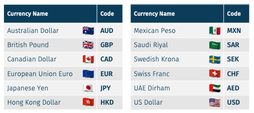

## Table of Contents

## What is an ISO currency code?

An ISO currency code is a short way to show what kind of money a country uses. It uses three letters to stand for the money. For example, USD means United States Dollar, and EUR means Euro. These codes help people all over the world understand and use different kinds of money easily.

The codes are made by a group called the International Organization for Standardization, or ISO for short. They make sure that everyone uses the same codes, so there is no confusion. This is very helpful for businesses and banks that work with money from different countries.

## Why are ISO currency codes important?

ISO currency codes are important because they help people understand which money is being talked about no matter where they are in the world. For example, if someone sees "USD" on a price tag, they know it means United States Dollars. This is helpful because it makes it easier for people from different countries to do business together. Without these codes, it would be confusing to know if a price is in dollars, euros, or another type of money.

These codes also make things simpler for banks and businesses that work with money from many countries. When everyone uses the same three-letter codes, it's easier to keep track of money and make sure everything is correct. This helps avoid mistakes and makes international trade and finance run smoothly. So, ISO currency codes are a key part of making the world's money system work well together.

## How are ISO currency codes structured?

ISO currency codes are made up of three letters. Each code stands for a different type of money from a country or group of countries. For example, "USD" stands for United States Dollar, and "EUR" stands for Euro. The codes are always written with capital letters and never have any spaces or symbols in them.

The first two letters of the code usually come from the name of the country or area where the money is used. For example, in "USD," the "US" comes from "United States." The last letter often comes from the name of the money itself. In "USD," the "D" comes from "Dollar." But sometimes, the last letter might not match the money's name exactly, because the codes need to be unique and easy to understand for everyone around the world.

## What is the difference between ISO 4217 and other currency code standards?

ISO 4217 is a special set of rules made by the International Organization for Standardization (ISO) for naming different kinds of money around the world. It uses three letters to make a code for each type of money, like "USD" for United States Dollar and "EUR" for Euro. This way, everyone knows which money is being talked about, no matter where they are. ISO 4217 is the most used standard for currency codes because it's easy to understand and helps avoid confusion in international trade and finance.

Other currency code standards might use different ways to name money. For example, some countries might use their own codes or symbols that are only understood locally. These other standards can be confusing when people from different countries need to work together. ISO 4217 is different because it's a worldwide standard that everyone agrees on, making it easier for banks, businesses, and people to handle money from different places without mistakes.

## Can you list the ISO currency codes for the top 5 economies in the world?

The top 5 economies in the world are the United States, China, Japan, Germany, and India. The ISO currency code for the United States is USD, which stands for United States Dollar. China uses CNY, known as the Chinese Yuan. Japan's currency is the Japanese Yen, and its code is JPY. Germany uses the Euro, with the code EUR, because it is part of the European Union. India's currency is the Indian Rupee, and its code is INR.

These codes help people from different countries understand and use money easily. For example, if someone sees USD on a price tag, they know it means United States Dollar. This makes it easier for businesses and banks to work with money from different countries without getting confused.

## How often are ISO currency codes updated?

ISO currency codes are updated whenever there are changes in the world's money systems. This can happen when a country decides to use a new kind of money or when a new country starts using its own money. The group that makes these codes, called the International Organization for Standardization (ISO), keeps an eye on these changes and updates the codes to make sure they are correct and useful for everyone.

These updates do not happen on a set schedule because they depend on when changes happen in different countries. It could be once a year or even more often if there are big changes in the world's money systems. The ISO makes sure that everyone knows about the new codes so that businesses and banks can keep using them without any problems.

## What process is followed to assign a new ISO currency code?

When a country wants to use a new kind of money, they need a new ISO currency code. The first step is for the country to tell the International Organization for Standardization (ISO) about their new money. The ISO then checks to make sure the new money is real and will be used in the country. They also make sure the new code will not be confused with other codes.

After checking everything, the ISO picks three letters to make the new code. These letters usually come from the name of the country and the name of the money. The ISO makes sure the new code is unique and easy to understand. Once they have the new code, they tell everyone about it so that banks, businesses, and people can start using it. This way, everyone knows what the new money is called and can use it without any confusion.

## How do ISO currency codes impact international trade and finance?

ISO currency codes make international trade and finance easier and less confusing. When people from different countries do business, they need to know what kind of money they are using. ISO codes, like USD for United States Dollar or EUR for Euro, help everyone understand which money is being talked about. This is very important for businesses and banks that work with money from many countries. Without these codes, it would be hard to know if a price is in dollars, euros, or another type of money, and this could lead to mistakes and problems.

These codes also help make sure that money transactions are done correctly and smoothly. When everyone uses the same three-letter codes, it's easier to keep track of money and make sure everything is right. This helps avoid mistakes and makes international trade and finance run well. So, ISO currency codes are a big part of making the world's money system work together easily and without confusion.

## What are some common mistakes to avoid when using ISO currency codes?

When using ISO currency codes, a common mistake is mixing up similar codes. For example, "USD" is for United States Dollar, but "CAD" is for Canadian Dollar. If you mix these up, you could end up using the wrong money. Another mistake is not using capital letters. ISO codes always need to be in capital letters, like "EUR" for Euro, not "eur." If you use lowercase letters, it might not be clear what money you are talking about.

Another mistake to avoid is adding extra spaces or symbols to the code. ISO codes should be just three letters, like "JPY" for Japanese Yen. Adding spaces or symbols can make it hard for others to understand which money you mean. Also, make sure you are using the right code for the right country. Sometimes, countries might change their money, so it's important to check the latest codes to avoid using old ones. By being careful with these details, you can use ISO currency codes correctly and avoid confusion in international trade and finance.

## How do ISO currency codes integrate with financial software and systems?

ISO currency codes are very important for financial software and systems because they help keep everything clear and correct. When banks and businesses use these codes in their computers, it makes it easier to handle money from different countries. For example, if a bank is moving money from the United States to Japan, the software will use "USD" for United States Dollar and "JPY" for Japanese Yen. This way, everyone knows which money is being used, and the computer can do the right calculations and keep track of everything without mistakes.

These codes are built into financial systems in a way that makes them work smoothly. When someone enters a price or makes a payment, the software checks the ISO code to know which money to use. This helps avoid confusion and makes sure that all the numbers are right. For example, if someone wants to buy something that costs 100 USD, the software will know to use United States Dollars and not mix it up with another kind of money. This is really helpful for businesses that work with money from many different countries, because it makes everything easier and less likely to go wrong.

## What are the historical changes to ISO currency codes for major countries?

Over the years, ISO currency codes have changed as countries have changed their money. For example, in 1999, many countries in Europe started using the Euro instead of their old money. Before that, Germany used the Deutsche Mark, which had the code "DEM." When they switched to the Euro, the code changed to "EUR." This was a big change because many countries started using the same money, and it made things simpler for people and businesses in Europe.

Another big change happened in 2009 when Zimbabwe stopped using the Zimbabwean Dollar, which had the code "ZWD." They started using other countries' money like the US Dollar and the South African Rand instead. Later, in 2019, Zimbabwe brought back their own money but called it the Zimbabwean RTGS Dollar, with the new code "ZWL." These changes show how ISO codes need to be updated when countries decide to use new kinds of money or go back to using their old money.

## What future trends might affect the use and development of ISO currency codes?

In the future, the way we use money might change a lot because of new technology. More countries might start using digital money, like cryptocurrencies. If this happens, the people who make ISO currency codes might need to make new codes for these digital kinds of money. They will have to make sure these new codes work well with the old ones so that everyone can still understand and use them easily. This could mean more updates to the ISO codes to keep up with all the new types of money that might come along.

Another thing that could change ISO currency codes is if more countries decide to use the same money, like how many European countries use the Euro. If big groups of countries start using one kind of money, it might mean fewer codes are needed. But it also means the codes that are used will be very important because they will be used by a lot of people. The people who make the codes will need to keep them simple and clear so that everyone can use them without getting confused, no matter how the world's money systems change.

## What is the impact of ISO Currency Codes on Forex Markets?

ISO currency codes are essential components of the foreign exchange ([forex](/wiki/forex-system)) market, a decentralized global market where currencies are traded. These standardized three-letter codes, established by the International Organization for Standardization (ISO), provide a universally recognized system for identifying each currency, thereby facilitating the swift and accurate exchange of currency pairs.

In the forex market, currency trading occurs in pairs, known as currency pairings. Each pairing consists of a base currency and a quote currency, with transactions indicating how much of the quote currency is needed to purchase one unit of the base currency. ISO codes are integral to this process, as they clearly and unambiguously define the currencies in each pairing. A popular example is the EUR/USD pair, where EUR represents the Euro, and USD represents the United States Dollar. This pairing illustrates how many U.S. dollars are required to purchase one Euro.

These codes also play a crucial role in calculating cross rates, which involve determining the exchange rate between two currencies indirectly through a third currency, often the U.S. dollar. For instance, if a trader wants to find the exchange rate between the Euro (EUR) and the Japanese Yen (JPY), with known rates for EUR/USD and USD/JPY, the cross rate can be computed using the formula:

$$
\text{Cross Rate (EUR/JPY)} = \frac{\text{Exchange Rate (EUR/USD)}}{\text{Exchange Rate (USD/JPY)}}
$$

Using ISO codes ensures clarity and precision during these calculations, reducing the risk of errors that may arise during currency conversions.

Traders often use ISO currency codes to interpret and navigate the forex market, leveraging these codes to assess real-time currency valuations and to strategize their trades. The uniformity provided by ISO codes allows traders to streamline their operations, access accurate data efficiently, and execute trades based on reliable information across different trading platforms. Therefore, the adoption and utilization of ISO currency codes remain crucial for maintaining operational integrity and facilitating international monetary exchanges within the forex industry.

## References & Further Reading

[1]: ["ISO 4217: Currency codes"](https://www.iban.com/currency-codes) - International Organization for Standardization.

[2]: ["Foreign Exchange Markets"](https://www.investopedia.com/terms/forex/f/foreign-exchange-markets.asp) - Bank for International Settlements. 

[3]: Frankel, J. A., & Froot, K. A. (1990). "Chartists, Fundamentalists, and Trading in the Foreign Exchange Market." *The American Economic Review*, 80(2), 181-185.

[4]: ["Algorithmic Trading: Winning Strategies and Their Rationale"](https://onlinelibrary.wiley.com/doi/pdf/10.1002/9781118676998.fmatter) by Ernie Chan

[5]: Lyons, R. K. (2001). "The Microstructure Approach to Exchange Rates." *MIT Press*.