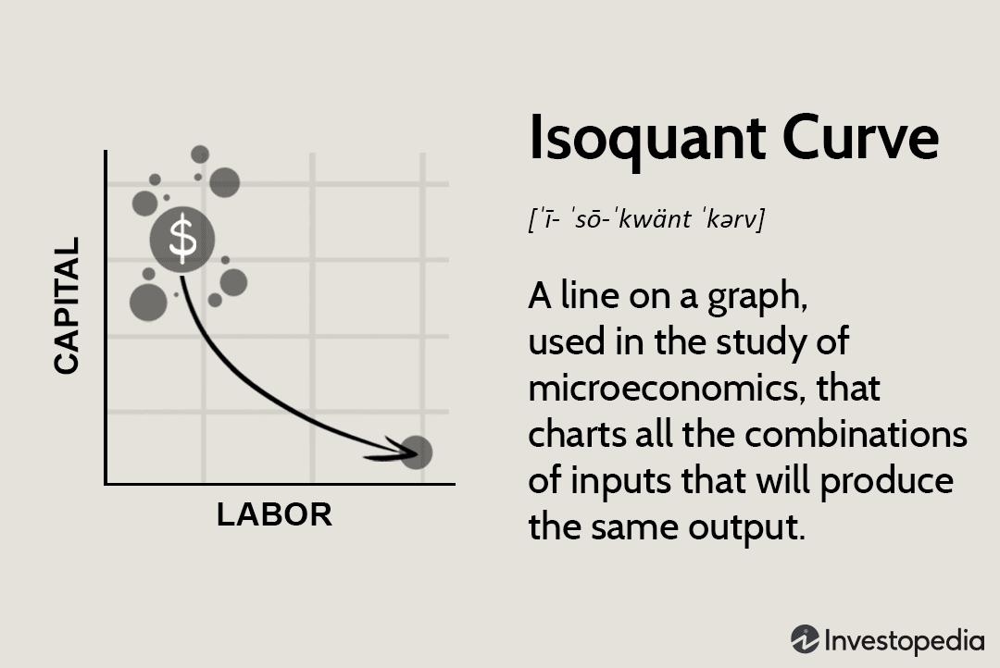

In the evolving landscape of economics and finance, understanding production theory and its applications in modern technology like algorithmic trading is crucial. Production theory, a core concept in economics, examines how inputs are transformed into outputs, providing frameworks that are essential for optimizing resource allocation and enhancing productivity. One of the central elements of production theory is the isoquant curve, which represents all combinations of inputs, such as capital and labor, capable of producing a specific level of output. 

The isoquant curve is pivotal because it offers insights into how firms can maximize efficiency while minimizing costs. By analyzing the trade-offs between different input combinations, businesses can achieve optimal output levels without unnecessary expenditure. These principles are not limited to traditional manufacturing or service sectors but extend to technological advances like algorithmic trading. 



Algorithmic trading involves using automated systems to execute trades based on pre-defined criteria, and it heavily relies on mathematical models and computational algorithms. Understanding the economics behind production processes can significantly enhance these trading models. For instance, the isoquant curve can assist in optimizing the usage of computational resources and data feeds, balancing them to maximize the efficiency of algorithms while ensuring accuracy and speed are maintained.

The integration of economic principles, such as those derived from the isoquant curve, with technological solutions in algorithmic trading facilitates optimized trading operations and improved decision-making processes. This alignment offers potential benefits, including increased efficiency, cost savings, and enhanced strategic advantage in competitive financial markets. As we explore the significance of the isoquant curve in production theory and its impact on algorithmic trading strategies, it becomes apparent that economic theory can be effectively synthesized with cutting-edge trading techniques to innovate and improve outcomes in the financial industry. 

This article aims to provide insights into this intersection, illustrating how the application of production theory to algorithmic trading not only helps in understanding the optimal use of inputs but also paves the way for the future development of more robust and adaptive trading systems.

## Table of Contents

## Understanding the Isoquant Curve

The isoquant curve occupies a central role in production theory by illustrating various input combinations, like capital and labor, that yield identical levels of output. This curve enables businesses to optimize resource allocation, ensuring a balance between maximizing productivity and minimizing costs. Understanding the characteristics of the isoquant curve is crucial for analyzing production efficiency and making informed decisions regarding resource trade-offs.

An isoquant curve's downward slope signifies that as you increase one input, you need to reduce the other to maintain the same level of output. This relationship is crucial because it reflects the concept of input substitutability. For instance, if more capital is utilized in production, less labor may be required to maintain the same output level, assuming capital can substitute labor to a certain extent.

The characteristic of being convex to the origin is attributed to diminishing marginal rates of technical substitution (MRTS). This principle indicates that as a producer substitutes capital for labor, the amount of capital needed to replace one unit of labor increases. Mathematically, the MRTS is defined as the negative slope of the isoquant:

$$

\text{MRTS} = -\frac{\Delta K}{\Delta L} 
$$

where $\Delta K$ represents the change in capital, and $\Delta L$ represents the change in labor. The convexity of the isoquant arises because the MRTS diminishes as more capital is substituted for labor, illustrating the decreasing ease of substituting one input for another as you move along the curve.

These characteristics render the isoquant curve a valuable analytical tool for examining production efficiency. By focusing on how inputs can be traded off while keeping output constant, businesses can determine the most efficient combinations of inputs. This insight is crucial for strategizing around cost structures, determining investment allocations between capital and labor, and ensuring optimal operational efficiency.

By leveraging the isoquant curve, firms can make strategic decisions that align with economic objectives, such as producing at minimum cost for a given level of output. This approach ensures that resource utilization is efficient, sustainable, and aligned with business goals. Understanding and applying the principles of the isoquant curve can thus significantly impact a firm's ability to compete effectively in modern economic environments.

## Isoquant Curve and Production Efficiency

The isoquant curve is a pivotal tool in assessing production efficiency as it guides firms in identifying the most cost-effective input mixture for achieving a specific output level. By analyzing the interactions and trade-offs between inputs like capital and labor, companies can streamline operations to minimize wastage and enhance productivity. This approach is grounded in the premise that different combinations of inputs can yield the same output, allowing businesses to choose the most efficient, cost-effective option.

Key to this analysis is understanding the marginal rate of technical substitution (MRTS), which quantifies the rate at which one input can be substituted for another while maintaining the same level of output. Mathematically, this can be expressed as:

$$
MRTS_{KL} = -\frac{dK}{dL} = \frac{MP_L}{MP_K}
$$

where $K$ and $L$ represent capital and labor inputs, respectively, and $MP_L$ and $MP_K$ are their marginal products.

By evaluating MRTS, firms can determine the proportionate change in input quantities that maintains output levels, aiding in the resource allocation process. For example, if labor is relatively expensive compared to capital, a firm might substitute labor with capital to achieve cost savings without sacrificing output.

This process not only supports operational efficiency but also informs strategic decisions about investment in technology versus human resources. As technology automates more labor-intensive tasks, businesses can reallocate resources towards capital investments or re-skill labor to align with new technological advancements. Ultimately, understanding and leveraging isoquant curves enables firms to adapt to changing resource prices, input availability, and technological advancements, ensuring sustained competitiveness and growth.

## Applications of Isoquant Curves in Managerial Decision-Making

Isoquant analysis is a powerful tool for managerial decision-making, providing critical insights into optimizing production processes. By exploring the various combinations of inputs that can achieve a certain level of output, managers can identify efficient substitution possibilities between capital and labor, aiding in strategic resource allocation. This process not only helps in maintaining productivity but also in aligning production techniques with cost objectives and resource availability, ultimately seeking to minimize costs while maximizing output.

For instance, managers can use isoquant analysis to evaluate when it might be economically viable to substitute labor with machinery. By examining the marginal rate of technical substitution (MRTS), which is the rate at which one input can be reduced per additional unit of another input while maintaining the same level of output, managers can determine optimal input combinations. If the MRTS of labor for capital is high, it may be advantageous to invest in automation technologies, reducing dependency on labor without sacrificing output efficiency.

Moreover, isoquant analysis aids in technology enhancements by enabling managers to assess the potential impact of new machinery or technological investments on production efficacy. By plotting isoquants, managers can visualize how new technology shifts production possibilities, represented by a move to a higher isoquant, reflecting increased output for the same level of input. This aids in justifying capital expenditures and supports decisions related to scaling productions or entering new markets.

In terms of hiring practices, understanding isoquants can inform managers about the potential effects of changes in labor variables. For example, when wage rates rise, an isoquant analysis might suggest reducing labor input in favor of capital-intensive processes, thereby maintaining or increasing production levels cost-effectively.

Python can be employed to simulate isoquant curves and analyze production possibilities. For instance, using Python's data visualization libraries like Matplotlib, managers can create visual models to interpret isoquant data:

```python
import numpy as np
import matplotlib.pyplot as plt

# Define the production function
def production_function(K, L):
    return K**0.5 * L**0.5

# Generate combinations of capital (K) and labor (L)
K = np.linspace(1, 10, 100)
L = np.linspace(1, 10, 100)
K, L = np.meshgrid(K, L)
Z = production_function(K, L)

# Plot isoquant curve
plt.contour(K, L, Z, levels=[1.0, 1.5, 2.0, 2.5], cmap='RdYlBu')
plt.title('Isoquant Curves')
plt.xlabel('Capital (K)')
plt.ylabel('Labor (L)')
plt.show()
```

This type of analysis equips managers with data-driven insights, facilitating informed decisions regarding production optimization, investment in technology, and strategic hiring. By leveraging these economic concepts, firms can build production strategies that enhance efficiency and competitiveness in rapidly changing markets.

## Intersection of Isoquant Curves and Algorithmic Trading

Algorithmic trading relies on sophisticated mathematical models to make real-time trading decisions, and integrating principles from production theory can significantly enhance these models' efficiency. Specifically, applying isoquant-like analysis can optimize various input factors such as data feeds and computational resources. These inputs, when finely tuned, allow the effective generation of trading signals, which are the outputs of interest in this context.

At the core of this integration is the concept of identifying the least-cost combination of inputs required to produce a specific output level. In [algorithmic trading](/wiki/algorithmic-trading), this involves determining the optimal settings and resources necessary for maximizing trading performance, such as balancing the frequency and [volume](/wiki/volume-trading-strategy) of data inputs with computing power and time constraints. By treating trading operations as a production process, similar to a manufacturing system that produces physical goods, one can draw parallels in optimizing resource allocation and operational efficiency.

For algorithm developers, one practical approach is to use optimization techniques that resemble the isoquant curve analysis. For instance, consider a scenario in which the trading algorithm must decide on the optimal combination of data feed frequency (let's denote it as $x$) and computational power ($y$) to maximize the accuracy and speed of trading signals. The trade-offs between $x$ and $y$ can be illustrated as a curve on a graph where each point on the curve represents combinations of $x$ and $y$ that achieve identical levels of output—or trading efficiency.

In such an optimization problem, the goal would be to minimize costs, which can be expressed through a budget constraint $C = x \cdot c_x + y \cdot c_y$, where $c_x$ and $c_y$ are the costs associated with the data feed frequency and computational power, respectively. Using methodologies like linear programming or [machine learning](/wiki/machine-learning) algorithms to find optimal points on the isoquant curve enables developers to identify the most cost-effective inputs without compromising output quality.

Moreover, integrating these principles aids in achieving a balance among critical factors such as speed, accuracy, and cost, which are essential for profitable trading operations. Speed ensures timely responses to market changes, accuracy leads to high-quality trading decisions, and cost-effectiveness warrants sustainable operations. The use of isoquant-based analysis in the development of trading algorithms provides financial institutions with a competitive edge by refining their resource management strategies. As the financial markets continue to evolve, this interdisciplinary approach is likely to see increased application, driving further innovation in trading technologies.

## Benefits and Challenges of Integrating Economic Theory with Algo Trading

Integrating the principles of isoquant theory into algorithmic trading offers a host of benefits, including enhanced efficiency, cost savings, and obtaining a strategic edge through optimized resource management. By leveraging the isoquant concept, trading algorithms can identify and utilize the optimal combination of input factors, such as data acquisition, processing capabilities, and computational resources, to achieve targeted outputs, including precise and timely trading signals.

**Benefits:**

1. **Improved Efficiency:**
   By adopting isoquant-based models, trading systems can efficiently allocate resources, such as computational power and data flow, to ensure they are used most effectively. This optimization reduces latency in decision-making and execution, contributing to a higher throughput of trading operations.

2. **Cost Savings:**
   Understanding and applying the marginal rates of technical substitution—derived from the isoquant curve—enables traders to substitute between different inputs without affecting output levels. For example, substituting a slower but cheaper server for a faster, more expensive one without sacrificing execution speed can yield significant cost reductions.

3. **Strategic Advantage:**
   Sophisticated algorithmic strategies informed by economic production theories can quickly adapt to changing market conditions. This adaptability, based on historical data and real-time adjustments, offers a strategic advantage, especially in volatile markets where speed and precision are paramount.

**Challenges:**

1. **Complexity in Modeling:**
   Accurately modeling the trading environment remains a major challenge. The [volatility](/wiki/volatility-trading-strategies) and unpredictability of financial markets demand complex, dynamic models that can consider a myriad of factors, from economic indicators to geopolitical events, within their algorithms.

2. **Continuous Adjustments:**
   The fast-paced nature of markets necessitates the continuous reassessment and reconfiguration of modeling strategies. This could involve real-time recalibrations based on the shifting landscape of input costs and availability, as well as evolving market data.

3. **Balancing Theory with Real-Time Needs:**
   While theoretical models like the isoquant provide a robust framework for understanding input-output relationships, real-time trading involves nuanced, instantaneous decision-making that cannot always align with static theoretical predictions. The crux lies in harmonizing these theoretical models with the agility required in live trading scenarios to maximize effectiveness.

In conclusion, effectively merging isoquant theory with algorithmic trading is a complex yet rewarding endeavor. It hinges on deftly balancing robust economic models with the demands of real-time trading environments, allowing traders to harness the full potential of their systems for optimized performance and profitability.

## Conclusion

In the rapidly evolving landscape where economics intersects with technology, a nuanced comprehension of both theoretical and practical components becomes essential. Algorithmic trading exemplifies this intersection, leveraging economic principles such as the isoquant curve to enhance trading strategies. The isoquant curve, a critical concept in production theory, serves as a framework for determining optimal input combinations. By utilizing the isoquant curve, trading strategies can be refined to optimize resource allocation, ensuring that data inputs and computational resources are employed most effectively to produce desirable outputs like trading signals.

As we look to the future of algorithmic trading, the integration of production theory concepts such as the isoquant curve will likely become more prevalent. This incorporation promises to drive innovation in financial markets by improving the efficiency and effectiveness of trading operations. By analyzing input trade-offs and optimizing for cost efficiencies, trading algorithms can achieve better performance metrics and strategic advantages. However, this synthesis also demands sophisticated modeling and continuous adaptation to the dynamic conditions of financial markets.

Therefore, the convergence of economics and technology, facilitated by the application of frameworks like the isoquant curve, is set to unlock new possibilities in algorithmic trading, shaping the way financial markets function and innovate.

## References & Further Reading

[1]: Allen, F., & Karjalainen, R. (1999). ["Using Genetic Algorithms to Find Technical Trading Rules."](https://www.sciencedirect.com/science/article/pii/S0304405X9800052X) Journal of Financial Economics, 51(2), 245-271.

[2]: Coelli, T. J., Prasada Rao, D. S., O'Donnell, C. J., & Battese, G. E. (2005). ["An Introduction to Efficiency and Productivity Analysis."](https://link.springer.com/book/10.1007/b136381) Springer Science & Business Media.

[3]: Mishkin, F. S. (2015). ["The Economics of Money, Banking, and Financial Markets."](https://www.pearsonhighered.com/assets/preface/0/1/3/4/0134855388.pdf) 11th Edition. Pearson.

[4]: Liberti, J., & Petersen, M. A. (2019). ["Information: Hard and Soft."](https://academic.oup.com/rcfs/article/8/1/1/5220773) SSRN Electronic Journal.

[5]: Kaldor, N. (1975). ["What is the Essence of Economic Theory?"](https://www.cambridge.org/core/journals/journal-of-the-history-of-economic-thought/article/abs/kaldors-growth-theory/78A635672A9188590197BB22D04E8986) History of Political Economy, 7(1), 23-44.