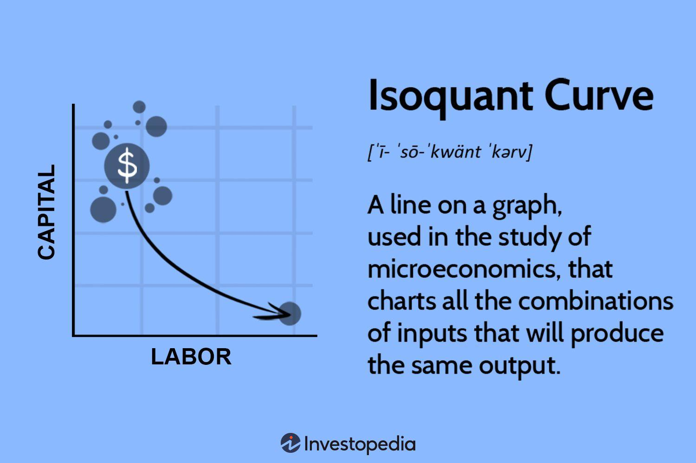

## Table of Contents

## What is an isoquant curve in economics?

An isoquant curve is a graph used in economics to show all the different combinations of two inputs, like labor and capital, that can produce the same amount of output. Imagine you are making pizzas. An isoquant curve would show all the ways you could use different amounts of workers and ovens to make the same number of pizzas. The curve itself is usually drawn as a smooth, downward-sloping line, which means that if you use more of one input, you can use less of the other input and still make the same amount of output.

These curves are important because they help businesses figure out the most efficient way to produce things. For example, if labor is cheaper than capital, a business might want to use more workers and fewer machines. Isoquant curves can also show how easily one input can be substituted for another. If the curve is straighter, it means the inputs are easily interchangeable. If the curve is more curved, it means the inputs are not as easily swapped out, and the business needs to be more careful about how it uses them.

## How does an isoquant curve differ from an indifference curve?

An isoquant curve and an indifference curve look similar because they are both downward-sloping lines on a graph, but they show different things. An isoquant curve is used in economics to show all the different ways a business can use two inputs, like workers and machines, to make the same amount of a product. For example, it could show how many workers and how many machines you need to make 100 cars. The goal is to find the most efficient way to produce things.

On the other hand, an indifference curve is used to show all the different combinations of two goods that give a person the same level of happiness or satisfaction. For example, it could show how many apples and how many oranges you could have and still be equally happy. The focus here is on what people want, not on how things are made. So, while isoquant curves are about production and efficiency, indifference curves are about consumption and satisfaction.

## What are the basic assumptions behind the isoquant curve?

Isoquant curves are based on some important ideas. First, they assume that you can use different amounts of two things, like workers and machines, to make the same amount of stuff. This means if you have more workers, you might need fewer machines, and vice versa. Second, these curves assume that you can always find a way to make a little bit more of the product by using a little bit more of either input. This is called the possibility of continuous substitution.

Another key assumption is that the isoquant curves are smooth and don't have any sudden jumps or breaks. This means that you can switch between using more of one input and less of another in small, smooth steps. Finally, isoquant curves assume that more is better – if you have more workers and more machines, you can make more products. These assumptions help businesses figure out the best way to use their resources to produce things efficiently.

## Can you explain the concept of marginal rate of technical substitution (MRTS) in relation to isoquants?

The marginal rate of technical substitution (MRTS) is a concept that helps us understand how businesses can switch between using different amounts of two inputs, like workers and machines, while still making the same amount of a product. Imagine you're making pizzas and you want to keep the number of pizzas the same. If you decide to use one more worker, the MRTS tells you how many fewer machines you can use and still make the same number of pizzas. It's like a trade-off: more of one input means you can use less of the other.

MRTS is closely related to isoquant curves because it shows the slope of these curves at any point. If you look at an isoquant curve, the MRTS is the absolute value of the slope of the curve at that point. When the curve is steep, it means a big change in one input (like workers) only allows a small change in the other input (like machines) to keep production the same. When the curve is flatter, it means you can swap one input for the other more easily. So, the MRTS helps businesses figure out how flexible they can be with their inputs to keep production steady.

## What are the different types of isoquant curves?

Isoquant curves can look different based on how easily you can switch between using different amounts of two inputs, like workers and machines. There are three main types of isoquant curves: linear, convex, and L-shaped. A linear isoquant curve is a straight line, which means you can swap one input for another very easily. For example, if you're making cookies, you could use more workers and fewer ovens, or more ovens and fewer workers, and still make the same number of cookies. This type of curve is rare because usually, inputs aren't perfectly interchangeable.

A convex isoquant curve is the most common type. It looks like a smooth, curved line that slopes downward. This means that you can switch between inputs, but not as easily as with a linear isoquant. As you use more of one input, you need less of the other, but the trade-off gets harder the more you switch. For instance, if you're making cars, you might be able to use more workers and fewer robots at first, but as you keep adding workers, you'll need to cut back on robots more and more to keep making the same number of cars. This reflects the real-world situation where inputs are somewhat substitutable but not perfectly so.

The third type is an L-shaped isoquant curve, also called a Leontief isoquant. This curve looks like the letter "L" and means that the inputs must be used in a fixed ratio. You can't switch between them at all. For example, if you're making a cake, you need exactly two cups of flour for every cup of sugar. If you change the amount of one input, you have to change the other in the same proportion, or you won't be able to make the same number of cakes. This type of isoquant is seen when inputs are complementary and can't be substituted for each other.

## How do isoquant curves illustrate the concept of returns to scale?

Isoquant curves can show us something called returns to scale, which is about what happens to the amount of stuff you make when you use more of everything. Imagine you're making pizzas and you decide to double the number of workers and double the number of ovens. If you end up making more than double the number of pizzas, that's called increasing returns to scale. On an isoquant map, this would look like the isoquants getting further apart as you move away from the origin, where you start with less stuff. It means that using more inputs gives you a bigger boost in how much you can produce.

If, instead, doubling your workers and ovens only doubles your pizzas, that's called constant returns to scale. On the isoquant map, the curves would be evenly spaced apart. This shows that your production grows at the same rate as your inputs. Finally, if doubling your inputs leads to less than double the output, that's decreasing returns to scale. The isoquants would get closer together as you move away from the origin, showing that adding more inputs doesn't help as much as it used to. So, by looking at how the spacing between isoquant curves changes, you can see what kind of returns to scale you're dealing with.

## What are the properties of isoquant curves?

Isoquant curves have some important properties that help us understand how businesses can make things. First, isoquant curves slope downwards. This means that if you use more of one input, like workers, you can use less of another input, like machines, and still make the same amount of stuff. The curve shows all the different ways you can mix inputs to get the same result. Also, isoquant curves never cross each other. If they did, it would mean you could make the same amount of stuff in more than one way, which doesn't make sense. Each curve represents a different level of output, so they stay separate.

Another property is that isoquant curves are usually convex to the origin. This shape shows that as you use more of one input, you need less of the other, but the trade-off gets harder the more you switch. It's like if you're making cookies, you can use more workers and fewer ovens at first, but as you keep adding workers, you need to cut back on ovens more and more to keep making the same number of cookies. Finally, isoquant curves can't touch the axes. If they did, it would mean you could make something with just one input, which usually isn't possible. You need both inputs, like workers and machines, to make things.

## How can the formula for an isoquant curve be derived?

To derive the formula for an isoquant curve, we start with a production function, which tells us how much of a product we can make using different amounts of inputs, like workers and machines. Let's say the production function is Q = f(L, K), where Q is the amount of the product, L is the number of workers, and K is the number of machines. An isoquant curve shows all the combinations of L and K that give the same Q. So, if we want to find the isoquant for a specific level of output, say Q0, we set the production function equal to Q0, which gives us Q0 = f(L, K). This equation represents the isoquant curve for the output level Q0.

To make this equation easier to work with, we might need to solve for one of the inputs in terms of the other. For example, if the production function is Q = L^a * K^b, where a and b are constants, we can rearrange it to find the isoquant curve for a specific Q0. We get Q0 = L^a * K^b, and solving for K in terms of L, we get K = (Q0 / L^a)^(1/b). This equation is the formula for the isoquant curve that shows all the combinations of L and K that produce Q0 units of the product. By changing Q0, we can draw different isoquant curves, each representing a different level of output.

## What role do isoquants play in production theory?

Isoquants are super important in production theory because they help businesses figure out the best way to make things. They show all the different ways you can use two things, like workers and machines, to make the same amount of a product. For example, if you're making cookies, an isoquant can show how many workers and how many ovens you need to make 100 cookies. By looking at these curves, businesses can see how they can switch between using more workers and fewer machines, or vice versa, to keep making the same amount of stuff. This helps them find the most efficient way to use their resources.

Isoquants also help businesses understand how easily they can switch between inputs. If the curve is straighter, it means you can swap workers for machines easily. If it's more curved, it means the switch is harder. This information is really useful for planning how to use resources. Plus, isoquants can show if using more of everything leads to more than double the output, the same amount of output, or less than double the output. This helps businesses decide if they should grow bigger or stay the same size. So, isoquants are a key tool for making smart choices about production.

## How do isoquants help in determining the optimal combination of inputs?

Isoquants help businesses find the best way to use their workers and machines to make stuff. They show all the different ways you can use these two things to make the same amount of a product. For example, if you're making pizzas, an isoquant can show how many workers and how many ovens you need to make 100 pizzas. By looking at these curves, a business can see how they can switch between using more workers and fewer ovens, or more ovens and fewer workers, to keep making the same number of pizzas. This helps them figure out the most efficient way to use their resources, so they can make as many pizzas as possible without wasting anything.

Isoquants also help businesses understand how easily they can switch between using different amounts of workers and ovens. If the isoquant curve is straighter, it means you can easily swap workers for ovens. If the curve is more curved, it means the switch is harder. This information is really useful because it helps businesses plan how to use their resources in the best way. Plus, by looking at how the spacing between isoquants changes, businesses can see if using more of everything will lead to more than double the output, the same amount of output, or less than double the output. This helps them decide if they should grow bigger or stay the same size. So, isoquants are a key tool for making smart choices about production.

## What are some practical applications of isoquant analysis in business?

Isoquant analysis helps businesses figure out the best way to use their resources to make things. For example, if a company makes cars, isoquants can show how many workers and how many robots they need to make a certain number of cars. By looking at these curves, the company can see if they should hire more workers or buy more robots to keep production steady. This helps them save money and use their resources in the smartest way possible. It's like a map that guides them to the most efficient way to make things.

Isoquants also help businesses plan for the future. If a company wants to make more cars, they can use isoquants to see if adding more workers and robots will lead to a big increase in production, or if it won't make much difference. This helps them decide if they should grow bigger or stay the same size. Plus, isoquants can show how easily the company can switch between using workers and robots. If it's easy to switch, they might choose to use more workers if labor costs go down, or more robots if machine costs go down. So, isoquants are a useful tool for making smart decisions about how to run a business.

## How do changes in technology affect the shape and position of isoquant curves?

Changes in technology can really change the way isoquant curves look and where they are on a graph. If a new technology makes machines better at making stuff, businesses might need fewer machines to make the same amount of products. This means the isoquant curve would move closer to the machine axis because you can use less machines and still make the same amount. For example, if a new kind of oven can bake more pizzas at once, you wouldn't need as many ovens to make 100 pizzas. The curve would shift, showing that you can use fewer ovens and more workers, or even fewer of both, to make the same number of pizzas.

Also, new technology can change how easily you can switch between using workers and machines. If the new technology makes it easier to swap workers for machines, the isoquant curve might get straighter. This means you can use more workers and fewer machines, or more machines and fewer workers, without changing how much you make. But if the new technology makes it harder to switch, the curve might get more curved. This shows that you need to be more careful about how you mix workers and machines to keep making the same amount of stuff. So, technology can really shake things up when it comes to isoquant curves.

## What is the Isoquant Curve and how do we understand it?

The isoquant curve occupies a central role in production theory by illustrating various input combinations, like capital and labor, that yield identical levels of output. This curve enables businesses to optimize resource allocation, ensuring a balance between maximizing productivity and minimizing costs. Understanding the characteristics of the isoquant curve is crucial for analyzing production efficiency and making informed decisions regarding resource trade-offs.

An isoquant curve's downward slope signifies that as you increase one input, you need to reduce the other to maintain the same level of output. This relationship is crucial because it reflects the concept of input substitutability. For instance, if more capital is utilized in production, less labor may be required to maintain the same output level, assuming capital can substitute labor to a certain extent.

The characteristic of being convex to the origin is attributed to diminishing marginal rates of technical substitution (MRTS). This principle indicates that as a producer substitutes capital for labor, the amount of capital needed to replace one unit of labor increases. Mathematically, the MRTS is defined as the negative slope of the isoquant:

$$

\text{MRTS} = -\frac{\Delta K}{\Delta L} 
$$

where $\Delta K$ represents the change in capital, and $\Delta L$ represents the change in labor. The convexity of the isoquant arises because the MRTS diminishes as more capital is substituted for labor, illustrating the decreasing ease of substituting one input for another as you move along the curve.

These characteristics render the isoquant curve a valuable analytical tool for examining production efficiency. By focusing on how inputs can be traded off while keeping output constant, businesses can determine the most efficient combinations of inputs. This insight is crucial for strategizing around cost structures, determining investment allocations between capital and labor, and ensuring optimal operational efficiency.

By leveraging the isoquant curve, firms can make strategic decisions that align with economic objectives, such as producing at minimum cost for a given level of output. This approach ensures that resource utilization is efficient, sustainable, and aligned with business goals. Understanding and applying the principles of the isoquant curve can thus significantly impact a firm's ability to compete effectively in modern economic environments.

## What is the relationship between Isoquant Curve and Production Efficiency?

The isoquant curve is a pivotal tool in assessing production efficiency as it guides firms in identifying the most cost-effective input mixture for achieving a specific output level. By analyzing the interactions and trade-offs between inputs like capital and labor, companies can streamline operations to minimize wastage and enhance productivity. This approach is grounded in the premise that different combinations of inputs can yield the same output, allowing businesses to choose the most efficient, cost-effective option.

Key to this analysis is understanding the marginal rate of technical substitution (MRTS), which quantifies the rate at which one input can be substituted for another while maintaining the same level of output. Mathematically, this can be expressed as:

$$
MRTS_{KL} = -\frac{dK}{dL} = \frac{MP_L}{MP_K}
$$

where $K$ and $L$ represent capital and labor inputs, respectively, and $MP_L$ and $MP_K$ are their marginal products.

By evaluating MRTS, firms can determine the proportionate change in input quantities that maintains output levels, aiding in the resource allocation process. For example, if labor is relatively expensive compared to capital, a firm might substitute labor with capital to achieve cost savings without sacrificing output.

This process not only supports operational efficiency but also informs strategic decisions about investment in technology versus human resources. As technology automates more labor-intensive tasks, businesses can reallocate resources towards capital investments or re-skill labor to align with new technological advancements. Ultimately, understanding and leveraging isoquant curves enables firms to adapt to changing resource prices, input availability, and technological advancements, ensuring sustained competitiveness and growth.

## References & Further Reading

[1]: Allen, F., & Karjalainen, R. (1999). ["Using Genetic Algorithms to Find Technical Trading Rules."](https://www.sciencedirect.com/science/article/pii/S0304405X9800052X) Journal of Financial Economics, 51(2), 245-271.

[2]: Coelli, T. J., Prasada Rao, D. S., O'Donnell, C. J., & Battese, G. E. (2005). ["An Introduction to Efficiency and Productivity Analysis."](https://link.springer.com/book/10.1007/b136381) Springer Science & Business Media.

[3]: Mishkin, F. S. (2015). ["The Economics of Money, Banking, and Financial Markets."](https://www.pearsonhighered.com/assets/preface/0/1/3/4/0134855388.pdf) 11th Edition. Pearson.

[4]: Liberti, J., & Petersen, M. A. (2019). ["Information: Hard and Soft."](https://academic.oup.com/rcfs/article/8/1/1/5220773) SSRN Electronic Journal.

[5]: Kaldor, N. (1975). ["What is the Essence of Economic Theory?"](https://www.cambridge.org/core/journals/journal-of-the-history-of-economic-thought/article/abs/kaldors-growth-theory/78A635672A9188590197BB22D04E8986) History of Political Economy, 7(1), 23-44.